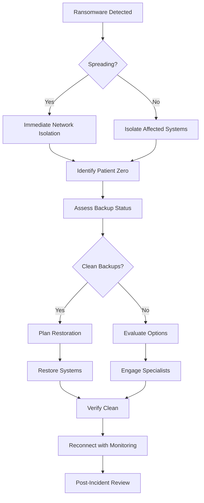

# 🚨 Incident Response Playbook

**Author:** Asif Hussain  
**Version:** 1.0.0  
**Last Updated:** December 30, 2025  
**Status:** ✅ Active  
**Category:** Security Knowledge Library  

---

## 📋 Executive Summary

This playbook provides structured procedures for detecting, responding to, containing, and recovering from security incidents. It establishes roles, responsibilities, communication protocols, and step-by-step guidance for handling various incident types.

**Related Documents:**
- `risk-assessment-methodology.md` - Risk analysis
- `security-awareness-training.md` - Incident reporting
- `audit-logging-standards.md` - Log analysis for incidents

---

## 🎯 Incident Response Framework

### IR Lifecycle

```mermaid
flowchart LR
    subgraph Preparation
        P1[Policies & Plans]
        P2[Team Training]
        P3[Tools & Resources]
    end
    
    subgraph Detection
        D1[Monitoring]
        D2[Alerting]
        D3[Triage]
    end
    
    subgraph Containment
        C1[Short-term]
        C2[Long-term]
        C3[Evidence Preservation]
    end
    
    subgraph Eradication
        E1[Root Cause]
        E2[Remove Threat]
        E3[Hardening]
    end
    
    subgraph Recovery
        R1[System Restore]
        R2[Validation]
        R3[Monitoring]
    end
    
    subgraph Lessons
        L1[Post-Incident]
        L2[Documentation]
        L3[Improvements]
    end
    
    Preparation --> Detection --> Containment --> Eradication --> Recovery --> Lessons
    Lessons -.-> Preparation
```



---

## 👥 Incident Response Team

### Team Structure

| Role | Responsibilities | Contact |
|------|------------------|---------|
| **IR Manager** | Overall incident coordination, executive communication | [Contact] |
| **Security Analyst** | Technical investigation, log analysis, forensics | [Contact] |
| **IT Operations** | System access, containment actions, recovery | [Contact] |
| **Communications** | Internal/external messaging, PR coordination | [Contact] |
| **Legal** | Regulatory compliance, legal obligations | [Contact] |
| **HR** | Insider threat cases, employee matters | [Contact] |
| **Executive Sponsor** | Resource authorization, major decisions | [Contact] |

### Escalation Matrix

| Severity | Initial Response | 30 min | 1 hour | 4 hours |
|----------|-----------------|--------|--------|---------|
| **Critical** | IR Team | CISO | CTO/CEO | Board |
| **High** | IR Team | CISO | CTO | - |
| **Medium** | Security Analyst | IR Manager | CISO | - |
| **Low** | Security Analyst | IR Manager | - | - |

---

## 🔴 Incident Classification

### Severity Levels

| Level | Definition | Examples | Response Time |
|-------|------------|----------|---------------|
| **Critical (P1)** | Active attack, data breach, system compromise | Ransomware, active intrusion, major data leak | Immediate (≤15 min) |
| **High (P2)** | Significant threat, potential breach | Malware outbreak, credential compromise, DDoS | ≤1 hour |
| **Medium (P3)** | Contained threat, policy violation | Phishing attempt, unauthorized access attempt | ≤4 hours |
| **Low (P4)** | Minor incident, informational | Failed login attempts, policy reminder | ≤24 hours |

### Incident Categories

| Category | Description | Examples |
|----------|-------------|----------|
| **Malware** | Malicious software infection | Ransomware, trojan, virus, worm |
| **Unauthorized Access** | Illegitimate system access | Credential theft, privilege escalation |
| **Data Breach** | Unauthorized data disclosure | Exfiltration, accidental exposure |
| **Denial of Service** | Service disruption | DDoS, resource exhaustion |
| **Insider Threat** | Employee/contractor misconduct | Data theft, sabotage |
| **Phishing** | Social engineering attack | Email phishing, spear phishing |
| **Web Attack** | Application-layer attack | SQL injection, XSS, API abuse |
| **Physical** | Physical security breach | Unauthorized facility access |

---

## 📋 Phase 1: Preparation

### 1.1 Essential Documentation

**Required Documents:**
- [ ] Incident Response Plan (this playbook)
- [ ] Contact lists (internal, external, vendors)
- [ ] Network diagrams and asset inventory
- [ ] System credentials (secure storage)
- [ ] Vendor support contracts
- [ ] Regulatory notification requirements
- [ ] Communication templates

### 1.2 Tools & Resources

| Category | Tools |
|----------|-------|
| **SIEM/Logging** | Splunk, ELK, Azure Sentinel |
| **Endpoint Detection** | CrowdStrike, Carbon Black, Defender |
| **Network Analysis** | Wireshark, tcpdump, Zeek |
| **Forensics** | Autopsy, FTK, Volatility |
| **Malware Analysis** | VirusTotal, Any.Run, Cuckoo |
| **Communication** | Secure chat, incident bridge |

### 1.3 Training Requirements

| Training | Frequency | Audience |
|----------|-----------|----------|
| IR fundamentals | Annually | All IT staff |
| Tabletop exercises | Quarterly | IR Team |
| Technical forensics | Semi-annually | Security Analysts |
| Communication protocols | Annually | IR Team + Comms |
| Full simulation | Annually | Organization-wide |

---

## 🔍 Phase 2: Detection & Analysis

### 2.1 Detection Sources

| Source | Detection Capability |
|--------|---------------------|
| **SIEM** | Correlation alerts, anomaly detection |
| **EDR** | Endpoint threats, behavioral analysis |
| **IDS/IPS** | Network intrusions, signatures |
| **WAF** | Web application attacks |
| **DLP** | Data exfiltration attempts |
| **User Reports** | Phishing, suspicious activity |
| **Threat Intel** | External threat indicators |

### 2.2 Initial Triage

**Triage Checklist:**
```markdown
## Incident Triage Form

**Incident ID:** INC-[YYYY]-[NNN]  
**Date/Time Detected:** [DateTime]  
**Detected By:** [Source/Person]  
**Analyst:** [Name]  

### Initial Assessment
- [ ] What systems are affected?
- [ ] What type of incident is this?
- [ ] Is the incident ongoing or contained?
- [ ] What is the potential business impact?
- [ ] What evidence is available?

### Severity Determination
- [ ] Data at risk: [None/Low/Medium/High/Critical]
- [ ] Systems affected: [Count and criticality]
- [ ] Business impact: [Description]
- [ ] **Assigned Severity:** [P1/P2/P3/P4]

### Initial Actions Taken
1. [Action and timestamp]
2. [Action and timestamp]
```

### 2.3 Analysis Procedures

**Log Analysis:**
```bash
# Common log searches

# Failed authentication attempts
grep -i "failed\|failure\|invalid" /var/log/auth.log

# Unusual network connections
netstat -tunapl | grep ESTABLISHED

# Recent file modifications
find /var -mtime -1 -type f

# Process analysis
ps auxf | grep -v "^\["
```

**Network Analysis:**
```bash
# Capture traffic
tcpdump -i eth0 -w capture.pcap

# Analyze connections
netstat -an | awk '/ESTABLISHED/ {print $5}' | cut -d: -f1 | sort | uniq -c | sort -rn

# DNS queries
tcpdump -i eth0 port 53
```

---

## 🛡️ Phase 3: Containment

### 3.1 Short-Term Containment

**Immediate Actions:**
| Action | When to Use | Risk |
|--------|-------------|------|
| Network isolation | Active breach, malware spread | Service disruption |
| Account disable | Compromised credentials | User impact |
| Block IP/domain | Known malicious source | False positives |
| Kill process | Malicious process identified | Data loss |
| Disable service | Vulnerable service exploited | Availability |

**Containment Decision Matrix:**
| Incident Type | Recommended Containment |
|---------------|------------------------|
| Ransomware | Immediate network isolation |
| Credential theft | Disable affected accounts, force password reset |
| Web attack | WAF block, take application offline if needed |
| DDoS | Enable DDoS protection, rate limiting |
| Data exfiltration | Block egress, isolate system |
| Insider threat | Disable access, preserve evidence |

### 3.2 Long-Term Containment

**Actions:**
- Patch vulnerable systems
- Implement additional monitoring
- Deploy additional controls
- Rebuild compromised systems (if needed)
- Restore from clean backups

### 3.3 Evidence Preservation

**Chain of Custody:**
```markdown
## Evidence Log

**Incident ID:** [ID]  
**Evidence ID:** [EVD-NNN]  

| Date/Time | Action | Handler | Location | Hash |
|-----------|--------|---------|----------|------|
| [DateTime] | Collected | [Name] | [Location] | [SHA256] |
| [DateTime] | Transferred | [Name] | [Location] | [SHA256] |

## Evidence Details
- **Type:** [Memory dump/Disk image/Logs/Network capture]
- **Source System:** [Hostname/IP]
- **Collection Method:** [Tool/process used]
- **Storage Location:** [Secure location]
- **Retention Period:** [Duration]
```

**Evidence Collection Priorities:**
1. Volatile data (memory, processes, network connections)
2. System logs
3. Application logs
4. Disk images
5. Network captures

---

## 🧹 Phase 4: Eradication

### 4.1 Root Cause Analysis

**Investigation Questions:**
- How did the attacker gain initial access?
- What vulnerabilities were exploited?
- What was the attacker's objective?
- What systems were accessed?
- What data was compromised?
- How long was the attacker present?

### 4.2 Threat Removal

| Threat Type | Eradication Steps |
|-------------|-------------------|
| **Malware** | Remove malware, scan all systems, verify clean |
| **Backdoor** | Identify and remove all access, change credentials |
| **Compromised Account** | Reset passwords, review access, enable MFA |
| **Vulnerable System** | Patch or rebuild, verify configuration |

### 4.3 System Hardening

**Post-Incident Hardening:**
- [ ] Apply all security patches
- [ ] Rotate compromised credentials
- [ ] Review and restrict access permissions
- [ ] Enable additional logging/monitoring
- [ ] Update firewall rules
- [ ] Implement identified security controls

---

## 🔄 Phase 5: Recovery

### 5.1 Recovery Planning

**Recovery Priorities:**
| Priority | Systems | Recovery Order |
|----------|---------|----------------|
| P1 | Critical business systems | First |
| P2 | Important services | Second |
| P3 | Supporting systems | Third |
| P4 | Non-critical | As available |

### 5.2 System Restoration

**Restoration Checklist:**
- [ ] Verify backups are clean/uncompromised
- [ ] Restore systems from known-good state
- [ ] Apply all security patches before reconnection
- [ ] Reset all credentials
- [ ] Verify security controls are active
- [ ] Test functionality before production use
- [ ] Implement enhanced monitoring

### 5.3 Validation

**Before Return to Production:**
- [ ] Vulnerability scan (clean results)
- [ ] Security control verification
- [ ] Backup validation
- [ ] Monitoring confirmation
- [ ] Stakeholder approval
- [ ] Documentation complete

---

## 📝 Phase 6: Post-Incident

### 6.1 Post-Incident Review

**Review Meeting Agenda:**
1. Incident timeline review
2. What worked well?
3. What could be improved?
4. Action items for improvement
5. Documentation updates needed
6. Training needs identified

### 6.2 Incident Report Template

```markdown
# Incident Report

**Incident ID:** [INC-YYYY-NNN]  
**Classification:** [Category]  
**Severity:** [P1/P2/P3/P4]  
**Status:** [Open/Closed]  

## Executive Summary
[Brief description of the incident and outcome]

## Timeline
| Date/Time | Event |
|-----------|-------|
| [DateTime] | [Event description] |

## Technical Details
### Attack Vector
[How the attack occurred]

### Affected Systems
[List of affected systems]

### Data Impact
[Description of data affected]

## Response Actions
[Summary of containment, eradication, recovery]

## Root Cause
[Root cause analysis]

## Lessons Learned
[Key takeaways]

## Recommendations
| # | Recommendation | Priority | Owner | Due Date |
|---|---------------|----------|-------|----------|
| 1 | [Rec] | [P1-P4] | [Name] | [Date] |

## Appendices
- Evidence log
- Communication log
- Technical analysis
```

### 6.3 Metrics Tracking

**Key Metrics:**
| Metric | Description | Target |
|--------|-------------|--------|
| MTTD | Mean Time to Detect | <1 hour |
| MTTR | Mean Time to Respond | <30 min |
| MTTC | Mean Time to Contain | <4 hours |
| MTTR | Mean Time to Recover | <24 hours |
| Incidents/Month | Monthly incident count | Decreasing |
| False Positive Rate | False alerts percentage | <10% |

---

## 📞 Communication

### Internal Communication

**Notification Templates:**

**Initial Alert:**
```
SECURITY INCIDENT ALERT

Severity: [CRITICAL/HIGH/MEDIUM/LOW]
Time: [DateTime]
Summary: [Brief description]
Current Status: [Investigating/Contained/Resolved]
Business Impact: [Description]

Actions Required:
- [Specific actions for recipients]

Contact: [IR Manager contact]

Next Update: [Time of next update]
```

### External Communication

**Customer Notification (if required):**
```
Dear [Customer],

We are writing to inform you of a security incident that 
may have affected your data.

What Happened: [Description]
When: [Timeframe]
What Data: [Data types affected]
What We're Doing: [Response actions]
What You Can Do: [Recommended actions]

For questions, contact: [Contact information]

We apologize for any inconvenience.
```

### Regulatory Notification

| Regulation | Notification Requirement | Timeline |
|------------|------------------------|----------|
| GDPR | Supervisory authority | 72 hours |
| HIPAA | HHS (breach >500) | 60 days |
| PCI-DSS | Card brands, acquirer | Immediately |
| State Laws | Varies by state | 30-90 days |

---

## 🔥 Specific Incident Playbooks

### Ransomware Response



**DO NOT:**
- ❌ Pay ransom without executive/legal approval
- ❌ Restart infected systems
- ❌ Delete encrypted files immediately
- ❌ Use infected systems for communication

### Phishing Response

1. **Identify:** Determine scope of phishing campaign
2. **Block:** Add sender/URLs to block lists
3. **Notify:** Alert users who received the email
4. **Assess:** Identify users who clicked/submitted credentials
5. **Remediate:** Reset passwords, scan for malware
6. **Report:** Submit to anti-phishing services

### Data Breach Response

1. **Contain:** Stop ongoing data loss
2. **Assess:** Determine data affected and volume
3. **Legal:** Engage legal counsel immediately
4. **Notify:** Prepare regulatory notifications
5. **Communicate:** Customer notification if required
6. **Investigate:** Full forensic investigation
7. **Remediate:** Fix vulnerabilities, enhance controls

---

## 📚 Resources

### External Resources
- [NIST SP 800-61](https://csrc.nist.gov/publications/detail/sp/800-61/rev-2/final) - Computer Security Incident Handling Guide
- [SANS Incident Handler's Handbook](https://www.sans.org/white-papers/33901/)
- [CISA Incident Response](https://www.cisa.gov/topics/cybersecurity-best-practices/incident-response)

### Related Documents
- `risk-assessment-methodology.md` - Risk analysis
- `threat-modeling-framework.md` - Threat identification
- `audit-logging-standards.md` - Log analysis guidance
- `security-awareness-training.md` - User reporting training

---

## 📝 Document History

| Version | Date | Author | Changes |
|---------|------|--------|---------|
| 1.0.0 | 2025-12-30 | Asif Hussain | Initial comprehensive playbook |

---

*This playbook is part of the CORTEX Security Knowledge Library and should be tested annually through tabletop exercises and updated after each significant incident.*
