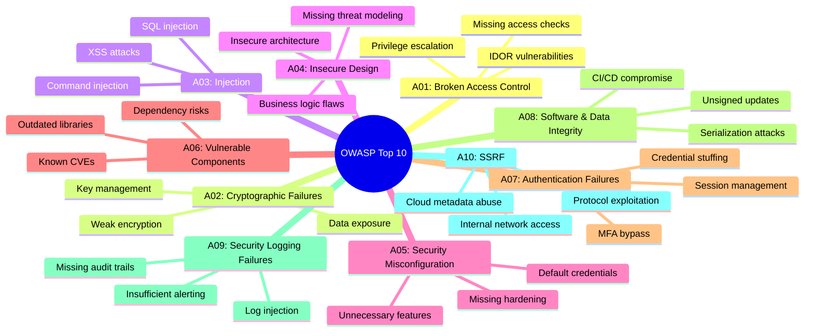
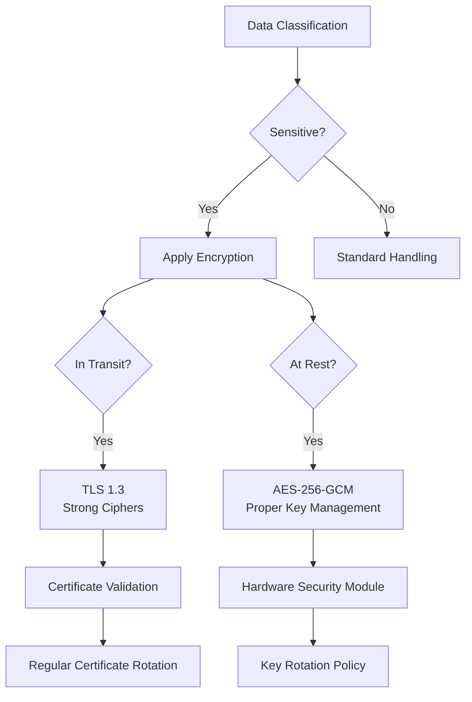
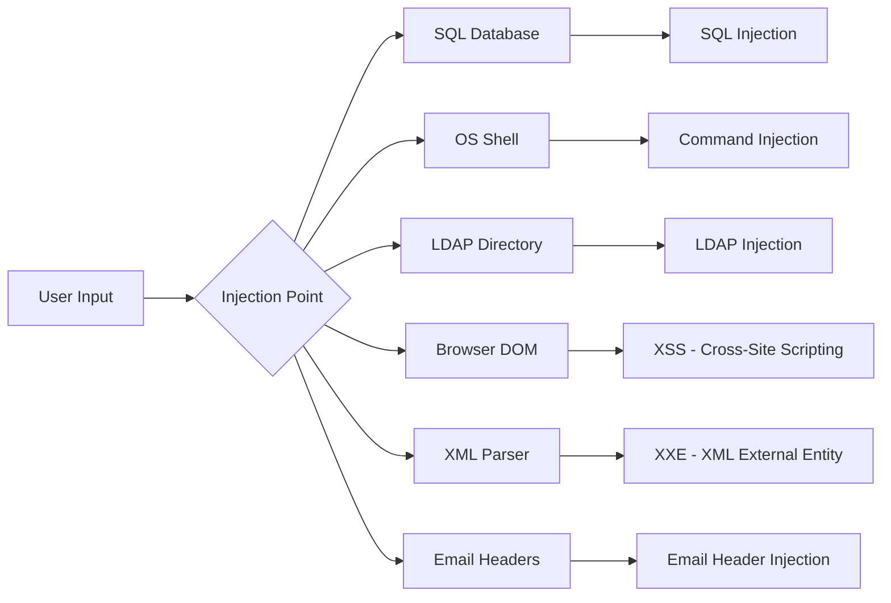
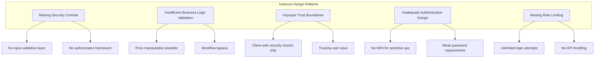
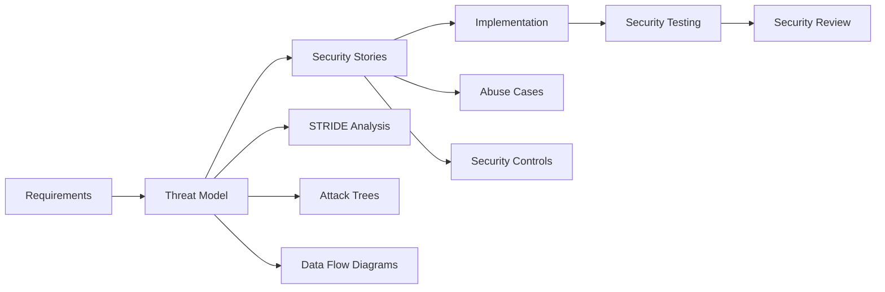
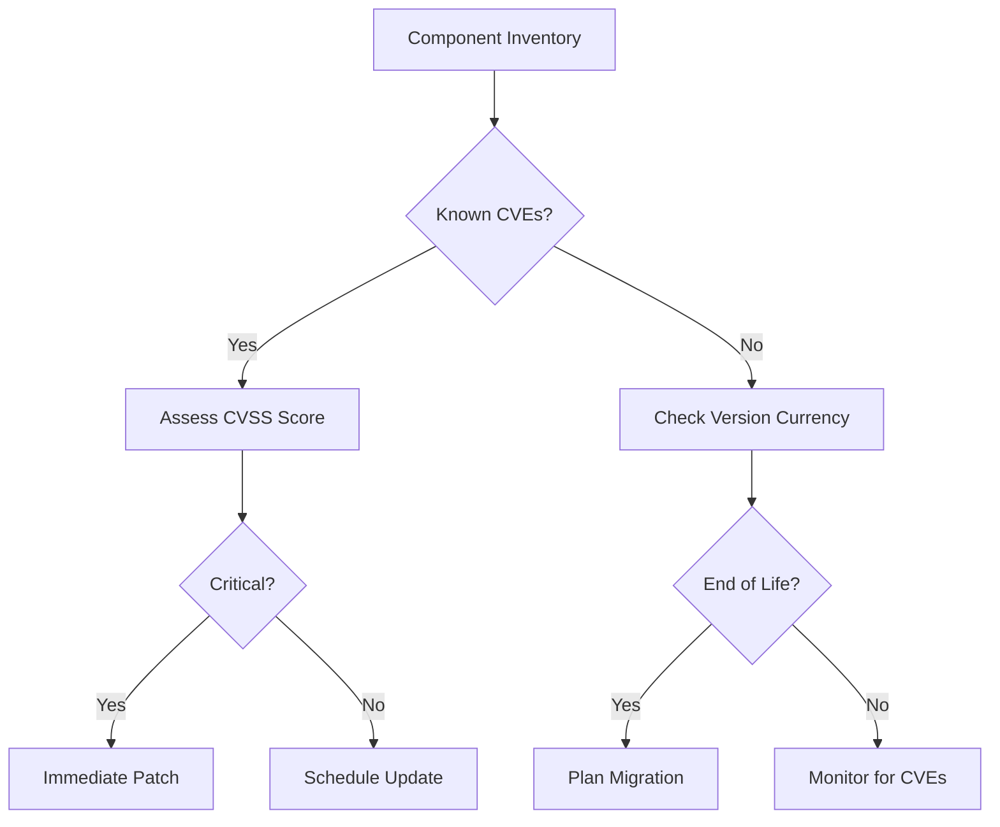
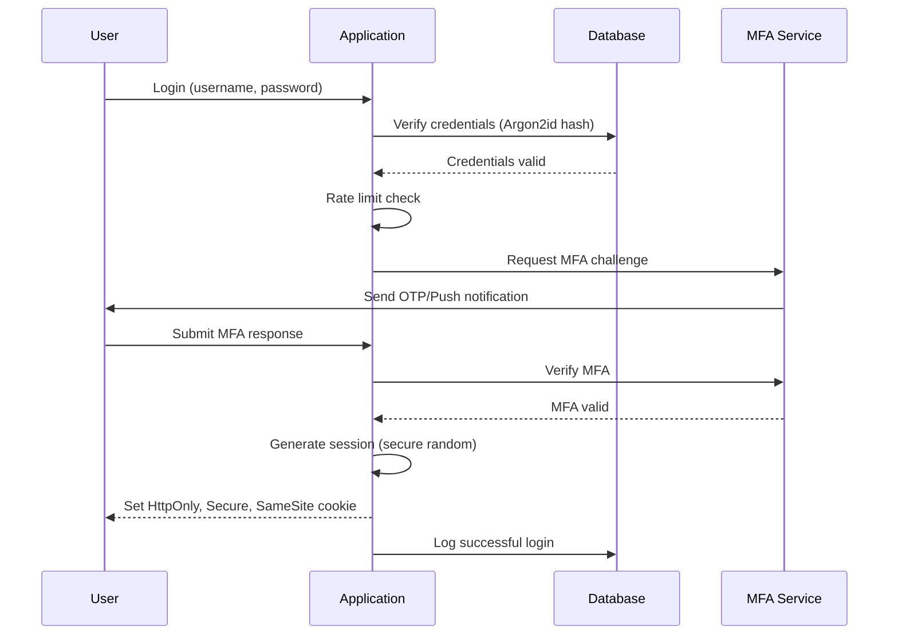
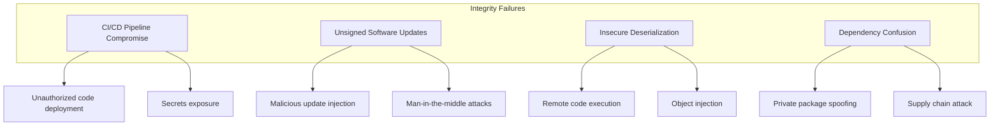
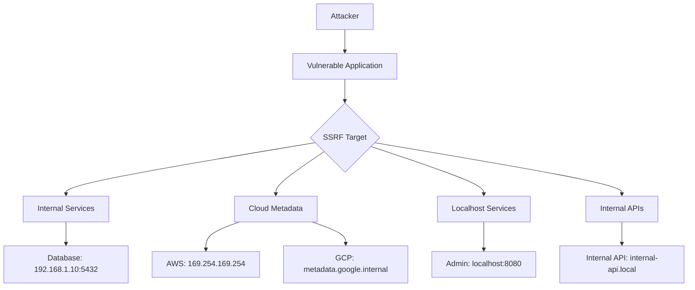
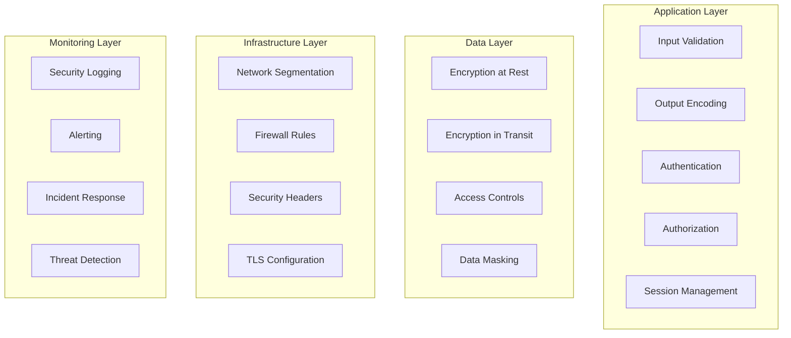

# 🛡️ OWASP Top 10 Web Application Security Guide

**Author:** Asif Hussain  
**Version:** 1.0.0  
**Last Updated:** December 30, 2025  
**Status:** ✅ Active  
**Category:** Security Knowledge Library  

---

## 📋 Executive Summary

This guide provides comprehensive coverage of the OWASP Top 10 Web Application Security Risks (2021 edition), extending beyond API-specific vulnerabilities to cover the full spectrum of web application security threats. It serves as the authoritative reference for identifying, preventing, and remediating the most critical security risks in web applications.

**Related Documents:**
- `api-security-foundations.md` - API-specific security (OWASP API Top 10)
- `database-security-guide.md` - Database layer security
- `security-awareness-training.md` - Security awareness best practices

---

## 🎯 OWASP Top 10 - 2021 Overview



---

## 🔴 A01:2021 – Broken Access Control

### Overview

Broken Access Control moved from #5 to the #1 position as the most serious web application security risk. Access control enforces policies so users cannot act outside their intended permissions. Failures typically lead to unauthorized information disclosure, modification, or destruction of data.

**Impact:** Attackers can gain unauthorized access to other users' accounts, view sensitive files, modify other users' data, or change access rights.

### Common Vulnerabilities

| Vulnerability Type | Description | Risk Level |
|-------------------|-------------|------------|
| **IDOR (Insecure Direct Object Reference)** | Accessing objects by manipulating IDs | 🔴 Critical |
| **Privilege Escalation** | Gaining higher privileges than assigned | 🔴 Critical |
| **Path Traversal** | Accessing files outside allowed directories | 🟠 High |
| **Missing Function Level Access Control** | No server-side authorization checks | 🔴 Critical |
| **CORS Misconfiguration** | Overly permissive cross-origin policies | 🟠 High |
| **Metadata Manipulation** | Tampering with JWT tokens, cookies | 🟠 High |

### Detection Patterns

```python
# Pattern 1: IDOR Detection - Direct object reference in URLs
# VULNERABLE: /api/users/123/profile - ID is user-controlled
# SECURE: /api/users/me/profile - Uses authenticated user's ID

# Pattern 2: Missing Authorization Check
# VULNERABLE:
def get_user_data(user_id):
    return User.query.get(user_id)  # No ownership check!

# SECURE:
def get_user_data(user_id, current_user):
    user = User.query.get(user_id)
    if user.id != current_user.id and not current_user.is_admin:
        raise AuthorizationError("Access denied")
    return user
```

### Prevention Strategies

1. **Deny by Default**
   - Implement access control lists that deny access unless explicitly granted
   - Prefer allowlists over blocklists

2. **Server-Side Enforcement**
   ```python
   # Always verify authorization server-side
   @require_authorization(roles=['admin', 'manager'])
   def delete_resource(resource_id):
       resource = Resource.query.get(resource_id)
       if not current_user.can_delete(resource):
           abort(403)
       resource.delete()
   ```

3. **Record Ownership Validation**
   ```python
   # Validate user owns the resource
   def update_profile(profile_id, data):
       profile = Profile.query.get(profile_id)
       if profile.user_id != current_user.id:
           raise AuthorizationError()
       profile.update(data)
   ```

4. **Disable Directory Listing**
   ```apache
   # Apache
   Options -Indexes
   
   # Nginx
   autoindex off;
   ```

5. **Log Access Control Failures**
   - Monitor and alert on repeated failures
   - Rate limit access attempts

### Testing Checklist

- [ ] Test accessing resources as unauthenticated user
- [ ] Test accessing resources owned by other users
- [ ] Test privilege escalation (user → admin)
- [ ] Test path traversal (../../etc/passwd)
- [ ] Test CORS policy (cross-origin requests)
- [ ] Test JWT/token manipulation
- [ ] Verify server-side authorization for all endpoints

---

## 🔴 A02:2021 – Cryptographic Failures

### Overview

Previously known as "Sensitive Data Exposure," this category focuses on failures related to cryptography that often lead to exposure of sensitive data. This includes weak cryptographic algorithms, improper key management, and transmission of data in clear text.

**Impact:** Exposure of credentials, personal data, financial information, or health records leading to identity theft, fraud, and compliance violations.

### Common Vulnerabilities

| Vulnerability Type | Description | Risk Level |
|-------------------|-------------|------------|
| **Data Transmitted in Clear Text** | HTTP, FTP, SMTP without TLS | 🔴 Critical |
| **Weak Cryptographic Algorithms** | MD5, SHA1, DES, 3DES | 🔴 Critical |
| **Insufficient Key Length** | RSA < 2048, AES < 128 | 🟠 High |
| **Poor Key Management** | Hardcoded keys, weak key derivation | 🔴 Critical |
| **Weak Random Number Generation** | Predictable tokens, IVs | 🔴 Critical |
| **Missing Encryption at Rest** | Unencrypted databases, files | 🟠 High |

### Secure Cryptography Standards



### Recommended Algorithms

| Use Case | Recommended | Deprecated/Avoid |
|----------|-------------|------------------|
| **Hashing (Passwords)** | Argon2id, bcrypt, scrypt | MD5, SHA1, plain SHA256 |
| **Hashing (Integrity)** | SHA-256, SHA-3 | MD5, SHA1 |
| **Symmetric Encryption** | AES-256-GCM | DES, 3DES, RC4, AES-ECB |
| **Asymmetric Encryption** | RSA-2048+, ECDSA P-256+ | RSA-1024, DSA-1024 |
| **Key Exchange** | ECDHE, X25519 | Static RSA, DHE < 2048 |
| **TLS Version** | TLS 1.3, TLS 1.2 | SSL, TLS 1.0, TLS 1.1 |

### Implementation Examples

```python
# SECURE Password Hashing with Argon2id
from argon2 import PasswordHasher

ph = PasswordHasher(
    time_cost=3,        # Number of iterations
    memory_cost=65536,  # 64 MB memory
    parallelism=4       # Parallel threads
)

# Hash password
hashed = ph.hash("user_password")

# Verify password
try:
    ph.verify(hashed, "user_password")
except:
    raise AuthenticationError("Invalid password")

# SECURE Encryption with AES-256-GCM
from cryptography.hazmat.primitives.ciphers.aead import AESGCM
import os

def encrypt_data(plaintext: bytes, key: bytes) -> tuple[bytes, bytes]:
    """Encrypt data using AES-256-GCM."""
    nonce = os.urandom(12)  # 96-bit nonce for GCM
    aesgcm = AESGCM(key)
    ciphertext = aesgcm.encrypt(nonce, plaintext, None)
    return nonce, ciphertext

def decrypt_data(nonce: bytes, ciphertext: bytes, key: bytes) -> bytes:
    """Decrypt data using AES-256-GCM."""
    aesgcm = AESGCM(key)
    return aesgcm.decrypt(nonce, ciphertext, None)
```

### Key Management Best Practices

1. **Never Hardcode Keys**
   ```python
   # WRONG
   SECRET_KEY = "my-secret-key-12345"
   
   # CORRECT
   SECRET_KEY = os.environ.get('SECRET_KEY')
   # Or use secrets manager: AWS Secrets Manager, Azure Key Vault, HashiCorp Vault
   ```

2. **Key Rotation Policy**
   - Rotate encryption keys annually (minimum)
   - Rotate keys immediately if compromise suspected
   - Implement key versioning for backward compatibility

3. **Secure Key Storage**
   - Use Hardware Security Modules (HSM) for critical keys
   - Use envelope encryption (encrypt key with master key)
   - Separate key storage from encrypted data

### Testing Checklist

- [ ] Verify TLS 1.2+ for all connections
- [ ] Check for weak cipher suites
- [ ] Verify passwords are properly hashed (not encrypted/encoded)
- [ ] Test for hardcoded credentials in code/config
- [ ] Verify sensitive data encrypted at rest
- [ ] Check certificate validity and chain
- [ ] Test for insecure random number generation

---

## 🔴 A03:2021 – Injection

### Overview

Injection attacks occur when untrusted data is sent to an interpreter as part of a command or query. This includes SQL, NoSQL, OS command, LDAP, and XPath injection. Cross-Site Scripting (XSS) is also part of this category in the 2021 update.

**Impact:** Complete data breach, data loss, denial of service, or full system compromise.

### Injection Types



### SQL Injection

```python
# VULNERABLE - String concatenation
def get_user(username):
    query = f"SELECT * FROM users WHERE username = '{username}'"
    return db.execute(query)  # Attacker: ' OR '1'='1

# SECURE - Parameterized queries
def get_user(username):
    query = "SELECT * FROM users WHERE username = :username"
    return db.execute(query, {"username": username})

# SECURE - ORM (SQLAlchemy)
def get_user(username):
    return User.query.filter_by(username=username).first()
```

### Cross-Site Scripting (XSS)

| XSS Type | Description | Example |
|----------|-------------|---------|
| **Reflected XSS** | Malicious script reflected from request | URL parameter echoed in response |
| **Stored XSS** | Script stored in database, served to users | Comment section containing script |
| **DOM-based XSS** | Script executed via DOM manipulation | document.write with URL parameter |

```javascript
// VULNERABLE - Direct innerHTML assignment
document.getElementById('output').innerHTML = userInput;

// SECURE - Use textContent for untrusted data
document.getElementById('output').textContent = userInput;

// SECURE - DOMPurify for HTML that must be rendered
import DOMPurify from 'dompurify';
document.getElementById('output').innerHTML = DOMPurify.sanitize(userInput);
```

### Command Injection

```python
# VULNERABLE - Shell command with user input
import os
def ping_host(host):
    os.system(f"ping -c 4 {host}")  # Attacker: ; rm -rf /

# SECURE - Use subprocess with arguments list
import subprocess
def ping_host(host):
    # Validate input first
    if not is_valid_hostname(host):
        raise ValueError("Invalid hostname")
    subprocess.run(["ping", "-c", "4", host], capture_output=True)
```

### Prevention Matrix

| Injection Type | Primary Defense | Secondary Defense |
|---------------|-----------------|-------------------|
| SQL Injection | Parameterized queries | Input validation, least privilege |
| XSS | Output encoding | Content Security Policy |
| Command Injection | Avoid shell calls | Input validation, allowlisting |
| LDAP Injection | Escape special characters | Parameterized queries |
| XXE | Disable external entities | Input validation |

### Content Security Policy (CSP)

```http
# Strict CSP Header to prevent XSS
Content-Security-Policy: 
    default-src 'self';
    script-src 'self' 'nonce-random123';
    style-src 'self' 'unsafe-inline';
    img-src 'self' data: https:;
    connect-src 'self' https://api.example.com;
    frame-ancestors 'none';
    form-action 'self';
```

### Testing Checklist

- [ ] Test all input fields for SQL injection
- [ ] Test for XSS in all output contexts (HTML, JS, CSS, URL)
- [ ] Test file upload for malicious content
- [ ] Verify parameterized queries used throughout
- [ ] Check CSP headers implemented
- [ ] Test for command injection in system calls
- [ ] Verify XML parsers disable external entities

---

## 🔴 A04:2021 – Insecure Design

### Overview

**NEW in 2021.** Insecure Design represents a broad category focusing on risks related to design and architectural flaws. This differs from insecure implementation - it's about missing or ineffective control design. A perfect implementation cannot fix an insecure design.

**Impact:** Business logic vulnerabilities, missing security controls, and architectural weaknesses that cannot be fixed by patches alone.

### Insecure Design vs Implementation Flaws

| Aspect | Insecure Design | Implementation Flaw |
|--------|-----------------|---------------------|
| **Root Cause** | Missing security requirement | Coding error |
| **Example** | No rate limiting designed | Rate limiting bypass bug |
| **Fix** | Redesign/re-architect | Patch/hotfix |
| **Detection** | Threat modeling, design review | Code review, testing |
| **Prevention** | Secure SDLC, threat modeling | Secure coding training |

### Common Design Flaws



### Secure Design Principles

1. **Defense in Depth**
   - Multiple layers of security controls
   - No single point of failure

2. **Least Privilege**
   - Minimal permissions by default
   - Just-in-time access

3. **Secure Defaults**
   - Security enabled out of the box
   - Explicit opt-out required

4. **Fail Secure**
   - Deny access on errors
   - Safe failure modes

5. **Separation of Duties**
   - Multiple approvals for critical actions
   - No single user can complete sensitive transactions

### Threat Modeling Integration



### Prevention Strategies

1. **Integrate Threat Modeling**
   - Conduct threat modeling during design phase
   - Use STRIDE or PASTA methodology
   - Document assumptions and trust boundaries

2. **Security Requirements**
   - Define security requirements upfront
   - Include abuse cases in user stories
   - Security acceptance criteria for each feature

3. **Reference Architectures**
   - Use proven secure design patterns
   - Follow industry reference architectures
   - Implement zero-trust architecture

4. **Limit Resource Consumption**
   - Design rate limiting from start
   - Plan for abuse scenarios
   - Implement quotas and throttling

### Testing Checklist

- [ ] Conduct threat modeling for all features
- [ ] Review business logic for bypass possibilities
- [ ] Verify rate limiting on all endpoints
- [ ] Test for workflow/state machine bypasses
- [ ] Check for missing authorization checks by design
- [ ] Validate trust boundaries are properly defined
- [ ] Review for client-side only security checks

---

## 🟠 A05:2021 – Security Misconfiguration

### Overview

Security Misconfiguration is the most commonly seen issue. This is commonly a result of insecure default configurations, incomplete configurations, open cloud storage, misconfigured HTTP headers, and verbose error messages containing sensitive information.

**Impact:** Unauthorized access to system data, functionality, or complete server compromise.

### Common Misconfigurations

| Category | Misconfiguration | Risk |
|----------|-----------------|------|
| **Defaults** | Default credentials | 🔴 Critical |
| **Features** | Unnecessary features enabled | 🟠 High |
| **Permissions** | Overly permissive cloud storage | 🔴 Critical |
| **Headers** | Missing security headers | 🟠 High |
| **Errors** | Verbose error messages | 🟡 Medium |
| **Updates** | Unpatched systems | 🔴 Critical |
| **Directory** | Directory listing enabled | 🟡 Medium |

### Security Headers Configuration

```http
# Essential Security Headers
Strict-Transport-Security: max-age=31536000; includeSubDomains; preload
X-Content-Type-Options: nosniff
X-Frame-Options: DENY
X-XSS-Protection: 1; mode=block
Referrer-Policy: strict-origin-when-cross-origin
Permissions-Policy: geolocation=(), microphone=(), camera=()
Content-Security-Policy: default-src 'self'; script-src 'self'
```

### Framework-Specific Hardening

**Django:**
```python
# settings.py
DEBUG = False
ALLOWED_HOSTS = ['example.com', 'www.example.com']
SECURE_BROWSER_XSS_FILTER = True
SECURE_CONTENT_TYPE_NOSNIFF = True
SECURE_HSTS_SECONDS = 31536000
SECURE_HSTS_INCLUDE_SUBDOMAINS = True
SECURE_SSL_REDIRECT = True
SESSION_COOKIE_SECURE = True
CSRF_COOKIE_SECURE = True
```

**Flask:**
```python
from flask_talisman import Talisman

app = Flask(__name__)
Talisman(
    app,
    force_https=True,
    strict_transport_security=True,
    strict_transport_security_max_age=31536000,
    content_security_policy={
        'default-src': "'self'",
        'script-src': "'self'"
    }
)
```

**Express.js:**
```javascript
const helmet = require('helmet');
const app = express();

app.use(helmet({
    contentSecurityPolicy: {
        directives: {
            defaultSrc: ["'self'"],
            scriptSrc: ["'self'"],
            styleSrc: ["'self'", "'unsafe-inline'"]
        }
    },
    hsts: {
        maxAge: 31536000,
        includeSubDomains: true,
        preload: true
    },
    frameguard: { action: 'deny' }
}));
```

### Cloud Security Checklist

```yaml
# AWS S3 Secure Configuration
aws_s3_bucket:
  acl: private
  block_public_acls: true
  block_public_policy: true
  ignore_public_acls: true
  restrict_public_buckets: true
  versioning_enabled: true
  encryption:
    algorithm: AES256  # or aws:kms
  logging:
    enabled: true
    target_bucket: access-logs-bucket
```

### Testing Checklist

- [ ] Scan for default credentials
- [ ] Check for unnecessary features/ports
- [ ] Verify security headers present
- [ ] Test for verbose error messages
- [ ] Check cloud storage permissions
- [ ] Verify software versions are current
- [ ] Check directory listing disabled
- [ ] Review admin interface security

---

## 🟠 A06:2021 – Vulnerable and Outdated Components

### Overview

Using components with known vulnerabilities can undermine application defenses. Components run with the same privileges as the application itself, and vulnerable components can lead to serious security breaches.

**Impact:** Full system compromise depending on the vulnerable component's privileges and the nature of the vulnerability.

### Component Risk Assessment



### Dependency Scanning Tools

| Tool | Language/Platform | Features |
|------|------------------|----------|
| **npm audit** | Node.js | Built-in, free |
| **pip-audit** | Python | PyPI vulnerabilities |
| **OWASP Dependency-Check** | Multi-language | Offline capable |
| **Snyk** | Multi-language | SaaS, CI/CD integration |
| **Dependabot** | GitHub | Auto-PR for updates |
| **Trivy** | Containers | Images, IaC, SBOM |

### Implementation Example

```bash
# Python - pip-audit
pip install pip-audit
pip-audit --fix

# Node.js - npm audit
npm audit
npm audit fix

# OWASP Dependency-Check (CI/CD)
dependency-check.sh --project "MyApp" --scan ./
```

### SBOM (Software Bill of Materials)

```json
{
  "bomFormat": "CycloneDX",
  "specVersion": "1.4",
  "components": [
    {
      "type": "library",
      "name": "express",
      "version": "4.18.2",
      "purl": "pkg:npm/express@4.18.2",
      "licenses": [{"license": {"id": "MIT"}}],
      "hashes": [{"alg": "SHA-256", "content": "..."}]
    }
  ]
}
```

### Prevention Strategies

1. **Remove Unused Dependencies**
   ```bash
   # Python
   pip-autoremove
   
   # Node.js
   npx depcheck
   ```

2. **Pin Dependency Versions**
   ```python
   # requirements.txt
   django==4.2.7  # Pin exact version
   requests>=2.28.0,<3.0.0  # Or range
   ```

3. **Automated Updates**
   ```yaml
   # GitHub Dependabot config
   version: 2
   updates:
     - package-ecosystem: "pip"
       directory: "/"
       schedule:
         interval: "weekly"
       open-pull-requests-limit: 10
   ```

### Testing Checklist

- [ ] Generate component inventory (SBOM)
- [ ] Scan dependencies for known CVEs
- [ ] Check for end-of-life components
- [ ] Verify automated update process
- [ ] Review direct and transitive dependencies
- [ ] Test update compatibility before deployment

---

## 🟠 A07:2021 – Identification and Authentication Failures

### Overview

Confirmation of the user's identity, authentication, and session management is critical. Authentication weaknesses can allow attackers to compromise passwords, keys, session tokens, or exploit implementation flaws to assume other users' identities.

**Impact:** Account takeover, identity theft, unauthorized access to sensitive data and functions.

### Authentication Weakness Categories

| Category | Examples | Risk |
|----------|----------|------|
| **Credential Attacks** | Brute force, credential stuffing | 🔴 Critical |
| **Session Management** | Session fixation, hijacking | 🔴 Critical |
| **Password Issues** | Weak policies, plain text storage | 🔴 Critical |
| **MFA Bypass** | Missing or weak MFA | 🟠 High |
| **Account Recovery** | Insecure password reset | 🟠 High |

### Secure Authentication Flow



### Password Policy Requirements

```python
import re

class PasswordPolicy:
    MIN_LENGTH = 12
    REQUIRE_UPPER = True
    REQUIRE_LOWER = True
    REQUIRE_DIGIT = True
    REQUIRE_SPECIAL = True
    MAX_REPEATED_CHARS = 3
    BREACH_CHECK = True  # Check HaveIBeenPwned
    
    @staticmethod
    def validate(password: str) -> tuple[bool, list[str]]:
        errors = []
        
        if len(password) < PasswordPolicy.MIN_LENGTH:
            errors.append(f"Password must be at least {PasswordPolicy.MIN_LENGTH} characters")
        
        if PasswordPolicy.REQUIRE_UPPER and not re.search(r'[A-Z]', password):
            errors.append("Password must contain uppercase letter")
            
        if PasswordPolicy.REQUIRE_LOWER and not re.search(r'[a-z]', password):
            errors.append("Password must contain lowercase letter")
            
        if PasswordPolicy.REQUIRE_DIGIT and not re.search(r'\d', password):
            errors.append("Password must contain digit")
            
        if PasswordPolicy.REQUIRE_SPECIAL and not re.search(r'[!@#$%^&*(),.?":{}|<>]', password):
            errors.append("Password must contain special character")
        
        # Check for repeated characters
        if re.search(r'(.)\1{' + str(PasswordPolicy.MAX_REPEATED_CHARS) + ',}', password):
            errors.append(f"Password cannot have more than {PasswordPolicy.MAX_REPEATED_CHARS} repeated characters")
        
        return len(errors) == 0, errors
```

### Session Management

```python
import secrets
from datetime import datetime, timedelta

class SessionManager:
    SESSION_TIMEOUT = timedelta(hours=1)
    ABSOLUTE_TIMEOUT = timedelta(hours=8)
    
    @staticmethod
    def create_session(user_id: str) -> dict:
        return {
            "session_id": secrets.token_urlsafe(32),  # 256-bit random
            "user_id": user_id,
            "created_at": datetime.utcnow(),
            "last_activity": datetime.utcnow(),
            "ip_address": request.remote_addr,
            "user_agent": request.user_agent.string[:200]
        }
    
    @staticmethod
    def validate_session(session: dict) -> bool:
        now = datetime.utcnow()
        
        # Idle timeout
        if now - session["last_activity"] > SessionManager.SESSION_TIMEOUT:
            return False
            
        # Absolute timeout
        if now - session["created_at"] > SessionManager.ABSOLUTE_TIMEOUT:
            return False
            
        return True
    
    @staticmethod
    def set_session_cookie(response, session_id: str):
        response.set_cookie(
            "session_id",
            session_id,
            httponly=True,
            secure=True,
            samesite="Strict",
            max_age=3600
        )
```

### Rate Limiting Implementation

```python
from functools import wraps
from collections import defaultdict
import time

class RateLimiter:
    def __init__(self, max_attempts=5, window_seconds=300):
        self.max_attempts = max_attempts
        self.window = window_seconds
        self.attempts = defaultdict(list)
    
    def is_rate_limited(self, key: str) -> bool:
        now = time.time()
        # Clean old attempts
        self.attempts[key] = [t for t in self.attempts[key] if now - t < self.window]
        return len(self.attempts[key]) >= self.max_attempts
    
    def record_attempt(self, key: str):
        self.attempts[key].append(time.time())

# Usage
login_limiter = RateLimiter(max_attempts=5, window_seconds=900)

def login(username, password):
    if login_limiter.is_rate_limited(username):
        raise RateLimitExceeded("Too many login attempts. Try again in 15 minutes.")
    
    login_limiter.record_attempt(username)
    # ... proceed with authentication
```

### Testing Checklist

- [ ] Test password policy enforcement
- [ ] Test brute force protection
- [ ] Test credential stuffing protection
- [ ] Verify session timeout (idle and absolute)
- [ ] Test session fixation protection
- [ ] Verify MFA implementation
- [ ] Test account lockout and recovery
- [ ] Check for session cookie security flags

---

## 🟠 A08:2021 – Software and Data Integrity Failures

### Overview

**NEW in 2021.** Focuses on code and infrastructure that does not protect against integrity violations. This includes insecure CI/CD pipelines, unsigned or unverified updates, and insecure deserialization.

**Impact:** Malicious code injection, supply chain attacks, unauthorized system access through compromised updates.

### Integrity Failure Types



### CI/CD Security

```yaml
# Secure GitHub Actions Workflow
name: Secure Build
on: [push]

jobs:
  build:
    runs-on: ubuntu-latest
    permissions:
      contents: read  # Least privilege
      packages: write
    
    steps:
      - uses: actions/checkout@v4
        with:
          persist-credentials: false
      
      - name: Verify commits are signed
        run: |
          git log --show-signature -1 | grep "Good signature"
      
      - name: Run security scan
        uses: github/codeql-action/analyze@v2
      
      - name: Build with hash verification
        run: |
          sha256sum requirements.txt > checksums.txt
          pip install -r requirements.txt --require-hashes
      
      - name: Sign artifact
        run: |
          cosign sign --key env://COSIGN_KEY ${{ env.IMAGE_TAG }}
```

### Insecure Deserialization Prevention

```python
# VULNERABLE - pickle deserialization
import pickle

def load_data(data):
    return pickle.loads(data)  # RCE possible!

# SECURE - Use safe formats
import json

def load_data(data):
    return json.loads(data)  # Safe

# If serialization needed, use safe alternatives
import jsonpickle
jsonpickle.set_encoder_options('json', unpicklable=False)
```

### Subresource Integrity (SRI)

```html
<!-- CDN resources with integrity check -->
<script 
  src="https://cdn.example.com/library.js"
  integrity="sha384-oqVuAfXRKap7fdgcCY5uykM6+R9GqQ8K/uxIuQj7KxXYwYtH8qOr2J6LMq2nJi8t"
  crossorigin="anonymous">
</script>
```

### Prevention Strategies

1. **Code Signing**
   - Sign all releases and updates
   - Verify signatures before installation
   - Use timestamping for long-term validity

2. **Dependency Pinning**
   ```python
   # requirements.txt with hashes
   requests==2.28.1 \
       --hash=sha256:7c5599b102feddaa661c826c56ab4fee28bfd17f5abca1ebbe3e7f19d7c97983
   ```

3. **Pipeline Security**
   - Require code review for all changes
   - Protect secrets with vault solutions
   - Implement branch protection rules

### Testing Checklist

- [ ] Verify CI/CD pipeline access controls
- [ ] Check for signed commits/releases
- [ ] Test for deserialization vulnerabilities
- [ ] Verify dependency integrity (hashes)
- [ ] Check SRI for external resources
- [ ] Review pipeline secrets management
- [ ] Test for dependency confusion

---

## 🟡 A09:2021 – Security Logging and Monitoring Failures

### Overview

Without logging and monitoring, breaches cannot be detected. Insufficient logging, detection, monitoring, and active response allows attackers to persist, pivot, and extract data without detection.

**Impact:** Extended breach duration, inability to detect attacks, lack of forensic evidence, compliance violations.

### Logging Requirements

| Event Type | Required Information | Retention |
|------------|---------------------|-----------|
| **Authentication** | User, timestamp, IP, success/failure, MFA used | 1 year |
| **Authorization** | User, resource, action, decision, reason | 1 year |
| **Data Access** | User, data type, operation, timestamp | 1-7 years |
| **Admin Actions** | Admin, action, target, before/after | 2 years |
| **Security Events** | Event type, severity, source, details | 2 years |
| **Errors** | Error type, stack trace (sanitized), context | 90 days |

### Secure Logging Implementation

```python
import logging
import json
from datetime import datetime
import hashlib

class SecurityLogger:
    def __init__(self):
        self.logger = logging.getLogger('security')
        handler = logging.FileHandler('security.log')
        handler.setFormatter(logging.Formatter('%(message)s'))
        self.logger.addHandler(handler)
        self.logger.setLevel(logging.INFO)
    
    def log_event(self, event_type: str, user: str, action: str, 
                  resource: str, outcome: str, details: dict = None):
        event = {
            "timestamp": datetime.utcnow().isoformat() + "Z",
            "event_type": event_type,
            "user": self._hash_pii(user) if self._is_pii(user) else user,
            "action": action,
            "resource": resource,
            "outcome": outcome,  # "success", "failure", "denied"
            "details": details or {},
            "source_ip": self._get_client_ip(),
            "user_agent": self._get_user_agent()[:200]
        }
        self.logger.info(json.dumps(event))
    
    def log_authentication(self, user: str, success: bool, 
                          method: str, mfa_used: bool = False):
        self.log_event(
            event_type="authentication",
            user=user,
            action="login",
            resource="auth_service",
            outcome="success" if success else "failure",
            details={
                "method": method,
                "mfa_used": mfa_used
            }
        )
    
    @staticmethod
    def _hash_pii(value: str) -> str:
        """Hash PII for logging while maintaining correlation."""
        return hashlib.sha256(value.encode()).hexdigest()[:16]
```

### Log Protection

```python
# Log integrity with HMAC
import hmac
import hashlib

class IntegrityProtectedLog:
    def __init__(self, secret_key: bytes):
        self.key = secret_key
        self.previous_hash = b'\x00' * 32
    
    def write_entry(self, entry: str) -> str:
        # Chain hash for tamper detection
        data = f"{self.previous_hash.hex()}|{entry}"
        new_hash = hmac.new(self.key, data.encode(), hashlib.sha256).digest()
        
        protected_entry = {
            "entry": entry,
            "hash": new_hash.hex(),
            "prev_hash": self.previous_hash.hex()
        }
        
        self.previous_hash = new_hash
        return json.dumps(protected_entry)
```

### Monitoring and Alerting

```yaml
# Alert Rules Example (SIEM)
alerts:
  - name: "Brute Force Detected"
    condition: "failed_logins > 10 within 5m from same IP"
    severity: "high"
    action: "block_ip, notify_security"
    
  - name: "Privilege Escalation Attempt"
    condition: "authorization_denied AND resource = 'admin_panel'"
    severity: "critical"
    action: "block_user, notify_security, create_incident"
    
  - name: "Data Exfiltration Suspected"
    condition: "data_access > 1000 records within 1h"
    severity: "critical"
    action: "suspend_user, notify_security, preserve_evidence"
```

### Testing Checklist

- [ ] Verify all authentication events logged
- [ ] Check authorization decisions logged
- [ ] Test high-value transaction logging
- [ ] Verify log integrity protection
- [ ] Test alerting thresholds
- [ ] Check log retention compliance
- [ ] Verify no sensitive data in logs
- [ ] Test log correlation capability

---

## 🟡 A10:2021 – Server-Side Request Forgery (SSRF)

### Overview

**NEW in 2021.** SSRF flaws occur when a web application fetches a remote resource without validating the user-supplied URL. This allows attackers to coerce the application to send crafted requests to unexpected destinations.

**Impact:** Internal network reconnaissance, internal service access, cloud metadata theft, remote code execution.

### SSRF Attack Vectors



### Vulnerable Patterns

```python
# VULNERABLE - User controls URL
import requests

def fetch_url(user_url):
    response = requests.get(user_url)  # Attacker: http://169.254.169.254/latest/meta-data/
    return response.text

# VULNERABLE - URL in parameter
def get_avatar(avatar_url):
    return requests.get(avatar_url).content  # Attacker: http://localhost:8080/admin
```

### Prevention Strategies

```python
from urllib.parse import urlparse
import ipaddress
import socket

class SSRFProtection:
    # Allowlist of permitted domains
    ALLOWED_DOMAINS = {'api.example.com', 'cdn.example.com'}
    
    # Blocklist of internal ranges
    BLOCKED_RANGES = [
        ipaddress.ip_network('10.0.0.0/8'),
        ipaddress.ip_network('172.16.0.0/12'),
        ipaddress.ip_network('192.168.0.0/16'),
        ipaddress.ip_network('127.0.0.0/8'),
        ipaddress.ip_network('169.254.0.0/16'),  # Link-local (cloud metadata)
        ipaddress.ip_network('::1/128'),  # IPv6 localhost
    ]
    
    @classmethod
    def validate_url(cls, url: str) -> bool:
        """Validate URL is safe to request."""
        try:
            parsed = urlparse(url)
            
            # Only allow HTTP/HTTPS
            if parsed.scheme not in ('http', 'https'):
                return False
            
            # Check domain allowlist
            if parsed.hostname not in cls.ALLOWED_DOMAINS:
                return False
            
            # Resolve and check IP
            ip = socket.gethostbyname(parsed.hostname)
            ip_addr = ipaddress.ip_address(ip)
            
            for blocked in cls.BLOCKED_RANGES:
                if ip_addr in blocked:
                    return False
            
            return True
            
        except Exception:
            return False
    
    @classmethod
    def safe_request(cls, url: str) -> requests.Response:
        """Make a request only if URL passes validation."""
        if not cls.validate_url(url):
            raise ValueError("URL not allowed")
        
        # Additional protections
        return requests.get(
            url,
            allow_redirects=False,  # Prevent redirect to internal
            timeout=10
        )
```

### Cloud Metadata Protection

```yaml
# AWS IMDSv2 - Require token
aws_instance:
  metadata_options:
    http_tokens: required  # Require IMDSv2
    http_put_response_hop_limit: 1
    http_endpoint: enabled
```

```python
# Application-level metadata protection
BLOCKED_HOSTNAMES = [
    '169.254.169.254',  # AWS/Azure metadata
    'metadata.google.internal',  # GCP metadata
    'metadata.goog',  # GCP metadata
    '100.100.100.200',  # Alibaba Cloud
]

def is_metadata_url(url: str) -> bool:
    parsed = urlparse(url)
    return parsed.hostname in BLOCKED_HOSTNAMES
```

### Testing Checklist

- [ ] Test URL parameters with internal IPs
- [ ] Test URL parameters with localhost
- [ ] Test cloud metadata URLs (169.254.169.254)
- [ ] Test URL scheme bypass (file://, gopher://)
- [ ] Test redirect-based SSRF
- [ ] Test DNS rebinding attacks
- [ ] Verify allowlist enforcement
- [ ] Test IPv6 bypass attempts

---

## 🔧 Implementation Roadmap

### Priority Matrix

| Vulnerability | Likelihood | Impact | Priority |
|--------------|------------|--------|----------|
| A01: Broken Access Control | High | Critical | 🔴 P1 |
| A03: Injection | High | Critical | 🔴 P1 |
| A07: Auth Failures | High | Critical | 🔴 P1 |
| A02: Crypto Failures | Medium | Critical | 🔴 P1 |
| A05: Misconfiguration | High | High | 🟠 P2 |
| A06: Vulnerable Components | High | High | 🟠 P2 |
| A04: Insecure Design | Medium | High | 🟠 P2 |
| A08: Integrity Failures | Medium | High | 🟠 P2 |
| A09: Logging Failures | High | Medium | 🟡 P3 |
| A10: SSRF | Low | High | 🟡 P3 |

### Security Controls by Layer



---

## 📚 Additional Resources

### OWASP Resources
- [OWASP Top 10 Official](https://owasp.org/www-project-top-ten/)
- [OWASP Cheat Sheet Series](https://cheatsheetseries.owasp.org/)
- [OWASP Testing Guide](https://owasp.org/www-project-web-security-testing-guide/)
- [OWASP ASVS](https://owasp.org/www-project-application-security-verification-standard/)

### CORTEX Integration
- `api-security-foundations.md` - OWASP API Security Top 10
- `database-security-guide.md` - Database-layer security controls
- `security-awareness-training.md` - Security education
- `threat-modeling-framework.md` - Threat analysis methodology

### Testing Tools
- **OWASP ZAP** - Web application security scanner
- **Burp Suite** - Web security testing platform
- **SQLMap** - SQL injection detection and exploitation
- **Nikto** - Web server scanner
- **Semgrep** - Static analysis for security

---

**Document Classification:** Internal Security Reference  
**Review Cycle:** Quarterly (or when OWASP Top 10 updates)  
**Related Plans:** Security Enhancement Plan (Phase 1)
