# 🔓 Penetration Testing Methodology

**Author:** Asif Hussain  
**Version:** 1.0.0  
**Last Updated:** December 30, 2025  
**Status:** ✅ Active  
**Category:** Security Knowledge Library  

---

## 📋 Executive Summary

This methodology provides a structured approach to conducting penetration tests across applications, networks, and infrastructure. It establishes standardized procedures, testing phases, tool recommendations, and reporting requirements aligned with industry standards (OWASP, PTES, NIST).

**Related Documents:**
- `owasp-top-10-guide.md` - Web vulnerability reference
- `vulnerability-assessment-framework.md` - Vulnerability analysis
- `api-security-foundations.md` - API testing guidance

---

## 🎯 Penetration Testing Framework

### Testing Lifecycle

```mermaid
flowchart LR
    subgraph Planning
        P1[Scope Definition]
        P2[Rules of Engagement]
        P3[Authorization]
    end
    
    subgraph Reconnaissance
        R1[Passive Recon]
        R2[Active Recon]
        R3[Enumeration]
    end
    
    subgraph Vulnerability
        V1[Scanning]
        V2[Analysis]
        V3[Validation]
    end
    
    subgraph Exploitation
        E1[Initial Access]
        E2[Privilege Escalation]
        E3[Lateral Movement]
    end
    
    subgraph PostExploit[Post-Exploitation]
        PE1[Persistence]
        PE2[Data Access]
        PE3[Impact Demo]
    end
    
    subgraph Reporting
        RP1[Documentation]
        RP2[Report Writing]
        RP3[Presentation]
    end
    
    Planning --> Reconnaissance --> Vulnerability --> Exploitation --> PostExploit --> Reporting
```



---

## 📋 Phase 1: Planning & Scoping

### 1.1 Scope Definition

**Scope Document Template:**
```markdown
# Penetration Test Scope

**Project:** [Project Name]  
**Test Type:** [Black Box/Gray Box/White Box]  
**Start Date:** [Date]  
**End Date:** [Date]  
**Tester(s):** [Names]  

## In Scope
| Type | Target | IP/URL |
|------|--------|--------|
| Web Application | [Name] | [URL] |
| API | [Name] | [Endpoint] |
| Network | [Description] | [IP Range] |
| Cloud | [Service] | [Account/Region] |

## Out of Scope
| Target | Reason |
|--------|--------|
| [Target] | [Production system / Third party / etc.] |

## Testing Approach
- [ ] Authenticated testing
- [ ] Unauthenticated testing
- [ ] Social engineering
- [ ] Physical testing

## Test Credentials (if Gray/White Box)
| Role | Username | Access Level |
|------|----------|--------------|
| [Role] | [Username] | [Permissions] |
```

### 1.2 Rules of Engagement

**ROE Checklist:**
| Item | Details |
|------|---------|
| Testing window | [Date/time restrictions] |
| Notification contacts | [Emergency contacts] |
| Prohibited actions | DoS, data destruction, social engineering limits |
| Data handling | How to handle sensitive data found |
| Reporting requirements | Immediate notification thresholds |
| Legal authorization | Written approval required |

### 1.3 Authorization

**Required Authorizations:**
- [ ] Written authorization from asset owner
- [ ] Legal/compliance approval
- [ ] Third-party authorization (if applicable)
- [ ] Cloud provider notification (if applicable)
- [ ] NDA signed

---

## 🔍 Phase 2: Reconnaissance

### 2.1 Passive Reconnaissance

**Information Gathering (No Direct Contact):**

| Technique | Tools | Information Gathered |
|-----------|-------|---------------------|
| OSINT | Google dorks, Shodan, Censys | Exposed services, subdomains |
| DNS | dig, nslookup, DNSdumpster | DNS records, mail servers |
| WHOIS | whois, ARIN | Registration info, contacts |
| Social Media | LinkedIn, Twitter | Employee info, tech stack |
| Code Repos | GitHub, GitLab | Source code, credentials |
| Job Postings | Indeed, LinkedIn | Technology stack |
| Archive | Wayback Machine | Historical data |

**Google Dorks:**
```
site:target.com filetype:pdf
site:target.com inurl:admin
site:target.com intitle:"index of"
site:target.com ext:sql | ext:db | ext:log
site:target.com inurl:login | inurl:signin
"target.com" password | secret | credentials
```

### 2.2 Active Reconnaissance

**Direct Target Interaction:**

| Technique | Tools | Purpose |
|-----------|-------|---------|
| Port Scanning | Nmap, Masscan | Identify open ports |
| Service Detection | Nmap -sV | Identify services/versions |
| OS Fingerprinting | Nmap -O | Operating system detection |
| Web Crawling | Burp Spider, Gospider | Discover endpoints |
| Directory Brute | Gobuster, Dirbuster | Hidden directories |

**Nmap Scans:**
```bash
# Quick scan
nmap -sC -sV -O target.com

# Full port scan
nmap -p- --min-rate 1000 target.com

# UDP scan
nmap -sU --top-ports 100 target.com

# Vulnerability scan
nmap --script vuln target.com
```

### 2.3 Enumeration

**Service-Specific Enumeration:**

| Service | Port | Enumeration |
|---------|------|-------------|
| HTTP/S | 80/443 | Directories, technologies, CMS |
| SMB | 445 | Shares, users, policies |
| DNS | 53 | Zone transfer, records |
| SMTP | 25 | User enumeration |
| LDAP | 389 | Directory enumeration |
| SSH | 22 | Version, auth methods |

---

## 🔎 Phase 3: Vulnerability Assessment

### 3.1 Automated Scanning

**Scanning Tools:**
| Category | Tools |
|----------|-------|
| Web Application | Burp Suite, OWASP ZAP, Nikto |
| Network | Nessus, OpenVAS, Qualys |
| Cloud | ScoutSuite, Prowler, Cloudsploit |
| Container | Trivy, Clair, Anchore |
| Code | Semgrep, SonarQube, Checkmarx |

### 3.2 Manual Testing

**Web Application Testing (OWASP-Based):**

| Category | Tests |
|----------|-------|
| **A01: Access Control** | IDOR, privilege escalation, missing auth |
| **A02: Cryptography** | Weak encryption, exposed data |
| **A03: Injection** | SQLi, XSS, command injection |
| **A04: Design** | Business logic, threat modeling |
| **A05: Configuration** | Default creds, unnecessary features |
| **A06: Components** | CVEs, outdated libraries |
| **A07: Authentication** | Credential stuffing, session issues |
| **A08: Integrity** | Deserialization, unsigned updates |
| **A09: Logging** | Missing logs, log injection |
| **A10: SSRF** | Internal access, cloud metadata |

### 3.3 Vulnerability Validation

**False Positive Elimination:**
- Manually verify scanner findings
- Test with different payloads
- Confirm exploitability
- Document proof of concept

---

## 💥 Phase 4: Exploitation

### 4.1 Initial Access

**Common Attack Vectors:**

| Vector | Technique | Tools |
|--------|-----------|-------|
| Web | SQL injection | SQLmap, manual |
| Web | File upload | Custom shells |
| Auth | Password attacks | Hydra, Burp |
| Network | Service exploits | Metasploit |
| Social | Phishing | GoPhish |

**SQL Injection Testing:**
```bash
# SQLmap basic
sqlmap -u "http://target/page?id=1" --dbs

# SQLmap with authentication
sqlmap -u "http://target/page?id=1" --cookie="session=abc" --dbs

# POST parameter
sqlmap -u "http://target/login" --data="user=admin&pass=test" -p user
```

### 4.2 Privilege Escalation

**Linux Privilege Escalation:**
```bash
# Check sudo permissions
sudo -l

# Find SUID binaries
find / -perm -u=s -type f 2>/dev/null

# Check cron jobs
cat /etc/crontab
ls -la /etc/cron.*

# World-writable files
find / -writable -type f 2>/dev/null

# Kernel exploits
uname -a
searchsploit linux kernel [version]
```

**Windows Privilege Escalation:**
```powershell
# Check privileges
whoami /priv

# Scheduled tasks
schtasks /query /fo LIST /v

# Unquoted service paths
wmic service get name,displayname,pathname,startmode | findstr /i "auto" | findstr /i /v "c:\windows"

# AlwaysInstallElevated
reg query HKCU\SOFTWARE\Policies\Microsoft\Windows\Installer /v AlwaysInstallElevated
```

### 4.3 Lateral Movement

**Techniques:**
| Technique | Description | Tools |
|-----------|-------------|-------|
| Pass-the-Hash | Reuse NTLM hashes | Mimikatz, CrackMapExec |
| Pass-the-Ticket | Reuse Kerberos tickets | Mimikatz, Rubeus |
| RDP | Remote Desktop access | Native, xfreerdp |
| SSH | Secure Shell | Native, keys |
| WMI/WinRM | Windows remote management | CrackMapExec |
| PSExec | Remote execution | Impacket, Sysinternals |

---

## 🔒 Phase 5: Post-Exploitation

### 5.1 Maintaining Access

**Persistence Techniques (for demonstration only):**
- Scheduled tasks / Cron jobs
- Registry keys (Windows)
- SSH keys
- Web shells
- Service creation

### 5.2 Data Access

**Sensitive Data Locations:**
| System | Locations |
|--------|-----------|
| Windows | SAM database, LSASS memory, registry |
| Linux | /etc/shadow, SSH keys, config files |
| Web Apps | Database, config files, session data |
| Cloud | Metadata service, storage buckets |

### 5.3 Impact Demonstration

**Safe Demonstration Methods:**
- Create proof file (e.g., "pentest_proof.txt")
- Screenshot sensitive areas (redact PII)
- Document access achieved
- DO NOT exfiltrate real data
- DO NOT modify production systems

---

## 📝 Phase 6: Reporting

### 6.1 Finding Documentation

**Finding Template:**
```markdown
## [VULN-001] Vulnerability Title

**Severity:** Critical / High / Medium / Low / Info  
**CVSS:** [Score] ([Vector])  
**Affected Asset:** [Target]  
**CWE:** [CWE-ID]  

### Description
[Detailed description of the vulnerability]

### Evidence
[Screenshots, requests/responses, commands]

### Impact
[Business impact if exploited]

### Reproduction Steps
1. [Step 1]
2. [Step 2]
3. [Step 3]

### Recommendation
[Specific remediation guidance]

### References
- [CVE/CWE links]
- [Vendor documentation]
```

### 6.2 Report Structure

**Executive Summary:**
- Engagement overview
- Critical findings summary
- Risk rating
- Key recommendations

**Technical Report:**
- Methodology
- Detailed findings
- Evidence/screenshots
- Remediation steps

**Appendices:**
- Raw tool output
- Full request/response data
- Additional evidence

### 6.3 Severity Rating

| Severity | CVSS | Description |
|----------|------|-------------|
| Critical | 9.0-10.0 | Direct system compromise, data breach |
| High | 7.0-8.9 | Significant impact, exploitation likely |
| Medium | 4.0-6.9 | Moderate impact, requires conditions |
| Low | 0.1-3.9 | Minor impact, difficult to exploit |
| Info | 0.0 | Best practice, hardening |

---

## 🛠️ Tool Reference

### Essential Tools

| Category | Tool | Purpose |
|----------|------|---------|
| **Proxy** | Burp Suite | Web app testing |
| **Scanner** | Nmap | Network scanning |
| **Exploitation** | Metasploit | Exploitation framework |
| **Password** | Hashcat/John | Password cracking |
| **Wireless** | Aircrack-ng | WiFi testing |
| **Forensics** | Volatility | Memory analysis |

### Tool Installation (Kali Linux)

```bash
# Update system
sudo apt update && sudo apt upgrade

# Common tools (pre-installed on Kali)
# nmap, metasploit, burpsuite, sqlmap, hydra

# Additional tools
sudo apt install gobuster feroxbuster seclists
pip3 install impacket
```

---

## ⚠️ Legal & Ethical Considerations

### Legal Requirements

- ✅ Written authorization REQUIRED
- ✅ Stay within defined scope
- ✅ Document all activities
- ✅ Report critical findings immediately
- ❌ Never test without permission
- ❌ Never access systems out of scope
- ❌ Never exfiltrate real sensitive data
- ❌ Never cause intentional damage

### Ethical Guidelines

- Protect client confidentiality
- Report all findings honestly
- Provide actionable remediation
- Avoid unnecessary disruption
- Respect privacy of data encountered

---

## 📚 Resources

### Standards
- [PTES](http://www.pentest-standard.org/) - Penetration Testing Execution Standard
- [OWASP Testing Guide](https://owasp.org/www-project-web-security-testing-guide/)
- [NIST SP 800-115](https://csrc.nist.gov/publications/detail/sp/800-115/final) - Technical Guide to Testing

### Related Documents
- `owasp-top-10-guide.md` - Web vulnerabilities
- `api-security-foundations.md` - API testing
- `vulnerability-assessment-framework.md` - Vuln analysis

---

## 📝 Document History

| Version | Date | Author | Changes |
|---------|------|--------|---------|
| 1.0.0 | 2025-12-30 | Asif Hussain | Initial methodology |

---

*This methodology is part of the CORTEX Security Knowledge Library and should be reviewed annually.*
