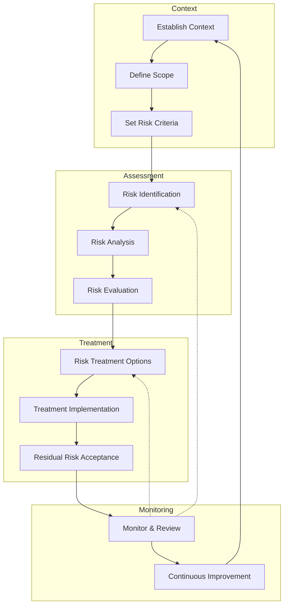
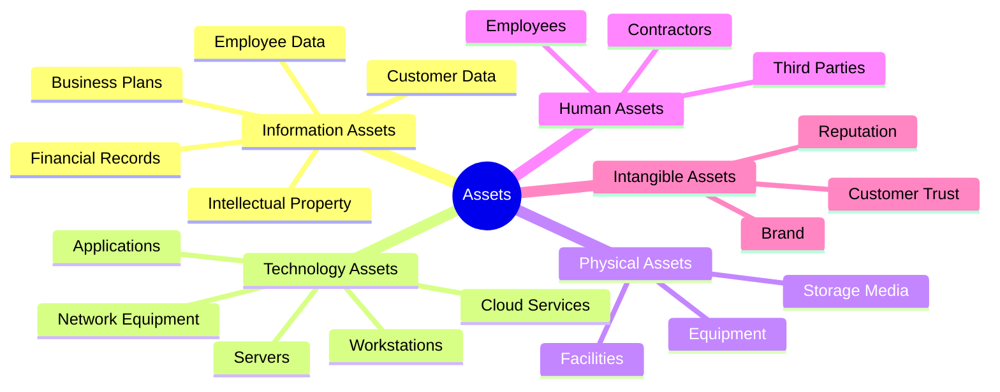
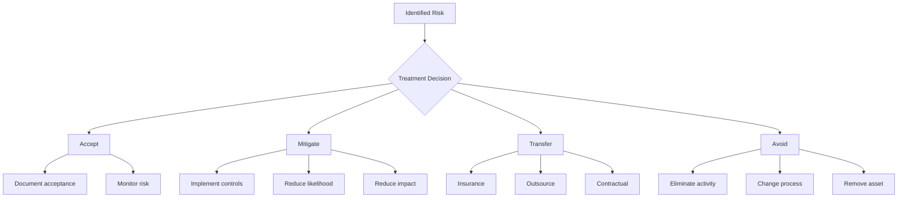

# ⚖️ Risk Assessment Methodology

**Author:** Asif Hussain  
**Version:** 1.0.0  
**Last Updated:** December 30, 2025  
**Status:** ✅ Active  
**Category:** Security Knowledge Library  

---

## 📋 Executive Summary

This methodology provides a structured approach to identifying, analyzing, evaluating, and treating information security risks. It establishes standardized procedures for risk assessment activities, scoring criteria, and documentation requirements to enable consistent risk management across the organization.

**Related Documents:**
- `threat-modeling-framework.md` - Threat identification
- `vulnerability-assessment-framework.md` - Vulnerability analysis
- `incident-response-playbook.md` - Risk materialization response

---

## 🎯 Risk Assessment Framework

### Risk Management Lifecycle



---

## 📋 Phase 1: Establish Context

### 1.1 Organizational Context

**Internal Factors:**
| Factor | Considerations |
|--------|---------------|
| Governance | Organizational structure, roles, accountability |
| Strategy | Business objectives, strategic initiatives |
| Culture | Risk appetite, security awareness |
| Capabilities | Resources, skills, technology |
| Standards | Internal policies, procedures, guidelines |

**External Factors:**
| Factor | Considerations |
|--------|---------------|
| Regulatory | Compliance requirements (GDPR, HIPAA, PCI-DSS) |
| Legal | Contractual obligations, liability |
| Market | Industry trends, competitive landscape |
| Threat Landscape | Emerging threats, attack trends |
| Technology | New technologies, vulnerabilities |

### 1.2 Scope Definition

```markdown
# Risk Assessment Scope Document

**Assessment ID:** [RA-YYYY-NNN]  
**Assessment Type:** [Annual | Project | System | Compliance]  
**Date:** [Start Date] - [End Date]  
**Lead Assessor:** [Name]  

## Scope

### In Scope
| Category | Assets/Systems |
|----------|---------------|
| Applications | [List applications] |
| Infrastructure | [List systems] |
| Data | [Data classifications] |
| Processes | [Business processes] |
| Third Parties | [Vendors/partners] |

### Out of Scope
| Category | Reason |
|----------|--------|
| [Asset/System] | [Justification] |

## Assessment Boundaries
- Geographic: [Locations]
- Organizational: [Departments/teams]
- Technical: [Networks/systems]
- Temporal: [Time period]
```

### 1.3 Risk Criteria Definition

**Risk Appetite Statement:**
| Risk Category | Appetite Level | Description |
|--------------|----------------|-------------|
| Strategic | Moderate | Accept calculated risks for competitive advantage |
| Financial | Low | Minimize financial exposure |
| Operational | Moderate | Accept manageable operational disruptions |
| Compliance | Very Low | Zero tolerance for compliance violations |
| Reputational | Low | Protect brand and customer trust |
| Security | Low | Prioritize data and system protection |

**Risk Tolerance Thresholds:**
| Level | Quantitative | Action Required |
|-------|-------------|-----------------|
| Critical | >$1M impact or >10K records | Immediate escalation, CEO notification |
| High | $500K-$1M or 1K-10K records | Executive review within 24 hours |
| Medium | $100K-$500K or 100-1K records | Management review within 1 week |
| Low | $10K-$100K or <100 records | Standard remediation process |
| Minimal | <$10K | Accept or address opportunistically |

---

## 🔍 Phase 2: Risk Identification

### 2.1 Asset Identification

**Asset Categories:**


**Asset Inventory Template:**
| Asset ID | Name | Owner | Classification | Location | Dependencies | Criticality |
|----------|------|-------|---------------|----------|--------------|-------------|
| A-001 | Customer DB | DBA Team | Confidential | AWS RDS | App Server | Critical |
| A-002 | Web Server | IT Ops | Internal | AWS EC2 | Load Balancer | High |

### 2.2 Threat Identification

**Threat Sources:**
| Category | Examples | Motivation |
|----------|----------|------------|
| **Nation States** | APT groups, cyber warfare | Espionage, disruption |
| **Cybercriminals** | Ransomware gangs, fraud rings | Financial gain |
| **Hacktivists** | Anonymous, political groups | Ideology, publicity |
| **Insiders** | Employees, contractors | Revenge, financial gain |
| **Competitors** | Corporate espionage | Competitive advantage |
| **Script Kiddies** | Amateur hackers | Notoriety, curiosity |
| **Natural Events** | Disasters, power outages | N/A |
| **Accidents** | Human error, system failures | N/A |

**Threat Catalog (STRIDE-based):**
| Threat ID | Category | Threat | Typical Attack Vectors |
|-----------|----------|--------|----------------------|
| T-001 | Spoofing | Credential theft | Phishing, credential stuffing |
| T-002 | Spoofing | Session hijacking | XSS, cookie theft |
| T-003 | Tampering | Data modification | SQL injection, MitM |
| T-004 | Tampering | Code injection | Command injection, XSS |
| T-005 | Repudiation | Action denial | Missing audit logs |
| T-006 | Information Disclosure | Data breach | Misconfiguration, vulnerabilities |
| T-007 | Denial of Service | Service disruption | DDoS, resource exhaustion |
| T-008 | Elevation of Privilege | Privilege escalation | Misconfiguration, exploits |

### 2.3 Vulnerability Identification

**Vulnerability Sources:**
- Automated vulnerability scans
- Penetration test findings
- Code review results
- Configuration assessments
- Vendor security advisories
- Threat intelligence feeds

**Vulnerability Assessment Matrix:**
| Vuln ID | Asset | Vulnerability | CVE | CVSS | Exploitability |
|---------|-------|--------------|-----|------|----------------|
| V-001 | Web App | SQL Injection | N/A | 9.8 | Active exploits |
| V-002 | Server | Unpatched OS | CVE-2024-XXX | 7.5 | PoC available |

### 2.4 Risk Scenario Development

**Risk Scenario Template:**
```markdown
## Risk Scenario: [RS-NNN]

**Title:** [Descriptive name]

**Threat Actor:** [Who/what causes the risk]
**Threat Action:** [What they do]
**Vulnerability:** [What weakness is exploited]
**Asset:** [What is affected]
**Impact:** [What happens]

### Scenario Narrative
[Detailed description of how the risk materializes]

### Attack Chain
1. [Initial access method]
2. [Exploitation technique]
3. [Persistence mechanism]
4. [Impact realization]

### Historical Precedent
[Similar incidents that have occurred]
```

---

## 📊 Phase 3: Risk Analysis

### 3.1 CVSS v3.1 Scoring

**Common Vulnerability Scoring System (CVSS) Calculator:**

```mermaid
flowchart LR
    subgraph Base Score
        AV[Attack Vector]
        AC[Attack Complexity]
        PR[Privileges Required]
        UI[User Interaction]
        S[Scope]
        C[Confidentiality]
        I[Integrity]
        A[Availability]
    end
    
    subgraph Temporal
        E[Exploit Maturity]
        RL[Remediation Level]
        RC[Report Confidence]
    end
    
    subgraph Environmental
        CR[Confidentiality Req]
        IR[Integrity Req]
        AR[Availability Req]
        MAV[Modified AV]
        MAC[Modified AC]
    end
    
    Base Score --> Temporal --> Environmental
```

**CVSS Base Metrics:**
| Metric | Values | Description |
|--------|--------|-------------|
| **Attack Vector (AV)** | Network (0.85), Adjacent (0.62), Local (0.55), Physical (0.20) | How the vulnerability is exploited |
| **Attack Complexity (AC)** | Low (0.77), High (0.44) | Conditions beyond attacker control |
| **Privileges Required (PR)** | None (0.85), Low (0.62/0.68), High (0.27/0.50) | Level of privileges needed |
| **User Interaction (UI)** | None (0.85), Required (0.62) | Whether user action required |
| **Scope (S)** | Unchanged (U), Changed (C) | Impact beyond vulnerable component |
| **Confidentiality (C)** | High (0.56), Low (0.22), None (0) | Impact on confidentiality |
| **Integrity (I)** | High (0.56), Low (0.22), None (0) | Impact on integrity |
| **Availability (A)** | High (0.56), Low (0.22), None (0) | Impact on availability |

**CVSS Score Ranges:**
| Score | Severity | Color Code |
|-------|----------|------------|
| 0.0 | None | ⬜ Gray |
| 0.1-3.9 | Low | 🟢 Green |
| 4.0-6.9 | Medium | 🟡 Yellow |
| 7.0-8.9 | High | 🟠 Orange |
| 9.0-10.0 | Critical | 🔴 Red |

### 3.2 Likelihood Assessment

**Likelihood Rating Scale:**
| Rating | Score | Probability | Frequency | Description |
|--------|-------|-------------|-----------|-------------|
| **Almost Certain** | 5 | >90% | Multiple times/year | Expected to occur |
| **Likely** | 4 | 60-90% | Once per year | Will probably occur |
| **Possible** | 3 | 30-60% | Once per 2-3 years | Might occur |
| **Unlikely** | 2 | 10-30% | Once per 5 years | Could occur occasionally |
| **Rare** | 1 | <10% | Once per 10+ years | May occur in exceptional cases |

**Likelihood Factors:**
| Factor | High Likelihood | Low Likelihood |
|--------|-----------------|----------------|
| Threat capability | Sophisticated, well-resourced | Limited skills/resources |
| Threat motivation | High value target, revenge | Low interest |
| Attack surface | Large, exposed | Small, protected |
| Vulnerability age | New, unpatched | Old, mitigated |
| Control effectiveness | Weak, bypassed | Strong, monitored |
| Historical frequency | Multiple incidents | No history |

### 3.3 Impact Assessment

**Impact Categories:**
| Category | Critical (5) | High (4) | Medium (3) | Low (2) | Minimal (1) |
|----------|-------------|----------|------------|---------|-------------|
| **Financial** | >$1M | $500K-$1M | $100K-$500K | $10K-$100K | <$10K |
| **Operational** | Total shutdown >1 week | Major disruption 1-7 days | Significant impact 1-24 hrs | Minor disruption <1 hr | Negligible |
| **Compliance** | License revocation, criminal | Major fines, sanctions | Moderate fines, audit findings | Minor findings | None |
| **Reputational** | National news, customer exodus | Industry coverage, churn | Local coverage, complaints | Social media mentions | Internal only |
| **Safety** | Loss of life | Serious injury | Minor injury | Near miss | None |
| **Data** | >100K records | 10K-100K records | 1K-10K records | 100-1K records | <100 records |

**Impact Assessment Worksheet:**
```markdown
## Impact Assessment: [Risk ID]

### Confidentiality Impact
- Data classification affected: [Classification]
- Volume of data at risk: [Number of records]
- Regulatory implications: [Regulations]
- **Score:** [1-5]

### Integrity Impact
- Systems/data affected: [Description]
- Recoverability: [Easy/Difficult/Impossible]
- Trust implications: [Description]
- **Score:** [1-5]

### Availability Impact
- Services affected: [Service list]
- Downtime estimate: [Duration]
- Revenue impact: [Amount]
- **Score:** [1-5]

### Overall Impact Score: [Max of C/I/A scores]
```

### 3.4 Risk Calculation

**Risk Score Formula:**
```
Risk Score = Likelihood × Impact
```

**Risk Matrix:**
```
        │ Minimal(1) │  Low(2)  │ Medium(3) │  High(4)  │Critical(5)│
────────┼────────────┼──────────┼───────────┼───────────┼───────────┤
Certain │     5      │    10    │    15     │    20     │    25     │
  (5)   │   Medium   │   High   │   High    │  Critical │  Critical │
────────┼────────────┼──────────┼───────────┼───────────┼───────────┤
Likely  │     4      │     8    │    12     │    16     │    20     │
  (4)   │    Low     │  Medium  │   High    │   High    │  Critical │
────────┼────────────┼──────────┼───────────┼───────────┼───────────┤
Possible│     3      │     6    │     9     │    12     │    15     │
  (3)   │    Low     │   Low    │  Medium   │   High    │   High    │
────────┼────────────┼──────────┼───────────┼───────────┼───────────┤
Unlikely│     2      │     4    │     6     │     8     │    10     │
  (2)   │  Minimal   │   Low    │   Low     │  Medium   │  Medium   │
────────┼────────────┼──────────┼───────────┼───────────┼───────────┤
Rare    │     1      │     2    │     3     │     4     │     5     │
  (1)   │  Minimal   │ Minimal  │   Low     │   Low     │  Medium   │
────────┴────────────┴──────────┴───────────┴───────────┴───────────┘
```

**Risk Level Definitions:**
| Level | Score Range | Response Time | Approval Level |
|-------|-------------|---------------|----------------|
| Critical | 20-25 | Immediate (≤24 hrs) | Executive/Board |
| High | 12-19 | Urgent (≤1 week) | Senior Management |
| Medium | 6-11 | Standard (≤1 month) | Management |
| Low | 3-5 | Planned (≤3 months) | Team Lead |
| Minimal | 1-2 | As Available | Risk Owner |

---

## ⚖️ Phase 4: Risk Evaluation

### 4.1 Risk Prioritization

**Prioritization Criteria:**
1. **Risk Score** - Primary sorting factor
2. **Asset Criticality** - Business importance
3. **Regulatory Requirements** - Compliance mandates
4. **Exploitability** - Active threats/exploits
5. **Remediation Complexity** - Quick wins vs. long-term

**Risk Priority Matrix:**
| Priority | Risk Score | Asset Criticality | Action Timeline |
|----------|-----------|-------------------|-----------------|
| P1 - Critical | 20-25 | Critical/High | Immediate action |
| P2 - High | 12-19 | Any | This sprint/week |
| P3 - Medium | 6-11 | High/Medium | This quarter |
| P4 - Low | 3-5 | Medium/Low | Next quarter |
| P5 - Backlog | 1-2 | Low | As resources allow |

### 4.2 Risk Comparison

**Compare Against:**
- Risk appetite/tolerance thresholds
- Previous assessment results
- Industry benchmarks
- Regulatory requirements
- Peer organization data

**Decision Points:**
| Evaluation Result | Decision |
|-------------------|----------|
| Above risk tolerance | Must treat/mitigate |
| At risk tolerance | Consider treatment options |
| Below risk tolerance | Monitor, accept if cost-effective |
| Regulatory requirement | Must address regardless of score |

---

## 🔧 Phase 5: Risk Treatment

### 5.1 Treatment Options



**Treatment Option Analysis:**
| Option | When to Use | Considerations |
|--------|-------------|----------------|
| **Accept** | Risk within tolerance, cost of treatment exceeds benefit | Requires formal approval, ongoing monitoring |
| **Mitigate** | Risk above tolerance, controls available | Cost-benefit analysis, control effectiveness |
| **Transfer** | Risk can be shared/shifted | Insurance limits, vendor reliability |
| **Avoid** | Risk unacceptable, no viable mitigation | Business impact, alternative approaches |

### 5.2 Control Selection

**Control Categories:**
| Type | Purpose | Examples |
|------|---------|----------|
| **Preventive** | Stop incidents from occurring | Firewalls, access controls, training |
| **Detective** | Identify incidents when they occur | IDS/IPS, SIEM, log monitoring |
| **Corrective** | Limit damage, restore systems | Incident response, backups, patches |
| **Deterrent** | Discourage threat actors | Warnings, surveillance, penalties |
| **Compensating** | Alternative when primary control not feasible | Additional monitoring, manual review |

**Control Effectiveness Rating:**
| Rating | Effectiveness | Description |
|--------|---------------|-------------|
| 5 - Excellent | >90% | Fully automated, continuously monitored |
| 4 - Good | 70-90% | Well-implemented, regularly tested |
| 3 - Moderate | 50-70% | Implemented but gaps exist |
| 2 - Limited | 30-50% | Partially implemented, inconsistent |
| 1 - Minimal | <30% | Basic only, significant gaps |

### 5.3 Risk Treatment Plan

**Treatment Plan Template:**
```markdown
# Risk Treatment Plan

**Risk ID:** [RS-NNN]  
**Risk Title:** [Title]  
**Risk Owner:** [Name]  
**Treatment Owner:** [Name]  

## Current State
- **Risk Score:** [Score]
- **Risk Level:** [Critical/High/Medium/Low]
- **Current Controls:** [List existing controls]

## Treatment Strategy
**Selected Option:** [Accept/Mitigate/Transfer/Avoid]

## Treatment Actions
| # | Action | Owner | Due Date | Status | Cost |
|---|--------|-------|----------|--------|------|
| 1 | [Action description] | [Name] | [Date] | [Status] | [$] |
| 2 | [Action description] | [Name] | [Date] | [Status] | [$] |

## Target State
- **Target Risk Score:** [Score]
- **Target Risk Level:** [Level]
- **Expected Residual Risk:** [Description]

## Success Criteria
- [ ] [Criterion 1]
- [ ] [Criterion 2]

## Monitoring Plan
- **Review Frequency:** [Weekly/Monthly/Quarterly]
- **Key Metrics:** [List metrics]
- **Escalation Triggers:** [Define triggers]

## Approval
| Role | Name | Date | Signature |
|------|------|------|-----------|
| Risk Owner | | | |
| Treatment Owner | | | |
| Approver | | | |
```

### 5.4 Residual Risk Assessment

**Residual Risk Calculation:**
```
Residual Risk = Inherent Risk × (1 - Control Effectiveness)
```

**Example:**
- Inherent Risk Score: 20 (Critical)
- Control Effectiveness: 70%
- Residual Risk: 20 × 0.30 = 6 (Medium)

**Residual Risk Acceptance:**
| Residual Level | Approval Authority | Documentation Required |
|----------------|-------------------|----------------------|
| Critical | Board/CEO | Detailed justification, timeline |
| High | CISO/CRO | Business case, mitigation timeline |
| Medium | Department Head | Risk acceptance form |
| Low | Manager | Standard documentation |
| Minimal | Risk Owner | Register entry |

---

## 📝 Risk Register

### Risk Register Template

| Field | Description |
|-------|-------------|
| Risk ID | Unique identifier (RS-YYYY-NNN) |
| Title | Short descriptive name |
| Description | Detailed risk description |
| Category | Risk category (Security, Compliance, etc.) |
| Owner | Accountable individual |
| Asset(s) | Affected assets |
| Threat | Threat source/action |
| Vulnerability | Weakness exploited |
| Inherent Likelihood | Pre-control likelihood (1-5) |
| Inherent Impact | Pre-control impact (1-5) |
| Inherent Risk Score | Likelihood × Impact |
| Existing Controls | Current mitigations |
| Control Effectiveness | Rating (1-5) |
| Residual Likelihood | Post-control likelihood |
| Residual Impact | Post-control impact |
| Residual Risk Score | Residual L × I |
| Treatment | Accept/Mitigate/Transfer/Avoid |
| Treatment Plan | Link to treatment plan |
| Target Risk Score | Expected after treatment |
| Status | Open/In Progress/Closed |
| Review Date | Next review date |
| Last Updated | Last modification date |

### Sample Risk Register Entry

```yaml
Risk:
  id: RS-2025-042
  title: SQL Injection in Customer Portal
  description: >
    Customer-facing web application vulnerable to SQL injection 
    attacks due to insufficient input validation in search functionality.
  category: Application Security
  owner: Application Security Lead
  assets:
    - Customer Portal (Web App)
    - Customer Database
  threat:
    source: External Attacker
    action: Data exfiltration via SQL injection
  vulnerability: CWE-89 SQL Injection
  
  inherent_assessment:
    likelihood: 4  # Likely - active exploitation attempts
    impact: 5      # Critical - customer data exposure
    score: 20      # Critical
    
  existing_controls:
    - Web Application Firewall (moderate effectiveness)
    - Database activity monitoring
    
  control_effectiveness: 2  # Limited
  
  residual_assessment:
    likelihood: 3  # Possible
    impact: 5      # Critical (unchanged)
    score: 15      # High
    
  treatment:
    strategy: Mitigate
    plan_id: TP-2025-042
    actions:
      - Implement parameterized queries
      - Deploy input validation
      - Enhance WAF rules
    target_score: 5  # Low
    
  status: In Progress
  review_date: 2025-01-15
  last_updated: 2025-12-30
```

---

## 📊 Reporting & Communication

### Risk Dashboard Metrics

**Key Risk Indicators (KRIs):**
| Metric | Description | Target | Alert |
|--------|-------------|--------|-------|
| Critical Risks | Count of critical-level risks | 0 | >0 |
| High Risks | Count of high-level risks | <5 | >10 |
| Overdue Treatments | Treatment plans past due | 0 | >3 |
| Avg Time to Treat | Mean days to complete treatment | <30 | >60 |
| Control Effectiveness | Average control rating | >3.5 | <3.0 |
| Risk Trend | Month-over-month risk change | Decreasing | Increasing |

### Executive Risk Report

**Report Components:**
1. **Executive Summary** - Key findings, trends, recommendations
2. **Risk Heat Map** - Visual risk distribution
3. **Top 10 Risks** - Highest priority risks
4. **Treatment Progress** - Status of mitigation efforts
5. **Trend Analysis** - Risk changes over time
6. **Recommendations** - Strategic risk guidance

### Risk Heat Map Visualization

```
                    IMPACT
           Low    Medium    High    Critical
         ┌────────┬────────┬────────┬────────┐
 High    │   2    │   5    │   8    │  12    │
         ├────────┼────────┼────────┼────────┤
LIKELIHOOD│   1    │   3    │   6    │   9    │
 Medium  │        │        │   ●    │   ●●   │
         ├────────┼────────┼────────┼────────┤
 Low     │   0    │   2    │   4    │   5    │
         │   ●    │   ●●   │  ●●●   │   ●    │
         └────────┴────────┴────────┴────────┘
         
Legend: Each ● represents one risk
```

---

## 🔄 Continuous Monitoring

### Review Schedule

| Activity | Frequency | Owner |
|----------|-----------|-------|
| Risk register review | Weekly | Risk Team |
| KRI monitoring | Daily/Real-time | SOC |
| Control testing | Quarterly | Security Team |
| Risk reassessment | Quarterly | Risk Owners |
| Full risk assessment | Annually | CISO |
| Board risk reporting | Quarterly | CRO/CISO |

### Trigger-Based Reviews

**Reassess When:**
- New system/application deployment
- Significant infrastructure changes
- Security incident occurrence
- New regulatory requirements
- Merger/acquisition activity
- Major vendor changes
- Emerging threat intelligence

---

## 📚 Resources

### Standards & Frameworks
- [ISO 27005](https://www.iso.org/standard/75281.html) - Information Security Risk Management
- [NIST SP 800-30](https://csrc.nist.gov/publications/detail/sp/800-30/rev-1/final) - Risk Assessment Guide
- [FAIR](https://www.fairinstitute.org/) - Factor Analysis of Information Risk
- [OCTAVE](https://www.sei.cmu.edu/our-work/cybersecurity/) - Operationally Critical Threat, Asset, and Vulnerability Evaluation

### Related Documents
- `threat-modeling-framework.md` - Threat identification methodology
- `vulnerability-assessment-framework.md` - Vulnerability analysis
- `incident-response-playbook.md` - Risk materialization response
- `soc2-compliance-checklist.md` - SOC 2 risk requirements
- `gdpr-compliance-checklist.md` - GDPR risk requirements

---

## 📝 Document History

| Version | Date | Author | Changes |
|---------|------|--------|---------|
| 1.0.0 | 2025-12-30 | Asif Hussain | Initial comprehensive methodology |

---

*This methodology is part of the CORTEX Security Knowledge Library and should be reviewed annually or when significant organizational changes occur.*
