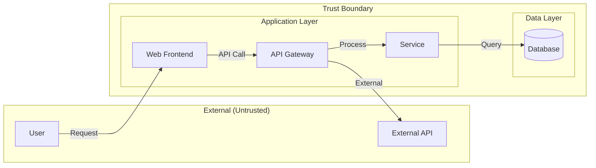

# 📋 Security Documentation Standards

**Version:** 1.0.0  
**Created:** December 30, 2025  
**Author:** Asif Hussain  
**Status:** ✅ Production  
**Category:** Standards & Guidelines  

---

## 📑 Table of Contents

1. [Overview](#1-overview)
2. [Security Documentation Requirements](#2-security-documentation-requirements)
3. [Documentation Templates](#3-documentation-templates)
4. [Threat Modeling Standards](#4-threat-modeling-standards)
5. [Security Requirements Documentation](#5-security-requirements-documentation)
6. [Compliance Documentation](#6-compliance-documentation)
7. [Risk Documentation](#7-risk-documentation)
8. [Review and Approval Process](#8-review-and-approval-process)
9. [Version Control and Maintenance](#9-version-control-and-maintenance)
10. [Integration with CORTEX Planning System](#10-integration-with-cortex-planning-system)

---

## 1. Overview

### 1.1 Purpose

This document establishes standards for creating, maintaining, and managing security documentation within CORTEX projects. These standards ensure consistent, comprehensive, and actionable security documentation across all development initiatives.

### 1.2 Scope

These standards apply to:
- All CORTEX plans with security implications
- Feature development with authentication, authorization, or data handling
- API development and integration projects
- Infrastructure and deployment configurations
- Third-party integrations and dependencies

### 1.3 Key Principles

| Principle | Description |
|-----------|-------------|
| **Completeness** | All relevant security aspects documented |
| **Accuracy** | Technical details verified and current |
| **Actionability** | Clear steps for implementation and verification |
| **Traceability** | Links to requirements, threats, and mitigations |
| **Maintainability** | Regular updates as threats evolve |

---

## 2. Security Documentation Requirements

### 2.1 Mandatory Documentation

Every plan with security relevance MUST include:

| Document | Location | Purpose |
|----------|----------|---------|
| **Security Documentation** | `{plan}/security/security-documentation.md` | Comprehensive security analysis |
| **Threat Model** | Within security documentation | STRIDE analysis of threats |
| **Security Requirements** | Within security documentation | Functional & non-functional |
| **Compliance Mapping** | Within security documentation | Regulatory requirements |
| **Risk Register** | Within security documentation | Identified risks and mitigations |

### 2.2 Security Relevance Detection

A plan is security-relevant if it involves ANY of:

```yaml
security_domains:
  authentication:
    - login
    - password
    - credential
    - session
    - token
    - jwt
    - oauth
    - sso
    - mfa
    - 2fa
    
  authorization:
    - permission
    - role
    - rbac
    - abac
    - access control
    - privilege
    - grant
    
  data_protection:
    - encryption
    - decrypt
    - hash
    - pii
    - sensitive
    - personal data
    - user data
    
  input_handling:
    - input
    - validation
    - sanitize
    - form
    - upload
    - file
    - user input
    
  api_security:
    - api
    - endpoint
    - rest
    - graphql
    - webhook
    - request
    - response
    
  network:
    - https
    - tls
    - ssl
    - certificate
    - firewall
    - proxy
```

### 2.3 Documentation Depth Tiers

| Tier | Criteria | Required Sections |
|------|----------|-------------------|
| **BASIC** | Low security impact | Executive Summary, Basic Threat Model, Security Checklist |
| **STANDARD** | Medium security impact | All BASIC + Full STRIDE Analysis, Security Requirements, Risk Register |
| **COMPREHENSIVE** | High security impact | All STANDARD + Compliance Mapping, Testing Plan, Incident Response |
| **CRITICAL** | Critical security impact | All COMPREHENSIVE + External Review, Penetration Testing, Continuous Monitoring |

---

## 3. Documentation Templates

### 3.1 Primary Template

**Location:** `cortex-brain/templates/security/plan-security-template.md`

This template provides a complete framework for security documentation with:
- Executive Summary
- STRIDE Threat Model
- Security Requirements (Functional & Non-Functional)
- OWASP Top 10 Mapping
- Compliance Mapping (GDPR, HIPAA, PCI-DSS, SOC2)
- Mitigation Strategies
- Security Testing Plan
- Risk Register
- Review Checklists

### 3.2 Template Usage

```markdown
# When creating a new plan:
1. Planning system automatically creates security/ subfolder
2. security-documentation.md generated from template
3. Placeholders replaced with plan-specific values
4. Security team reviews and completes analysis
```

### 3.3 Placeholder Variables

| Variable | Description | Example |
|----------|-------------|---------|
| `{PLAN_NAME}` | Name of the plan | User Authentication System |
| `{DATE}` | Current date | 2025-12-30 |
| `{AUTHOR}` | Document author | Asif Hussain |
| `{HIGH/MEDIUM/LOW}` | Security relevance | HIGH |
| `{Threat}` | Threat description | SQL Injection in login form |
| `{Asset}` | Asset at risk | User credentials database |

---

## 4. Threat Modeling Standards

### 4.1 Required Methodology: STRIDE

All threat models MUST use STRIDE methodology:

| Category | Question | Example Threats |
|----------|----------|-----------------|
| **S**poofing | Can identity be faked? | Session hijacking, credential theft |
| **T**ampering | Can data be modified? | SQL injection, parameter tampering |
| **R**epudiation | Can actions be denied? | Missing audit logs, unsigned transactions |
| **I**nformation Disclosure | Can data be exposed? | Data leakage, verbose errors |
| **D**enial of Service | Can service be disrupted? | Resource exhaustion, flooding |
| **E**levation of Privilege | Can access be escalated? | Privilege escalation, broken access control |

### 4.2 Threat Model Format

```markdown
#### {STRIDE Category}

| Threat | Asset | Likelihood | Impact | Risk Score | Status |
|--------|-------|------------|--------|------------|--------|
| {Description} | {Asset} | {1-5} | {1-5} | {L×I} | {Status} |

**Mitigations:**
- [ ] {Mitigation 1}
- [ ] {Mitigation 2}
```

### 4.3 Attack Surface Documentation

Required elements:
- **Entry Points:** All interfaces accepting external input
- **Trust Boundaries:** Lines between different trust levels
- **Data Flows:** How data moves through the system
- **Assets:** What needs protection

### 4.4 Data Flow Diagrams

Every threat model SHOULD include a Mermaid DFD:



---

## 5. Security Requirements Documentation

### 5.1 Functional Security Requirements Format

```markdown
| ID | Requirement | Priority | OWASP | Status |
|----|-------------|----------|-------|--------|
| SEC-001 | {Description} | P1/P2/P3 | A01-A10 | ⏳ |
```

### 5.2 Non-Functional Security Requirements

| Category | Examples | Metrics |
|----------|----------|---------|
| **Performance** | Auth response time | < 500ms |
| **Cryptography** | Password hashing | bcrypt/Argon2 cost ≥ 10 |
| **Session** | Timeout | 15-60 minutes |
| **Transport** | TLS version | TLS 1.2+ only |
| **Availability** | Rate limiting | 100 req/min per user |

### 5.3 OWASP Top 10 Mapping

Every plan MUST document applicability of OWASP Top 10 2021:

| ID | Category | Applicable | Requirement |
|----|----------|------------|-------------|
| A01:2021 | Broken Access Control | ✅/❌ | {Requirement} |
| A02:2021 | Cryptographic Failures | ✅/❌ | {Requirement} |
| A03:2021 | Injection | ✅/❌ | {Requirement} |
| A04:2021 | Insecure Design | ✅/❌ | {Requirement} |
| A05:2021 | Security Misconfiguration | ✅/❌ | {Requirement} |
| A06:2021 | Vulnerable Components | ✅/❌ | {Requirement} |
| A07:2021 | Authentication Failures | ✅/❌ | {Requirement} |
| A08:2021 | Software/Data Integrity | ✅/❌ | {Requirement} |
| A09:2021 | Logging Failures | ✅/❌ | {Requirement} |
| A10:2021 | SSRF | ✅/❌ | {Requirement} |

---

## 6. Compliance Documentation

### 6.1 Compliance Applicability

Document which regulations apply based on:

| Factor | Regulations |
|--------|-------------|
| **PII Processing** | GDPR, CCPA |
| **Healthcare Data** | HIPAA, HITECH |
| **Payment Data** | PCI-DSS |
| **Financial Services** | SOX, GLBA |
| **General Security** | SOC2, ISO 27001 |

### 6.2 Compliance Mapping Format

```markdown
#### {Regulation} Compliance

| Article/Requirement | Description | Implementation | Status |
|---------------------|-------------|----------------|--------|
| {ID} | {Requirement} | {How implemented} | ⏳ |
```

### 6.3 Evidence Requirements

For each compliance claim, document:
- **Control Implementation:** How the requirement is met
- **Evidence:** Proof of implementation (logs, configs, code)
- **Testing:** How compliance is verified
- **Owner:** Who is responsible

---

## 7. Risk Documentation

### 7.1 Risk Assessment Format

```markdown
| Risk ID | Description | Likelihood | Impact | Score | Owner | Status |
|---------|-------------|------------|--------|-------|-------|--------|
| RISK-001 | {Description} | {1-5} | {1-5} | {L×I} | {Owner} | ⏳ |
```

### 7.2 Risk Scoring Matrix

| Score | Likelihood | Impact |
|-------|------------|--------|
| 1 | Rare | Minimal |
| 2 | Unlikely | Minor |
| 3 | Possible | Moderate |
| 4 | Likely | Major |
| 5 | Almost Certain | Severe |

### 7.3 Risk Level Actions

| Level | Score Range | Required Action |
|-------|-------------|-----------------|
| 🟢 **Low** | 1-6 | Monitor, accept if appropriate |
| 🟡 **Medium** | 7-12 | Plan mitigation, implement within sprint |
| 🟠 **High** | 13-19 | Prioritize mitigation, escalate to lead |
| 🔴 **Critical** | 20-25 | Immediate action, block deployment |

### 7.4 Mitigation Documentation

Each risk mitigation MUST include:

```markdown
| ID | Mitigation | Control Type | Phase | Effort | Status |
|----|-----------|-------------|-------|--------|--------|
| MIT-001 | {Description} | Preventive/Detective/Corrective | {Phase} | {Hours} | ⏳ |
```

---

## 8. Review and Approval Process

### 8.1 Review Stages

| Stage | Reviewer | Criteria | Timing |
|-------|----------|----------|--------|
| **Self-Review** | Author | Template completeness | Before submission |
| **Peer Review** | Team member | Technical accuracy | Within 2 days |
| **Security Review** | Security team | Threat coverage | For HIGH+ tier |
| **Final Approval** | Tech lead | Overall quality | Before implementation |

### 8.2 Review Checklist

**Pre-Implementation:**
- [ ] Threat model completed with all STRIDE categories
- [ ] Security requirements documented
- [ ] OWASP Top 10 mapping completed
- [ ] Compliance requirements identified
- [ ] Risk register populated
- [ ] Mitigations defined

**Pre-Deployment:**
- [ ] Security testing completed
- [ ] All P1/P2 vulnerabilities resolved
- [ ] Code review completed
- [ ] Documentation updated
- [ ] Monitoring configured

### 8.3 Approval Documentation

```markdown
## Approvals

| Role | Name | Date | Signature |
|------|------|------|-----------|
| Author | {Name} | {Date} | ✅ |
| Peer Reviewer | {Name} | {Date} | ✅ |
| Security Reviewer | {Name} | {Date} | ✅ |
| Final Approver | {Name} | {Date} | ✅ |
```

---

## 9. Version Control and Maintenance

### 9.1 Document Versioning

Use semantic versioning:
- **Major (X.0.0):** Significant changes to security posture
- **Minor (0.X.0):** New threats, requirements, or mitigations
- **Patch (0.0.X):** Corrections, clarifications, status updates

### 9.2 Change Log Format

```markdown
## Document History

| Version | Date | Author | Changes |
|---------|------|--------|---------|
| 1.0.0 | {Date} | {Author} | Initial security documentation |
| 1.1.0 | {Date} | {Author} | Added new threat: {Description} |
```

### 9.3 Maintenance Schedule

| Activity | Frequency | Trigger |
|----------|-----------|---------|
| **Threat Model Update** | Quarterly | New threats, architecture changes |
| **Risk Review** | Monthly | Risk status changes |
| **Compliance Check** | Annually | Regulatory updates |
| **Full Review** | Per release | Before major deployments |

---

## 10. Integration with CORTEX Planning System

### 10.1 Automatic Generation

The CORTEX planning system automatically:
1. Detects security relevance in plan features
2. Creates `security/` subfolder in plan structure
3. Generates `security-documentation.md` from template
4. Populates placeholders with plan metadata

### 10.2 Plan Folder Structure

```
{plan-name}/
├── 00-master-plan.md
├── context/
├── reports/
├── artifacts/
├── security/                    # Phase 3: Mandatory
│   └── security-documentation.md
└── tracking/
    └── progress-tracker.json
```

### 10.3 Maintenance System Integration

The CORTEX maintenance system:
- **Verifies** security folder exists for all plans
- **Validates** security documentation completeness
- **Reports** missing security documentation
- **Auto-repairs** by creating security folders if missing

### 10.4 CLI Commands

```bash
# Create new plan with security folder (default)
python plan_scaffold_generator.py "feature-name"

# Create without security (legacy mode)
python plan_scaffold_generator.py "feature-name" --no-security

# Add security to existing plan
python plan_scaffold_generator.py "existing-plan" --retrofit-security

# Retrofit ALL plans with security
python plan_scaffold_generator.py --retrofit-all

# Validate plan structure (includes security check)
python plan_scaffold_generator.py "feature-name" --validate
```

---

## 📚 Related Documents

- [Threat Modeling Framework](threat-modeling-framework.md)
- [OWASP Top 10 Guide](owasp-top-10-guide.md)
- [API Security Foundations](api-security-foundations.md)
- [Risk Assessment Methodology](risk-assessment-methodology.md)
- [Data Protection Framework](data-protection-framework.md)
- [Incident Response Playbook](incident-response-playbook.md)
- [Access Control Patterns](access-control-patterns.md)
- [Audit Logging Standards](audit-logging-standards.md)

### Compliance Checklists

- [GDPR Compliance Checklist](../compliance/gdpr-compliance-checklist.md)
- [HIPAA Compliance Checklist](../compliance/hipaa-compliance-checklist.md)
- [PCI-DSS Compliance Checklist](../compliance/pci-dss-compliance-checklist.md)
- [SOC2 Compliance Checklist](../compliance/soc2-compliance-checklist.md)

---

## 📝 Document History

| Version | Date | Author | Changes |
|---------|------|--------|---------|
| 1.0.0 | 2025-12-30 | Asif Hussain | Initial security documentation standards |

---

**⚠️ IMPORTANT:** These standards are mandatory for all CORTEX plans with security implications. Non-compliance may result in blocked deployments and security review escalation.
