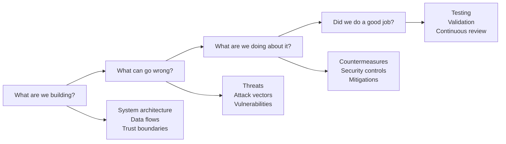
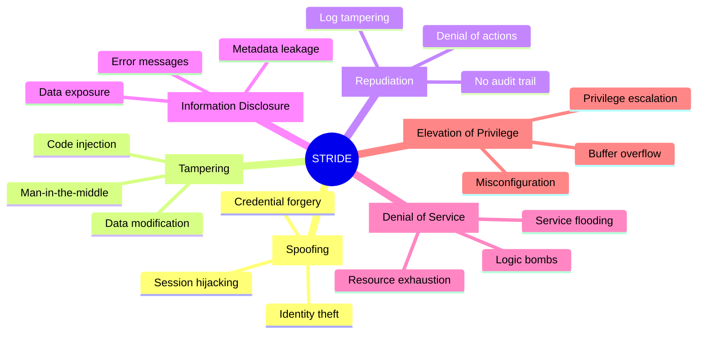
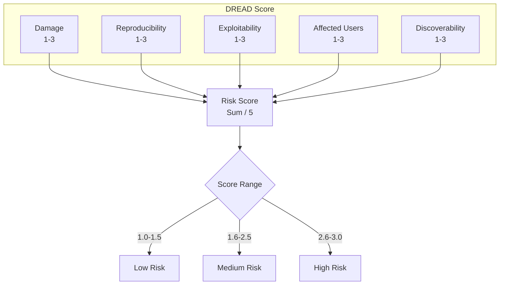
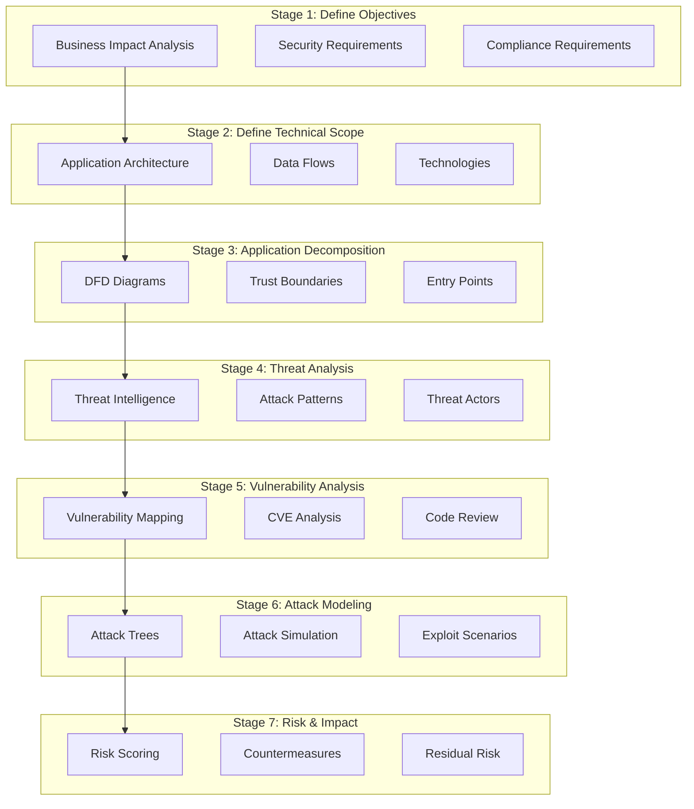
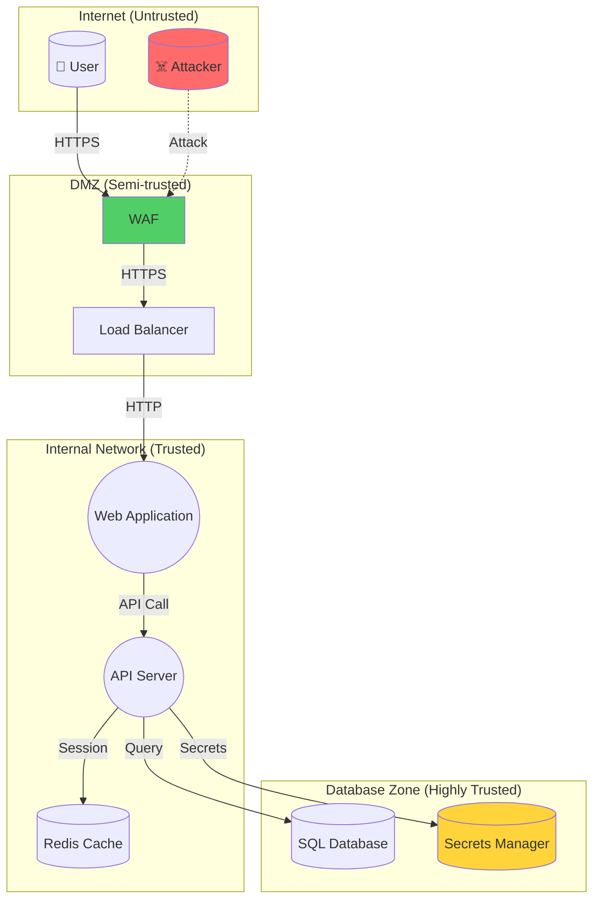
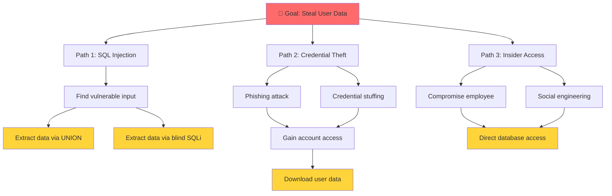

# 🎯 Threat Modeling Framework

**Author:** Asif Hussain  
**Version:** 1.0.0  
**Last Updated:** December 30, 2025  
**Status:** ✅ Active  
**Category:** Security Knowledge Library  

---

## 📋 Executive Summary

This framework provides a comprehensive methodology for identifying, categorizing, and mitigating security threats in software systems. It combines industry-standard approaches (STRIDE, DREAD, PASTA) with practical templates and integration guidance for CORTEX planning workflows.

**Related Documents:**
- `owasp-top-10-guide.md` - Web application vulnerabilities
- `vulnerability-assessment-framework.md` - Vulnerability analysis
- `api-security-foundations.md` - API-specific threat modeling

---

## 🎯 What is Threat Modeling?

Threat modeling is a structured approach to identifying security threats, understanding their potential impact, and determining countermeasures to mitigate risks. It answers four key questions:



---

## 📊 Threat Modeling Methodologies

### Comparison Matrix

| Methodology | Focus | Best For | Complexity |
|-------------|-------|----------|------------|
| **STRIDE** | Threat categories | Application security | Medium |
| **DREAD** | Risk scoring | Prioritization | Low |
| **PASTA** | Attack simulation | Comprehensive analysis | High |
| **LINDDUN** | Privacy threats | Privacy-focused systems | Medium |
| **Attack Trees** | Attack paths | Specific threat analysis | Variable |
| **VAST** | Enterprise scale | Agile/DevOps | High |

---

## 🔴 STRIDE Methodology

### Overview

STRIDE is a threat classification system developed by Microsoft. Each letter represents a category of security threat.



### STRIDE Detailed Analysis

#### S - Spoofing (Authentication Threats)

**Definition:** Pretending to be something or someone other than yourself.

| Threat | Example | Controls |
|--------|---------|----------|
| Credential theft | Phishing, keylogging | MFA, security training |
| Session hijacking | Cookie theft, XSS | Secure cookies, HTTPS |
| Token forgery | JWT manipulation | Strong signing, short expiry |
| IP spoofing | Source IP forgery | Network controls, validation |
| Certificate forgery | Fake SSL certificates | Certificate pinning, CT logs |

**Questions to Ask:**
- How do users authenticate?
- How do services authenticate to each other?
- Can authentication be bypassed?
- Are credentials transmitted securely?

#### T - Tampering (Integrity Threats)

**Definition:** Modifying data or code without authorization.

| Threat | Example | Controls |
|--------|---------|----------|
| Data modification | SQL injection, parameter tampering | Input validation, prepared statements |
| Code injection | XSS, command injection | Output encoding, parameterization |
| Man-in-the-middle | Traffic interception | TLS, certificate validation |
| Binary patching | Malware, rootkits | Code signing, integrity checks |
| Config tampering | Environment variable injection | Secure configuration, monitoring |

**Questions to Ask:**
- Where can data be modified in transit?
- Where can data be modified at rest?
- How is code integrity verified?
- Are configuration files protected?

#### R - Repudiation (Non-Repudiation Threats)

**Definition:** Claiming to have not performed an action when you did.

| Threat | Example | Controls |
|--------|---------|----------|
| Action denial | User denies transaction | Digital signatures, audit logs |
| Log tampering | Deleting audit trails | Immutable logs, SIEM |
| Timestamp manipulation | Backdating records | NTP synchronization, log chaining |
| Identity denial | Shared accounts | Individual accounts, strong auth |

**Questions to Ask:**
- Are all security-relevant actions logged?
- Can logs be tampered with?
- Is there evidence of who performed actions?
- Are timestamps from trusted sources?

#### I - Information Disclosure (Confidentiality Threats)

**Definition:** Exposing information to unauthorized parties.

| Threat | Example | Controls |
|--------|---------|----------|
| Data exposure | Database dumps, API responses | Encryption, access control |
| Error messages | Stack traces, debug info | Custom error pages, logging |
| Metadata leakage | HTTP headers, file metadata | Header hardening, scrubbing |
| Side channels | Timing attacks, cache attacks | Constant-time operations |
| Social engineering | Phishing, pretexting | Security awareness training |

**Questions to Ask:**
- What sensitive data does the system handle?
- Where is sensitive data stored?
- How is data transmitted?
- What error information is exposed?

#### D - Denial of Service (Availability Threats)

**Definition:** Making a system or resource unavailable.

| Threat | Example | Controls |
|--------|---------|----------|
| Resource exhaustion | Memory leaks, disk fill | Resource limits, monitoring |
| Network flooding | DDoS, SYN flood | Rate limiting, CDN, WAF |
| Application DoS | ReDoS, algorithmic complexity | Input validation, timeouts |
| Logic bombs | Triggered failures | Code review, testing |
| Dependency failure | Cascading failures | Circuit breakers, fallbacks |

**Questions to Ask:**
- What resources can be exhausted?
- What are the rate limits?
- How are cascading failures prevented?
- What is the recovery procedure?

#### E - Elevation of Privilege (Authorization Threats)

**Definition:** Gaining capabilities without proper authorization.

| Threat | Example | Controls |
|--------|---------|----------|
| Vertical escalation | User to admin | RBAC, least privilege |
| Horizontal escalation | User A to User B | Object-level authorization |
| Buffer overflow | Memory corruption | Memory-safe languages, ASLR |
| SQL injection | Database admin access | Least privilege DB accounts |
| Misconfiguration | Default admin accounts | Security hardening, audits |

**Questions to Ask:**
- What privileges exist in the system?
- How are privileges checked?
- Can privileges be escalated through bugs?
- Are default accounts disabled?

---

## 🟠 DREAD Risk Scoring

### Overview

DREAD provides a quantitative method for scoring threat severity. Each factor is rated 1-3 (Low, Medium, High).



### DREAD Scoring Matrix

| Factor | 1 (Low) | 2 (Medium) | 3 (High) |
|--------|---------|------------|----------|
| **Damage** | Minor data exposure | Sensitive data exposed | Complete system compromise |
| **Reproducibility** | Requires specific conditions | Reproducible with effort | Always reproducible |
| **Exploitability** | Requires advanced skills | Requires some skills | Easy to exploit (tools exist) |
| **Affected Users** | Single user | Subset of users | All users |
| **Discoverability** | Requires deep analysis | Discoverable with tools | Obvious/public knowledge |

### DREAD Calculation Example

```markdown
## Threat: SQL Injection in Login Form

| Factor | Score | Justification |
|--------|-------|---------------|
| Damage | 3 | Full database access |
| Reproducibility | 3 | Always works once found |
| Exploitability | 3 | SQLMap automates attack |
| Affected Users | 3 | All users compromised |
| Discoverability | 2 | Requires security testing |

**Total Score:** (3+3+3+3+2) / 5 = **2.8 (High Risk)**
```

---

## 🔵 PASTA Methodology

### Overview

Process for Attack Simulation and Threat Analysis (PASTA) is a risk-centric threat modeling methodology with 7 stages.



### PASTA Stages Detail

| Stage | Activities | Outputs |
|-------|------------|---------|
| **1. Define Objectives** | Business context, compliance needs | Security objectives document |
| **2. Technical Scope** | Architecture review, technology stack | Technical scope document |
| **3. Decomposition** | DFD creation, trust boundaries | Data flow diagrams |
| **4. Threat Analysis** | Threat intel, actor profiling | Threat library |
| **5. Vulnerability Analysis** | CVE mapping, code analysis | Vulnerability map |
| **6. Attack Modeling** | Attack trees, simulation | Attack scenarios |
| **7. Risk & Impact** | Risk scoring, countermeasures | Risk treatment plan |

---

## 📐 Data Flow Diagrams (DFD)

### DFD Elements

| Element | Symbol | Description |
|---------|--------|-------------|
| **External Entity** | Rectangle | Users, external systems |
| **Process** | Circle | Application components |
| **Data Store** | Parallel lines | Databases, files |
| **Data Flow** | Arrow | Data movement |
| **Trust Boundary** | Dashed line | Security domains |

### DFD Example



### Trust Boundary Analysis

```markdown
## Trust Boundary: Internet → DMZ

**Crossing Point:** WAF/Load Balancer
**Data Crossing:** User requests, responses
**Threats:**
- T1: SQL Injection through WAF bypass
- T2: XSS in request parameters
- T3: DDoS attacks

**Controls:**
- WAF rules (OWASP CRS)
- Rate limiting
- Input validation at application layer
```

---

## 🌳 Attack Trees

### Overview

Attack trees visualize the different paths an attacker might take to achieve a goal.



### Attack Tree Construction

1. **Define Goal** - What is the attacker trying to achieve?
2. **Identify Paths** - Different ways to reach the goal
3. **Decompose Steps** - Break paths into individual steps
4. **Add Logic** - AND (all required) or OR (any one)
5. **Annotate** - Difficulty, cost, likelihood

---

## 📝 Threat Modeling Templates

### Threat Identification Template

```markdown
## Threat: [Threat Name]

**ID:** THREAT-001  
**Category:** [STRIDE Category]  
**Date Identified:** YYYY-MM-DD  
**Status:** Open | Mitigated | Accepted  

### Description
[Detailed description of the threat]

### Affected Components
- Component 1: [Description]
- Component 2: [Description]

### Attack Scenario
1. Attacker [action]
2. System [response]
3. Attacker [follow-up action]
4. Result: [impact]

### DREAD Score
| Factor | Score | Justification |
|--------|-------|---------------|
| Damage | X | [Why] |
| Reproducibility | X | [Why] |
| Exploitability | X | [Why] |
| Affected Users | X | [Why] |
| Discoverability | X | [Why] |
| **Total** | **X.X** | [Risk Level] |

### Countermeasures
| Control | Type | Status | Owner |
|---------|------|--------|-------|
| [Control 1] | Preventive | Implemented | [Name] |
| [Control 2] | Detective | Planned | [Name] |

### Residual Risk
[Description of remaining risk after controls]

### References
- [CVE-XXXX-XXXX](link)
- [OWASP Reference](link)
```

### Threat Model Summary Template

```markdown
# Threat Model: [System Name]

**Version:** 1.0  
**Date:** YYYY-MM-DD  
**Author:** [Name]  
**Reviewers:** [Names]  
**Status:** Draft | Review | Approved  

## 1. System Overview
[Brief description of the system]

## 2. Scope
### In Scope
- [Component/feature 1]
- [Component/feature 2]

### Out of Scope
- [Component/feature 3]

## 3. Data Flow Diagram
[Include DFD]

## 4. Trust Boundaries
| Boundary | Description | Data Crossing |
|----------|-------------|---------------|
| TB-1 | Internet to DMZ | User requests |
| TB-2 | DMZ to Internal | Authenticated requests |

## 5. Assets
| Asset | Classification | Location | Owner |
|-------|---------------|----------|-------|
| User PII | Confidential | Database | Data Team |
| Session Tokens | Confidential | Memory/Redis | App Team |

## 6. Threat Summary
| ID | Threat | STRIDE | DREAD | Status |
|----|--------|--------|-------|--------|
| T-001 | SQL Injection | T, I, E | 2.8 | Mitigated |
| T-002 | Session Hijacking | S | 2.4 | Open |

## 7. Recommendations
| Priority | Recommendation | Effort | Impact |
|----------|---------------|--------|--------|
| P1 | Implement prepared statements | Low | High |
| P2 | Add MFA for admin | Medium | High |

## 8. Appendices
### A. Attack Trees
### B. Detailed Threat Analysis
### C. Security Controls Matrix
```

---

## 🔄 CORTEX Integration

### Planning System Integration

When CORTEX Planning System creates a coding plan, threat modeling should be automatically included:

```yaml
# Auto-generated security/threat-model.md
plan_security:
  threat_model_required: true
  trigger_patterns:
    - "api"
    - "authentication"
    - "database"
    - "user data"
    - "payment"
    - "encryption"
  
  auto_generate:
    - data_flow_diagram: true
    - stride_analysis: true
    - dread_scoring: true
    - attack_trees: conditional  # For high-risk features
    
  templates:
    base: "cortex-brain/templates/threat-model-template.md"
    api: "cortex-brain/templates/api-threat-model-template.md"
    auth: "cortex-brain/templates/auth-threat-model-template.md"
```

### TDD Security Integration

```python
# Threat-to-Test Mapping
THREAT_TO_TESTS = {
    "Spoofing": [
        "test_authentication_required",
        "test_session_validation",
        "test_token_verification"
    ],
    "Tampering": [
        "test_input_validation",
        "test_parameter_tampering",
        "test_sql_injection_prevention"
    ],
    "Repudiation": [
        "test_audit_logging",
        "test_transaction_logging"
    ],
    "Information Disclosure": [
        "test_error_handling",
        "test_sensitive_data_exposure",
        "test_authorization_checks"
    ],
    "Denial of Service": [
        "test_rate_limiting",
        "test_input_size_limits"
    ],
    "Elevation of Privilege": [
        "test_authorization_enforcement",
        "test_role_based_access"
    ]
}
```

---

## 🛠️ Threat Modeling Tools

### Recommended Tools

| Tool | Type | Best For | Cost |
|------|------|----------|------|
| **Microsoft Threat Modeling Tool** | Desktop | Microsoft tech stack | Free |
| **OWASP Threat Dragon** | Web/Desktop | General, open source | Free |
| **IriusRisk** | Enterprise | Automation, compliance | Paid |
| **ThreatModeler** | Enterprise | DevOps integration | Paid |
| **draw.io** | Diagramming | DFD creation | Free |
| **Miro** | Collaborative | Team workshops | Freemium |

### Automation Integration

```yaml
# CI/CD Threat Model Validation
threat_model_check:
  stage: security
  script:
    - python scripts/validate_threat_model.py
  rules:
    - if: '$CI_COMMIT_BRANCH == "main"'
    - changes:
        - "src/**/*"
        - "api/**/*"
  artifacts:
    reports:
      threat_model: threat-model-report.json
```

---

## 📊 Metrics and Reporting

### Key Metrics

| Metric | Target | Measurement |
|--------|--------|-------------|
| Threat coverage | 100% | Features with threat models / Total features |
| Mitigation rate | >90% | Mitigated threats / Identified threats |
| Time to mitigate | <30 days | Average days from identification to mitigation |
| High-risk threats | <5% | High DREAD score threats / Total threats |
| Model freshness | <90 days | Days since last threat model review |

### Reporting Template

```markdown
# Threat Modeling Status Report

**Period:** [Date Range]  
**Prepared By:** [Name]  
**Date:** [Date]  

## Executive Summary
[High-level overview]

## Metrics
| Metric | Current | Target | Trend |
|--------|---------|--------|-------|
| Coverage | 85% | 100% | ⬆️ |
| Mitigation Rate | 92% | 90% | ✅ |
| Avg Time to Mitigate | 25 days | 30 days | ✅ |

## New Threats Identified
[Count and summary]

## High-Risk Threats
[List of DREAD >= 2.5]

## Completed Mitigations
[List of closed threats]

## Recommendations
[Prioritized action items]
```

---

## 📚 Additional Resources

### Standards and Frameworks
- [OWASP Threat Modeling](https://owasp.org/www-community/Threat_Modeling)
- [NIST SP 800-154](https://nvlpubs.nist.gov/nistpubs/SpecialPublications/NIST.SP.800-154.pdf)
- [MITRE ATT&CK](https://attack.mitre.org/)
- [CAPEC - Attack Patterns](https://capec.mitre.org/)

### CORTEX Related Documents
- `owasp-top-10-guide.md` - Vulnerability reference
- `vulnerability-assessment-framework.md` - Assessment methodology
- `incident-response-playbook.md` - Response procedures
- `risk-assessment-methodology.md` - Risk analysis

### Training Resources
- [Threat Modeling Manifesto](https://www.threatmodelingmanifesto.org/)
- [SANS SEC540: Cloud Security and DevSecOps](https://www.sans.org/cyber-security-courses/cloud-security-devops-automation/)
- [Adam Shostack's Threat Modeling Blog](https://adam.shostack.org/)

---

**Document Classification:** Internal Security Reference  
**Review Cycle:** Quarterly  
**Related Plans:** Security Enhancement Plan (Phase 1)
