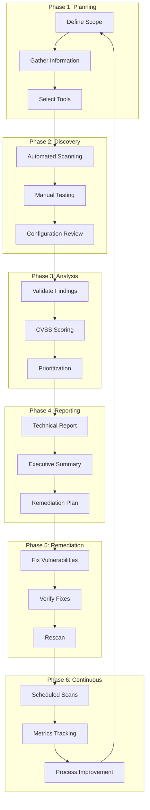
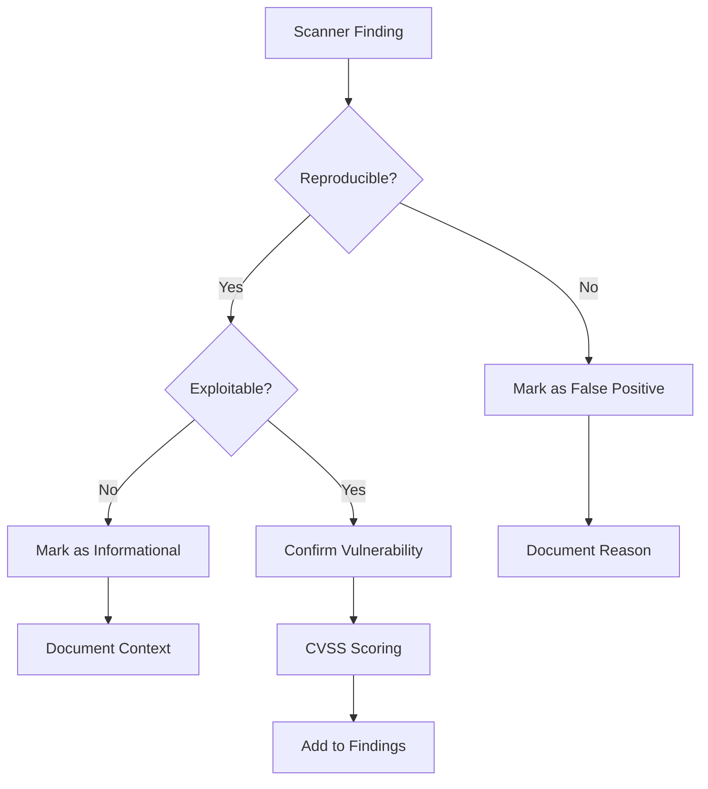
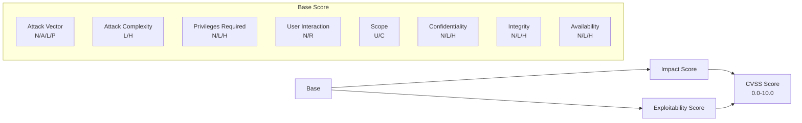
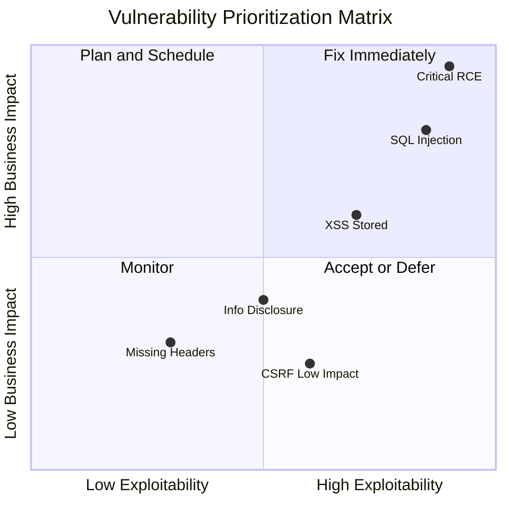
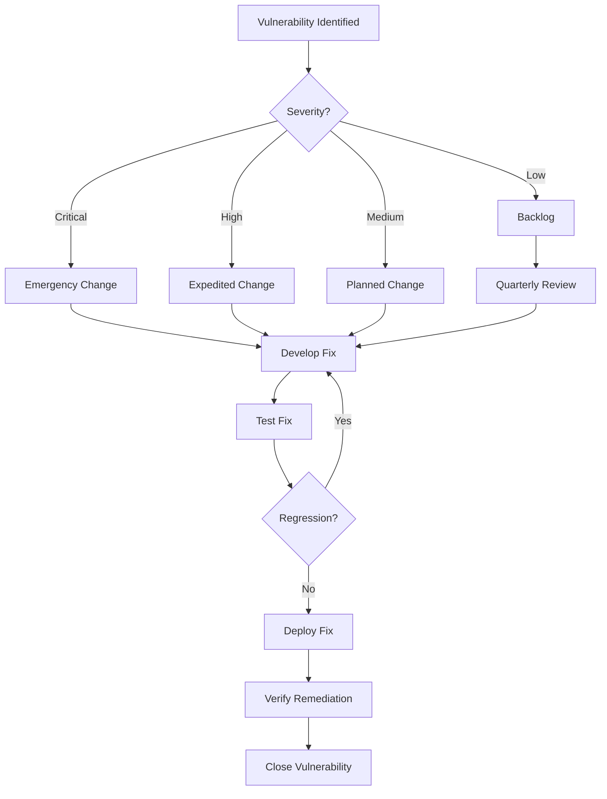
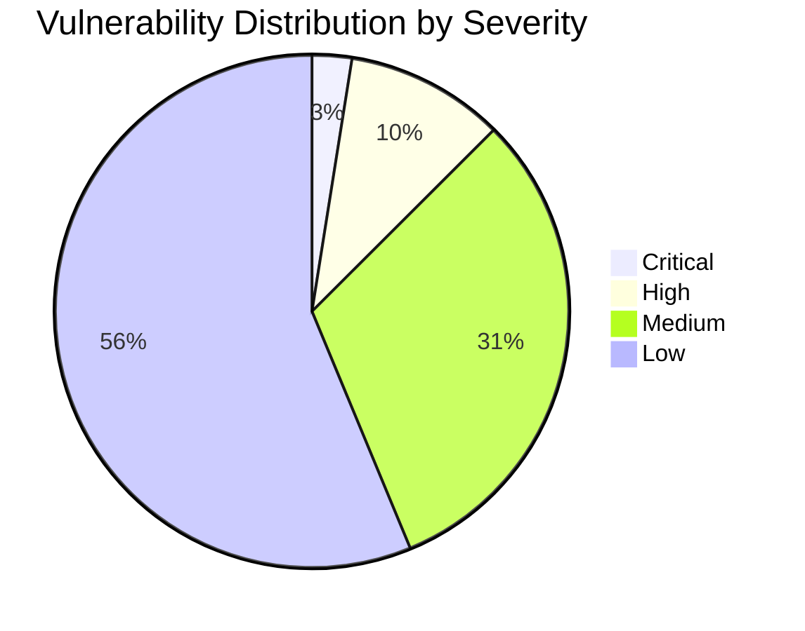
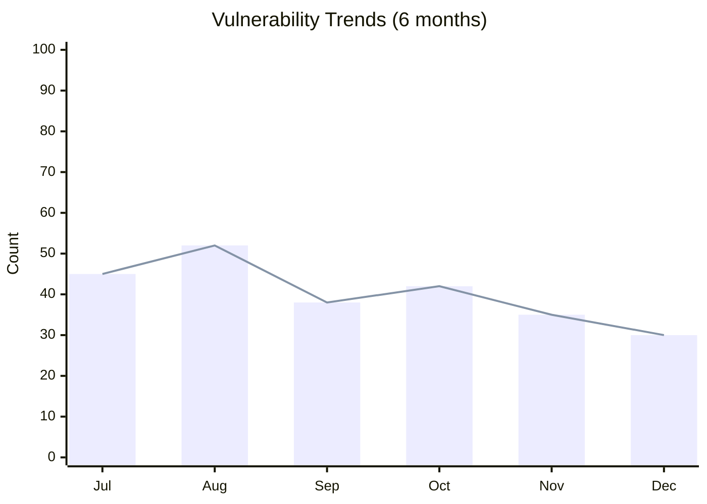

# 🔍 Vulnerability Assessment Framework

**Author:** Asif Hussain  
**Version:** 1.0.0  
**Last Updated:** December 30, 2025  
**Status:** ✅ Active  
**Category:** Security Knowledge Library  

---

## 📋 Executive Summary

This framework provides a systematic methodology for identifying, analyzing, and prioritizing security vulnerabilities across applications, infrastructure, and processes. It establishes standardized procedures for vulnerability discovery, scoring, remediation prioritization, and continuous monitoring.

**Related Documents:**
- `owasp-top-10-guide.md` - Web application vulnerabilities
- `threat-modeling-framework.md` - Threat identification
- `penetration-testing-methodology.md` - Active security testing
- `risk-assessment-methodology.md` - Risk analysis

---

## 🎯 Framework Overview

### Vulnerability Assessment Lifecycle



---

## 📋 Phase 1: Planning

### 1.1 Scope Definition

#### Scope Document Template

```markdown
# Vulnerability Assessment Scope

**Project:** [Project Name]  
**Date:** [Date]  
**Assessor:** [Name]  
**Sponsor:** [Business Owner]  

## Assessment Type
- [ ] Full Assessment
- [ ] Targeted Assessment
- [ ] Compliance Assessment
- [ ] Pre-deployment Assessment

## In Scope
| Asset Type | Assets | IP Range/URLs |
|------------|--------|---------------|
| Web Applications | [App Names] | [URLs] |
| APIs | [API Names] | [Endpoints] |
| Infrastructure | [Server Names] | [IP Ranges] |
| Databases | [DB Names] | [Hosts] |
| Cloud Resources | [Resources] | [Identifiers] |

## Out of Scope
| Asset | Reason |
|-------|--------|
| [Asset] | [Reason for exclusion] |

## Constraints
- Testing Window: [Dates/Times]
- Blackout Periods: [Critical business hours]
- Rate Limits: [Requests per second]
- Exclusions: [DoS testing, social engineering, etc.]

## Stakeholders
| Role | Name | Contact |
|------|------|---------|
| Business Owner | [Name] | [Email] |
| Technical Lead | [Name] | [Email] |
| Security Team | [Name] | [Email] |

## Authorization
Signed authorization from asset owners: [Attached/Reference]
```

### 1.2 Information Gathering

| Source | Information Type | Purpose |
|--------|-----------------|---------|
| **Asset Inventory** | Systems, applications, IPs | Identify targets |
| **Architecture Docs** | Design, data flows | Understand attack surface |
| **Previous Assessments** | Past vulnerabilities | Focus areas |
| **Compliance Requirements** | Standards (PCI, HIPAA) | Assessment criteria |
| **Change Records** | Recent changes | New vulnerability areas |

### 1.3 Tool Selection Matrix

| Tool Type | Open Source | Commercial | Best For |
|-----------|-------------|------------|----------|
| **Network Scanner** | Nmap, Masscan | Nessus, Qualys | Port/service discovery |
| **Web App Scanner** | OWASP ZAP, Nikto | Burp Suite Pro, Acunetix | Web vulnerabilities |
| **Container Scanner** | Trivy, Clair | Twistlock, Aqua | Container images |
| **Code Scanner** | Semgrep, Bandit | Checkmarx, Veracode | Source code analysis |
| **Dependency Scanner** | OWASP Dependency-Check | Snyk, WhiteSource | Library vulnerabilities |
| **Cloud Scanner** | Prowler, ScoutSuite | Prisma Cloud, CloudGuard | Cloud misconfigurations |

---

## 🔍 Phase 2: Discovery

### 2.1 Automated Scanning

#### Network Vulnerability Scanning

```bash
# Nmap - Service and version detection
nmap -sV -sC -p- -oA output_file target_range

# Nmap with vulnerability scripts
nmap --script vuln -oA vuln_scan target_ip

# Nessus CLI (example)
nessuscli scan --template "Advanced Network Scan" --targets target_list.txt
```

#### Web Application Scanning

```bash
# OWASP ZAP - Automated scan
zap-cli quick-scan --self-contained \
    --start-options '-config api.key=<key>' \
    -t https://target.example.com

# Nikto - Web server scanner
nikto -h https://target.example.com -o report.html -Format htm

# SQLMap - SQL injection testing
sqlmap -u "https://target.example.com/page?id=1" --batch --random-agent
```

#### Dependency Scanning

```bash
# Python - pip-audit
pip-audit --requirement requirements.txt --format json > vuln_report.json

# Node.js - npm audit
npm audit --json > npm_audit.json

# OWASP Dependency-Check
dependency-check.sh --project "MyApp" --scan ./src --format JSON
```

#### Container Scanning

```bash
# Trivy - Container image scan
trivy image --format json --output trivy_report.json myapp:latest

# Grype - Alternative container scanner
grype myapp:latest -o json > grype_report.json
```

### 2.2 Manual Testing Checklist

| Category | Test Items | Priority |
|----------|------------|----------|
| **Authentication** | Password policy, session management, MFA bypass | High |
| **Authorization** | IDOR, privilege escalation, function-level access | High |
| **Input Validation** | SQL injection, XSS, command injection | High |
| **Business Logic** | Workflow bypass, race conditions | Medium |
| **Error Handling** | Information disclosure, stack traces | Medium |
| **Cryptography** | Weak algorithms, key management | High |
| **API Security** | Rate limiting, authentication, data exposure | High |

### 2.3 Configuration Review

```yaml
# Configuration Review Checklist
security_configuration:
  server:
    - ssl_tls_version: "TLS 1.2+"
    - cipher_suites: "Strong ciphers only"
    - security_headers: "All required headers present"
    - directory_listing: "Disabled"
    
  application:
    - debug_mode: "Disabled in production"
    - error_handling: "Generic error messages"
    - session_config: "Secure cookie flags"
    - input_validation: "Server-side validation enabled"
    
  database:
    - encryption_at_rest: "Enabled"
    - access_controls: "Least privilege"
    - audit_logging: "Enabled"
    - backup_encryption: "Enabled"
    
  cloud:
    - public_access: "Restricted"
    - iam_policies: "Least privilege"
    - encryption: "Enabled for all storage"
    - logging: "CloudTrail/Activity logs enabled"
```

---

## 📊 Phase 3: Analysis

### 3.1 Vulnerability Validation



### 3.2 CVSS v3.1 Scoring

#### CVSS Calculator

The Common Vulnerability Scoring System provides standardized severity ratings.



#### CVSS Metrics Explained

| Metric | Values | Description |
|--------|--------|-------------|
| **Attack Vector (AV)** | Network (N), Adjacent (A), Local (L), Physical (P) | How attacker reaches vulnerability |
| **Attack Complexity (AC)** | Low (L), High (H) | Conditions beyond attacker's control |
| **Privileges Required (PR)** | None (N), Low (L), High (H) | Authentication level needed |
| **User Interaction (UI)** | None (N), Required (R) | Victim participation needed |
| **Scope (S)** | Unchanged (U), Changed (C) | Impact on other components |
| **Confidentiality (C)** | None (N), Low (L), High (H) | Information disclosure impact |
| **Integrity (I)** | None (N), Low (L), High (H) | Data modification impact |
| **Availability (A)** | None (N), Low (L), High (H) | System availability impact |

#### Severity Ratings

| CVSS Score | Severity | Color | SLA |
|------------|----------|-------|-----|
| 9.0 - 10.0 | 🔴 Critical | Red | 24-48 hours |
| 7.0 - 8.9 | 🟠 High | Orange | 7 days |
| 4.0 - 6.9 | 🟡 Medium | Yellow | 30 days |
| 0.1 - 3.9 | 🟢 Low | Green | 90 days |
| 0.0 | ⚪ None | Gray | Informational |

### 3.3 Prioritization Matrix



#### Prioritization Factors

| Factor | Weight | Description |
|--------|--------|-------------|
| **CVSS Score** | 40% | Technical severity |
| **Business Impact** | 25% | Data/system criticality |
| **Exploitability** | 20% | Public exploits, ease of attack |
| **Exposure** | 15% | Internet-facing vs internal |

---

## 📝 Phase 4: Reporting

### 4.1 Vulnerability Report Template

```markdown
# Vulnerability Assessment Report

**Project:** [Project Name]  
**Assessment Date:** [Date Range]  
**Report Date:** [Date]  
**Assessor:** [Name/Company]  
**Classification:** [Confidential/Internal]  

---

## Executive Summary

### Overview
[Brief description of assessment scope and methodology]

### Key Findings

| Severity | Count | Status |
|----------|-------|--------|
| 🔴 Critical | X | X New / X Known |
| 🟠 High | X | X New / X Known |
| 🟡 Medium | X | X New / X Known |
| 🟢 Low | X | X New / X Known |
| **Total** | **XX** | |

### Risk Rating
**Overall Risk Level:** [Critical/High/Medium/Low]

### Top Recommendations
1. [Priority 1 recommendation]
2. [Priority 2 recommendation]
3. [Priority 3 recommendation]

---

## Scope and Methodology

### Scope
[In-scope and out-of-scope items]

### Methodology
[Testing approach and tools used]

### Timeline
| Phase | Date | Duration |
|-------|------|----------|
| Planning | [Date] | [Duration] |
| Testing | [Date] | [Duration] |
| Analysis | [Date] | [Duration] |
| Reporting | [Date] | [Duration] |

---

## Detailed Findings

### VULN-001: [Vulnerability Title]

**Severity:** 🔴 Critical (CVSS: 9.8)  
**Status:** Open  
**Asset:** [Affected asset]  
**CWE:** CWE-89 (SQL Injection)  

#### Description
[Detailed description of the vulnerability]

#### Evidence
```
[Screenshot, request/response, code snippet]
```

#### Impact
[Business and technical impact]

#### Remediation
**Short-term:** [Immediate mitigation]
**Long-term:** [Permanent fix]

#### References
- [CVE-XXXX-XXXX](link)
- [OWASP Reference](link)

---

## Appendices

### A. Vulnerability Details Matrix
### B. CVSS Calculations
### C. Tool Output (sanitized)
### D. Remediation Tracking Sheet
```

### 4.2 Executive Summary Template

```markdown
# Executive Summary: Vulnerability Assessment

**System:** [System Name]  
**Date:** [Date]  
**Risk Level:** [Critical/High/Medium/Low]  

## Key Points

✅ **Strengths Identified:**
- [Positive finding 1]
- [Positive finding 2]

⚠️ **Areas of Concern:**
- [X] critical vulnerabilities require immediate attention
- [Key risk area]

## Risk Overview

[Pie chart or bar chart showing vulnerability distribution]

## Business Impact
[Brief description of potential business impact if vulnerabilities are exploited]

## Recommended Actions
| Priority | Action | Timeline | Owner |
|----------|--------|----------|-------|
| P1 | [Action] | 48 hours | [Owner] |
| P2 | [Action] | 7 days | [Owner] |
| P3 | [Action] | 30 days | [Owner] |

## Investment Required
- **Immediate fixes:** [Estimate]
- **Long-term improvements:** [Estimate]
- **Ongoing monitoring:** [Estimate]
```

---

## 🔧 Phase 5: Remediation

### 5.1 Remediation Workflow



### 5.2 Remediation Guidance by Vulnerability Type

| Vulnerability | Short-term Mitigation | Long-term Fix |
|--------------|----------------------|---------------|
| **SQL Injection** | WAF rules, input filtering | Parameterized queries, ORM |
| **XSS** | CSP headers, output encoding | Framework auto-escaping |
| **Authentication Bypass** | Additional controls, monitoring | Proper auth implementation |
| **Sensitive Data Exposure** | Encryption, access restrictions | Data classification, encryption at rest |
| **Security Misconfiguration** | Configuration hardening | Infrastructure as Code, scanning |
| **Vulnerable Dependencies** | Update/patch | Dependency management automation |
| **Broken Access Control** | Emergency access review | RBAC implementation |
| **SSRF** | URL allowlisting | Request validation, network segmentation |

### 5.3 Verification Testing

```bash
# Verify SQL injection fix
sqlmap -u "https://target.example.com/page?id=1" --batch --level=3 --risk=2

# Verify XSS fix
python xsstrike.py -u "https://target.example.com/search?q=test"

# Verify header fix
curl -I https://target.example.com | grep -E "(X-Frame-Options|Content-Security-Policy|X-Content-Type)"

# Run targeted scan
zap-cli quick-scan -t https://target.example.com/fixed_page
```

---

## 📈 Phase 6: Continuous Monitoring

### 6.1 Scanning Schedule

| Scan Type | Frequency | Scope | Tool |
|-----------|-----------|-------|------|
| **Network Vulnerability** | Weekly | All production | Nessus/Qualys |
| **Web Application** | Weekly | Public-facing apps | OWASP ZAP |
| **Dependency** | Daily (CI/CD) | All code repos | Snyk/Dependabot |
| **Container** | Per-build | All images | Trivy |
| **Cloud Configuration** | Daily | All cloud resources | Prowler/ScoutSuite |
| **Compliance** | Monthly | Regulated systems | Tool varies |

### 6.2 Metrics and KPIs

```yaml
vulnerability_metrics:
  detection:
    - mean_time_to_detect: "< 7 days"
    - scan_coverage: "> 95%"
    - false_positive_rate: "< 10%"
    
  remediation:
    - critical_mttr: "< 48 hours"
    - high_mttr: "< 7 days"
    - medium_mttr: "< 30 days"
    - remediation_rate: "> 90%"
    
  risk:
    - open_critical_vulns: "0"
    - open_high_vulns: "< 5"
    - vulnerability_aging: "< 30 days average"
    - recurrence_rate: "< 5%"
```

### 6.3 Dashboard Metrics





---

## 🔄 CORTEX Integration

### Vulnerability Assessment in Planning

```yaml
# Auto-generated for plans with security impact
security_assessment:
  pre_deployment:
    required: true
    scan_types:
      - dependency_scan
      - sast_scan
      - container_scan
    
  post_deployment:
    required: true
    scan_types:
      - dast_scan
      - configuration_review
    delay: "24 hours"  # Allow deployment stabilization
```

### CI/CD Integration

```yaml
# GitHub Actions - Vulnerability Scanning
name: Security Scan
on: [push, pull_request]

jobs:
  dependency-scan:
    runs-on: ubuntu-latest
    steps:
      - uses: actions/checkout@v4
      
      - name: Run Snyk
        uses: snyk/actions/python@master
        env:
          SNYK_TOKEN: ${{ secrets.SNYK_TOKEN }}
        with:
          args: --severity-threshold=high
          
  sast-scan:
    runs-on: ubuntu-latest
    steps:
      - uses: actions/checkout@v4
      
      - name: Run Semgrep
        uses: returntocorp/semgrep-action@v1
        with:
          config: p/security-audit
          
  container-scan:
    runs-on: ubuntu-latest
    needs: [build]
    steps:
      - name: Run Trivy
        uses: aquasecurity/trivy-action@master
        with:
          image-ref: '${{ env.IMAGE_NAME }}'
          severity: 'CRITICAL,HIGH'
          exit-code: '1'
```

---

## 📝 Assessment Templates

### Pre-Assessment Checklist

```markdown
## Pre-Assessment Checklist

**Assessment:** [Name]  
**Date:** [Date]  

### Authorization
- [ ] Written authorization obtained
- [ ] Scope document signed
- [ ] Emergency contacts documented
- [ ] Rollback procedures defined

### Environment
- [ ] Test environment available
- [ ] Production environment protected
- [ ] Backup verified
- [ ] Monitoring alerts configured

### Tools
- [ ] Scanner licenses valid
- [ ] Tools updated
- [ ] Custom scripts tested
- [ ] Output storage prepared

### Communication
- [ ] Stakeholders notified
- [ ] Escalation path defined
- [ ] Status reporting schedule set
```

### Post-Assessment Checklist

```markdown
## Post-Assessment Checklist

**Assessment:** [Name]  
**Date:** [Date]  

### Cleanup
- [ ] Test accounts removed
- [ ] Test data purged
- [ ] Temporary files deleted
- [ ] Network changes reverted

### Documentation
- [ ] All findings documented
- [ ] Evidence archived
- [ ] Report drafted
- [ ] Peer review completed

### Handoff
- [ ] Report delivered
- [ ] Findings presented
- [ ] Questions answered
- [ ] Remediation owners assigned
```

---

## 📚 Reference Materials

### Vulnerability Databases
- [NVD - National Vulnerability Database](https://nvd.nist.gov/)
- [CVE - Common Vulnerabilities and Exposures](https://cve.mitre.org/)
- [CWE - Common Weakness Enumeration](https://cwe.mitre.org/)
- [OWASP Vulnerability Database](https://owasp.org/)
- [Exploit-DB](https://www.exploit-db.com/)

### Standards and Frameworks
- [NIST Cybersecurity Framework](https://www.nist.gov/cyberframework)
- [OWASP Testing Guide](https://owasp.org/www-project-web-security-testing-guide/)
- [PTES - Penetration Testing Execution Standard](http://www.pentest-standard.org/)
- [CVSS v3.1 Specification](https://www.first.org/cvss/v3.1/specification-document)

### CORTEX Related Documents
- `threat-modeling-framework.md` - Threat identification methodology
- `penetration-testing-methodology.md` - Active testing procedures
- `risk-assessment-methodology.md` - Risk analysis framework
- `incident-response-playbook.md` - Response procedures

---

**Document Classification:** Internal Security Reference  
**Review Cycle:** Quarterly  
**Related Plans:** Security Enhancement Plan (Phase 1)
