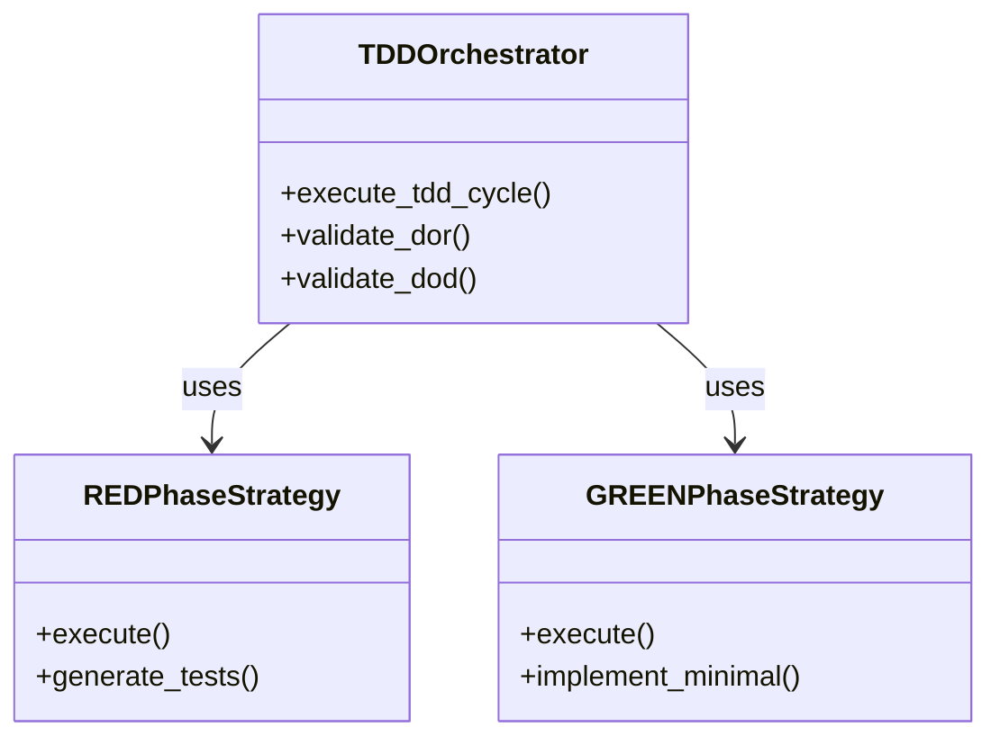
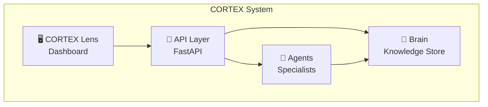
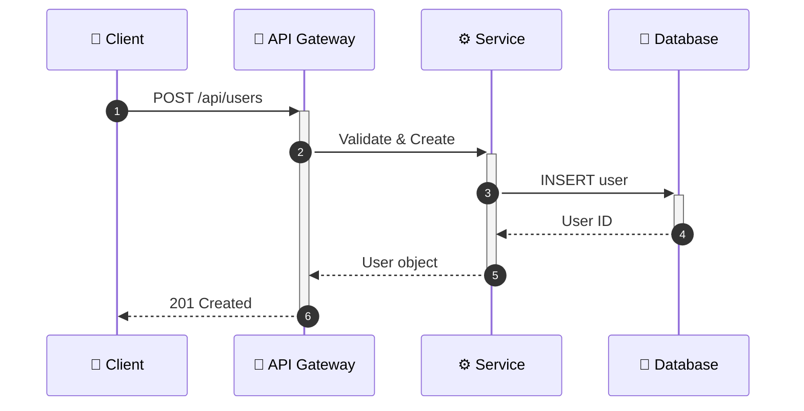
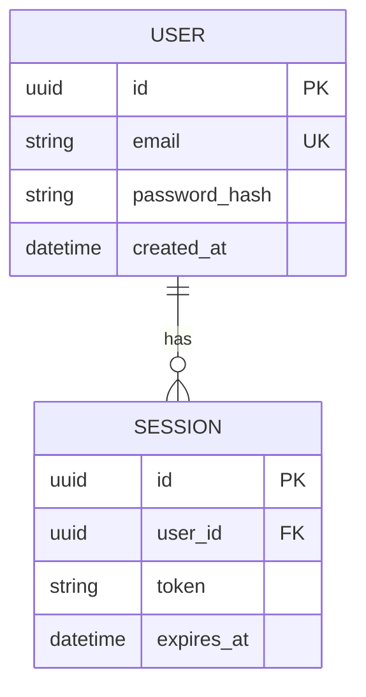
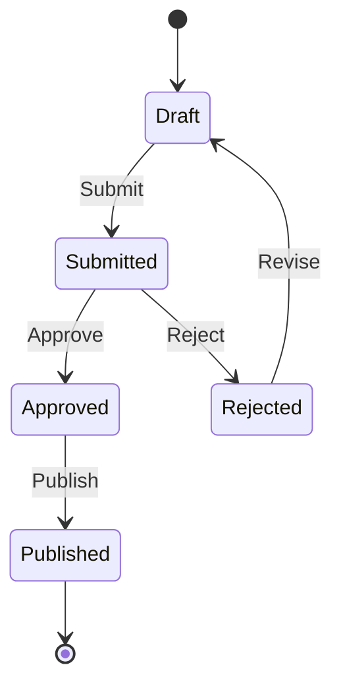
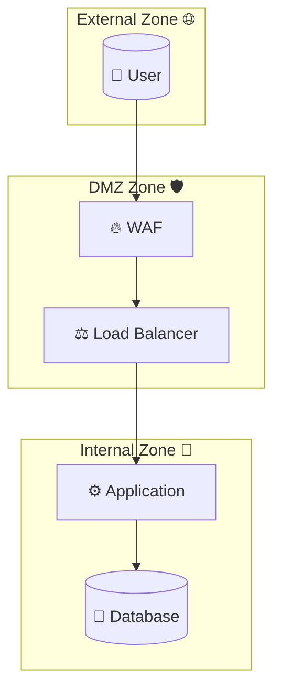
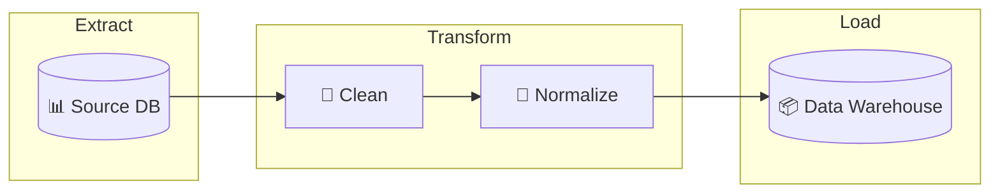
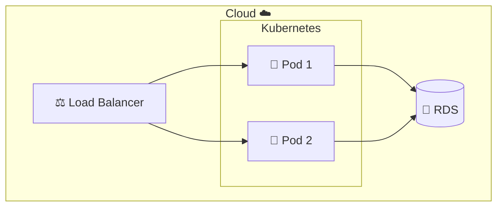

# 📊 Diagram Guidelines

**Document Version:** 1.0.0  
**Author:** CORTEX Development Team  
**Created:** December 30, 2025  
**Category:** Knowledge Library Standards  
**Status:** Active  

---

## 📋 Table of Contents

1. [Overview](#overview)
2. [When to Use Each Diagram Type](#when-to-use-each-diagram-type)
3. [Diagram Type Reference](#diagram-type-reference)
4. [Accessibility Standards](#accessibility-standards)
5. [Best Practices](#best-practices)
6. [Version Control](#version-control)
7. [CORTEX Integration](#cortex-integration)

---

## Overview

This guide establishes standards for using Mermaid diagrams throughout CORTEX documentation. Diagrams enhance understanding of complex systems, workflows, and relationships. Following these guidelines ensures consistency, accessibility, and maintainability.

### Purpose

- **Communicate architecture** clearly to all stakeholders
- **Document workflows** and state transitions
- **Visualize data models** and relationships
- **Illustrate security** threat models and mitigations
- **Support onboarding** with visual learning aids

### Mermaid Syntax

All diagrams use [Mermaid](https://mermaid.js.org/) syntax, which renders as SVG in GitHub, GitLab, and most documentation platforms. Mermaid is:

- **Text-based** - Version-controllable with Git
- **Declarative** - Describe structure, not layout
- **Portable** - Works in Markdown files
- **Accessible** - Can include alt text

---

## When to Use Each Diagram Type

### Decision Matrix

| Code Pattern | Recommended Diagram | Priority |
|--------------|---------------------|----------|
| 3+ classes with relationships | Architecture (Class/C4) | High |
| API endpoints (REST/GraphQL) | Sequence | High |
| Database models (ORM) | Entity-Relationship | High |
| State transitions/workflows | State Machine | Medium |
| Security features (auth, crypto) | Threat Model | High |
| Data pipelines/ETL | Data Flow | Medium |
| Infrastructure/deployment | Deployment | Medium |

### Trigger Rules

The CORTEX DOCUMENT phase uses these rules to auto-recommend diagrams:

```yaml
triggers:
  architecture:
    - class_count >= 3
    - module_hierarchy detected
    - service layer patterns
  
  sequence:
    - api_endpoints >= 1
    - async operations
    - message passing patterns
  
  entity_relationship:
    - orm_models >= 1
    - foreign_key references
    - database operations
  
  state_machine:
    - status/state fields
    - workflow patterns
    - enum State classes
  
  threat_model:
    - auth/authorization code
    - encryption/hashing
    - input validation
    - security-sensitive operations
  
  data_flow:
    - pipeline patterns
    - ETL processes
    - message queue integration
  
  deployment:
    - docker/kubernetes configs
    - cloud infrastructure
    - CI/CD pipelines
```

---

## Diagram Type Reference

### 1. Architecture Diagrams

**Purpose:** Visualize system structure, component relationships, and class hierarchies.

**Use When:**
- Documenting module/package structure
- Showing class inheritance
- Illustrating system components
- Creating C4 model views

**Template:** `cortex-brain/templates/mermaid-diagrams/architecture-diagram-template.mmd`

**Example - Class Diagram:**



**Example - C4 Container Diagram:**



---

### 2. Sequence Diagrams

**Purpose:** Show interactions between components over time, especially for API flows.

**Use When:**
- Documenting API request/response cycles
- Illustrating authentication flows
- Showing async operation sequences
- Explaining error handling paths

**Template:** `cortex-brain/templates/mermaid-diagrams/sequence-diagram-template.mmd`

**Example:**



---

### 3. Entity-Relationship Diagrams

**Purpose:** Document database schemas and data model relationships.

**Use When:**
- Designing database schemas
- Documenting ORM models
- Showing table relationships
- Planning data migrations

**Template:** `cortex-brain/templates/mermaid-diagrams/entity-relationship-template.mmd`

**Example:**



---

### 4. State Machine Diagrams

**Purpose:** Visualize state transitions and workflow lifecycles.

**Use When:**
- Documenting order/ticket lifecycles
- Showing workflow states
- Illustrating status transitions
- Planning state management

**Template:** `cortex-brain/templates/mermaid-diagrams/state-machine-template.mmd`

**Example:**



---

### 5. Threat Model Diagrams

**Purpose:** Visualize security threats, trust boundaries, and mitigations.

**Use When:**
- Documenting security architecture
- Performing STRIDE analysis
- Showing attack trees
- Planning security controls

**Template:** `cortex-brain/templates/mermaid-diagrams/threat-model-diagram-template.mmd`

**Example - Trust Boundaries:**



---

### 6. Data Flow Diagrams

**Purpose:** Show how data moves through systems and processes.

**Use When:**
- Documenting ETL pipelines
- Showing data processing flows
- Illustrating message queue architecture
- Planning data integration

**Template:** `cortex-brain/templates/mermaid-diagrams/data-flow-diagram-template.mmd`

**Example:**



---

### 7. Deployment Diagrams

**Purpose:** Visualize infrastructure, cloud architecture, and deployment topology.

**Use When:**
- Documenting cloud architecture
- Showing Kubernetes deployments
- Illustrating CI/CD pipelines
- Planning infrastructure changes

**Template:** `cortex-brain/templates/mermaid-diagrams/deployment-diagram-template.mmd`

**Example:**



---

## Accessibility Standards

### Required Elements

1. **Descriptive Titles:** Every diagram must have a clear title comment
2. **Emoji Indicators:** Use emojis consistently for quick visual identification
3. **Color Contrast:** Use style fills that meet WCAG AA contrast ratios
4. **Text Labels:** All nodes must have readable text labels
5. **Alt Text:** Provide Markdown description before complex diagrams

### Color Palette

Use consistent colors for semantic meaning:

| Element | Color | Hex Code | Meaning |
|---------|-------|----------|---------|
| Primary | Blue | `#1168bd` | Main components |
| Success | Green | `#4CAF50` | Passing/secure |
| Warning | Orange | `#FF9800` | Caution/pending |
| Error | Red | `#ff4444` | Failed/threat |
| Neutral | Gray | `#999999` | External/legacy |

### Icon Reference

| Icon | Meaning |
|------|---------|
| 👤 | User/Actor |
| 🔌 | API/Interface |
| ⚙️ | Service/Logic |
| 💾 | Database/Storage |
| 🔐 | Security/Auth |
| 📬 | Message Queue |
| 🐳 | Container |
| ☁️ | Cloud Service |

---

## Best Practices

### DO ✅

1. **Keep diagrams focused** - One concept per diagram
2. **Use consistent naming** - Follow codebase conventions
3. **Include context** - Add notes explaining non-obvious elements
4. **Layer complexity** - Start high-level, link to detailed views
5. **Update with code** - Diagrams are documentation debt if stale
6. **Use subgraphs** - Group related elements logically
7. **Add legends** - Explain custom styling or icons

### DON'T ❌

1. **Don't overcrowd** - Limit to ~10-15 nodes per diagram
2. **Don't use only text** - Always add visual grouping
3. **Don't hardcode values** - Use placeholders in templates
4. **Don't skip validation** - Test diagram rendering
5. **Don't mix concerns** - Separate architecture from data flow
6. **Don't use inconsistent styling** - Follow the color palette

### Complexity Guidelines

| Complexity | Max Nodes | Recommended Approach |
|------------|-----------|---------------------|
| Low | 5-10 | Single diagram |
| Medium | 10-20 | Use subgraphs |
| High | 20+ | Split into multiple diagrams |
| Very High | 50+ | Create diagram hierarchy |

---

## Version Control

### File Organization

```
docs/diagrams/
├── {module-name}/
│   ├── {module}-architecture.mmd
│   ├── {module}-sequence.mmd
│   └── {module}-er.mmd
└── README.md  # Index of all diagrams

cortex-brain/templates/mermaid-diagrams/
├── architecture-diagram-template.mmd
├── sequence-diagram-template.mmd
├── entity-relationship-template.mmd
├── state-machine-template.mmd
├── threat-model-diagram-template.mmd
├── data-flow-diagram-template.mmd
└── deployment-diagram-template.mmd
```

### Naming Convention

```
{module-name}-{diagram-type}.mmd

Examples:
- tdd-orchestrator-architecture.mmd
- user-service-sequence.mmd
- order-system-state.mmd
```

### Change Management

1. **Review diagrams** with code changes in PRs
2. **Link diagrams** to related code files
3. **Version diagrams** with semantic versioning comment
4. **Archive old diagrams** when systems change significantly

---

## CORTEX Integration

### DOCUMENT Phase Auto-Generation

The TDD DOCUMENT phase automatically:

1. **Analyzes code** using AST parsing
2. **Detects patterns** that warrant diagrams
3. **Generates diagrams** using templates
4. **Updates documentation** with new diagrams

### Configuration

In `cortex-brain/manifests/orchestrators/tdd-orchestrator-v4-manifest.yaml`:

```yaml
diagram_generation:
  enabled: true
  triggers:
    - trigger: "new_module"
      diagram_type: "architecture"
    - trigger: "api_endpoints"
      diagram_type: "sequence"
    - trigger: "security_feature"
      diagram_type: "threat-model"
  output_location: "docs/diagrams/{module_name}/"
```

### Template Variables

Templates use placeholder syntax for auto-generation:

```
{{SYSTEM_NAME}} - Name of the system/module
{{COMPONENT_N}} - Component names (numbered)
{{RELATIONSHIP}} - Relationship descriptions
{{ENDPOINT}} - API endpoint names
{{MODEL_NAME}} - Database model names
```

### Manual Generation

To manually generate diagrams:

```python
from src.orchestrators.tdd.strategies.document_phase_strategy import DOCUMENTPhaseStrategy

strategy = DOCUMENTPhaseStrategy(project_root=Path('.'))
analysis = strategy.analyze_code_structure(Path('src/module.py'))
recommendations = strategy.detect_diagram_recommendations(analysis, content)

for rec in recommendations:
    diagram = strategy.generate_mermaid_diagram(rec.diagram_type, analysis, 'module')
    print(diagram)
```

---

## References

- [Mermaid Documentation](https://mermaid.js.org/intro/)
- [C4 Model](https://c4model.com/)
- [STRIDE Threat Modeling](https://docs.microsoft.com/en-us/azure/security/develop/threat-modeling-tool-threats)
- [WCAG Color Contrast Guidelines](https://www.w3.org/WAI/WCAG21/Understanding/contrast-minimum.html)

---

**Maintained by:** CORTEX Development Team  
**Last Updated:** December 30, 2025
