# Onboarding Orchestrator - Visual Flowcharts

**Purpose:** Mermaid diagrams for onboarding orchestrator workflows  
**Version:** 3.8.1  
**Date:** December 7, 2025

---

## 1. Overall System Architecture

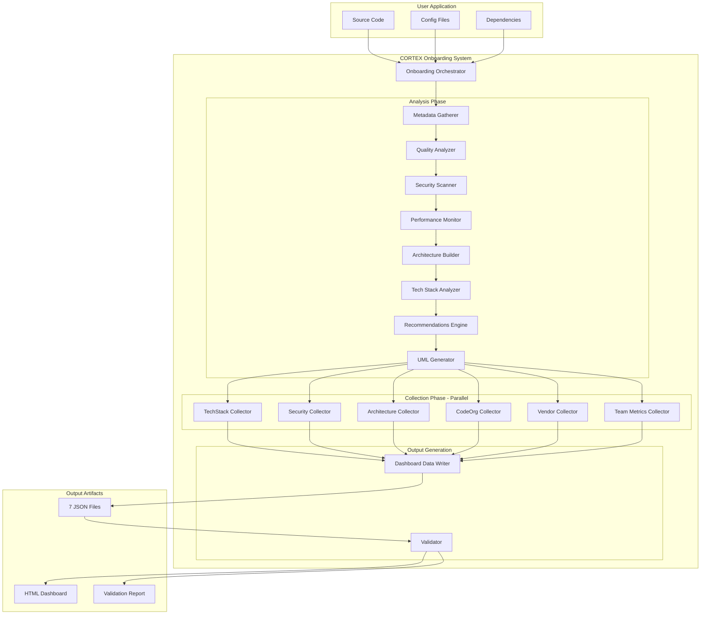

---

## 2. Onboarding Workflow - Detailed Sequence

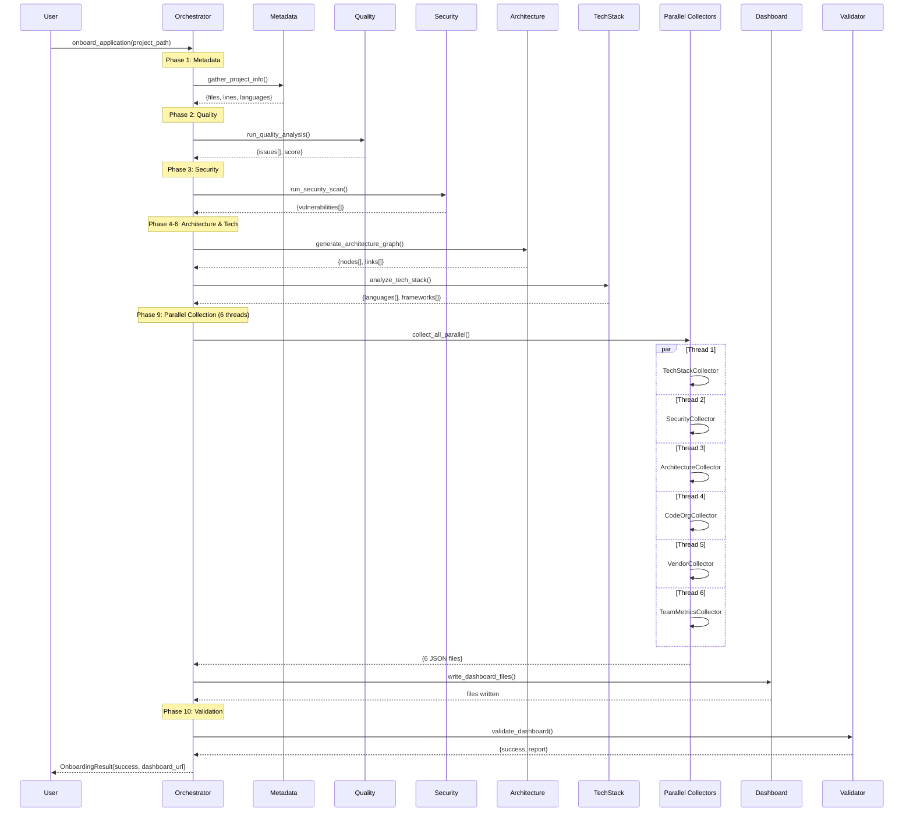

---

## 3. File Filtering Decision Tree

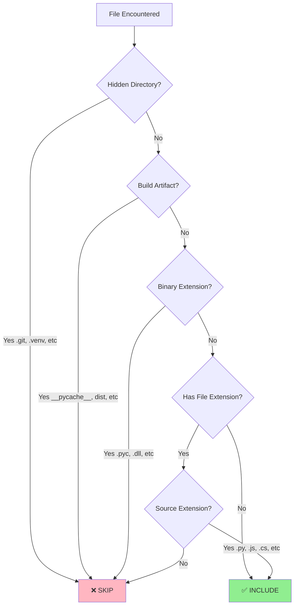

---

## 4. Mode-Specific Path Resolution

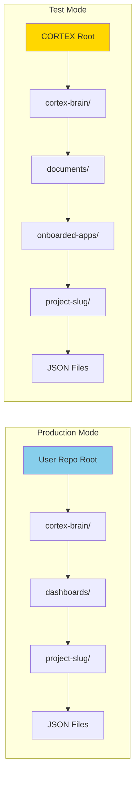

---

## 5. Parallel Collector Thread Pool

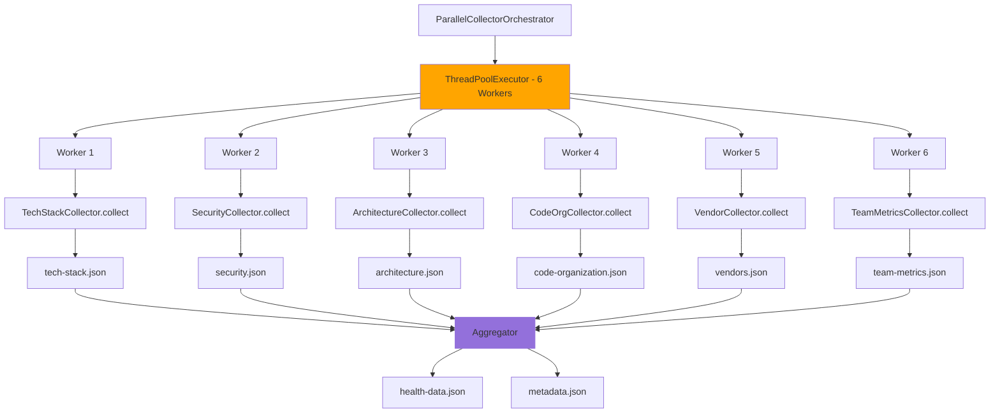

---

## 6. Health Score Calculation Flow

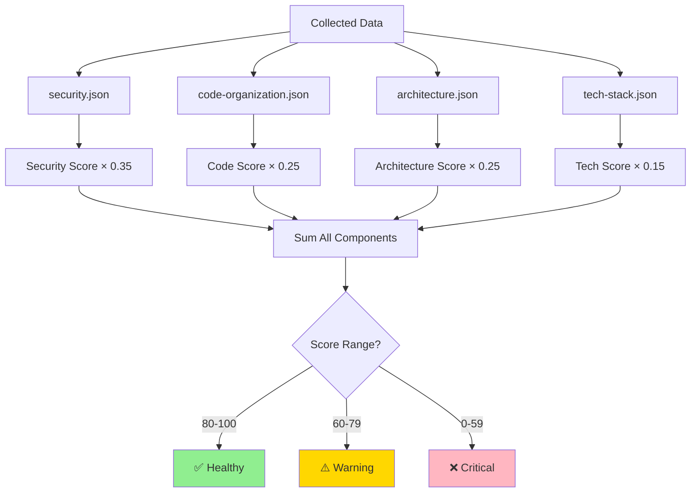

---

## 7. Dashboard Validation State Machine

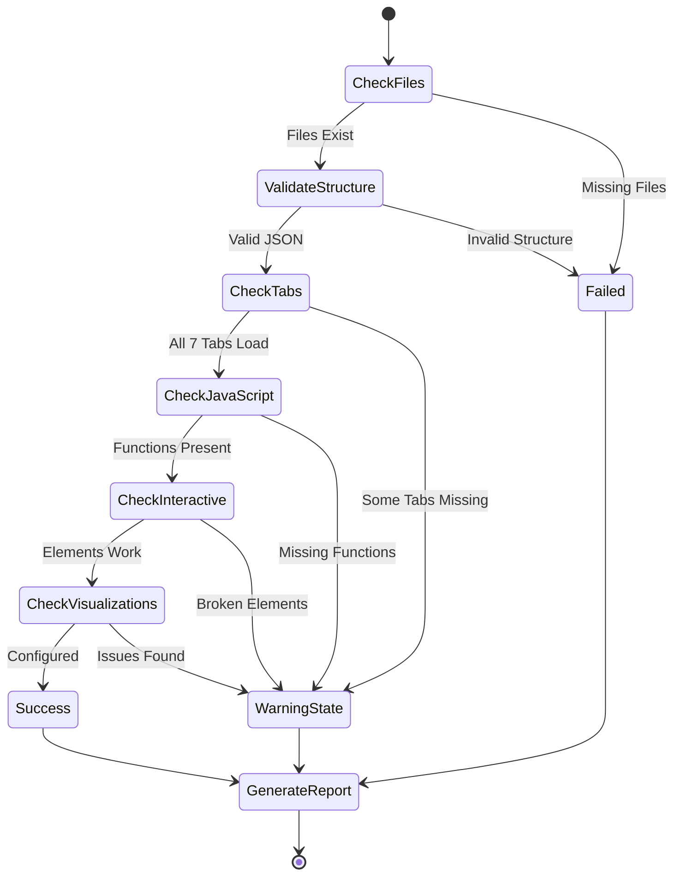

---

## 8. Error Handling Flow

```mermaid
graph TD
    A[Phase Execution] --> B{Exception?}
    B -->|No| C[Continue to Next Phase]
    B -->|Yes| D{Critical Error?}
    
    D -->|Yes| E[Log Error]
    E --> F[Add to errors[]]
    F --> G[Return OnboardingResult]
    G --> H[success = False]
    
    D -->|No| I[Log Warning]
    I --> J[Use Fallback/Default]
    J --> C
    
    C --> K{More Phases?}
    K -->|Yes| A
    K -->|No| L{Any Errors?}
    
    L -->|No| M[success = True]
    L -->|Yes| H
    
    M --> N[Return Complete Result]
    H --> N
    
    style E fill:#FFB6C1
    style I fill:#FFD700
    style M fill:#90EE90
```

---

## 9. Integration with Other Orchestrators

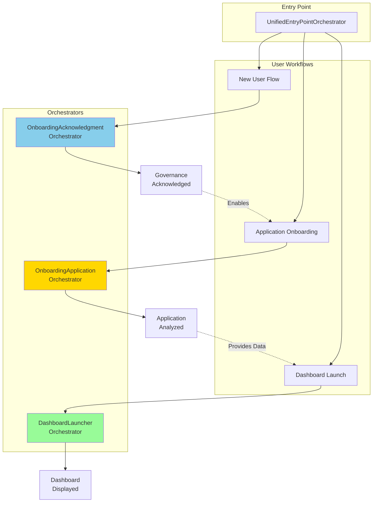

---

## 10. Phase Dependency Graph

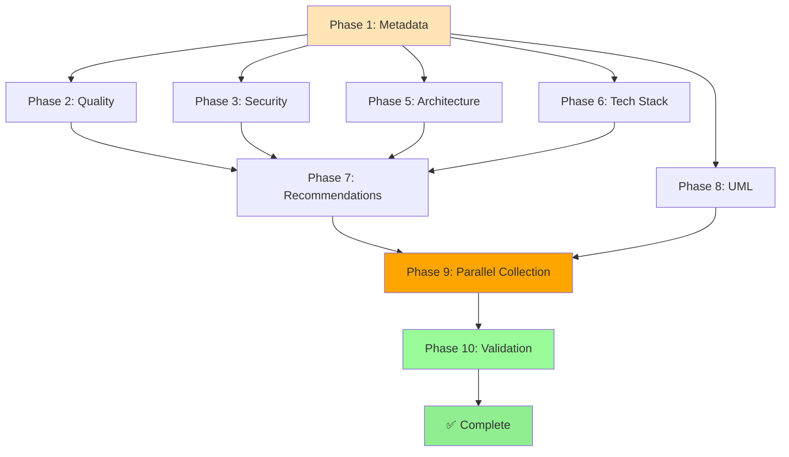

---

## 11. Collector Class Hierarchy

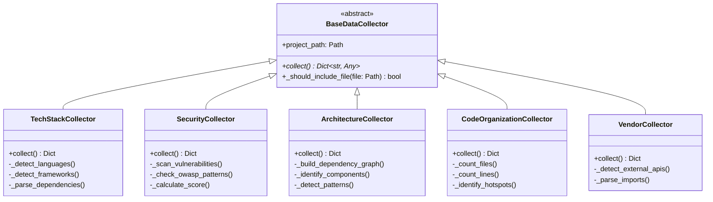

---

## 12. OnboardingResult State Transitions

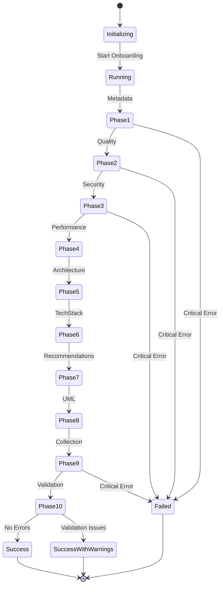

---

## Diagram Usage Guide

### For Presentations
- Use **Diagram 1** (System Architecture) for high-level overview
- Use **Diagram 2** (Sequence) for explaining execution flow
- Use **Diagram 6** (Health Score) for quality metrics explanation

### For Development
- Use **Diagram 3** (File Filtering) when implementing file scanners
- Use **Diagram 5** (Thread Pool) when debugging parallel execution
- Use **Diagram 10** (Phase Dependencies) for understanding phase order

### For Troubleshooting
- Use **Diagram 8** (Error Handling) for debugging failures
- Use **Diagram 7** (Validation) for dashboard issues
- Use **Diagram 4** (Path Resolution) for file location problems

### For Architecture Reviews
- Use **Diagram 11** (Class Hierarchy) for OOP design discussions
- Use **Diagram 9** (Integration) for system integration understanding
- Use **Diagram 12** (State Transitions) for workflow state management

---

**Rendering Instructions:**

These diagrams use Mermaid syntax. To view them:

1. **GitHub:** Automatically rendered in `.md` files
2. **VS Code:** Install "Markdown Preview Mermaid Support" extension
3. **Online:** Use https://mermaid.live/
4. **Export:** Use Mermaid CLI to generate PNG/SVG

```bash
# Install Mermaid CLI
npm install -g @mermaid-js/mermaid-cli

# Generate PNG
mmdc -i flowcharts.md -o flowcharts.png

# Generate SVG
mmdc -i flowcharts.md -o flowcharts.svg
```

---

**Document Version:** 1.0  
**Last Updated:** December 7, 2025  
**Maintainer:** Asif Hussain
