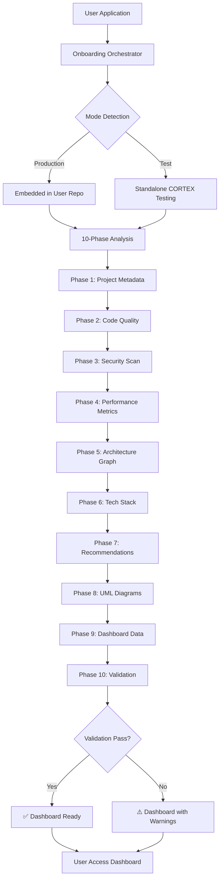

# Onboarding Application Orchestrator - Complete Guide

**Version:** 3.8.1  
**Author:** Asif Hussain  
**Purpose:** Comprehensive documentation on CORTEX application onboarding system  
**Date:** December 7, 2025

---

## Table of Contents

1. [Overview](#overview)
2. [Architecture](#architecture)
3. [Workflow & Process Flow](#workflow--process-flow)
4. [Component Details](#component-details)
5. [Data Flow Diagrams](#data-flow-diagrams)
6. [Integration Points](#integration-points)
7. [Usage Examples](#usage-examples)
8. [Troubleshooting](#troubleshooting)

---

## Overview

### What is the Onboarding Orchestrator?

The Onboarding Application Orchestrator is CORTEX's automated system for analyzing, evaluating, and integrating external user applications. It provides comprehensive code quality, security, architecture, and technology stack analysis with interactive dashboard generation.

### Key Features

- **Multi-dimensional Analysis:** Code quality, security scanning, performance metrics, architecture mapping
- **Parallel Data Collection:** 6 specialized collectors running simultaneously for optimal performance
- **Interactive Dashboards:** Auto-generated HTML dashboards with 7 tabs of insights
- **Two Operation Modes:** Production (embedded in user repos) and Test (standalone CORTEX testing)
- **Validation Framework:** Comprehensive dashboard functionality validation
- **Smart File Filtering:** Excludes build artifacts, hidden directories, binary files

### Primary Use Cases

1. **New Application Onboarding:** First-time analysis when CORTEX is introduced to a project
2. **Health Assessment:** Periodic health checks of existing applications
3. **Migration Planning:** Pre-migration analysis for legacy system modernization
4. **Compliance Auditing:** Security and quality compliance verification

---

## Architecture

### System Components

```
┌─────────────────────────────────────────────────────────────────┐
│                   Onboarding Orchestrator                       │
│                    (src/operations/)                            │
└───────────────────────┬─────────────────────────────────────────┘
                        │
        ┌───────────────┼───────────────┐
        │               │               │
        ▼               ▼               ▼
┌──────────────┐ ┌──────────────┐ ┌──────────────┐
│   Analysis   │ │  Collection  │ │  Generation  │
│   Engines    │ │  Collectors  │ │   Engines    │
└──────────────┘ └──────────────┘ └──────────────┘
        │               │               │
        │               │               │
        ▼               ▼               ▼
┌──────────────────────────────────────────────┐
│         Dashboard Data Files (JSON)          │
│  • health-data.json                          │
│  • tech-stack.json                           │
│  • security.json                             │
│  • architecture.json                         │
│  • code-organization.json                    │
│  • vendors.json                              │
│  • metadata.json                             │
└──────────────────────────────────────────────┘
        │
        ▼
┌──────────────────────────────────────────────┐
│      Interactive HTML Dashboard              │
│   (cortex-brain/dashboards/ui/)              │
└──────────────────────────────────────────────┘
```

### Class Hierarchy

```
OnboardingOrchestrator
├── Initialization
│   ├── __init__(project_root, test_mode)
│   └── _find_cortex_root()
│
├── Main Workflow
│   └── onboard_application(project_path, project_name) → OnboardingResult
│
├── Analysis Steps (10 phases)
│   ├── _gather_project_info()
│   ├── _run_quality_analysis()
│   ├── _run_security_scan()
│   ├── _collect_performance_metrics()
│   ├── _generate_architecture_graph()
│   ├── _analyze_tech_stack()
│   ├── _generate_recommendations()
│   ├── _generate_uml_diagram()
│   ├── _generate_dashboard_data()
│   └── _validate_dashboard()
│
└── Utility Methods
    ├── _should_scan_file()
    ├── _get_minimal_structure()
    └── _calculate_health_metrics()
```

### Data Structures

```python
@dataclass
class OnboardingResult:
    success: bool                    # Overall operation success
    project_name: str                # Application name
    analysis_timestamp: str          # ISO timestamp
    quality_score: float             # 0-100 quality score
    security_issues: int             # Number of vulnerabilities
    performance_metrics: int         # Performance observations
    dashboard_url: str               # Relative URL to dashboard
    errors: List[str]                # Error messages
    output_path: Optional[Path]      # Path to generated files
```

---

## Workflow & Process Flow

### High-Level Workflow



### Detailed 10-Phase Process Flow

```
┌─────────────────────────────────────────────────────────────┐
│ PHASE 1: Gather Project Metadata                           │
├─────────────────────────────────────────────────────────────┤
│ • Count total files                                         │
│ • Calculate total lines of code                             │
│ • Detect programming languages                              │
│ • Identify project structure                                │
│ ⏱ Execution Time: ~1-2 seconds                              │
└─────────────────────────────────────────────────────────────┘
                        ↓
┌─────────────────────────────────────────────────────────────┐
│ PHASE 2: Run Code Quality Analysis                         │
├─────────────────────────────────────────────────────────────┤
│ • Analyze all source files                                  │
│ • Check file sizes (flag >500 lines)                        │
│ • Detect TODO/FIXME comments                                │
│ • Calculate quality score (0-100)                           │
│ • Severity classification: critical/high/medium/low         │
│ ⏱ Execution Time: ~3-10 seconds (project size dependent)    │
└─────────────────────────────────────────────────────────────┘
                        ↓
┌─────────────────────────────────────────────────────────────┐
│ PHASE 3: Run Security Scan (OWASP)                         │
├─────────────────────────────────────────────────────────────┤
│ • Scan for common vulnerabilities                           │
│ • Check injection patterns (SQL, XSS, etc.)                 │
│ • Identify hardcoded secrets                                │
│ • Verify authentication patterns                            │
│ • Language-specific security checks                         │
│ ⏱ Execution Time: ~5-15 seconds                             │
└─────────────────────────────────────────────────────────────┘
                        ↓
┌─────────────────────────────────────────────────────────────┐
│ PHASE 4: Collect Performance Metrics                       │
├─────────────────────────────────────────────────────────────┤
│ • Measure analysis execution time                           │
│ • Track resource utilization (optional)                     │
│ • Benchmark collector performance                           │
│ ⏱ Execution Time: <1 second                                 │
└─────────────────────────────────────────────────────────────┘
                        ↓
┌─────────────────────────────────────────────────────────────┐
│ PHASE 5: Generate Architecture Graph                       │
├─────────────────────────────────────────────────────────────┤
│ • Build dependency graph                                    │
│ • Identify components & layers                              │
│ • Map inter-component relationships                         │
│ • Detect architectural patterns                             │
│ ⏱ Execution Time: ~5-20 seconds                             │
└─────────────────────────────────────────────────────────────┘
                        ↓
┌─────────────────────────────────────────────────────────────┐
│ PHASE 6: Analyze Technology Stack                          │
├─────────────────────────────────────────────────────────────┤
│ • Detect languages (Python, JS, C#, Java, etc.)             │
│ • Identify frameworks (Django, React, .NET, etc.)           │
│ • Extract dependencies (requirements.txt, package.json)     │
│ • Version detection                                         │
│ ⏱ Execution Time: ~2-5 seconds                              │
└─────────────────────────────────────────────────────────────┘
                        ↓
┌─────────────────────────────────────────────────────────────┐
│ PHASE 7: Generate Recommendations                          │
├─────────────────────────────────────────────────────────────┤
│ • Security improvement suggestions                          │
│ • Code quality enhancements                                 │
│ • Architecture optimization opportunities                   │
│ • Dependency upgrade recommendations                        │
│ ⏱ Execution Time: ~1-3 seconds                              │
└─────────────────────────────────────────────────────────────┘
                        ↓
┌─────────────────────────────────────────────────────────────┐
│ PHASE 8: Generate UML Diagrams (Optional)                  │
├─────────────────────────────────────────────────────────────┤
│ • Parse Python classes (extendable to other languages)      │
│ • Generate class diagrams (SVG format)                      │
│ • Limit to 100 classes for performance                      │
│ • Requires graphviz (skipped if unavailable)                │
│ ⏱ Execution Time: ~5-15 seconds (if graphviz present)       │
└─────────────────────────────────────────────────────────────┘
                        ↓
┌─────────────────────────────────────────────────────────────┐
│ PHASE 9: Generate Dashboard Data (Parallel Execution)      │
├─────────────────────────────────────────────────────────────┤
│ • Launch 6 collectors in parallel threads:                  │
│   1. TechStackCollector                                     │
│   2. SecurityCollector                                      │
│   3. ArchitectureCollector                                  │
│   4. CodeOrganizationCollector                              │
│   5. VendorCollector                                        │
│   6. TeamMetricsCollector (optional)                        │
│ • Write 7 JSON files (6 collectors + health-data.json)      │
│ • Generate metadata.json                                    │
│ ⏱ Execution Time: ~8-20 seconds (parallel optimization)     │
└─────────────────────────────────────────────────────────────┘
                        ↓
┌─────────────────────────────────────────────────────────────┐
│ PHASE 10: Validate Dashboard                               │
├─────────────────────────────────────────────────────────────┤
│ • Verify all 7 tabs load correctly                          │
│ • Check JavaScript functions present                        │
│ • Validate interactive elements                             │
│ • Test visualization configurations                         │
│ • Verify data structure integrity                           │
│ • Generate validation report (if issues found)              │
│ ⏱ Execution Time: ~2-5 seconds                              │
└─────────────────────────────────────────────────────────────┘
                        ↓
                    ✅ COMPLETE
```

### Parallel Collection Architecture (Phase 9 Detail)

```
┌──────────────────────────────────────────────────────────┐
│         ParallelCollectorOrchestrator                    │
│              (6 Thread Pool)                             │
└─────────────────────┬────────────────────────────────────┘
                      │
        ┌─────────────┼─────────────┐
        │             │             │
   Thread 1      Thread 2      Thread 3
        │             │             │
        ▼             ▼             ▼
┌──────────────┐ ┌──────────────┐ ┌──────────────┐
│ TechStack    │ │  Security    │ │Architecture  │
│ Collector    │ │  Collector   │ │  Collector   │
└──────────────┘ └──────────────┘ └──────────────┘
        │             │             │
        ▼             ▼             ▼
   tech-stack.json security.json architecture.json
        
        
   Thread 4      Thread 5      Thread 6
        │             │             │
        ▼             ▼             ▼
┌──────────────┐ ┌──────────────┐ ┌──────────────┐
│   CodeOrg    │ │   Vendor     │ │ TeamMetrics  │
│  Collector   │ │  Collector   │ │  Collector   │
└──────────────┘ └──────────────┘ └──────────────┘
        │             │             │
        ▼             ▼             ▼
code-organization  vendors.json  (optional)
     .json
        
        └─────────────┬─────────────┘
                      │
                      ▼
              ┌──────────────┐
              │ Aggregation  │
              │   (Main)     │
              └──────┬───────┘
                     │
                     ▼
              health-data.json
              metadata.json
```

---

## Component Details

### 1. OnboardingOrchestrator Class

**Location:** `src/operations/onboarding_orchestrator.py`

**Responsibilities:**
- Coordinate all 10 phases of application analysis
- Manage operation modes (production vs test)
- Handle file system operations and path resolution
- Orchestrate parallel data collection
- Generate final dashboard artifacts

**Key Methods:**

#### `__init__(project_root: Path, test_mode: bool = False)`
```python
"""
Initialize orchestrator with project root and operation mode.

Args:
    project_root: Path to project (CORTEX root in test mode, user repo in production)
    test_mode: If True, outputs to onboarded-apps/ for testing
"""
```

#### `onboard_application(project_path: Path, project_name: str) → OnboardingResult`
```python
"""
Main entry point - executes all 10 phases and returns comprehensive results.

Returns:
    OnboardingResult with success status, metrics, and dashboard URL
"""
```

#### `_should_scan_file(file_path: Path) → bool`
```python
"""
Intelligent file filtering to exclude:
- Hidden directories (.git, .venv, .pytest_cache)
- Build artifacts (__pycache__, node_modules, dist)
- Binary files (.pyc, .so, .dll, .exe)
- Large data files (.pack, .idx)

Returns:
    True if file should be included in analysis
"""
```

### 2. Analysis Engines

#### Code Quality Analyzer
- **Purpose:** Evaluate code maintainability and cleanliness
- **Checks:** File size, TODO/FIXME comments, complexity indicators
- **Scoring:** 0-100 scale with severity-weighted penalties
- **Output:** List of issues with severity classification

#### Security Scanner
- **Purpose:** Identify OWASP vulnerabilities and security risks
- **Checks:** SQL injection, XSS, hardcoded secrets, authentication flaws
- **Language Support:** Python, JavaScript, TypeScript, C#, Java, PHP
- **Output:** Vulnerability list with location and severity

#### Architecture Graph Builder
- **Purpose:** Map component dependencies and system structure
- **Analysis:** Python AST parsing for imports and class relationships
- **Output:** Graph with nodes (components) and links (dependencies)

#### Tech Stack Analyzer
- **Purpose:** Detect technologies, frameworks, and dependencies
- **Detection:** File extensions, package manifests, import statements
- **Output:** Languages, frameworks, dependencies with versions

#### UML Diagram Renderer
- **Purpose:** Generate visual class diagrams
- **Technology:** Graphviz (optional dependency)
- **Limitations:** Max 100 classes, Python only (extendable)
- **Output:** SVG diagram

### 3. Data Collectors (Parallel)

#### BaseDataCollector (Abstract)
```python
class BaseDataCollector(ABC):
    """
    Abstract base for all collectors.
    
    Features:
    - Thread-safe execution
    - Consistent error handling
    - Standardized output format
    """
    
    @abstractmethod
    def collect(self) -> Dict[str, Any]:
        """Implement collection logic."""
        pass
```

#### TechStackCollector
- **Output File:** `tech-stack.json`
- **Data:** Languages, frameworks, total counts
- **Execution Time:** ~2-3 seconds

#### SecurityCollector
- **Output File:** `security.json`
- **Data:** Vulnerabilities, overall score, categories
- **Execution Time:** ~5-8 seconds

#### ArchitectureCollector
- **Output File:** `architecture.json`
- **Data:** Components, layers, architectural patterns
- **Execution Time:** ~4-6 seconds

#### CodeOrganizationCollector
- **Output File:** `code-organization.json`
- **Data:** File counts, line counts, hotspots, file types
- **Execution Time:** ~3-5 seconds

#### VendorCollector
- **Output File:** `vendors.json`
- **Data:** External vendors, total count
- **Execution Time:** ~1-2 seconds

#### TeamMetricsCollector (Optional)
- **Output File:** Not generated (team metrics removed in v3.8)
- **Status:** Placeholder for future implementation

### 4. Dashboard Validator

**Location:** `src/operations/dashboard_validator_v2.py`

**Tests:**
1. All 7 dashboard tabs load with data
2. JavaScript functions are present and callable
3. Interactive elements (buttons, filters) work
4. Visualizations are properly configured
5. Data structures match expected schemas

**Output:** Validation report with passed/failed tests, errors, warnings

---

## Data Flow Diagrams

### Overall Data Flow

```
User Application
      │
      ├─→ [File Scanner] ─→ Source Files List
      │                           │
      │                           ↓
      ├─→ [Metadata Collector] ─→ Project Info
      │                           (files, lines, languages)
      │                           │
      │                           ↓
      ├─→ [Quality Analyzer] ─→ Quality Issues + Score
      │                           │
      │                           ↓
      ├─→ [Security Scanner] ─→ Vulnerabilities
      │                           │
      │                           ↓
      ├─→ [Architecture Builder] ─→ Dependency Graph
      │                           │
      │                           ↓
      ├─→ [Tech Stack Analyzer] ─→ Technologies List
      │                           │
      │                           ↓
      └─→ [UML Generator] ─→ Class Diagrams (SVG)
                                  │
                                  ↓
                    ┌─────────────────────────┐
                    │ Parallel Collectors (6) │
                    │  - TechStack            │
                    │  - Security             │
                    │  - Architecture         │
                    │  - CodeOrg              │
                    │  - Vendor               │
                    │  - TeamMetrics          │
                    └────────────┬────────────┘
                                 │
                                 ▼
                    ┌─────────────────────────┐
                    │   7 JSON Data Files     │
                    │ + metadata.json         │
                    └────────────┬────────────┘
                                 │
                                 ▼
                    ┌─────────────────────────┐
                    │  Dashboard Validator    │
                    └────────────┬────────────┘
                                 │
                                 ▼
                    ┌─────────────────────────┐
                    │ Interactive Dashboard   │
                    │    (HTML + JS)          │
                    └─────────────────────────┘
```

### Mode-Specific Output Paths

```
┌─────────────────────────────────────────────────────────┐
│                    PRODUCTION MODE                      │
├─────────────────────────────────────────────────────────┤
│  User Repo Root                                         │
│    └─ cortex-brain/                                     │
│         └─ dashboards/                                  │
│              └─ {project-slug}/                         │
│                   ├─ health-data.json                   │
│                   ├─ tech-stack.json                    │
│                   ├─ security.json                      │
│                   ├─ architecture.json                  │
│                   ├─ code-organization.json             │
│                   ├─ vendors.json                       │
│                   └─ metadata.json                      │
└─────────────────────────────────────────────────────────┘

┌─────────────────────────────────────────────────────────┐
│                      TEST MODE                          │
├─────────────────────────────────────────────────────────┤
│  CORTEX Root                                            │
│    └─ cortex-brain/                                     │
│         └─ documents/                                   │
│              └─ onboarded-apps/                         │
│                   └─ {project-slug}/                    │
│                        ├─ health-data.json              │
│                        ├─ tech-stack.json               │
│                        ├─ security.json                 │
│                        ├─ architecture.json             │
│                        ├─ code-organization.json        │
│                        ├─ vendors.json                  │
│                        └─ metadata.json                 │
└─────────────────────────────────────────────────────────┘
```

### Health Score Calculation

```
┌──────────────────────────────────────────────────────────┐
│            Health Metrics Calculation                    │
├──────────────────────────────────────────────────────────┤
│                                                          │
│  Security Score (35%):                                   │
│    security.json["score"] × 0.35                         │
│                                                          │
│  Code Score (25%):                                       │
│    (100 - hotspots × 5) × 0.25                           │
│                                                          │
│  Architecture Score (25%):                               │
│    (100 - components / 10) × 0.25                        │
│                                                          │
│  Tech Stack Score (15%):                                 │
│    (languages × 20) × 0.15                               │
│                                                          │
│  Overall Score = SUM(above)                              │
│                                                          │
│  Status Classification:                                  │
│    ✅ Healthy:   80-100                                  │
│    ⚠️  Warning:  60-79                                   │
│    ❌ Critical:  0-59                                    │
└──────────────────────────────────────────────────────────┘
```

---

## Integration Points

### 1. With Acknowledgment Orchestrator

**Location:** `src/orchestrators/onboarding_acknowledgment_orchestrator.py`

**Purpose:** Governance acknowledgment for first-time users (separate from application onboarding)

**Key Differences:**
- **Acknowledgment:** User education and governance acceptance
- **Application:** Technical analysis and dashboard generation

**Flow:**
```
First-Time User
      │
      ├─→ [Acknowledgment Orchestrator]
      │         ├─ Step 1: Welcome
      │         ├─ Step 2: Rulebook
      │         └─ Step 3: Acknowledgment
      │                   │
      │                   ▼
      │          [User Acknowledged]
      │
      └─→ [Application Orchestrator]
                ├─ Onboard User's App
                └─ Generate Dashboard
```

### 2. With Unified Entry Point

**Integration Pattern:**
```python
# In UnifiedEntryPointOrchestrator
def handle_onboarding_request(self, app_path: Path):
    """
    Handle user request to onboard an application.
    """
    orchestrator = OnboardingOrchestrator(
        project_root=self.cortex_root,
        test_mode=False  # Production mode
    )
    
    result = orchestrator.onboard_application(
        project_path=app_path,
        project_name=app_path.name
    )
    
    if result.success:
        return f"Dashboard: {result.dashboard_url}"
    else:
        return f"Errors: {result.errors}"
```

### 3. With Dashboard Launcher

**Launch Sequence:**
```
User: "load dashboard"
      │
      ▼
[Dashboard Launcher]
      │
      ├─→ Check for existing dashboard data
      │     (cortex-brain/dashboards/{project}/)
      │
      ├─→ If missing: Trigger OnboardingOrchestrator
      │
      ├─→ Start HTTP server (port 8080-8089)
      │
      └─→ Open browser to dashboard URL
```

---

## Usage Examples

### Example 1: Production Onboarding (Embedded CORTEX)

```python
from pathlib import Path
from src.operations.onboarding_orchestrator import OnboardingOrchestrator

# Initialize in production mode
orchestrator = OnboardingOrchestrator(
    project_root=Path.cwd(),  # User's repo root
    test_mode=False
)

# Onboard current application
result = orchestrator.onboard_application(
    project_path=Path.cwd(),
    project_name="MyApp"
)

# Check results
if result.success:
    print(f"✅ Quality Score: {result.quality_score}/100")
    print(f"   Security Issues: {result.security_issues}")
    print(f"   Dashboard: {result.dashboard_url}")
else:
    print(f"❌ Onboarding failed:")
    for error in result.errors:
        print(f"   • {error}")
```

### Example 2: Test Mode (Standalone CORTEX Testing External Repo)

```python
from pathlib import Path
from src.operations.onboarding_orchestrator import OnboardingOrchestrator

# Initialize in test mode
orchestrator = OnboardingOrchestrator(
    project_root=Path("D:/PROJECTS/CORTEX"),  # CORTEX root
    test_mode=True
)

# Onboard external application
result = orchestrator.onboard_application(
    project_path=Path("D:/PROJECTS/ExternalApp"),
    project_name="ExternalApp"
)

# Output will be in:
# D:/PROJECTS/CORTEX/cortex-brain/documents/onboarded-apps/externalapp/
```

### Example 3: CLI Usage

```bash
# Navigate to CORTEX root
cd D:/PROJECTS/CORTEX

# Run onboarding orchestrator
python src/operations/onboarding_orchestrator.py /path/to/app --name "MyApp"

# Output:
# ✅ Onboarding successful!
#    Project: MyApp
#    Quality Score: 85.3/100
#    Security Issues: 3
#    Performance Metrics: 12
#    Dashboard: cortex-brain/dashboards/ui/index.html?source=myapp
```

### Example 4: Programmatic Integration with Custom Handling

```python
from pathlib import Path
from src.operations.onboarding_orchestrator import OnboardingOrchestrator

def onboard_with_notifications(app_path: Path, app_name: str):
    """Onboard application with progress notifications."""
    
    orchestrator = OnboardingOrchestrator(Path.cwd(), test_mode=False)
    
    print(f"🔍 Starting onboarding for {app_name}...")
    print("   This may take 30-60 seconds...")
    
    result = orchestrator.onboard_application(app_path, app_name)
    
    if result.success:
        print(f"\n✅ Onboarding Complete!")
        print(f"   📊 Quality Score: {result.quality_score:.1f}/100")
        
        if result.quality_score >= 80:
            print("   🏆 Excellent code quality!")
        elif result.quality_score >= 60:
            print("   ⚠️  Room for improvement")
        else:
            print("   ❌ Significant issues detected")
        
        print(f"\n   🔒 Security Issues: {result.security_issues}")
        if result.security_issues == 0:
            print("   🛡️  No security vulnerabilities found!")
        else:
            print(f"   ⚠️  Review security scan results")
        
        print(f"\n   🌐 Dashboard: {result.dashboard_url}")
        print(f"   📁 Data Location: {result.output_path}")
        
        return result
    else:
        print(f"\n❌ Onboarding Failed!")
        for i, error in enumerate(result.errors, 1):
            print(f"   {i}. {error}")
        return None

# Usage
result = onboard_with_notifications(
    app_path=Path("D:/PROJECTS/MyApp"),
    app_name="MyApp"
)
```

---

## Troubleshooting

### Common Issues

#### Issue 1: Collector Import Failures
**Symptom:** `ImportError: No module named 'dashboard.data'`

**Cause:** Incorrect Python path or missing dependencies

**Solution:**
```python
import sys
from pathlib import Path
sys.path.insert(0, str(Path(__file__).parent.parent.parent))
```

#### Issue 2: Slow Performance
**Symptom:** Onboarding takes >2 minutes

**Causes:**
- Large project (>10,000 files)
- Slow disk I/O
- Non-excluded build artifacts

**Solutions:**
1. Verify file exclusions: Check `_should_scan_file()` is filtering correctly
2. Limit UML generation: Reduce max classes from 100 to 50
3. Check disk performance: SSD recommended
4. Profile execution: Add timing logs to identify bottleneck phase

#### Issue 3: Dashboard Validation Fails
**Symptom:** Validation report shows errors

**Common Errors:**
- **Missing JSON files:** Check all 6 collectors completed successfully
- **Invalid data structure:** Verify collector output format
- **JavaScript errors:** Check dashboard HTML/JS files are not corrupted

**Solution:**
```python
# Check validation report
report_path = result.output_path / 'dashboard_validation_report.json'
with open(report_path) as f:
    report = json.load(f)

# Review failed tests
for test in report['tests']:
    if not test['passed']:
        print(f"Failed: {test['name']}")
        print(f"  Error: {test['error']}")
```

#### Issue 4: UML Generation Fails
**Symptom:** UML diagram is empty or missing

**Causes:**
- Graphviz not installed
- Too many classes (>100)
- Python parsing errors

**Solutions:**
1. Install graphviz: `pip install graphviz`
2. Reduce class limit in `_generate_uml_diagram()`
3. Check logs for parsing errors

#### Issue 5: Test Mode Path Issues
**Symptom:** `ValueError: Test mode requires cortex-brain in {path}`

**Cause:** `test_mode=True` but `project_root` is not CORTEX root

**Solution:**
```python
# Ensure project_root points to CORTEX root in test mode
cortex_root = Path("D:/PROJECTS/CORTEX")
assert (cortex_root / "cortex-brain").exists()

orchestrator = OnboardingOrchestrator(
    project_root=cortex_root,
    test_mode=True
)
```

### Debug Logging

Enable detailed logging:
```python
import logging

logging.basicConfig(
    level=logging.DEBUG,
    format='%(asctime)s - %(name)s - %(levelname)s - %(message)s'
)

# Now run orchestrator
orchestrator = OnboardingOrchestrator(...)
result = orchestrator.onboard_application(...)
```

### Performance Profiling

Profile execution time by phase:
```python
import time

class ProfilingOnboardingOrchestrator(OnboardingOrchestrator):
    def onboard_application(self, project_path, project_name):
        timings = {}
        
        start = time.time()
        # ... phase 1
        timings['phase1'] = time.time() - start
        
        start = time.time()
        # ... phase 2
        timings['phase2'] = time.time() - start
        
        # ... continue for all phases
        
        print("\n⏱️  Phase Timings:")
        for phase, duration in timings.items():
            print(f"   {phase}: {duration:.2f}s")
        
        return result
```

---

## Appendix: File Filtering Logic

### Excluded Patterns

```python
exclude_patterns = [
    '/.git/',           # Git repository metadata
    '/.venv/',          # Python virtual environment
    '/venv/',           # Alternative venv name
    '/.env/',           # Environment files
    '/__pycache__/',    # Python bytecode cache
    '/.pytest_cache/',  # Pytest cache
    '/node_modules/',   # Node.js dependencies
    '/.tox/',           # Tox testing
    '/dist/',           # Distribution builds
    '/build/',          # Build artifacts
    '/.egg-info/',      # Python egg info
    '/.mypy_cache/',    # MyPy cache
    '/.coverage',       # Coverage data
    '/htmlcov/',        # HTML coverage reports
    '/.idea/',          # JetBrains IDE
    '/.vscode/',        # VS Code settings
    '/.vs/',            # Visual Studio
    '/bin/',            # Binary output (C#, etc.)
    '/obj/',            # Object files (C#, etc.)
]
```

### Binary Extensions

```python
binary_extensions = {
    '.pyc', '.pyo', '.pyd',  # Python bytecode
    '.so', '.dll', '.exe',   # Compiled binaries
    '.bin',                  # Generic binary
    '.pack', '.idx',         # Git pack files
    '.rev',                  # Revision files
    '.db', '.sqlite',        # Database files
    '.sqlite3'               # SQLite3 files
}
```

### Source Extensions (Included)

```python
source_extensions = {
    # Languages
    '.py', '.js', '.ts', '.jsx', '.tsx',
    '.cs', '.java', '.go', '.rb', '.php',
    '.cpp', '.c', '.h', '.hpp',
    '.rs', '.swift', '.kt', '.scala',
    
    # Configuration & Data
    '.sql', '.yaml', '.yml', '.json', '.xml',
    
    # Documentation
    '.md', '.txt',
    
    # Scripts
    '.sh', '.ps1', '.bat'
}
```

---

## Summary

The Onboarding Application Orchestrator is a sophisticated multi-phase analysis system that provides comprehensive insights into user applications. Its parallel architecture, intelligent file filtering, and validation framework ensure reliable, performant, and actionable results.

**Key Takeaways:**
- **10 phases** of comprehensive analysis
- **Parallel execution** (6 collectors) for optimal performance
- **Two operation modes** (production/test) for flexibility
- **Validation framework** ensures dashboard quality
- **Extensible architecture** supports new collectors and analysis engines

**For Support:**
- Review logs in `cortex-brain/logs/`
- Check validation reports in dashboard output directory
- Consult CORTEX documentation: `.github/prompts/CORTEX.prompt.md`

---

**Document Version:** 1.0  
**Last Updated:** December 7, 2025  
**Maintainer:** Asif Hussain  
**License:** Source-Available (Use Allowed, No Contributions)
