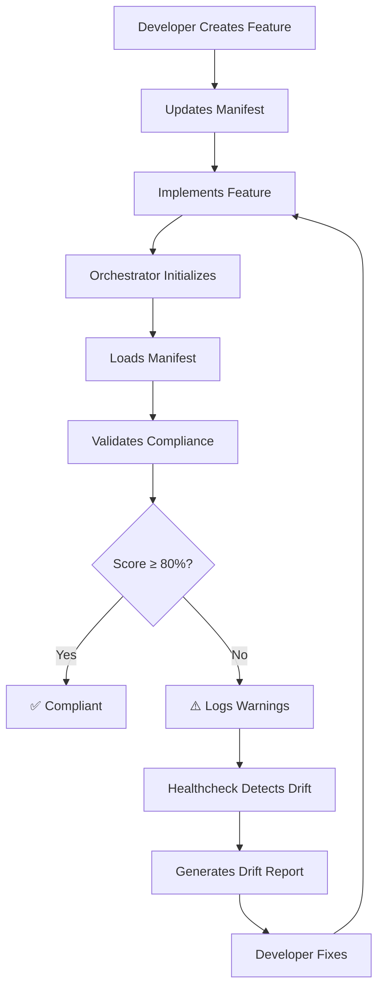

# Orchestrator Manifest System

**Version:** 1.0  
**Created:** 2025-12-08  
**Purpose:** Prevent orchestrator drift through centralized requirement management

---

## 📋 Overview

The Orchestrator Manifest System is a **central source of truth** for all CORTEX orchestrator requirements, integrations, quality gates, and workflows. It prevents drift by:

1. **Defining expected features** in YAML manifests (not scattered in code comments)
2. **Validating compliance** at runtime (orchestrators self-check on initialization)
3. **Detecting drift** automatically (healthcheck compares manifest vs implementation)
4. **Ensuring parity** between related orchestrators (e.g., Planning 2.0 vs ADO Planning)

---

## 🏗️ Architecture

```
cortex-brain/orchestrator-manifests/
├── manifest-schema.yaml                    # Universal schema for all manifests
├── planning-system-2.0-manifest.yaml       # Planning System 2.0 requirements
├── ado-planning-manifest.yaml              # ADO planning (inherits from Planning 2.0)
└── [future]-manifest.yaml                  # Extensible to all orchestrators
```

**Validator:** `src/utils/manifest_validator.py` - Validates manifests against schema and checks implementation compliance

---

## 📄 Manifest Structure

Each manifest contains:

### 1. Metadata
- Orchestrator name, version, description
- Category, deployment tier, status
- Related orchestrators, documentation links

### 2. Requirements
- Requirement ID, name, description
- Priority (critical/high/medium/low)
- Status (implemented/partial/missing)
- Validation method and criteria
- Implementation notes and effort estimates

### 3. Integrations
- Target component (orchestrator/agent to integrate)
- Integration type (required/optional/conditional)
- Trigger condition and expected behavior
- Validation method and status

### 4. Quality Gates
- Gate ID, name, type (approval/validation/security)
- Trigger point in workflow
- Blocking (true/false)
- Validation criteria and bypass conditions

### 5. Workflows
- Workflow phases and steps
- Sequence and required flags
- Validation criteria and status

### 6. Response Templates
- Required template sections
- Progress visualization needs
- Interactive elements

### 7. Compliance Rules
- SKULL rules that apply
- Enforcement level (mandatory/recommended)
- Validation methods

---

## 🚀 Usage

### For Orchestrator Developers

**1. Check Manifest on Initialization**

```python
from src.utils.manifest_validator import ManifestValidator

class MyOrchestrator:
    def __init__(self, cortex_root: str):
        self.cortex_root = cortex_root
        
        # Load and validate manifest
        self.manifest_validator = ManifestValidator(cortex_root)
        self.manifest = self.manifest_validator.load_manifest("my_orchestrator")
        
        # Validate compliance
        self._validate_manifest_compliance()
    
    def _validate_manifest_compliance(self):
        report = self.manifest_validator.validate_orchestrator(
            "my_orchestrator",
            orchestrator_instance=self
        )
        
        if report.compliance_score < 80:
            logger.warning(f"⚠️ Compliance: {report.compliance_score:.1f}%")
            
        critical_issues = report.get_critical_issues()
        if critical_issues:
            for issue in critical_issues:
                logger.error(f"❌ {issue.item_id}: {issue.item_name}")
```

**2. Create Manifest for New Orchestrator**

```bash
# Copy template
cp cortex-brain/orchestrator-manifests/manifest-schema.yaml \
   cortex-brain/orchestrator-manifests/my-orchestrator-manifest.yaml

# Edit with your requirements
# Follow schema structure defined in manifest-schema.yaml
```

**3. Inherit from Existing Manifest**

```yaml
schema_version: "1.0"
inherits_from: "planning-system-2.0-manifest.yaml"

metadata:
  orchestrator_name: "my_related_orchestrator"
  # Child inherits all requirements from parent
  # Override by redefining requirement_id
```

### For Administrators

**1. Run Drift Detection**

```python
from src.utils.manifest_validator import ManifestValidator

validator = ManifestValidator("/path/to/CORTEX")

# Validate all orchestrators
reports = validator.validate_all_orchestrators()

for name, report in reports.items():
    print(f"{name}: {report.compliance_score:.1f}% - {report.overall_status}")
```

**2. Generate Drift Reports**

```python
report = validator.validate_orchestrator("planning_system_2.0")

# Generate markdown report
markdown = validator.generate_drift_report(
    report,
    output_path=Path("cortex-brain/documents/reports/planning-drift-report.md")
)
```

**3. Add to Healthcheck**

```python
# In healthcheck orchestrator
def check_orchestrator_compliance(self):
    validator = ManifestValidator(self.cortex_root)
    reports = validator.validate_all_orchestrators()
    
    issues = []
    for name, report in reports.items():
        if report.overall_status == "non_compliant":
            issues.append(f"{name}: {len(report.get_critical_issues())} critical issues")
    
    return issues
```

---

## 📊 Validation Levels

| Severity | Description | Action Required |
|----------|-------------|-----------------|
| **CRITICAL** | Missing critical requirement | MUST fix before deployment |
| **HIGH** | Missing important feature | Fix in current sprint |
| **MEDIUM** | Missing enhancement | Fix when convenient |
| **LOW** | Nice-to-have missing | Optional improvement |
| **INFO** | Informational only | No action needed |

---

## 🎯 Compliance Scoring

**Score = 100.0 - (Weighted Issue Deductions)**

**Weights:**
- Critical: 10 points each
- High: 5 points each
- Medium: 2 points each
- Low: 1 point each
- Info: 0 points

**Status Thresholds:**
- ≥80%: **Compliant** ✅
- 60-79%: **Drift Detected** ⚠️
- <60%: **Non-Compliant** ❌

---

## 📝 Manifest Schema

See `manifest-schema.yaml` for complete schema definition.

**Key Sections:**
- `metadata` - Orchestrator identification
- `requirements` - Feature requirements with validation
- `integrations` - Component integrations
- `quality_gates` - Approval and validation gates
- `workflows` - Expected workflow phases/steps
- `response_templates` - Template requirements
- `compliance_rules` - SKULL and governance rules

---

## 🔄 Workflow



---

## 🚨 Critical Requirements

### Planning System 2.0
- ✅ Threat Modeling (implemented)
- ✅ TDD Requirements Injection (implemented)
- ❌ Acceptance Criteria Approval Gate (missing - **Priority 1**)
- ❌ Interactive DoR Workflow (missing - **Priority 1**)
- ❌ Review Orchestrator Integration (missing - **Priority 1**)

### ADO Planning
- ❌ Must maintain parity with Planning System 2.0
- ❌ All Planning 2.0 requirements apply
- ✅ ADO API Authentication (implemented)
- ⚠️ Story Point Conversion (partial)

---

## 🛠️ Adding New Orchestrator

1. **Create Manifest File**
   ```bash
   cp cortex-brain/orchestrator-manifests/manifest-schema.yaml \
      cortex-brain/orchestrator-manifests/my-orchestrator-manifest.yaml
   ```

2. **Fill Required Sections**
   - Metadata (name, version, description)
   - Requirements (what must be implemented)
   - Integrations (dependencies)
   - Quality Gates (validation checkpoints)
   - Workflows (phase/step structure)

3. **Integrate Validator**
   ```python
   from src.utils.manifest_validator import ManifestValidator
   
   def __init__(self, cortex_root):
       self.manifest_validator = ManifestValidator(cortex_root)
       self.manifest = self.manifest_validator.load_manifest("my_orchestrator")
       self._validate_manifest_compliance()
   ```

4. **Test Compliance**
   ```python
   report = validator.validate_orchestrator("my_orchestrator")
   assert report.compliance_score >= 80, "Compliance too low"
   ```

---

## 📚 Examples

### Example 1: Check Requirement Status

```python
manifest = validator.load_manifest("planning-system-2.0")

for req in manifest['requirements']:
    if req['status'] == 'missing' and req['priority'] == 'critical':
        print(f"❌ CRITICAL: {req['name']} - {req['description']}")
```

### Example 2: Find All Missing Features

```python
report = validator.validate_orchestrator("planning_system_2.0")

for issue in report.issues:
    if issue.category == "requirement":
        print(f"{issue.severity.value}: {issue.item_name}")
        print(f"  Resolution: {issue.resolution}")
```

### Example 3: Compare Two Orchestrators

```python
planning_report = validator.validate_orchestrator("planning-system-2.0")
ado_report = validator.validate_orchestrator("ado-planning")

print(f"Planning 2.0: {planning_report.compliance_score:.1f}%")
print(f"ADO Planning: {ado_report.compliance_score:.1f}%")
print(f"Parity Gap: {abs(planning_report.compliance_score - ado_report.compliance_score):.1f}%")
```

---

## 🔍 Troubleshooting

### Manifest Not Found
```
⚠️ Planning System 2.0 manifest not found - drift detection disabled
```
**Solution:** Create manifest file in `cortex-brain/orchestrator-manifests/`

### Low Compliance Score
```
⚠️ Planning System 2.0 compliance: 65.0%
```
**Solution:** Check report for critical issues, prioritize fixes

### Validation Errors
```
❌ REQ-001: Acceptance Criteria Approval Gate
```
**Solution:** Implement missing requirement per manifest specification

---

## 📖 Related Documentation

- `manifest-schema.yaml` - Universal manifest schema
- `planning-system-2.0-manifest.yaml` - Planning System 2.0 requirements
- `ado-planning-manifest.yaml` - ADO planning requirements
- `src/utils/manifest_validator.py` - Validation implementation

---

## 🎯 Future Enhancements

1. **Auto-Generate Manifests** - Scan code to generate initial manifest
2. **CI/CD Integration** - Block merges if compliance < 80%
3. **Manifest Diff Tool** - Compare manifest versions
4. **Visual Dashboard** - Show compliance across all orchestrators
5. **Auto-Fix Suggestions** - AI-powered remediation recommendations

---

**Questions?** See `manifest-schema.yaml` for complete specification or check existing manifests for examples.
