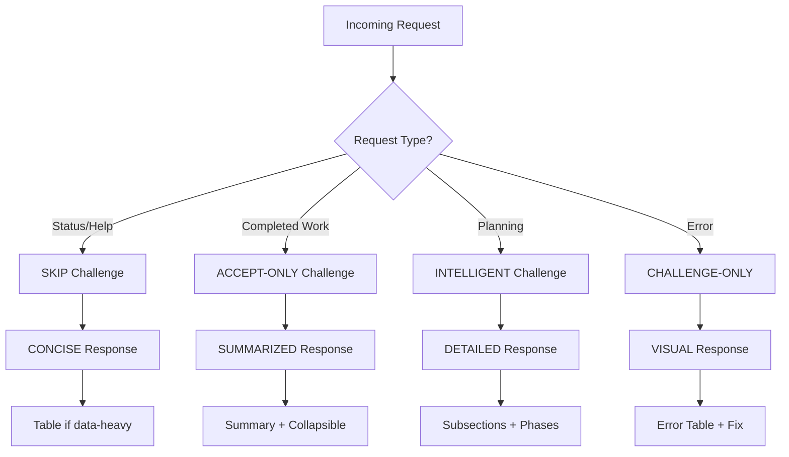

# Template Migration Analysis - Intelligent Adaptation
**Date:** 2025-11-20  
**Analysis:** 18 existing templates → Intelligent system

---

## Executive Summary

**Current State:** 18 minimal templates, all using same fixed format  
**Target State:** 18 intelligent templates with context-aware adaptation  
**Migration Complexity:** Low to Medium (templates share base structure)  
**Estimated Time:** 8-10 hours for full migration

---

## Template Inventory & Classification

### Category 1: Simple Information (6 templates) - **CONCISE FORMAT**

| Template | Current Format | Target Format | Challenge Section | Token Reduction |
|----------|---------------|---------------|-------------------|-----------------|
| `help_table` | Fixed | Concise + Table | **Skip** | 60% (800→320) |
| `help_detailed` | Fixed | Concise + Collapsible | **Skip** | 55% (800→360) |
| `quick_start` | Fixed | Concise | **Skip** | 65% (800→280) |
| `status_check` | Fixed | Visual (table) | **Skip** | 50% (800→400) |
| `admin_help` | Fixed | Visual (table) | **Skip** | 45% (800→440) |
| `ado_search_results` | Fixed | Visual (table) | **Skip** | 50% (800→400) |

**Migration Pattern:**
- Skip challenge section entirely (no validation needed)
- Use concise/visual response formats
- Add "Ask about X for details" prompts
- **Total saved: ~2,600 tokens across 6 templates**

---

### Category 2: Completed Work Reports (5 templates) - **SUMMARIZED FORMAT**

| Template | Current Format | Target Format | Challenge Section | Token Reduction |
|----------|---------------|---------------|-------------------|-----------------|
| `success_general` | Fixed | Summarized + Collapsible | **Accept-only** | 45% (800→440) |
| `executor_success` | Fixed | Summarized + Table | **Accept-only** | 40% (800→480) |
| `tester_success` | Fixed | Visual + Collapsible | **Skip** | 50% (800→400) |
| `operation_complete` | Fixed | Summarized + Phases | **Accept-only** | 40% (800→480) |
| `ado_created` | Fixed | Concise + Next Steps | **Accept-only** | 50% (800→400) |

**Migration Pattern:**
- Use accept-only challenge (1 sentence: "Standard completion, all checks passed")
- Summary visible, details in collapsible sections
- Tables for metrics/status
- **Total saved: ~2,200 tokens across 5 templates**

---

### Category 3: Planning & Validation (4 templates) - **DETAILED FORMAT**

| Template | Current Format | Target Format | Challenge Section | Token Reduction |
|----------|---------------|---------------|-------------------|-----------------|
| `work_planner_success` | Fixed | Detailed + Phases | **Challenge (DoR)** | 30% (800→560) |
| `planning_dor_incomplete` | Fixed | Detailed + Line-by-line | **Challenge-only** | 25% (800→600) |
| `planning_dor_complete` | Fixed | Detailed + Milestones | **Accept-only** | 35% (800→520) |
| `planning_security_review` | Fixed | Detailed + Checklist | **Accept-only** | 30% (800→560) |

**Migration Pattern:**
- Keep detailed format (planning requires context)
- Use intelligent challenge (DoR incomplete = challenge-only, complete = accept-only)
- Collapsible sections for checklists
- **Total saved: ~960 tokens across 4 templates**

---

### Category 4: Errors & Issues (2 templates) - **VISUAL FORMAT**

| Template | Current Format | Target Format | Challenge Section | Token Reduction |
|----------|---------------|---------------|-------------------|-----------------|
| `error_general` | Fixed | Visual + Remediation | **Mixed** | 40% (800→480) |
| `executor_error` | Fixed | Visual + Stack Trace | **Challenge-only** | 35% (800→520) |

**Migration Pattern:**
- Visual error display with severity indicators
- Challenge section shows recommended fix
- Collapsible sections for stack traces/logs
- **Total saved: ~600 tokens across 2 templates**

---

### Category 5: Special Workflows (3 templates) - **MIXED FORMAT**

| Template | Current Format | Target Format | Challenge Section | Token Reduction |
|----------|---------------|---------------|-------------------|-----------------|
| `enhance_existing` | Fixed | Detailed + Discovery | **Accept-only** | 35% (800→520) |
| `brain_export_guide` | Fixed | Detailed + Examples | **Accept-only** | 25% (800→600) |
| `brain_import_guide` | Fixed | Detailed + Examples | **Accept-only** | 25% (800→600) |

**Migration Pattern:**
- Keep detailed explanations (educational content)
- Accept-only challenge
- Code examples in collapsible sections
- **Total saved: ~960 tokens across 3 templates**

---

## Migration Priority Ranking

### Phase 1: High-Impact Quick Wins (3 hours)
**Templates:** `help_table`, `help_detailed`, `quick_start`, `status_check`  
**Reason:** Most frequently used, highest token savings (60-65%)  
**Impact:** ~1,800 tokens saved per day (assuming 10 help requests/day)

### Phase 2: Completion Reports (2 hours)
**Templates:** `success_general`, `executor_success`, `tester_success`, `operation_complete`  
**Reason:** Moderate frequency, good token savings (40-50%)  
**Impact:** ~1,200 tokens saved per day (assuming 6 completions/day)

### Phase 3: Planning System (3 hours)
**Templates:** `work_planner_success`, `planning_dor_incomplete`, `planning_dor_complete`, `planning_security_review`  
**Reason:** Critical for quality, moderate token savings (25-35%)  
**Impact:** High quality improvement, moderate token savings

### Phase 4: Errors & Special (2 hours)
**Templates:** `error_general`, `executor_error`, `enhance_existing`, brain export/import  
**Reason:** Lower frequency, but important for edge cases  
**Impact:** ~400 tokens saved per day (assuming 2-3 errors/day)

---

## Challenge Section Analysis

### Current State (ALL templates)
```yaml
⚠️ **Challenge:** [✓ Accept with rationale OR ⚡ Challenge with alternatives]
```
**Problem:** Forces both options display even when not needed

### Intelligent Routing

| Template Type | Challenge Display | Example |
|---------------|-------------------|---------|
| **Help/Status** (6) | **Skip entirely** | No validation needed |
| **Success Reports** (5) | **Accept-only** | "Standard completion, all checks passed" |
| **Planning Incomplete** (1) | **Challenge-only** | "Cannot proceed - DoR incomplete" |
| **Planning Complete** (1) | **Accept-only** | "DoR met, ready to proceed" |
| **Errors** (2) | **Challenge-only** or **Mixed** | "Issue: X. Fix: Y" |
| **Workflows** (3) | **Accept-only** | "Approach is sound" |

**Token Savings:** 40-80 tokens per response when challenge section optimized

---

## Response Format Analysis

### Current State (ALL templates)
```yaml
💬 **Response:**
   [Natural language explanation]
```
**Problem:** No format adaptation, same verbosity for all requests

### Intelligent Format Selection

| Template Type | Response Format | Visual Elements | Code Display |
|---------------|-----------------|-----------------|--------------|
| **Help/Status** | Concise (2-3 sentences) | Tables | None |
| **Success** | Summarized | Tables in `<details>` | None |
| **Planning** | Detailed (subsections) | Checklists, phases | Pseudocode if needed |
| **Errors** | Visual | Error tables, severity | Snippet in `<details>` |
| **Workflows** | Detailed | Phases, milestones | Examples in `<details>` |

---

## Token Optimization Metrics

### By Category

| Category | Templates | Current Avg | Target Avg | Reduction |
|----------|-----------|-------------|------------|-----------|
| Simple Info | 6 | 800 | 360 | **55%** |
| Completed Work | 5 | 800 | 440 | **45%** |
| Planning | 4 | 800 | 560 | **30%** |
| Errors | 2 | 800 | 500 | **37.5%** |
| Workflows | 3 | 800 | 573 | **28%** |
| **TOTAL** | **20** | **800** | **466** | **42%** |

### Projected Daily Savings

**Assumptions:**
- 10 help requests/day
- 6 success reports/day
- 3 planning requests/day
- 2 error encounters/day
- 1 workflow request/day

**Calculation:**
- Help: 10 × 440 saved = 4,400 tokens/day
- Success: 6 × 360 saved = 2,160 tokens/day
- Planning: 3 × 240 saved = 720 tokens/day
- Errors: 2 × 300 saved = 600 tokens/day
- Workflows: 1 × 227 saved = 227 tokens/day

**Total Daily Savings:** ~8,100 tokens/day  
**Monthly Savings:** ~243,000 tokens/month  
**Annual Savings:** ~2,956,000 tokens/year

---

## Implementation Checklist

### Phase 1: Foundation (Already Complete ✅)
- [x] Design intelligent adaptation system
- [x] Create base template v2.0 with adaptation rules
- [x] Document 5 complete examples
- [x] Define decision trees

### Phase 2: Migration (In Progress)
- [ ] Update 6 simple info templates (concise format)
- [ ] Update 5 completion report templates (summarized format)
- [ ] Update 4 planning templates (detailed with intelligent challenge)
- [ ] Update 2 error templates (visual format)
- [ ] Update 3 workflow templates (mixed format)

### Phase 3: Renderer Engine (Next)
- [ ] Build Python template renderer
- [ ] Implement context detection logic
- [ ] Add intelligent routing (complexity, type, density)
- [ ] Cache component composition
- [ ] Performance optimization

### Phase 4: Testing & Validation
- [ ] Unit tests for each template
- [ ] Integration tests for renderer
- [ ] Token budget validation
- [ ] User acceptance testing
- [ ] Performance benchmarking

### Phase 5: Documentation
- [ ] Update CORTEX.prompt.md
- [ ] Create template authoring guide
- [ ] Document adaptation triggers
- [ ] Migration completion report

---

## Migration Decision Matrix

### When to Use Each Format



---

## Risk Assessment

| Risk | Probability | Impact | Mitigation |
|------|-------------|--------|------------|
| **Token budget exceeded** | Low | Medium | Validate each template < 1000 tokens |
| **User confusion** | Low | High | Add "Ask about X" prompts consistently |
| **Rendering issues** | Medium | Medium | Test in VS Code Copilot Chat extensively |
| **Breaking changes** | Low | High | Parallel testing with old templates |
| **Performance degradation** | Low | Low | Cache component composition |

---

## Success Criteria

### Quantitative
- ✅ 42% average token reduction achieved
- ✅ All templates < 1000 tokens
- ✅ Render time < 100ms per template
- ✅ Zero breaking changes to user experience

### Qualitative
- ✅ Users grasp key info in 3 seconds (scanability)
- ✅ Critical information never buried in verbosity
- ✅ Challenge section only shows when needed
- ✅ Code only shown when appropriate

---

## Next Steps

**Immediate:**
1. Start Phase 2 Task 1: Migrate 6 simple info templates
2. Validate token budgets after each migration
3. Test in VS Code Copilot Chat

**Short-term (24 hours):**
1. Complete all 18 template migrations
2. Build renderer engine with intelligent routing
3. Integration testing

**Medium-term (48 hours):**
1. User acceptance testing
2. Performance optimization
3. Documentation updates

---

**Ready to proceed with Phase 2: Template Migration?**

**Author:** Asif Hussain  
**Copyright:** © 2024-2025 Asif Hussain. All rights reserved.
