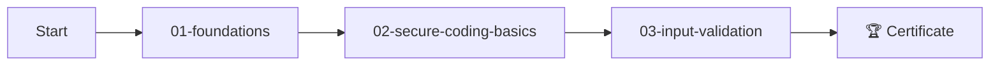
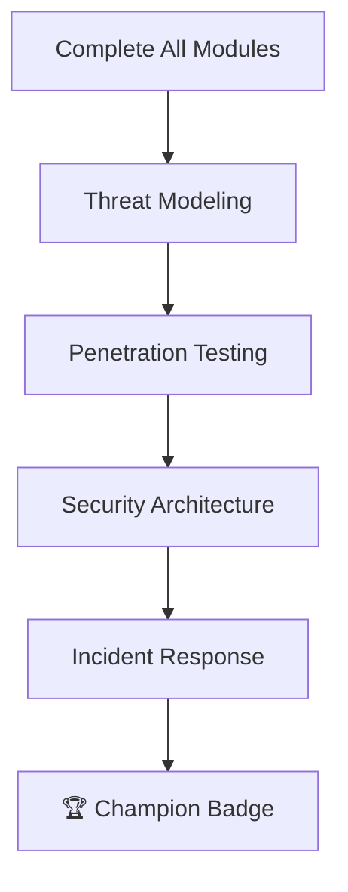

# CORTEX Interactive Security Training

**Purpose:** Self-paced security education with hands-on exercises  
**Author:** CORTEX Development Team  
**Version:** 1.0.0  
**Created:** December 30, 2025

---

## 📚 Module Overview

This training curriculum provides comprehensive security education covering OWASP Top 10, secure coding practices, and industry best practices.

### Training Tracks

| Track | Duration | Difficulty | Target Audience |
|-------|----------|------------|-----------------|
| **Foundations** | 2 hours | Beginner | All developers |
| **OWASP Top 10** | 4 hours | Intermediate | Backend developers |
| **Secure APIs** | 3 hours | Intermediate | API developers |
| **Advanced** | 6 hours | Advanced | Security engineers |

---

## 🎯 Learning Paths

### Path 1: Developer Fundamentals (2 hours)


### Path 2: OWASP Top 10 Deep Dive (4 hours)

```mermaid
flowchart LR
    A[Prerequisites:<br/>Foundations] --> B[owasp-01-broken-access-control]
    B --> C[owasp-02-cryptographic-failures]
    C --> D[owasp-03-injection]
    D --> E[owasp-04-insecure-design]
    E --> F[owasp-05-misconfiguration]
    F --> G[owasp-06-vulnerable-components]
    G --> H[owasp-07-auth-failures]
    H --> I[owasp-08-integrity-failures]
    I --> J[owasp-09-logging-failures]
    J --> K[owasp-10-ssrf]
    K --> L[🏆 OWASP Certificate]
```


### Path 3: Security Champion (6+ hours)


---

## 📖 Module Catalog

### Foundation Modules

| Module ID | Title | Duration | Prerequisites |
|-----------|-------|----------|---------------|
| `01-foundations` | Security Mindset | 30 min | None |
| `02-secure-coding-basics` | Secure Coding Principles | 30 min | 01 |
| `03-input-validation` | Input Validation & Sanitization | 30 min | 02 |
| `04-authentication-basics` | Authentication Fundamentals | 30 min | 02 |

### OWASP Modules

| Module ID | OWASP | Title | Duration |
|-----------|-------|-------|----------|
| `owasp-01` | A01:2021 | Broken Access Control | 30 min |
| `owasp-02` | A02:2021 | Cryptographic Failures | 30 min |
| `owasp-03` | A03:2021 | Injection Attacks | 30 min |
| `owasp-04` | A04:2021 | Insecure Design | 30 min |
| `owasp-05` | A05:2021 | Security Misconfiguration | 20 min |
| `owasp-06` | A06:2021 | Vulnerable Components | 20 min |
| `owasp-07` | A07:2021 | Authentication Failures | 30 min |
| `owasp-08` | A08:2021 | Integrity Failures | 20 min |
| `owasp-09` | A09:2021 | Logging & Monitoring | 20 min |
| `owasp-10` | A10:2021 | Server-Side Request Forgery | 20 min |

### Advanced Modules

| Module ID | Title | Duration | Prerequisites |
|-----------|-------|----------|---------------|
| `adv-01-threat-modeling` | Threat Modeling | 60 min | All OWASP |
| `adv-02-secure-architecture` | Secure Architecture | 60 min | Threat Modeling |
| `adv-03-incident-response` | Incident Response | 45 min | Foundations |
| `adv-04-api-security` | API Security Deep Dive | 60 min | OWASP |

---

## 📁 Directory Structure

```
cortex-brain/training/security/
├── README.md                     # This file
├── modules/
│   ├── foundations/
│   │   ├── 01-security-mindset.md
│   │   ├── 02-secure-coding-basics.md
│   │   ├── 03-input-validation.md
│   │   └── 04-authentication-basics.md
│   │
│   ├── owasp/
│   │   ├── 01-broken-access-control.md
│   │   ├── 02-cryptographic-failures.md
│   │   ├── 03-injection.md
│   │   ├── 04-insecure-design.md
│   │   ├── 05-misconfiguration.md
│   │   ├── 06-vulnerable-components.md
│   │   ├── 07-auth-failures.md
│   │   ├── 08-integrity-failures.md
│   │   ├── 09-logging-failures.md
│   │   └── 10-ssrf.md
│   │
│   └── advanced/
│       ├── threat-modeling.md
│       ├── secure-architecture.md
│       ├── incident-response.md
│       └── api-security.md
│
├── exercises/
│   ├── vulnerable-code-samples/
│   ├── fix-the-vuln/
│   └── code-review-practice/
│
├── assessments/
│   ├── foundations-quiz.yaml
│   ├── owasp-assessment.yaml
│   └── practical-exam.yaml
│
└── certificates/
    └── templates/
```

---

## 🧪 Assessment Framework

### Quiz Types

1. **Multiple Choice:** Concept verification
2. **Code Review:** Identify vulnerabilities in code
3. **Fix-the-Vuln:** Provide secure code alternatives
4. **Scenario-Based:** Real-world decision making

### Scoring

| Grade | Score | Outcome |
|-------|-------|---------|
| Pass | ≥80% | Certificate issued |
| Review | 60-79% | Study recommendations |
| Retry | <60% | Module replay required |

---

## 🏆 Certification Tracks

### Developer Security Foundations
- Complete: Modules 01-04
- Pass: Foundations Quiz (80%+)
- Badge: `🛡️ Security Aware Developer`

### OWASP Top 10 Specialist
- Complete: All OWASP modules
- Pass: OWASP Assessment (80%+)
- Badge: `🏅 OWASP Top 10 Specialist`

### Security Champion
- Complete: All tracks
- Pass: Practical Exam
- Badge: `🏆 CORTEX Security Champion`

---

## 🚀 Getting Started

1. **Assess Your Level:** Take the placement quiz
2. **Choose Your Path:** Select based on role
3. **Complete Modules:** Self-paced learning
4. **Practice:** Hands-on exercises
5. **Certify:** Pass assessments

```bash
# Start with the foundations module
cortex training start foundations

# Check progress
cortex training status

# Take assessment
cortex training assess owasp
```

---

## 📈 Progress Tracking

Progress is tracked in:
```
cortex-brain/learning/security-training-progress.json
```

Data includes:
- Modules completed
- Time spent
- Quiz scores
- Certificates earned

---

## 🔗 Integration with CORTEX

The training system integrates with:
- **Security Scanner:** Training recommendations based on findings
- **Code Review:** Contextual learning during reviews
- **Dashboard:** Training coverage metrics
- **Lens:** Visual progress tracking
