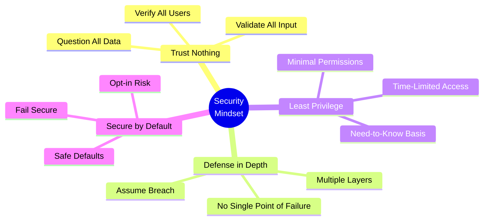
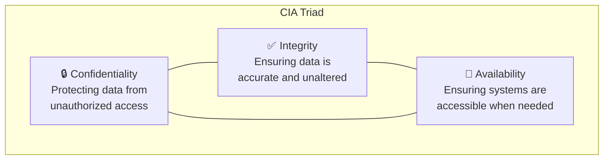
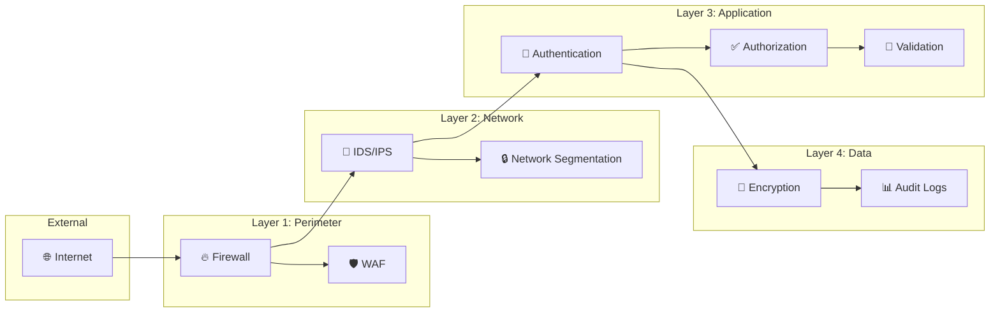
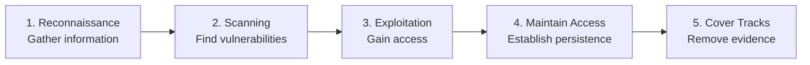

# Module 01: Security Mindset

**Track:** Foundations  
**Duration:** 30 minutes  
**Difficulty:** Beginner  
**Prerequisites:** None

---

## 🎯 Learning Objectives

After completing this module, you will:
- Understand the security-first mindset
- Recognize common threat actors and motivations
- Apply defense-in-depth principles
- Think like an attacker to build better defenses

---

## 📚 Content

### 1. The Security-First Mindset

Security isn't a feature—it's a fundamental property of quality software. Every line of code you write can be a potential attack vector.

### 2. Threat Landscape

Understanding who attacks systems and why:

| Threat Actor | Motivation | Typical Targets | Sophistication |
|--------------|------------|-----------------|----------------|
| **Script Kiddies** | Curiosity, bragging rights | Low-hanging fruit | Low |
| **Hacktivists** | Ideological | High-visibility orgs | Low-Medium |
| **Cybercriminals** | Financial gain | Any valuable data | Medium-High |
| **Competitors** | Industrial espionage | IP, trade secrets | Medium-High |
| **Nation States** | Strategic advantage | Critical infrastructure | Very High |
| **Insiders** | Revenge, financial | Internal systems | Varies |

### 3. The CIA Triad

The foundation of information security:

**Confidentiality Threats:**
- Data breaches
- Unauthorized access
- Information disclosure

**Integrity Threats:**
- Data tampering
- Man-in-the-middle attacks
- SQL injection

**Availability Threats:**
- DDoS attacks
- Ransomware
- System failures

### 4. Defense in Depth

Never rely on a single security control:

### 5. Think Like an Attacker

Security professionals must understand attack methodology:

**For Each Feature You Build, Ask:**
1. What data does this handle?
2. Who should have access?
3. What happens if input is malicious?
4. How could an attacker abuse this?
5. What's the worst-case scenario?

---

## 🧪 Exercises

### Exercise 1: Threat Analysis

Consider a simple login form. List at least 5 ways an attacker might try to abuse it:

Click for Answer

1. **Brute Force:** Try many password combinations
2. **Credential Stuffing:** Use leaked credentials from other sites
3. **SQL Injection:** `' OR '1'='1' --` in username field
4. **Timing Attack:** Measure response time to enumerate users
5. **Session Hijacking:** Steal session token after successful login
6. **CSRF:** Trick logged-in user into performing actions
7. **Account Lockout DoS:** Lock out legitimate users
8. **Password Reset Abuse:** Exploit password reset functionality

### Exercise 2: Security Design

You're building a file upload feature. Design security controls for each layer:

| Layer | Security Control | Purpose |
|-------|-----------------|---------|
| Perimeter | ? | ? |
| Network | ? | ? |
| Application | ? | ? |
| Data | ? | ? |

Click for Answer

| Layer | Security Control | Purpose |
|-------|-----------------|---------|
| **Perimeter** | Rate limiting | Prevent upload DoS |
| **Network** | Dedicated storage zone | Isolate uploaded files |
| **Application** | File type validation, size limits, virus scan | Prevent malicious uploads |
| **Data** | Encryption at rest, randomized filenames | Protect stored files |

---

## 📝 Knowledge Check

1. What does the "I" in CIA stand for?
   - [ ] Intelligence
   - [ ] Integration
   - [x] Integrity
   - [ ] Infrastructure

2. Which threat actor is typically motivated by financial gain?
   - [ ] Script Kiddies
   - [ ] Hacktivists
   - [x] Cybercriminals
   - [ ] Nation States

3. Defense in depth means:
   - [ ] Using the strongest possible firewall
   - [x] Using multiple layers of security controls
   - [ ] Defending your code with unit tests
   - [ ] Hiring more security staff

4. When thinking like an attacker, the first step is:
   - [ ] Exploitation
   - [x] Reconnaissance
   - [ ] Privilege Escalation
   - [ ] Exfiltration

---

## 🎓 Key Takeaways

1. **Security is everyone's responsibility**—not just the security team
2. **Trust nothing**—validate all inputs, verify all users
3. **Defense in depth**—never rely on a single control
4. **Think like an attacker**—anticipate how features can be abused
5. **Secure by default**—unsafe options should require opt-in

---

## 📖 Further Reading

- [OWASP Top 10](https://owasp.org/www-project-top-ten/)
- [NIST Cybersecurity Framework](https://www.nist.gov/cyberframework)
- [Microsoft SDL](https://www.microsoft.com/en-us/securityengineering/sdl)

---

## ⏭️ Next Module

Continue to [02 - Secure Coding Basics](./02-secure-coding-basics.md)
