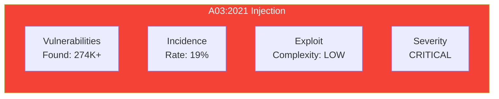
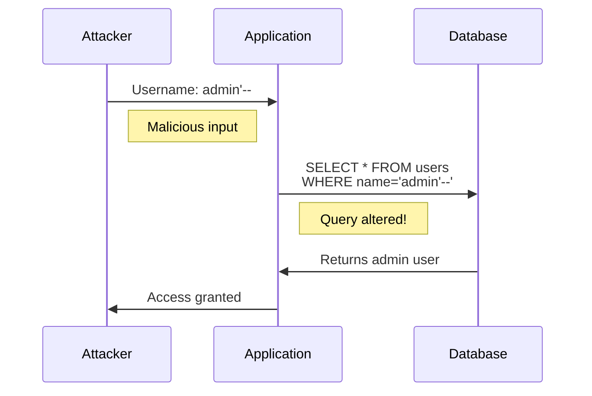
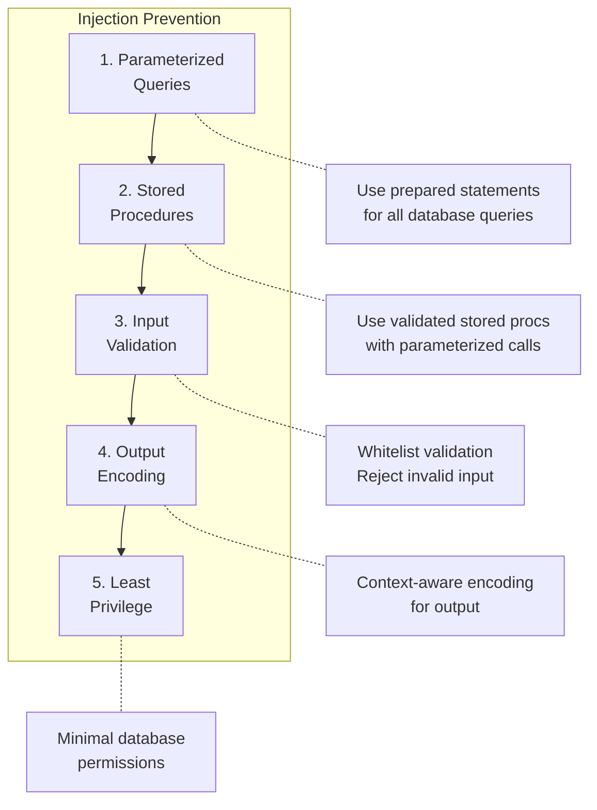

# OWASP Module: A03:2021 - Injection

**Track:** OWASP Top 10  
**Duration:** 30 minutes  
**Difficulty:** Intermediate  
**OWASP ID:** A03:2021  
**CWE References:** CWE-79, CWE-89, CWE-94, CWE-77

---

## 🎯 Learning Objectives

After completing this module, you will:
- Understand injection attack vectors
- Recognize vulnerable code patterns
- Implement secure coding practices to prevent injection
- Apply parameterized queries and input validation

---

## 📊 Risk Overview



| Metric | Value | Description |
|--------|-------|-------------|
| Prevalence | 94% of apps | Tested for some form of injection |
| Max Incidence | 19% | Applications with injection vulnerabilities |
| Exploitability | 3/3 | Easy to exploit |
| Impact | 3/3 | High impact on confidentiality/integrity |

---

## 📚 Understanding Injection

### What is Injection?

Injection occurs when untrusted data is sent to an interpreter as part of a command or query, tricking the interpreter into executing unintended commands.



### Types of Injection

| Type | Target | Example Payload | Impact |
|------|--------|-----------------|--------|
| **SQL Injection** | Database | `' OR '1'='1' --` | Data breach, bypass auth |
| **Command Injection** | OS Shell | `; rm -rf /` | System compromise |
| **LDAP Injection** | Directory | `*)(uid=*))(|(uid=*` | Directory access |
| **XPath Injection** | XML | `' or '1'='1` | Data extraction |
| **NoSQL Injection** | NoSQL DB | `{"$gt": ""}` | Bypass auth, data leak |
| **Template Injection** | Template Engine | `{{7*7}}` | RCE in some cases |

---

## 🔴 Vulnerable Code Examples

### SQL Injection (Python)

```python
# ❌ VULNERABLE - String concatenation
def get_user(username):
    query = f"SELECT * FROM users WHERE username = '{username}'"
    cursor.execute(query)
    return cursor.fetchone()

# Attack: username = "admin'--"
# Result: SELECT * FROM users WHERE username = 'admin'--'
```

### SQL Injection (JavaScript)

```javascript
// ❌ VULNERABLE - Template literal injection
async function getUser(username) {
    const query = `SELECT * FROM users WHERE username = '${username}'`;
    return await db.query(query);
}

// Attack: username = "'; DROP TABLE users;--"
```

### Command Injection (Python)

```python
# ❌ VULNERABLE - Unsanitized shell command
import os

def ping_host(hostname):
    os.system(f"ping -c 1 {hostname}")

# Attack: hostname = "google.com; cat /etc/passwd"
```

### NoSQL Injection (Node.js)

```javascript
// ❌ VULNERABLE - Direct user input in query
app.post('/login', async (req, res) => {
    const user = await User.findOne({
        username: req.body.username,
        password: req.body.password
    });
});

// Attack: {"username": "admin", "password": {"$gt": ""}}
```

---

## 🟢 Secure Code Patterns

### Parameterized Queries (Python)

```python
# ✅ SECURE - Parameterized query
def get_user(username):
    query = "SELECT * FROM users WHERE username = %s"
    cursor.execute(query, (username,))
    return cursor.fetchone()
```

### Parameterized Queries (JavaScript)

```javascript
// ✅ SECURE - Prepared statement
async function getUser(username) {
    const query = 'SELECT * FROM users WHERE username = $1';
    return await db.query(query, [username]);
}
```

### ORM Protection (Python)

```python
# ✅ SECURE - Using SQLAlchemy ORM
from sqlalchemy.orm import Session

def get_user(db: Session, username: str):
    return db.query(User).filter(User.username == username).first()
```

### Safe Command Execution (Python)

```python
# ✅ SECURE - Using subprocess with list arguments
import subprocess

def ping_host(hostname):
    # Validate hostname format first
    if not re.match(r'^[a-zA-Z0-9.-]+$', hostname):
        raise ValueError("Invalid hostname")
    
    result = subprocess.run(
        ['ping', '-c', '1', hostname],
        capture_output=True,
        text=True,
        timeout=30
    )
    return result.stdout
```

### NoSQL Injection Prevention (Node.js)

```javascript
// ✅ SECURE - Type validation
const sanitize = require('mongo-sanitize');

app.post('/login', async (req, res) => {
    // Ensure password is string, not object
    if (typeof req.body.password !== 'string') {
        return res.status(400).json({ error: 'Invalid input' });
    }
    
    const user = await User.findOne({
        username: sanitize(req.body.username),
        password: req.body.password
    });
});
```

---

## 🛡️ Prevention Checklist

### Primary Defenses



### Quick Reference

| Defense | SQL | Command | NoSQL | Template |
|---------|-----|---------|-------|----------|
| Parameterized queries | ✅ | N/A | ✅ | N/A |
| Input validation | ✅ | ✅ | ✅ | ✅ |
| Output encoding | ✅ | N/A | N/A | ✅ |
| Sandboxing | N/A | ✅ | N/A | ✅ |
| Type checking | ✅ | N/A | ✅ | ✅ |

---

## 🧪 Hands-On Exercise

### Exercise: Fix the Vulnerability

The following code has multiple injection vulnerabilities. Identify and fix them:

```python
from flask import Flask, request
import sqlite3
import os

app = Flask(__name__)

@app.route('/search')
def search():
    # VULNERABLE: SQL Injection
    term = request.args.get('q')
    conn = sqlite3.connect('products.db')
    cursor = conn.cursor()
    cursor.execute(f"SELECT * FROM products WHERE name LIKE '%{term}%'")
    return cursor.fetchall()

@app.route('/export')
def export():
    # VULNERABLE: Command Injection
    filename = request.args.get('file')
    os.system(f"cat /data/{filename}")
    return "Exported"
```

<details>
<summary>Click for Solution</summary>

```python
from flask import Flask, request, jsonify
import sqlite3
import subprocess
import re
from pathlib import Path

app = Flask(__name__)

@app.route('/search')
def search():
    # ✅ SECURE: Parameterized query
    term = request.args.get('q', '')
    
    # Additional validation
    if len(term) > 100:
        return jsonify({"error": "Search term too long"}), 400
    
    conn = sqlite3.connect('products.db')
    cursor = conn.cursor()
    cursor.execute(
        "SELECT * FROM products WHERE name LIKE ?",
        (f'%{term}%',)
    )
    return jsonify(cursor.fetchall())

@app.route('/export')
def export():
    # ✅ SECURE: Path validation + no shell
    filename = request.args.get('file', '')
    
    # Whitelist validation
    if not re.match(r'^[a-zA-Z0-9_-]+\.txt$', filename):
        return jsonify({"error": "Invalid filename"}), 400
    
    # Resolve path and validate it's within allowed directory
    base_path = Path('/data').resolve()
    file_path = (base_path / filename).resolve()
    
    if not str(file_path).startswith(str(base_path)):
        return jsonify({"error": "Invalid path"}), 400
    
    if not file_path.exists():
        return jsonify({"error": "File not found"}), 404
    
    # Safe read
    return file_path.read_text()
```

</details>

---

## 🔍 Detection Methods

### Code Review Patterns

Look for these red flags:

```python
# 🚨 String formatting in queries
f"SELECT * FROM {table}"
"SELECT * FROM " + table
query % (user_input,)

# 🚨 shell=True with user input
subprocess.run(cmd, shell=True)
os.system(user_cmd)

# 🚨 eval/exec with user input
eval(user_expression)
exec(user_code)
```

### SAST Rules

Configure security scanners to detect:
- String concatenation in SQL
- Dynamic query construction
- Shell command with user input
- Unparameterized database calls

---

## 📝 Knowledge Check

1. Which is the safest way to construct a SQL query?
   - [ ] String concatenation
   - [ ] f-strings
   - [x] Parameterized queries
   - [ ] String formatting

2. What makes command injection possible?
   - [x] Passing user input directly to shell
   - [ ] Using subprocess module
   - [ ] Reading command output
   - [ ] Running system commands

3. NoSQL injection can be prevented by:
   - [ ] Using MongoDB
   - [x] Type validation of inputs
   - [ ] URL encoding
   - [ ] JSON formatting

4. The safest Python subprocess usage is:
   - [ ] `os.system(cmd)`
   - [ ] `subprocess.run(cmd, shell=True)`
   - [x] `subprocess.run(['cmd', 'arg1', 'arg2'])`
   - [ ] `exec(cmd)`

---

## 🎓 Key Takeaways

1. **Never concatenate user input** into queries or commands
2. **Use parameterized queries** for all database operations
3. **Validate input** using whitelists, not blacklists
4. **Use subprocess with list args**, never `shell=True`
5. **Apply type checking** for NoSQL databases
6. **Implement least privilege** for database accounts

---

## 📖 Further Reading

- [OWASP Injection Prevention Cheat Sheet](https://cheatsheetseries.owasp.org/cheatsheets/Injection_Prevention_Cheat_Sheet.html)
- [OWASP SQL Injection Prevention](https://cheatsheetseries.owasp.org/cheatsheets/SQL_Injection_Prevention_Cheat_Sheet.html)
- [CWE-89: SQL Injection](https://cwe.mitre.org/data/definitions/89.html)

---

## ⏭️ Next Module

Continue to [A04:2021 - Insecure Design](./04-insecure-design.md)
