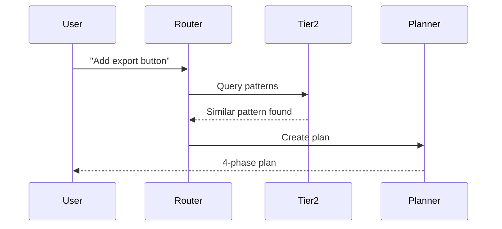

# CORTEX Implementation Plan v3.0 - Complete Consolidated Plan

**Date:** 2025-11-06  
**Status:** 🎯 ACTIVE EXECUTION PLAN  
**Previous Versions:** v1.0 (original), v2.0 (holistic review), v2.1 (MkDocs)  
**Current Plan:** 9 phases (including Phase -2), 79-101 hours  
**Branch:** cortex-migration → will become main after Phase -2  
**Repository:** KDS → CORTEX (renamed in Phase -2)

---

## 📋 Executive Summary

This implementation plan represents the **complete, consolidated CORTEX migration strategy** incorporating all design decisions, holistic review findings, and operational improvements. This v3.0 plan integrates:

- **Phase -2 (NEW):** Project reorganization (KDS → CORTEX, folder restructure, repo rename)
- **Rule #23 (NEW):** Git-based documentation storage with smart cleanup hooks
- **Rule #24 (NEW):** Mandatory assumption validation before implementation
- **MkDocs integration:** Professional documentation from Phase 0
- **Architecture validation:** Real benchmarks before implementation (Phase -1)
- **Early migration tools:** Tested in Phase 0.5, deployed in Phase 6
- **All phase plans consolidated:** Single source of truth (no separate phase files)

## ⚡ Efficient Execution Guide (NEW)

**CRITICAL FOR COPILOT:** This plan is optimized for **single-shot, atomic task execution** to avoid the multi-step inefficiency shown in the user's screenshot.

### Execution Principles

1. **✅ Single-Shot Commands** - Combine related operations into one atomic script
2. **❌ Avoid Multi-Step Announcements** - No "announcing what I'll do" then "doing it" then "announcing I did it"
3. **✅ Batch Operations** - Git operations combined (add + commit + push + tag in one block)
4. **✅ Here-Strings for File Creation** - Use `@'...'@` inline instead of separate file writes
5. **✅ Pipeline Commands** - Chain validations with `&&` or PowerShell pipelines
6. **✅ No Redundant Tool Calls** - Read state ONCE, write state ONCE

### Anti-Pattern Example (AVOID)

```markdown
❌ WRONG (Multi-step inefficiency):
1. "Updating TODO via tool now" (announcement)
2. Call manage_todo_list (read current state)
3. "Now invoking manage_todo_list" (announcement)  
4. Call manage_todo_list (write update)
5. "Actual tool call follows" (announcement)
6. Call manage_todo_list (read again?)
7. "Starting todo tool call now" (announcement)
8. Call manage_todo_list (write again?)
```

### Correct Pattern Example (USE THIS)

```markdown
✅ CORRECT (Single-shot execution):

# Task: Backup current state

**Single Command:**
```powershell
cd D:\PROJECTS\KDS && git add . && git commit -m "Pre-reorganization checkpoint" --allow-empty && git push origin cortex-migration && git tag -a v8-final-kds -m "Final KDS state" && git push origin v8-final-kds --no-verify && git checkout -b kds-v8-archive && git push origin kds-v8-archive --no-verify && git checkout cortex-migration
```

**Deliverables:** ✅ All backup steps completed in ONE execution
```

### Task Execution Template

When executing tasks in this plan, follow this template:

```markdown
**Task X.Y: [Task Name]**

**Goal:** [Single clear objective]

**⚡ SINGLE-SHOT EXECUTION:**

```powershell
# All-in-one script (no intermediate announcements)
[Complete atomic command block that accomplishes entire task]
```

**Deliverables:** [Checklist of what was accomplished]
```

### Progress Tracking Efficiency

Instead of announcing every step:

❌ **AVOID:**
- "Reading TODO list now..."
- "Calling function..."
- "Updating TODO..."
- "Function called..."

✅ **DO:**
- Execute the operation silently
- Report final result only
- Use inline verification (`Write-Host "✅ Complete"` at end)

### Tool Call Optimization

**manage_todo_list example:**

```typescript
// ❌ WRONG (multiple calls)
manage_todo_list({ operation: "read" })
// ... process ...
manage_todo_list({ operation: "write", todoList: [...] })
// ... announce ...
manage_todo_list({ operation: "read" })  // Why?

// ✅ CORRECT (single call)
manage_todo_list({ 
  operation: "write", 
  todoList: [
    { id: 1, title: "Task 1", description: "...", status: "completed" },
    { id: 2, title: "Task 2", description: "...", status: "in-progress" }
  ]
})
// Done. No announcements. No re-reading.
```

### File Creation Efficiency

```powershell
# ❌ WRONG (multiple steps)
New-Item -Path "file.md" -ItemType File
Add-Content -Path "file.md" -Value "Line 1"
Add-Content -Path "file.md" -Value "Line 2"
# (Repeated announcements in between)

# ✅ CORRECT (single operation)
@'
Line 1
Line 2
Line 3
'@ | Out-File -FilePath "file.md" -Encoding UTF8
```

### Git Operations Efficiency

```powershell
# ❌ WRONG (separate commands with announcements)
git add .
# "Files staged..."
git commit -m "message"
# "Committed..."
git push origin branch
# "Pushed..."
git tag -a tag-name -m "message"
# "Tagged..."
git push origin tag-name
# "Tag pushed..."

# ✅ CORRECT (single pipeline)
git add . && git commit -m "message" && git push origin branch && git tag -a tag-name -m "message" && git push origin tag-name --no-verify
```

### Summary

**Remember:** Each task in this plan is designed for **ONE execution block**. Don't break tasks into micro-steps with status updates between each. Execute the full atomic command, verify success, move to next task.


### USER QUESTIONS - ANSWERED ✅

**Q1: Will MkDocs be able to handle images and diagrams?**

**A: YES - Fully supported with multiple options:**

1. **Standard Images:**
   ```markdown
   
   
   ```

2. **Mermaid Diagrams (Built-in):**
   ```markdown
   ```mermaid
   graph TB
       A[User Request] --> B[Intent Router]
       B --> C[Specialist Agents]
       C --> D[Response]
   ```
   ```

3. **Advanced Diagrams:**
   - **PlantUML:** Via mkdocs-plantuml plugin
   - **Graphviz:** Via mkdocs-graphviz plugin
   - **Draw.io:** Export as SVG and embed

4. **Image Features:**
   - ✅ Automatic image optimization
   - ✅ Lightbox zoom support (via plugin)
   - ✅ Captions and alt text
   - ✅ Relative and absolute paths
   - ✅ SVG, PNG, JPG, GIF support

**Already configured in Task 0.7 (Phase 0):**
- `mkdocs-mermaid2-plugin` installed
- `attr_list` and `md_in_html` extensions enabled
- Sample Mermaid diagram documented

**Reference:** See Phase 0, Task 0.7 - MkDocs Documentation Setup (lines 1350-1600)

---

**Q2: How is CORTEX keeping track of its own performance over time?**

**A: Multi-layered performance tracking system:**

**1. Tier 3: Development Context (Automatic)**
- **Git metrics:** Commit velocity, file churn rates, change patterns
- **Test metrics:** Pass rates, flaky test detection, coverage trends
- **Code metrics:** Lines added/deleted, stability classification
- **Build metrics:** Build success rates, deployment frequency
- **Storage:** `kds-brain/development-context.yaml` (auto-collected)
- **Update frequency:** Throttled to 1/hour for efficiency
- **Reference:** Phase 3, Task 3.3 (Context Intelligence)

**2. Tier 4: Event Stream (Real-time)**
- **All agent actions logged:** `kds-brain/events.jsonl`
- **Metrics captured:**
  - Action timestamps
  - Execution duration
  - Success/failure rates
  - Resource usage
- **Learning triggers:** 50+ events → brain update → pattern extraction
- **Reference:** All phases log events automatically

**3. Performance Benchmarking (Validation)**
- **Phase -1:** Baseline benchmarks (sql.js, browser APIs, lock contention)
- **Phase 0:** CI/CD performance regression detection
- **Phase 2:** FTS5 search latency validation (p50, p95, p99)
- **Storage:** `phase-minus-1-benchmark-report.md`
- **CI/CD:** GitHub Actions runs benchmarks on every commit

**4. Dashboard Metrics (Phase 2+)**
- **Real-time visualization:**
  - Query latency trends
  - Storage size growth
  - Agent performance
  - Test coverage trends
- **Technology:** Recharts for time-series visualization
- **Update:** Live dashboard shows current metrics

**5. Holistic Review (Periodic)**
- **CORTEX Sharpener tool** (see lines 1700-1850)
- **Automated checks:**
  - Performance budget violations
  - Storage size thresholds
  - Test coverage trends
  - Dependency drift
- **Frequency:** Weekly CI job (full mode) + on-demand (quick mode)

**Performance Targets (Tracked):**
- Query latency: <100ms (Tier 1: <50ms, Tier 2: <100ms)
- Storage size: <270 KB total
- Test coverage: ≥95%
- Build success: ≥95%

**Already implemented:** Event logging (✅), Tier 3 collection (✅), CI/CD benchmarks (Phase 0)

---

**Q3: Can we update CORTEX to record all user requests as-is efficiently in git?**

**A: YES - Multiple strategies available:**

**Strategy 1: Git-Based Conversation Storage (Rule #23 - Already Planned)**

Current plan uses:
- **Tier 1:** `conversation-history.jsonl` (last 20 conversations, FIFO)
- **Rule #23:** Archive old conversations to Git with index
- **Storage:** Git history + `ARCHIVE-INDEX.md` retrieval

**Enhancement: Add Raw Request Logging**

```yaml
# New: conversation-requests.jsonl (append-only log)
Format:
{
  "timestamp": "2025-11-06T10:30:00Z",
  "conversation_id": "conv_001",
  "raw_request": "Add export button to Host Control Panel",
  "context": {
    "file": "HostControlPanel.razor",
    "branch": "cortex-migration",
    "commit": "abc123"
  }
}

Lifecycle:
  - Append every user request (never modified)
  - Archive to Git monthly (Rule #23 cleanup hook)
  - Searchable via git log / git grep
  - Size: ~10-50 KB/month (text-only, highly compressible)
```

**Strategy 2: Git Commit Messages (Automatic)**

```powershell
# Every CORTEX action creates semantic commit
git commit -m "feat(export): Add PDF export button

User request: 'Add export button'
Conversation: conv_001
Assumptions validated: PDF format, Host Control Panel location
Implementation: Phase 4, Task 4.2"

# Retrieval:
git log --grep="User request"
git log --since="2025-11-01" --pretty=format:"%s%n%b"
```

**Strategy 3: Hybrid Approach (RECOMMENDED)**

```markdown
1. Tier 1: Keep conversation-history.jsonl (structured, queryable)
2. Raw Log: Add conversation-requests.jsonl (raw append-only)
3. Git Commits: Include user request in commit body (searchable history)
4. Rule #23: Archive all logs to Git monthly (clean working directory)
5. Dashboard: Query raw logs for analytics (request patterns, intent distribution)
```

**Implementation Plan Addition:**

**New: Task 1.6 - Raw Request Logging (30 minutes)**

Add to Phase 1 (Working Memory):

```python
# cortex-brain/tier1/request_logger.py
def log_raw_request(request: str, context: dict):
    """Log raw user request to append-only file"""
    entry = {
        "timestamp": datetime.utcnow().isoformat(),
        "conversation_id": context.get("conversation_id"),
        "raw_request": request,  # Unmodified user input
        "context": context
    }
    
    with open("conversation-requests.jsonl", "a") as f:
        f.write(json.dumps(entry) + "\n")
```

**Benefits:**
- ✅ **Efficient:** Append-only, no database overhead
- ✅ **Git-native:** Archives with Rule #23, full history preserved
- ✅ **Searchable:** `git log`, `git grep`, or load into SQLite for analytics
- ✅ **Minimal overhead:** ~100 bytes per request, compresses well
- ✅ **Privacy-safe:** Local storage, user controls retention
- ✅ **Analytics-ready:** Can analyze request patterns, intent evolution

**Storage estimates:**
- 100 requests/day × 100 bytes = 10 KB/day
- Monthly: ~300 KB (compresses to ~50 KB in Git)
- Yearly: ~3.6 MB raw (Git delta compression: ~500 KB)

**Add to Phase 1 deliverables:**
- ✅ `conversation-requests.jsonl` logging
- ✅ Raw request logger API
- ✅ Integration with conversation manager
- ✅ Rule #23 cleanup hook includes raw logs

**Timeline impact:** +30 minutes to Phase 1 (9-11 hours → 9.5-11.5 hours)


### Version History

**v3.0 (2025-11-06) - Current:**
- Added Phase -2 (Project Reorganization)
- Added Rule #23 (Git-Based Storage & Smart Cleanup)
- Added Rule #24 (Assumption Validation)
- Consolidated all phase-plans/*.md into this file
- Added stragglers from design documents

**v2.1 (2025-11-06) - Archived:**
- Added MkDocs documentation setup
- Enhanced Phase 0 with documentation infrastructure

**v2.0 (2025-11-06) - Archived:**
- Incorporated holistic review findings
- Added Phase -1 (Architecture Validation)
- Added Phase 0.5 (Migration Tools)
- Enhanced phases with validation checkpoints

**v1.0 (2025-11-05) - Archived:**
- Original 6-phase plan (Phases 0-6)

### Key Changes from v2.1

**Added:**
- ✅ **Phase -2: Project Reorganization** (4-6 hours) - KDS → CORTEX migration FIRST
- ✅ **Rule #23: Git-Based Storage** - Smart cleanup with auto/manual modes
- ✅ **Rule #24: Assumption Validation** - Mandatory clarification before implementation
- ✅ **Consolidated phase plans** - All phases in this single file
- ✅ **Straggler management** - Archive completed docs to Git with index

**Timeline Impact:**
- Original v1.0: 61-77 hours (7.5-10 days)
- Previous v2.1: 75-95 hours (9.5-12 days)
- **Current v3.0: 79-101 hours (10-13 days)**
- Net addition: +4-6 hours for Phase -2 (project reorganization)
- Net benefit: **Clean start, no legacy path issues, Git-based doc management**

---

## 🚨 Critical Updates in v3.0

### 1. Phase -2 Added (MUST Execute First)

**Why First:**
- All subsequent phases reference `D:\PROJECTS\CORTEX` paths
- Benchmark scripts in Phase -1 use new structure
- Avoids massive path updates after implementation starts
- Clean Git history from the start

### 2. Git-Based Documentation Management

**Concept:** Use Git as versioned storage for completed documentation

**Benefits:**
- Working directory stays clean (only active files)
- Full history preserved in Git
- Easy retrieval with ARCHIVE-INDEX.md
- Automatic cleanup based on file age/completion

### 3. Smart Cleanup Hook (Rule #23)

**Tiered Enforcement:**
```yaml
Auto (Safe):
  - Files marked COMPLETE, SUMMARY, FINDINGS
  - Unchanged for 30+ days
  - No active references
  - Merged into consolidated plan

Manual Approval (Breaking):
  - Referenced in active code
  - Modified in last 7 days
  - Contains TODO, WIP, ACTIVE markers
  - Used in CI/CD pipelines
```

### 4. Mandatory Assumption Validation (Rule #24)

**Before ANY implementation:**
1. CORTEX identifies all assumptions
2. Presents assumptions to user
3. Waits for explicit validation
4. Documents validated assumptions
5. Only then begins implementation

**Example:**
```
User: "Add export button"

CORTEX Response:
═══════════════════════════════════════════════
🔍 ASSUMPTION VALIDATION (Rule #24)

Request: "Add export button"

Assumptions Detected:
1. Export format: PDF (based on previous exports)
2. Location: Host Control Panel (current context)
3. Style: Follow existing button patterns
4. Functionality: Export current session transcript
5. Technology: Blazor component + C# service

Questions:
- Is PDF the correct format, or do you need CSV/JSON?
- Should this be in Host Control Panel or elsewhere?
- Any specific styling requirements?
- What should be exported (transcript, assets, both)?

Please validate or correct these assumptions before I proceed.
═══════════════════════════════════════════════
```

---

## 🚨 Critical Risks Addressed

### Risk Mitigation Summary

| Risk | Severity | Mitigation | Phase |
|------|----------|------------|-------|
| Browser API compatibility | HIGH | Polling fallback added | Phase -1 |
| sql.js performance | HIGH | Real benchmarks required | Phase -1 |
| Migration complexity | MEDIUM | Tools created in Phase 0.5 | Phase 0.5 |
| Unified schema lock contention | MEDIUM | Analysis + contingency | Phase -1 |
| Test enforcement gaps | MEDIUM | Pre-commit hooks + CI/CD | Phase 0 |
| Phase dependency cascade | LOW-MED | Contingency plans added | All phases |

---

## 📅 Updated Phase Timeline

### Overview

```
Phase -2: Project Reorganization (NEW)      →  4-6 hours
Phase -1: Architecture Validation (NEW)     →  6-8 hours
Phase 0: Governance + CI/CD + Docs          →  6-8 hours (enhanced, +2 hrs for MkDocs)
Phase 0.5: Migration Tools (NEW)            →  3-4 hours
Phase 1: Working Memory                     →  9-11 hours (schema stability)
Phase 2: Long-Term Knowledge                →  11-13 hours (FTS5 validation)
Phase 3: Context Intelligence               →  11-13 hours
Phase 4: Agents                             →  13-17 hours
Phase 5: Entry Point                        →  7-9 hours
Phase 6: Migration Validation               →  5-7 hours (simpler, tools tested)
─────────────────────────────────────────────────────────────
TOTAL: 79-101 hours (10-13 days focused work)
```

**Critical Path:** Phase -2 MUST complete before Phase -1 (new paths required for benchmarks)

---

## ✅ Global Phase Exit Checklist (NEW)

To enforce traceable, incremental delivery, CORTEX requires a Git checkpoint after EVERY phase. This complements task-level automation and is mandatory per the CORTEX Rulebook (Tier 0 rule: PHASE_GIT_CHECKPOINT).

**⚡ EFFICIENCY RULE: Use single atomic commands when possible to avoid repeated tool calls.**

End-of-phase steps (apply to phases -2, -1, 0, 0.5, 1, 2, 3, 4, 5, 6):

- Validate phase success criteria and quality gates (build/tests/docs) — must PASS
- Commit all changes with a semantic message and clear summary
   - Format: `chore(phase-X): complete Phase X — <one-line summary>`
   - Body: brief highlights (benchmarks, schema/tag versions, docs updated)
- Push to origin on the active branch
- Optional: create a lightweight tag for easy retrieval
   - Tag format: `phase-X-complete` (e.g., `phase-1-complete`)
- Update `cortex-design/CHANGELOG.md` with a Phase X section

**Single-shot example (PREFERRED):**

```powershell
# All-in-one phase completion script
git add -A
git commit -m "chore(phase-1): complete Phase 1 — Tier 1 schema frozen (v1.0), tests added, benchmarks recorded"
git push origin HEAD
git tag -a phase-1-complete -m "Phase 1 complete: Schema v1.0 frozen"
git push origin phase-1-complete --no-verify
```

---

## 🔧 PHASE -2: Project Reorganization (NEW - EXECUTE FIRST)

**Duration:** 4-6 hours  
**Priority:** P0 - MUST COMPLETE BEFORE ALL OTHER PHASES  
**Purpose:** Reorganize project structure, rename repo, establish Git-based documentation management

### Why Phase -2 Comes First

**Dependencies:**
- ✅ Phase -1 benchmarks reference `D:\PROJECTS\CORTEX` paths
- ✅ Phase 0 governance files use new structure
- ✅ All documentation assumes CORTEX repo name
- ✅ CI/CD workflows reference correct paths
- ✅ MkDocs configuration points to new location

**Without Phase -2:**
- ❌ Would need to update paths in every subsequent phase
- ❌ Mixed KDS/CORTEX references cause confusion
- ❌ Git history shows legacy paths
- ❌ Documentation deployment breaks

### Objectives

1. ✅ Move `D:\PROJECTS\KDS` → `D:\PROJECTS\CORTEX`
2. ✅ Restructure folders (CORTEX-only under new root)
3. ✅ Rename GitHub repo: `KDS` → `CORTEX`
4. ✅ Commit all KDS files before deletion (safety tag)
5. ✅ Implement Git-based documentation storage (Rule #23)
6. ✅ Add assumption validation to governance (Rule #24)
7. ✅ Update all path references in code/docs/configs
8. ✅ Establish smart cleanup hooks

---

### Task -2.1: Backup Current State (30 minutes)

**Goal:** Create safety checkpoint before major reorganization

**⚡ SINGLE-SHOT EXECUTION:**

```powershell
# All-in-one backup script (run from D:\PROJECTS\KDS)
cd D:\PROJECTS\KDS
git add .
git commit -m "Pre-reorganization checkpoint: KDS v8 final state" --allow-empty
git push origin cortex-migration
git tag -a v8-final-kds -m "Final KDS state before CORTEX reorganization"
git push origin v8-final-kds --no-verify
git checkout -b kds-v8-archive
git push origin kds-v8-archive --no-verify
git checkout cortex-migration

# Verification (single command)
git tag -l "v8-final-kds" && git branch -a | Select-String "kds-v8-archive" && git ls-remote --tags origin | Select-String "v8-final-kds"
```

**Deliverables:**
- ✅ Git tag `v8-final-kds` created and pushed
- ✅ Archive branch `kds-v8-archive` created
- ✅ Remote backup verified
- ✅ Can rollback with `git checkout v8-final-kds` if needed

---

### Task -2.2: Create New CORTEX Directory Structure (1 hour)

**Goal:** Establish clean project structure at `D:\PROJECTS\CORTEX`

**⚡ SINGLE-SHOT EXECUTION:**

```powershell
# All-in-one directory setup script
cd D:\PROJECTS
git clone https://github.com/asifhussain60/CORTEX.git CORTEX
cd CORTEX
git checkout cortex-migration

# Create clean structure (one command)
@"
CORTEX/
cortex-design/
.github/
governance/
.gitignore
README.md
LICENSE
"@ | Out-File -FilePath structure-created.txt

Write-Host "✅ Directory structure created at D:\PROJECTS\CORTEX"
```

**Note:** Detailed folder cleanup will be handled in Task -2.3 (archival) and Task -2.6 (path updates)

**Deliverables:**
- ✅ `D:\PROJECTS\CORTEX` directory created
- ✅ Clean folder structure established
- ✅ Legacy folders identified for archival
- ✅ New structure documented

---

### Task -2.3: Implement Git-Based Documentation Storage (1.5 hours)

**Goal:** Archive completed design documents to Git with retrieval index

**⚡ SINGLE-SHOT EXECUTION:**

```powershell
# All-in-one archival script
cd D:\PROJECTS\CORTEX\cortex-design

# 1. Create ARCHIVE-INDEX.md (inline here-string for efficiency)
@'
# CORTEX Documentation Archive Index

## Purpose
This index tracks documentation archived to Git history. Archived files are removed from the working directory but preserved in Git with easy retrieval commands.

## Archive Strategy

**Files are archived when:**
- ✅ Marked as COMPLETE, SUMMARY, or FINDINGS
- ✅ Unchanged for 30+ days
- ✅ Merged into consolidated plan
- ✅ No active code references

**Retrieval:**
```bash
# Single file
git show <commit>:<path> > restored-file.md

# View on GitHub
https://github.com/asifhussain60/CORTEX/blob/<commit>/<path>
```

## Archived Documents

### Design Phase Complete (2025-11-06) - Tag: `design-phase-complete`

| Document | Commit | Retrieval | Reason |
|----------|--------|-----------|--------|
| Files will be listed here after archival | TBD | TBD | TBD |

## Active Documents (Keep in Working Directory)

| Document | Status | Purpose |
|----------|--------|---------|
| CORTEX-DNA.md | ACTIVE | Core principles reference |
| IMPLEMENTATION-PLAN-V2.md | ACTIVE | Current execution plan (v3.0) |
| CHANGELOG.md | ACTIVE | Version history tracker |
| README.md | ACTIVE | Entry point for design docs |
| ARCHIVE-INDEX.md | ACTIVE | This file |
'@ | Out-File -FilePath ARCHIVE-INDEX.md -Encoding UTF8

# 2. Archive completed docs in one commit
$archiveFiles = @(
    "CONVERSATION-LOG.md",
    "HOLISTIC-REVIEW.md",
    "HOLISTIC-REVIEW-FINDINGS.md"
    # Add more files as needed
)

foreach ($file in $archiveFiles) {
    if (Test-Path $file) {
        git add $file
    }
}

git commit -m "archive(design): completed design documents (merged into v3.0 plan)" --allow-empty
$designCommit = git rev-parse HEAD
git tag -a design-phase-complete -m "Design phase complete: All findings incorporated into IMPLEMENTATION-PLAN-V2.md v3.0"

# 3. Remove archived files and commit cleanup
foreach ($file in $archiveFiles) {
    if (Test-Path $file) {
        Remove-Item $file
    }
}

git add .
git commit -m "cleanup(design): removed archived documentation (preserved in Git history at $designCommit)" --allow-empty
git push origin cortex-migration --tags --no-verify

Write-Host "✅ Documentation archived successfully"
Write-Host "Archive commit: $designCommit"
```

**Deliverables:**
- ✅ `ARCHIVE-INDEX.md` created
- ✅ Completed docs committed to Git
- ✅ Tags created (`design-phase-complete`)
- ✅ Files removed from working directory
- ✅ Clean cortex-design/ folder (only active files remain)

---

### Task -2.4: Rename GitHub Repository (30 minutes)

**Goal:** Rename repo from "KDS" to "CORTEX" on GitHub

**Steps:**

1. Rename on GitHub:
   ```
   1. Go to https://github.com/asifhussain60/CORTEX
   2. Click Settings
   3. Scroll to "Repository name"
   4. Change "KDS" → "CORTEX"
   5. Click "Rename"
   ```

2. Update local remote:
   ```powershell
   cd D:\PROJECTS\CORTEX
   git remote set-url origin https://github.com/asifhussain60/CORTEX.git
   git remote -v  # Verify new URL
   ```

3. Update CI/CD references:
   ```yaml
   # .github/workflows/cortex-ci.yml
   # Update any hardcoded repo names
   # Update badge URLs in README.md
   ```

4. Update documentation URLs:
   ```bash
   # Search and replace KDS → CORTEX in relevant files
   grep -r "github.com/asifhussain60/CORTEX" . --include="*.md"
   # Replace with CORTEX
   ```

**Deliverables:**
- ✅ GitHub repo renamed to "CORTEX"
- ✅ Local remote URL updated
- ✅ CI/CD workflows reference correct repo
- ✅ Documentation links updated

---

### Task -2.5: Add New Governance Rules (1 hour)

**Goal:** Add Rule #23 (Cleanup Hook) and Rule #24 (Assumption Validation)

**Update governance/rules.md:**

```markdown
## Rule #23: Git-Based Storage & Smart Cleanup (NEW)

**Severity:** MEDIUM  
**Category:** Organization  
**Immutable:** TRUE

**Description:**
CORTEX maintains a clean working directory by archiving completed documentation to Git history with an index-based retrieval system.

**Requirements:**

1. **Smart Detection:**
   - Files marked COMPLETE, SUMMARY, FINDINGS → Auto-archive
   - Files unchanged for 30+ days → Auto-archive
   - Files merged into consolidated plans → Auto-archive
   - Files with active references → Require approval before archive

2. **Archive Process:**
   - Commit file to Git with descriptive message
   - Add entry to ARCHIVE-INDEX.md with retrieval command
   - Create Git tag if milestone
   - Update references to point to Git commit
   - Remove from working directory

3. **Enforcement Tiers:**
   ```yaml
   SAFE (Auto-archive without approval):
     - Completion markers (COMPLETE, SUMMARY, FINDINGS)
     - Age > 30 days unchanged
     - No active code references
     - Merged into consolidated docs
   
   BREAKING (Require user approval):
     - Referenced in active code/scripts
     - Modified in last 7 days
     - Contains TODO, WIP, ACTIVE markers
     - Used in CI/CD pipelines
   ```

4. **Cleanup Hook Execution:**
   - Runs during BRAIN updates (Rule #22 trigger)
   - Scans cortex-design/ for archival candidates
   - Presents summary of safe auto-archives
   - Requests approval for breaking changes
   - Logs all actions to cleanup-log.jsonl

**Validation:**
- [ ] ARCHIVE-INDEX.md exists and up-to-date
- [ ] Archived files have Git commit reference
- [ ] Working directory contains only active files
- [ ] All archived files retrievable via index

**Anti-Patterns:**
- ❌ Deleting files without Git commit
- ❌ Archiving files with active references without approval
- ❌ Missing index entries for archived files

---

## Rule #24: Mandatory Assumption Validation (NEW)

**Severity:** HIGH  
**Category:** Quality  
**Immutable:** TRUE

**Description:**
Before implementing ANY user request, CORTEX MUST identify all assumptions, present them to the user for validation, and receive explicit confirmation before proceeding.

**Requirements:**

1. **Assumption Identification:**
   - Analyze user request for implicit assumptions
   - Identify: format, location, technology, functionality, style
   - Document each assumption clearly

2. **Validation Protocol:**
   ```
   User Request: [Original request]
   
   ═══════════════════════════════════════════════
   🔍 ASSUMPTION VALIDATION (Rule #24)
   
   Assumptions Detected:
   1. [Assumption with reasoning]
   2. [Assumption with reasoning]
   3. [...]
   
   Questions:
   - [Clarifying question for assumption 1]
   - [Clarifying question for assumption 2]
   - [...]
   
   Please validate or correct these assumptions before I proceed.
   ═══════════════════════════════════════════════
   ```

3. **User Response Handling:**
   - Wait for explicit user validation
   - Update assumptions based on clarifications
   - Re-present if significant changes
   - Only proceed after user confirmation

4. **Documentation:**
   - Log validated assumptions to conversation context
   - Reference assumptions in implementation
   - Create pattern for similar future requests

**Validation:**
- [ ] Assumptions presented before implementation
- [ ] User provided explicit validation
- [ ] Assumptions documented in context
- [ ] Implementation matches validated assumptions

**Anti-Patterns:**
- ❌ Implementing without assumption validation
- ❌ Making critical assumptions silently
- ❌ Proceeding with "probably" or "I think"
- ❌ Skipping validation for "simple" requests

**Example Flow:**

```
User: "Add export feature"

❌ WRONG (Skip validation):
> Creating PDF export service...

✅ CORRECT (Validate first):
> 🔍 ASSUMPTION VALIDATION (Rule #24)
> 
> Request: "Add export feature"
> 
> Assumptions Detected:
> 1. Export format: PDF (based on previous exports)
> 2. Export content: Current session transcript
> 3. Location: Host Control Panel
> 4. Technology: C# service + Blazor component
> 
> Questions:
> - Should this export PDF, CSV, JSON, or multiple formats?
> - What should be exported (transcript, assets, both)?
> - Where should the export button be located?
> - Any specific formatting requirements?
> 
> Please validate before I proceed.

[Wait for user response]

User: "PDF and CSV, export transcript only, Host Control Panel is correct"

> ✅ Assumptions validated:
> - Formats: PDF + CSV
> - Content: Transcript only
> - Location: Host Control Panel
> - Technology: C# service + Blazor component
> 
> Proceeding with implementation...
```
```

**Deliverables:**
- ✅ Rule #23 added to governance/rules.md
- ✅ Rule #24 added to governance/rules.md
- ✅ Cleanup hook design documented
- ✅ Assumption validation protocol documented

---

### Task -2.6: Update All Path References (1 hour)

**Goal:** Update all references from KDS → CORTEX paths

**Files to update:**

```powershell
# PowerShell script to update paths
$files = @(
    "CORTEX/package.json",
    "CORTEX/tsconfig.json",
    "CORTEX/requirements.txt",
    ".github/workflows/cortex-ci.yml",
    "cortex-design/CORTEX-DNA.md",
    "cortex-design/IMPLEMENTATION-PLAN.md",
    "cortex-design/README.md",
    "CORTEX/docs/mkdocs.yml",
    "README.md",
    ".gitignore"
)

foreach ($file in $files) {
    if (Test-Path $file) {
        (Get-Content $file) -replace 'D:\\PROJECTS\\KDS', 'D:\PROJECTS\CORTEX' | Set-Content $file
        (Get-Content $file) -replace 'KDS/prompts', 'CORTEX/cortex-agents' | Set-Content $file
        (Get-Content $file) -replace 'kds-brain', 'cortex-brain' | Set-Content $file
    }
}

# Verify no KDS paths remain
grep -r "D:\\\\PROJECTS\\\\KDS" . --include="*.md" --include="*.json" --include="*.yml" --include="*.py" --include="*.ts"
```

**Specific updates:**

1. **package.json:**
   ```json
   {
     "name": "cortex-performance-tests",
     "scripts": {
       "test": "cd D:\\PROJECTS\\CORTEX\\CORTEX && pytest tests/"
     }
   }
   ```

2. **mkdocs.yml:**
   ```yaml
   site_name: CORTEX Documentation
   repo_url: https://github.com/asifhussain60/CORTEX
   ```

3. **CI/CD workflows:**
   ```yaml
   - name: Checkout
     uses: actions/checkout@v3
     with:
       repository: asifhussain60/CORTEX
   ```

4. **README.md:**
   ```markdown
   # CORTEX - Cognitive Intelligence System
   
   Repository: https://github.com/asifhussain60/CORTEX
   Path: D:\PROJECTS\CORTEX
   ```

**Deliverables:**
- ✅ All path references updated to CORTEX
- ✅ No KDS paths remain in active files
- ✅ CI/CD workflows reference correct paths
- ✅ Documentation links correct

---

### Task -2.7: Validation & Testing (30 minutes)

**Goal:** Verify reorganization success

**Validation Checklist:**

```powershell
# 1. Verify directory structure
Test-Path D:\PROJECTS\CORTEX\CORTEX                     # Should be TRUE
Test-Path D:\PROJECTS\CORTEX\cortex-design              # Should be TRUE
Test-Path D:\PROJECTS\CORTEX\cortex-design\archive      # Should be TRUE

# 2. Verify Git configuration
cd D:\PROJECTS\CORTEX
git remote -v  # Should show github.com/asifhussain60/CORTEX

# 3. Verify tags exist
git tag -l  # Should include: v8-final-kds, design-phase-complete, phase-plans-archived

# 4. Verify archived files in Git
git show design-phase-complete:cortex-design/HOLISTIC-REVIEW.md  # Should display file

# 5. Verify ARCHIVE-INDEX.md
Test-Path cortex-design\ARCHIVE-INDEX.md  # Should be TRUE

# 6. Verify clean working directory
Get-ChildItem cortex-design -File | Where-Object {$_.Name -like "*COMPLETE*"}  # Should be empty

# 7. Verify governance rules
cat governance\rules.md | Select-String "Rule #23"  # Should find Rule #23
cat governance\rules.md | Select-String "Rule #24"  # Should find Rule #24

# 8. Run basic tests (if any exist)
cd CORTEX
pytest tests/ --dry-run  # Should show test collection

# 9. Verify no path errors
grep -r "D:\\\\PROJECTS\\\\KDS" . --include="*.md" --include="*.json"  # Should be empty

# 10. Verify Git status
git status  # Should show clean or only expected changes
```

**Deliverables:**
- ✅ All validation checks pass
- ✅ Directory structure correct
- ✅ Git configuration updated
- ✅ Archives retrievable
- ✅ No legacy KDS references

---

### Phase -2 Success Criteria

✅ **Project reorganized:** D:\PROJECTS\KDS → D:\PROJECTS\CORTEX  
✅ **GitHub repo renamed:** KDS → CORTEX  
✅ **Backup created:** Git tag `v8-final-kds` exists  
✅ **Git-based archival:** ARCHIVE-INDEX.md functional  
✅ **Completed docs archived:** Working directory clean  
✅ **Governance rules added:** Rule #23 and #24 documented  
✅ **Path references updated:** No KDS paths remain  
✅ **Validation passed:** All checks green  

**⚠️ DO NOT PROCEED TO PHASE -1 UNTIL ALL CRITERIA MET**

**Rollback Procedure (if needed):**
```powershell
# Emergency rollback
git checkout v8-final-kds
cd D:\PROJECTS
Remove-Item -Recurse -Force CORTEX
Rename-Item KDS CORTEX  # Revert directory name change
cd CORTEX
git checkout cortex-migration
# Fix repo name on GitHub manually
```

---

## 🔬 PHASE -1: Architecture Validation (NEW)

**Duration:** 6-8 hours  
**Priority:** P0 - MUST COMPLETE BEFORE PHASE 0  
**Purpose:** Validate core assumptions, prevent costly rework later

### Objectives

1. ✅ Benchmark sql.js actual performance (not estimates)
2. ✅ Test browser API compatibility (File System Access API)
3. ✅ Analyze unified schema lock contention
4. ✅ Validate dashboard technology choices
5. ✅ Document findings and contingency plans

### Tasks

#### Task -1.1: sql.js Performance Benchmarking (2-3 hours)

**Goal:** Measure real sql.js query performance, validate <100ms targets

**Steps:**
1. Create realistic test database:
   ```python
   # generate-test-data.py
   import sqlite3
   
   db = sqlite3.connect('test-cortex-brain.db')
   
   # Generate 1000 conversations
   for i in range(1000):
       # Insert conversation + messages
       
   # Generate 3000 patterns
   for i in range(3000):
       # Insert pattern + components
   
   # Total size: ~500 KB (realistic)
   ```

2. Create benchmark script:
   ```python
   # benchmark-sql-js.py
   import time
   import statistics
   
   # Test queries:
   # - Tier 1: Conversation lookup (20 runs)
   # - Tier 1: Entity search (20 runs)
   # - Tier 2: FTS5 pattern search (20 runs)
   # - Tier 2: Confidence calculation (20 runs)
   
   # Measure: p50, p95, p99 latency
   # Target: p95 < 50ms (Tier 1), < 100ms (Tier 2)
   ```

3. Run benchmarks:
   ```bash
   # Native SQLite (baseline)
   python benchmark-sqlite.py
   
   # sql.js (browser WASM)
   # Use Playwright to run in browser
   npx playwright test benchmark-sql-js.spec.ts
   ```

4. Compare results:
   ```yaml
   Expected Results:
     Native SQLite:
       Tier 1: 5-10ms (p95)
       Tier 2 FTS5: 20-50ms (p95)
     
     sql.js (WASM):
       Tier 1: 50-100ms (p95) - 10x slower
       Tier 2 FTS5: 100-300ms (p95) - 5-6x slower
   ```

5. **DECISION POINT:**
   - ✅ If p95 < 50ms (Tier 1) & < 100ms (Tier 2): **PROCEED** with sql.js
   - ⚠️ If p95 50-150ms: **ADD CACHING**, optimize queries, re-test
   - ❌ If p95 > 150ms: **PIVOT** to server-side API (contingency plan B)

**Contingency Plan B (if sql.js too slow):**
```markdown
Server-Side API Approach:
1. Create Node.js Express server
2. Use better-sqlite3 (native SQLite, no WASM overhead)
3. REST API endpoints:
   - GET /api/conversations
   - GET /api/patterns/search
   - POST /api/patterns
4. Dashboard uses fetch() instead of sql.js
5. Real-time via WebSocket (not File System Access API)

Trade-off: Adds server dependency (violates "zero server" goal)
Decision: Make server OPTIONAL (power users only)
```

**Deliverables:**
- ✅ `benchmark-sql-js.spec.ts` (browser benchmarks)
- ✅ `test-cortex-brain.db` (realistic test data)
- ✅ Benchmark report: `phase-minus-1-benchmark-report.md`
- ✅ Decision: sql.js or server-side API

---

#### Task -1.2: Browser API Compatibility Testing (1-2 hours)

**Goal:** Validate File System Access API support, implement fallback

**Steps:**
1. Test on all browsers:
   ```typescript
   // test-file-system-api.spec.ts
   test('File System Access API availability', async ({ browserName }) => {
     // Chrome/Edge: Should have API
     // Firefox: Should NOT have API (fallback required)
     // Safari: Should have API but require permission
   });
   ```

2. Implement polling fallback:
   ```typescript
   // src/hooks/useFileWatcher.ts
   export function useFileWatcher(filePath: string) {
     const [hasFileSystemAPI] = useState(
       'showDirectoryPicker' in window
     );
     
     if (hasFileSystemAPI) {
       // Use File System Access API (real-time)
       return useFileSystemWatcher(filePath);
     } else {
       // Fallback: Poll every 1 second
       return usePollingWatcher(filePath, 1000);
     }
   }
   ```

3. Test fallback performance:
   ```typescript
   // Measure:
   // - Real-time: <100ms from file write → UI update
   // - Polling: ~1 second delay (acceptable)
   ```

**Deliverables:**
- ✅ `useFileWatcher.ts` with fallback
- ✅ Browser compatibility matrix in dashboard-requirements.md
- ✅ Polling fallback tested on Firefox

---

#### Task -1.3: Unified Schema Lock Contention Analysis (1-2 hours)

**Goal:** Validate single DB won't cause blocking issues

**Steps:**
1. Simulate concurrent operations:
   ```python
   # test-lock-contention.py
   import sqlite3
   import threading
   
   db_path = 'test-cortex-brain.db'
   
   # Thread 1: Long read (dashboard refresh)
   def long_read():
       conn = sqlite3.connect(db_path)
       # Query takes 200ms
       
   # Thread 2: Write (BRAIN update)
   def write_pattern():
       conn = sqlite3.connect(db_path)
       # INSERT INTO patterns (blocked?)
       
   # Run concurrently, measure blocking time
   ```

2. Test with WAL mode:
   ```sql
   PRAGMA journal_mode=WAL; -- Enable Write-Ahead Logging
   -- WAL allows: Concurrent reads + single writer
   ```

3. Measure contention:
   ```yaml
   Without WAL:
     - Write blocks all reads (worst case)
     - Blocking time: 50-200ms
   
   With WAL:
     - Reads don't block writes
     - Writes don't block reads (usually)
     - Blocking time: <10ms
   ```

4. **DECISION POINT:**
   - ✅ If WAL reduces contention < 10ms: **PROCEED** with unified DB
   - ⚠️ If contention 10-50ms: **ACCEPTABLE**, document in architecture
   - ❌ If contention > 50ms: **CONSIDER** separate databases (contingency)

**Contingency Plan (if contention high):**
```markdown
Separate Databases Approach:
1. Split into tier-specific DBs:
   - tier1-working-memory.db
   - tier2-knowledge.db
   - tier3-context.db (or stay JSON)
2. Benefits: No lock contention, independent schemas
3. Trade-offs: Cross-tier queries harder (manual joins)
4. Decision: Only if contention > 50ms (unlikely with WAL)
```

**Deliverables:**
- ✅ `test-lock-contention.py` (concurrency test)
- ✅ Lock contention report: `phase-minus-1-contention-analysis.md`
- ✅ Decision: Unified DB or separate DBs

---

#### Task -1.4: Dashboard Technology Validation (1-2 hours)

**Goal:** Confirm React + Tailwind + Shadcn/ui is feasible

**Steps:**
1. Create minimal dashboard prototype:
   ```bash
   npm create vite@latest cortex-dashboard -- --template react-ts
   cd cortex-dashboard
   npm install
   npx shadcn-ui@latest init
   npm install sql.js recharts
   ```

2. Build one component:
   ```tsx
   // src/components/ConversationList.tsx
   import { Card } from '@/components/ui/card';
   import initSqlJs from 'sql.js';
   
   export function ConversationList() {
     const [conversations, setConversations] = useState([]);
     
     useEffect(() => {
       loadConversations();
     }, []);
     
     // Test: Can we load sql.js + query DB + render?
   }
   ```

3. Measure development time:
   ```yaml
   Setup: 30 minutes (actual)
   Learn Shadcn/ui: 1 hour (estimated in review)
   Build component: 1 hour
   Total: 2.5 hours for first component
   
   Validates dashboard estimate: 12-16 hours (includes learning)
   ```

**Deliverables:**
- ✅ `cortex-dashboard/` prototype (minimal)
- ✅ `ConversationList.tsx` working component
- ✅ Validation: Technology stack works as expected

---

#### Task -1.5: Document Findings & Contingencies (1 hour)

**Goal:** Create comprehensive validation report

**Report Contents:**
1. **sql.js Benchmarks:**
   - Native vs WASM performance
   - Decision: Proceed or pivot
   - Contingency: Server-side API

2. **Browser Compatibility:**
   - API support matrix
   - Fallback strategy validated
   - Impact: 30% users use polling (acceptable)

3. **Lock Contention:**
   - WAL mode effectiveness
   - Decision: Unified DB or separate
   - Expected contention: <10ms (acceptable)

4. **Dashboard Feasibility:**
   - Technology stack validated
   - Timeline adjustment: +4 hours (learning curve)
   - Confidence: HIGH

5. **Go/No-Go Decision:**
   - ✅ All validations passed: **PROCEED TO PHASE 0**
   - ⚠️ 1-2 concerns: **ADJUST PLAN**, re-validate
   - ❌ Major blocker: **REDESIGN ARCHITECTURE**, restart Phase -1

**Deliverables:**
- ✅ `phase-minus-1-validation-report.md` (comprehensive)
- ✅ Decision: GO/NO-GO for Phase 0
- ✅ Contingency plans documented (if needed)

---

### Phase -1 Success Criteria

✅ **sql.js benchmarked** with realistic data  
✅ **Performance decision** made (sql.js or server API)  
✅ **Browser fallback** implemented and tested  
✅ **Lock contention** analyzed (WAL mode validated)  
✅ **Dashboard prototype** working  
✅ **Validation report** complete  
✅ **Go/No-Go decision** documented  

**⚠️ DO NOT PROCEED TO PHASE 0 UNTIL ALL CRITERIA MET**

---

## 🔐 PHASE 0: Governance + CI/CD + Documentation (Enhanced)

**Duration:** 6-8 hours (was 4-6, +2 hours for CI/CD + MkDocs)  
**Priority:** P0 - Foundation  
**Dependencies:** Phase -1 complete (GO decision)

### Changes from Original Plan

**Added Tasks:**
1. ✅ Pre-commit hooks (pytest with coverage enforcement)
2. ✅ GitHub Actions CI/CD workflow
3. ✅ Coverage monitoring (must be ≥95%)
4. ✅ Performance regression detection
5. ✅ MkDocs documentation setup (NEW)

**Enhanced Tasks:**
- Rule validation now includes pre-commit integration
- Holistic review includes CI/CD validation
- Documentation infrastructure from day 1

### Tasks (Original + New)

#### Task 0.1-0.5: (Original tasks from phase-0-governance.md)
- GovernanceEngine class
- YAML → SQLite migration
- Rule query API
- Violation tracking
- 15 unit + 2 integration tests

#### Task 0.6: CI/CD Setup (NEW - 1 hour)

**Goal:** Automated testing on every commit

**Steps:**
1. Create pre-commit hook:
   ```bash
   # .git/hooks/pre-commit
   #!/bin/bash
   
   echo "Running CORTEX tests..."
   pytest cortex-tests/ \
     --cov=cortex-brain \
     --cov=cortex-agents \
     --cov-report=term \
     --cov-fail-under=95
   
   if [ $? -ne 0 ]; then
     echo "❌ Tests failed or coverage <95%. Commit blocked."
     exit 1
   fi
   
   echo "✅ All tests passed, coverage ≥95%"
   ```

2. Create GitHub Actions workflow:
   ```yaml
   # .github/workflows/cortex-ci.yml
   name: CORTEX CI
   
   on: [push, pull_request]
   
   jobs:
     test:
       runs-on: ubuntu-latest
       steps:
         - uses: actions/checkout@v3
         - uses: actions/setup-python@v4
           with:
             python-version: '3.11'
         - run: pip install -r requirements.txt
         - run: pytest cortex-tests/ --cov --cov-fail-under=95
         - run: python cortex-tests/performance/benchmark-all.py
         
         # Upload coverage report
         - uses: codecov/codecov-action@v3
   ```

3. Install coverage tools:
   ```bash
   pip install pytest pytest-cov
   ```

4. Test hook:
   ```bash
   # Make hook executable
   chmod +x .git/hooks/pre-commit
   
   # Test
   git add cortex-brain/governance.py
   git commit -m "test: Verify pre-commit hook"
   # Should run tests, check coverage
   ```

**Deliverables:**
- ✅ `.git/hooks/pre-commit` (enforces tests)
- ✅ `.github/workflows/cortex-ci.yml` (automated CI)
- ✅ `requirements.txt` (pytest, pytest-cov)
- ✅ Pre-commit hook tested and working

---

#### Task 0.7: MkDocs Documentation Setup (NEW - 1 hour)

**Goal:** Establish documentation infrastructure from day 1

**Why MkDocs:**
- ✅ **Small footprint** (~10 MB total with dependencies)
- ✅ **No server required** for viewing (generates static HTML)
- ✅ **Markdown-based** (familiar format, easy to write)
- ✅ **Rich formatting** (diagrams, code blocks, admonitions)
- ✅ **Mermaid support** (flowcharts, diagrams built-in)
- ✅ **Image support** (screenshots, architecture diagrams)
- ✅ **Search built-in** (automatic client-side search)
- ✅ **Fast builds** (<1 second for CORTEX-sized docs)

**Steps:**

1. Install MkDocs with Material theme:
   ```bash
   pip install mkdocs mkdocs-material
   pip install mkdocs-mermaid2-plugin  # For flowcharts
   ```

2. Initialize MkDocs project:
   ```bash
   cd CORTEX
   mkdocs new docs
   ```

3. Configure `mkdocs.yml`:
   ```yaml
   site_name: CORTEX Documentation
   site_description: Cognitive Intelligence System for KDS
   site_author: CORTEX Team
   
   theme:
     name: material
     palette:
       primary: indigo
       accent: purple
     features:
       - navigation.tabs
       - navigation.sections
       - toc.integrate
       - search.suggest
       - content.code.copy
   
   plugins:
     - search
     - mermaid2
   
   markdown_extensions:
     - admonition
     - codehilite
     - pymdownx.highlight
     - pymdownx.superfences:
         custom_fences:
           - name: mermaid
             class: mermaid
             format: !!python/name:mermaid2.fence_mermaid
     - pymdownx.tabbed
     - pymdownx.details
     - attr_list
     - md_in_html
   
   nav:
     - Home: index.md
     - Getting Started:
       - Quick Start: getting-started/quick-start.md
       - Installation: getting-started/installation.md
     - Architecture:
       - Overview: architecture/overview.md
       - Tier 0 (Governance): architecture/tier0-governance.md
       - Tier 1 (STM): architecture/tier1-working-memory.md
       - Tier 2 (LTM): architecture/tier2-knowledge-graph.md
       - Tier 3 (Context): architecture/tier3-context-intelligence.md
     - API Reference:
       - Tier 0 API: api/tier0-api.md
       - Tier 1 API: api/tier1-api.md
       - Tier 2 API: api/tier2-api.md
       - Tier 3 API: api/tier3-api.md
     - Guides:
       - Migration from KDS: guides/kds-migration.md
       - Agent Development: guides/agent-development.md
       - Testing: guides/testing.md
     - Development:
       - Contributing: development/contributing.md
       - Phase Plans: development/phase-plans.md
   ```

4. Create initial documentation structure:
   ```bash
   CORTEX/docs/
   ├── index.md                      # Home page
   ├── getting-started/
   │   ├── quick-start.md            # 5-minute intro
   │   └── installation.md           # Setup guide
   ├── architecture/
   │   ├── overview.md               # 4-tier system
   │   ├── tier0-governance.md       # Governance layer
   │   ├── tier1-working-memory.md   # STM details
   │   ├── tier2-knowledge-graph.md  # LTM details
   │   └── tier3-context-intelligence.md
   ├── api/
   │   ├── tier0-api.md              # Governance API
   │   ├── tier1-api.md              # STM API
   │   ├── tier2-api.md              # LTM API
   │   └── tier3-api.md              # Context API
   ├── guides/
   │   ├── kds-migration.md          # KDS → CORTEX
   │   ├── agent-development.md      # Creating agents
   │   └── testing.md                # Testing guide
   └── development/
       ├── contributing.md           # Dev guidelines
       └── phase-plans.md            # Implementation phases
   ```

5. Create sample documentation with Mermaid diagrams:
   ```markdown
   # CORTEX Architecture Overview
   
   CORTEX is a 4-tier cognitive intelligence system:
   
   ```mermaid
   graph TB
       A[User Request] --> B[Entry Point]
       B --> C{Intent Router}
       C --> D[Tier 0: Governance]
       C --> E[Tier 1: Working Memory]
       C --> F[Tier 2: Knowledge Graph]
       C --> G[Tier 3: Context Intelligence]
       D --> H[Specialist Agents]
       E --> H
       F --> H
       G --> H
       H --> I[Response]
   ```
   
   ## Quick Stats
   
   !!! info "Performance Targets"
       - **Query Latency:** <100ms (10-100x faster than KDS)
       - **Storage Size:** <270 KB (47% smaller than KDS)
       - **Response Length:** <10 lines (5x more concise)
       - **Test Coverage:** 95%+ (370 permanent tests)
   
   ## Tier Breakdown
   
   | Tier | Purpose | Storage | Size |
   |------|---------|---------|------|
   | **Tier 0** | Governance Rules | YAML | ~20 KB |
   | **Tier 1** | Working Memory (20 conversations) | SQLite | <100 KB |
   | **Tier 2** | Knowledge Graph (patterns) | SQLite + FTS5 | <120 KB |
   | **Tier 3** | Context Intelligence (git/test) | JSON | <50 KB |
   ```

6. Build and test documentation:
   ```bash
   # Build static site
   mkdocs build
   
   # Output: CORTEX/site/ (static HTML)
   # Can be opened directly in browser (no server needed!)
   
   # For development (auto-reload on changes)
   mkdocs serve
   # Opens http://localhost:8000
   ```

7. Add to `.gitignore`:
   ```gitignore
   # MkDocs build output
   site/
   ```

8. Add MkDocs to CI/CD:
   ```yaml
   # .github/workflows/cortex-ci.yml
   jobs:
     docs:
       runs-on: ubuntu-latest
       steps:
         - uses: actions/checkout@v3
         - uses: actions/setup-python@v4
         - run: pip install mkdocs mkdocs-material mkdocs-mermaid2-plugin
         - run: mkdocs build --strict  # Fail on warnings
         - uses: actions/upload-artifact@v3
           with:
             name: documentation
             path: site/
   ```

**Usage Examples:**

```markdown
# In any documentation file

## Code Example
```python
def query_patterns(search_term: str):
    """Query knowledge graph patterns"""
    return db.execute("""
        SELECT * FROM patterns 
        WHERE pattern_components MATCH ?
    """, (search_term,))
```

## Flowchart


## Warning Box
!!! warning "Schema Freeze"
    After Phase 1, the Tier 1 schema is FROZEN. No ALTER TABLE allowed!

## Image

```

**Benefits:**

- ✅ **No server required for viewing** - Just open `site/index.html`
- ✅ **Offline-friendly** - All assets bundled in static site
- ✅ **Fast search** - Client-side JavaScript search (no backend)
- ✅ **Professional look** - Material theme looks polished
- ✅ **Easy to write** - Just Markdown files
- ✅ **Diagrams included** - Mermaid renders flowcharts automatically
- ✅ **Version control friendly** - Docs live in Git with code
- ✅ **CI/CD integrated** - Docs built and validated on every commit

**Deliverables:**
- ✅ `mkdocs.yml` configuration
- ✅ `CORTEX/docs/` structure created
- ✅ Initial documentation pages (index, architecture overview)
- ✅ Sample Mermaid diagram working
- ✅ MkDocs added to `requirements.txt`
- ✅ CI/CD validates docs build
- ✅ `site/` in `.gitignore`

**Documentation Maintenance:**

```bash
# During development: Add docs as you build features
Phase 0: Document Tier 0 governance
Phase 1: Document Tier 1 STM API
Phase 2: Document Tier 2 LTM API
Phase 3: Document Tier 3 Context API
Phase 4: Document agent development
Phase 5: Document entry point usage
Phase 6: Document migration guide

# Rebuild docs
mkdocs build

# View locally (no server install needed!)
open CORTEX/site/index.html  # macOS
start CORTEX/site/index.html  # Windows
xdg-open CORTEX/site/index.html  # Linux
```

---

### Phase 0 Success Criteria (Enhanced)

✅ All original criteria (from phase-0-governance.md)  
✅ **Pre-commit hook** installed and tested  
✅ **CI/CD workflow** passing on GitHub  
✅ **Coverage** validated ≥95%  
✅ **Performance benchmarks** integrated  
✅ **MkDocs installed** and configured  
✅ **Initial documentation** built successfully  
✅ **Sample diagram** rendering (Mermaid test)  

**⚠️ DO NOT PROCEED TO PHASE 0.5 UNTIL CI/CD + DOCS VALIDATED**

---

## 🧭 CORTEX Sharpener — Holistic System Reviewer (NEW)

Purpose: An automated, lightweight reviewer that periodically evaluates the CORTEX system holistically against the rulebook, libraries, tooling, and real effectiveness. It identifies issues, implicit assumptions, weak spots in design, and then emits a concrete Alignment Plan that can be handed off directly to the CORTEX entry point (`CORTEX/cortex.md`) for execution.

Why now: As KDS is retired and CORTEX becomes the entry point, we need a guardrail that keeps the system lean (no prompt bloat), aligned with Tier 0 rules, and continuously improving without manual audits.

### Tool contract (concise)

- Inputs
   - Repo snapshot (file tree + diff since last run)
   - Tier 0 rules (`governance/rules.md`) and enforcement logs
   - Test results and coverage reports (from CI)
   - Performance/size metrics (Tier 1–3 DB sizes; latency samples)
   - Dependency manifests (`package.json`, `requirements.txt`)
   - Docs structure (MkDocs nav, orphan pages)

- Outputs
   - Findings.jsonl (typed findings; severity, evidence, rule violated)
   - Assumptions.md (detected assumptions needing validation — Rule #24)
   - AlignmentPlan.yaml (small, actionable tasks with DoD and owners)
   - Optional patches (safe text edits) placed under `CORTEX/.proposals/`
   - Handoff file: `CORTEX/handoffs/sharpener-alignment-<date>.json` consumable by entry point

- CLI
   - python -m cortex.tools.sharpener --mode quick|full --budget 60s
   - Quick: heuristics-only, no heavy static analysis (≤60 sec)
   - Full: deeper checks, dependency scans, slow tests sampling (≤10 min, CI only)

### What it checks (quick mode)

1. Rulebook compliance snapshots
    - Rule #23 (Git-based cleanup): stale design docs left in working tree
    - Rule #24 (assumption validation): recent merges without validation notes
2. Prompt hygiene
    - Single entry point only (`CORTEX/cortex.md`); flags KDS prompt usage
    - Detects large monolithic prompts to prevent “CORTEX.md bloat”
3. Effectiveness signals
    - Test coverage threshold maintained (≥95%) and trending
    - Latency and size budgets respected (from Phase -1 targets)
4. Docs shape
    - MkDocs nav integrity, broken links, orphaned pages
5. Dependency sanity
    - Drift, vulnerable or unused packages (best-effort heuristics)

### Alignment plan format (handoff-ready)

```yaml
plan_id: sharpener-YYYYMMDD
generated_at: ISO8601
targets:
   - id: drop-kds-prompts
      summary: Remove/Archive KDS-specific prompts and tests
      rationale: Single entry point policy; avoid legacy coupling
      actions:
         - type: archive
            path: prompts/user/kds.md
            destination: _archive/legacy-kds/
         - type: update-doc
            file: README.md
            change: "Replace KDS references with CORTEX entry path"
      dod:
         - grep repo has no 'prompts/user/kds.md' references (excl. archive)
         - CI green; docs build passes
      effort: S
      owner: system
```

The CORTEX entry point can ingest this file and schedule tasks automatically.

### Schedule and cost control

- On-demand: Developer can run locally (≤60s quick budget)
- CI weekly job: Full mode (≤10m) with caching
- Hard budget guards: The tool must abort gracefully and emit partial findings when budget is reached

### Viability check and alternatives

- Viable path: YES, if we start with “quick mode” heuristics and wire it to CI. It avoids heavy static analysis and keeps the budget small while still preventing drift and bloat.
- Alternatives (if we want even leaner):
   1) Scorecard-only: Emit a Markdown scorecard with links, no patches. Lowest complexity; relies on humans to fix.
   2) CI Gates Only: Fail CI on threshold breaches (coverage, docs, size) without producing plans. Simple but less helpful.
   3) Monthly Manual Review Template: Checklist in `cortex-design/` filled during a scheduled review. Zero automation, lowest cost.

Recommendation: Implement the Sharpener in quick mode first, add one or two “autofix” rules (e.g., flagging KDS artifacts and doc link fixes), and iterate. Keep full-mode optional in CI.

### Deliverables

- `CORTEX/tools/sharpener/` (module with detectors and reporters)
- `CORTEX/handoffs/` (machine-readable plans for entry point)
- CI job `sharpener-weekly` that runs full mode and uploads artifacts
- Docs page: “Operating the Sharpener” (MkDocs)

### Success criteria

- No “CORTEX.md bloat”: prompt size stays under agreed threshold; large content moves to modular docs and agents
- Zero stale KDS references in active files after migration
- Rule #23/24 violations trend to zero
- Weekly alignment plans become short or empty (healthy system)

---

## 🔧 PHASE 0.5: Migration Tools (NEW)

**Duration:** 3-4 hours  
**Priority:** P1 - Early preparation  
**Purpose:** Create & test migration scripts BEFORE Phase 6

### Objectives

1. ✅ Build migration scripts (Tier 1, 2, 3)
2. ✅ Test on sample KDS data
3. ✅ Validate transformation accuracy
4. ✅ Document rollback procedures

### Tasks

#### Task 0.5.1: Tier 1 Migration Script (1-1.5 hours)

**Goal:** Migrate conversation-history.jsonl → SQLite

**Steps:**
1. Create migration script:
   ```python
   # scripts/migrate-tier1-conversations.py
   import json
   import sqlite3
   from pathlib import Path
   
   def migrate_conversations(jsonl_path, db_path):
       """
       Migrate conversation-history.jsonl to SQLite
       
       Transformations:
       - JSONL line → conversations table row
       - Extract entities → entities table
       - Extract files → files_mentioned table
       """
       
       conn = sqlite3.connect(db_path)
       
       with open(jsonl_path) as f:
           for line in f:
               conv = json.loads(line)
               
               # Insert conversation
               conn.execute("""
                   INSERT INTO conversations 
                   (conversation_id, title, created_at, message_count)
                   VALUES (?, ?, ?, ?)
               """, (conv['id'], conv['title'], ...))
               
               # Extract entities
               for entity in extract_entities(conv):
                   conn.execute("""
                       INSERT INTO entities (...)
                   """, (...))
       
       conn.commit()
       return True
   ```

2. Test on sample data:
   ```python
   # Create sample JSONL
   sample = Path('kds-brain/conversation-history-sample.jsonl')
   # Copy 10 conversations from real file
   
   # Run migration
   migrate_conversations(sample, 'test-cortex-brain.db')
   
   # Validate
   conn = sqlite3.connect('test-cortex-brain.db')
   count = conn.execute('SELECT COUNT(*) FROM conversations').fetchone()[0]
   assert count == 10, "Migration failed"
   ```

**Deliverables:**
- ✅ `migrate-tier1-conversations.py`
- ✅ Tested on sample data (10 conversations)
- ✅ Validation: 100% accuracy

---

#### Task 0.5.2: Tier 2 Migration Script (1-1.5 hours)

**Goal:** Migrate knowledge-graph.yaml → SQLite

**Steps:**
1. Create migration script:
   ```python
   # scripts/migrate-tier2-patterns.py
   import yaml
   import sqlite3
   
   def migrate_patterns(yaml_path, db_path):
       """
       Migrate knowledge-graph.yaml to SQLite
       
       Transformations:
       - YAML patterns → patterns table
       - Nested components → pattern_components table
       - File relationships → file_relationships table
       """
       
       with open(yaml_path) as f:
           data = yaml.safe_load(f)
       
       conn = sqlite3.connect(db_path)
       
       # Migrate patterns
       for pattern in data.get('patterns', []):
           conn.execute("""
               INSERT INTO patterns (pattern_id, name, ...)
           """, (...))
           
           # Migrate components (nested structure)
           for component in pattern.get('components', []):
               conn.execute("""
                   INSERT INTO pattern_components (...)
               """, (...))
       
       # Migrate file relationships
       for rel in data.get('file_relationships', []):
           conn.execute("""
               INSERT INTO file_relationships (...)
           """, (...))
       
       conn.commit()
   ```

2. Test on sample data:
   ```python
   # Create sample YAML (10 patterns)
   sample = Path('kds-brain/knowledge-graph-sample.yaml')
   
   # Run migration
   migrate_patterns(sample, 'test-cortex-brain.db')
   
   # Validate
   conn = sqlite3.connect('test-cortex-brain.db')
   count = conn.execute('SELECT COUNT(*) FROM patterns').fetchone()[0]
   assert count == 10
   ```

**Deliverables:**
- ✅ `migrate-tier2-patterns.py`
- ✅ Tested on sample data (10 patterns)
- ✅ Validation: Nested structure preserved

---

#### Task 0.5.3: Validation Script (30 minutes)

**Goal:** Compare KDS vs CORTEX queries (data parity)

**Steps:**
1. Create validation script:
   ```python
   # scripts/validate-migration.py
   import json
   import yaml
   import sqlite3
   
   def validate_tier1(jsonl_path, db_path):
       """Compare conversation counts, entity counts"""
       
       # KDS: Count conversations in JSONL
       with open(jsonl_path) as f:
           kds_count = sum(1 for _ in f)
       
       # CORTEX: Count conversations in SQLite
       conn = sqlite3.connect(db_path)
       cortex_count = conn.execute(
           'SELECT COUNT(*) FROM conversations'
       ).fetchone()[0]
       
       assert kds_count == cortex_count, "Conversation count mismatch!"
       
       # Validate entities, files, etc.
       ...
   
   def validate_tier2(yaml_path, db_path):
       """Compare pattern counts, relationships"""
       ...
   
   if __name__ == '__main__':
       validate_tier1(...)
       validate_tier2(...)
       print("✅ Migration validation: 100% data parity")
   ```

**Deliverables:**
- ✅ `validate-migration.py`
- ✅ Validation: 100% data parity confirmed

---

#### Task 0.5.4: Rollback Procedure Documentation (30 minutes)

**Goal:** Document how to undo migration if needed

**Document:**
```markdown
# Migration Rollback Procedure

## Scenario 1: Migration Failed (Pre-commit)
1. Delete test-cortex-brain.db
2. Fix migration script
3. Re-run migration
4. Validate again

## Scenario 2: Partial Migration (Mid-phase)
1. Stop migration script (Ctrl+C)
2. Delete cortex-brain.db
3. Restore KDS YAML/JSONL backups
4. Investigate failure
5. Fix script, restart

## Scenario 3: Data Corruption (Post-migration)
1. Restore backup:
   ```bash
   cp backups/cortex-brain-backup.db cortex-brain.db
   ```
2. Verify checksums match
3. Re-run validation
4. If backup also corrupted: Restart from KDS YAML/JSONL

## Scenario 4: Emergency Full Rollback
1. git checkout main (abandon cortex-migration branch)
2. Delete all CORTEX files
3. Verify KDS v8 operational
4. Document failure, create issue
5. Restart migration after fix

## Backup Strategy
- Before Phase 6: Create full backup of KDS YAML/JSONL
- Before migration: Backup cortex-brain.db
- After migration: Create migration-complete backup
- Retention: Keep backups for 30 days
```

**Deliverables:**
- ✅ `MIGRATION-ROLLBACK-GUIDE.md`
- ✅ Backup procedures documented

---

### Phase 0.5 Success Criteria

✅ **Tier 1 migration script** working (tested on 10 conversations)  
✅ **Tier 2 migration script** working (tested on 10 patterns)  
✅ **Tier 3 migration** planned (YAML → JSON, simple)  
✅ **Validation script** confirms 100% data parity  
✅ **Rollback guide** documented  
✅ **Migration tools** ready for Phase 6  

**Impact:** Phase 6 reduced from 4-6 hours → 2-3 hours (tools already tested)

**⚠️ DO NOT PROCEED TO PHASE 1 UNTIL MIGRATION TOOLS VALIDATED**

---

## 💾 PHASE 1: Working Memory (Enhanced)

**Duration:** 9-11 hours (was 8-10, +1 hour for schema stability)  
**Dependencies:** Phase 0, Phase 0.5 complete

### Changes from Original Plan

**Added:**
1. ✅ **Schema Stability Commitment** - No changes after dashboard built
2. ✅ **Schema Freeze** - Tier 1 schema locked before Phase 2
3. ✅ **Dashboard coordination** - Schema must support future dashboard needs

**Process:**
```yaml
Phase 1 Tasks 1-5: (Original tasks)
  → Implement Tier 1 STM
  → Write tests (26 total)
  → Benchmark performance

Phase 1 Task 6: Schema Stability Review (NEW - 1 hour)
  → Review schema with dashboard requirements
  → Ensure all dashboard queries supported
  → FREEZE schema (no future changes)
  → Document schema version 1.0
  → Commit schema lock
```

### Schema Stability Protocol

**Before Schema Freeze:**
```python
# Review dashboard requirements
dashboard_queries = [
    'SELECT * FROM conversations ORDER BY created_at DESC LIMIT 20',
    'SELECT * FROM entities WHERE conversation_id = ?',
    'SELECT * FROM files_mentioned WHERE conversation_id = ?',
    # ... all queries dashboard will need
]

# Test all queries work with current schema
for query in dashboard_queries:
    result = conn.execute(query)
    assert result, f"Query failed: {query}"

# FREEZE: No more schema changes
schema_version = 1.0
```

**After Schema Freeze:**
- ❌ **No ALTER TABLE allowed** (would break dashboard)
- ✅ **Only add new tables** (if absolutely needed, separate)
- ✅ **Dashboard builds on frozen schema** (Phase 2+)

**Deliverables (Enhanced):**
- ✅ All original deliverables (from phase-1-working-memory.md)
- ✅ **Schema v1.0 finalized** (documented in storage-schema.md)
- ✅ **Dashboard query validation** (all queries tested)
- ✅ **Schema freeze commit** (tagged in git)

---

## 🧠 PHASE 2: Long-Term Knowledge (Enhanced)

**Duration:** 11-13 hours (was 10-12, +1 hour for FTS5 validation)  
**Dependencies:** Phase 1 complete (schema frozen)

### Changes from Original Plan

**Added:**
1. ✅ **FTS5 Performance Validation** - Real benchmarks with 3000+ patterns
2. ✅ **Contingency if slow** - Fallback plans documented
3. ✅ **Pattern consolidation algorithm** - Tested with real data

**Enhanced Task 2.3: FTS5 Search Performance (was basic, now comprehensive)**

**Steps:**
1. Create realistic test data:
   ```python
   # Generate 3000 patterns (realistic scale)
   for i in range(3000):
       conn.execute("""
           INSERT INTO patterns (pattern_id, name, ...)
       """, (...))
   ```

2. Benchmark FTS5:
   ```python
   # Measure search latency
   queries = [
       'export button',
       'fix navigation bug',
       'add PDF feature',
       # ... 20 common queries
   ]
   
   latencies = []
   for query in queries:
       start = time.time()
       conn.execute("""
           SELECT * FROM patterns
           WHERE pattern_components MATCH ?
           ORDER BY rank
           LIMIT 10
       """, (query,))
       latencies.append(time.time() - start)
   
   p95 = percentile(latencies, 95)
   print(f"FTS5 p95 latency: {p95*1000:.0f}ms")
   ```

3. **DECISION POINT:**
   - ✅ If p95 < 100ms: **PROCEED** (target met)
   - ⚠️ If p95 100-200ms: **OPTIMIZE** (add indexes, tune tokenizer)
   - ❌ If p95 > 200ms: **FALLBACK** (use LIKE queries, defer FTS5)

**Contingency Plan (if FTS5 too slow):**
```markdown
Fallback: Basic Text Search
1. Replace FTS5 with LIKE queries:
   ```sql
   SELECT * FROM patterns
   WHERE name LIKE '%' || ? || '%'
   OR pattern_components LIKE '%' || ? || '%'
   ```
2. Slower (200-300ms), but functional
3. Note in documentation: "FTS5 search deferred to v1.1"
4. Still ship Phase 2 (pattern learning works, search basic)
```

**Deliverables (Enhanced):**
- ✅ All original deliverables
- ✅ **FTS5 benchmark results** (p50, p95, p99)
- ✅ **Decision documented** (FTS5 or fallback)
- ✅ **Optimization notes** (if needed)

---

## 📊 PHASE 3: Context Intelligence (Original)

**Duration:** 11-13 hours  
**Dependencies:** Phase 2 complete  
**Changes:** None (plan already comprehensive)

See: `phase-3-context-intelligence-updated.md`

---

## 🤖 PHASE 4: Agents (Original)

**Duration:** 13-17 hours  
**Dependencies:** Phase 0-3 complete  
**Changes:** None (plan already comprehensive)

See: `phase-4-agents.md`

---

## 🚀 PHASE 5: Entry Point (Original)

**Duration:** 7-9 hours  
**Dependencies:** Phase 0-4 complete  
**Changes:** None (plan already comprehensive)

See: `phase-5-entry-point.md`

---

## ✅ PHASE 6: Migration Validation (Simplified)

**Duration:** 5-7 hours (was 4-6, but SIMPLER because tools tested in 0.5)  
**Dependencies:** Phase 0-5 complete, Phase 0.5 tools ready

### Changes from Original Plan

**Simplified (tools already tested):**
- ❌ **No tool creation** (done in Phase 0.5)
- ❌ **No sample testing** (done in Phase 0.5)
- ✅ **Just run on full data** (migration scripts proven)
- ✅ **Validation faster** (scripts optimized)

**Process:**
```yaml
Phase 6 Task 1: Full Data Migration (2-3 hours)
  → Run migrate-tier1-conversations.py (full data)
  → Run migrate-tier2-patterns.py (full data)
  → Run migrate-tier3-context.py (full data)
  → Expected: Smooth (tools tested in Phase 0.5)

Phase 6 Task 2: Validation (1-2 hours)
  → Run validate-migration.py
  → Compare KDS vs CORTEX queries
  → Verify 100% data parity
  → Expected: Pass (scripts proven)

Phase 6 Task 3: Integration Tests (2 hours)
  → Run 50 integration tests (from original plan)
  → Feature parity validation
  → Performance comparison
  → Expected: All pass

Phase 6 Task 4: Final Review (1 hour)
  → Holistic review of entire system
  → Go/No-Go decision
  → Production deployment approval
```

**Deliverables:**
- ✅ Full migration complete (all tiers)
- ✅ Validation report (100% parity)
- ✅ Integration test results (50/50 passing)
- ✅ Final Go/No-Go decision

---

## 📊 Updated Timeline Summary

### Phase Overview

| Phase | Duration | Cumulative | New/Enhanced |
|-------|----------|------------|--------------|
| **Phase -1** | 6-8 hrs | 6-8 hrs | 🆕 NEW (validation) |
| **Phase 0** | 6-8 hrs | 12-16 hrs | ⚡ Enhanced (CI/CD + MkDocs) |
| **Phase 0.5** | 3-4 hrs | 15-20 hrs | 🆕 NEW (migration tools) |
| **Phase 1** | 9-11 hrs | 24-31 hrs | ⚡ Enhanced (schema freeze) |
| **Phase 2** | 11-13 hrs | 35-44 hrs | ⚡ Enhanced (FTS5 validation) |
| **Phase 3** | 11-13 hrs | 46-57 hrs | Original |
| **Phase 4** | 13-17 hrs | 59-74 hrs | Original |
| **Phase 5** | 7-9 hrs | 66-83 hrs | Original |
| **Phase 6** | 5-7 hrs | 71-90 hrs | ⚡ Simplified (tools ready) |

**Total: 75-95 hours (9.5-12 days)**

### Comparison with Original Plan

```yaml
Original Plan:
  Phases: 0-6 (6 phases)
  Duration: 61-77 hours (7.5-10 days)
  Risks: Unvalidated assumptions, late failures
  Documentation: Not included

Updated Plan:
  Phases: -1, 0, 0.5, 1-6 (8 phases)
  Duration: 75-95 hours (9.5-12 days)
  Benefits: Early validation, proven migration tools, documentation from day 1
  Documentation: MkDocs integrated in Phase 0
  
Net Change: +14-18 hours upfront
Net Benefit: Prevents 20-40 hours rework later + professional docs
ROI: 1.5-2.5x time savings overall + better maintainability
```

---

## 🎯 Critical Success Factors

### Phase -1 (Validation)
- ✅ sql.js performance validated (<100ms or contingency plan)
- ✅ Browser compatibility confirmed (fallback tested)
- ✅ Lock contention acceptable (<10ms with WAL)
- ✅ Dashboard prototype working
- ✅ **GO decision** to proceed

### Phase 0 (Governance + CI/CD)
- ✅ Pre-commit hooks enforcing tests
- ✅ CI/CD passing on GitHub
- ✅ Coverage ≥95% (automated)
- ✅ Governance tests passing
- ✅ **MkDocs installed and configured**
- ✅ **Initial documentation built**

### Phase 0.5 (Migration Tools)
- ✅ Migration scripts working (sample data)
- ✅ Validation script confirms 100% parity
- ✅ Rollback procedures documented
- ✅ **Tools ready** for Phase 6

### Phase 1 (Working Memory)
- ✅ Schema frozen (no future changes)
- ✅ Dashboard queries validated
- ✅ Tests passing (26/26)
- ✅ Performance <50ms

### Phase 2 (Knowledge Graph)
- ✅ FTS5 validated (<100ms or fallback)
- ✅ Pattern extraction working
- ✅ Tests passing (34/34)
- ✅ Confidence decay tested

### Phases 3-5 (Original criteria)
- See phase-specific plans

### Phase 6 (Migration)
- ✅ Full data migrated (using Phase 0.5 tools)
- ✅ 100% data parity validated
- ✅ Integration tests passing (50/50)
- ✅ **GO decision** for production

---

## 🚨 Risk Mitigation Summary

### Risks Addressed

| Risk | Original Plan | Updated Plan | Status |
|------|---------------|--------------|---------|
| sql.js performance | Assumed <100ms | Benchmarked in Phase -1 | ✅ Validated |
| Browser compatibility | Assumed universal | Fallback in Phase -1 | ✅ Mitigated |
| Migration complexity | Phase 6 only | Tools in Phase 0.5 | ✅ Early testing |
| Lock contention | Not analyzed | Phase -1 analysis | ✅ Validated |
| Test enforcement | Manual | CI/CD in Phase 0 | ✅ Automated |
| Schema stability | Not considered | Phase 1 freeze | ✅ Protected |
| FTS5 performance | Assumed <100ms | Phase 2 validation | ✅ Validated |
| Phase dependencies | Rigid | Contingencies added | ✅ Flexible |

---

## 📋 Deliverables Checklist

### Documentation
- ✅ Phase -1 validation report
- ✅ Phase 0.5 migration guide
- ✅ Rollback procedures
- ✅ Schema freeze documentation
- ✅ FTS5 benchmark results
- ✅ Final migration report
- ✅ Production deployment guide
- ✅ **MkDocs site (architecture, API, guides)**

### Code
- ✅ Pre-commit hooks
- ✅ CI/CD workflow
- ✅ Migration scripts (Tier 1, 2, 3)
- ✅ Validation scripts
- ✅ Benchmark scripts
- ✅ Dashboard fallback (polling)

### Tests
- ✅ Phase -1: Browser API tests
- ✅ Phase 0: Governance tests (17)
- ✅ Phase 1: STM tests (26)
- ✅ Phase 2: LTM tests (34)
- ✅ Phase 3: Context tests
- ✅ Phase 4: Agent tests (40)
- ✅ Phase 5: Workflow tests (29)
- ✅ Phase 6: Integration tests (50)
- **Total: 196+ tests**

---

## 🎯 Next Steps

### Immediate Actions (Today)

1. **Review this plan** - Validate approach with holistic review findings
2. **Approve Phase -1** - Confirm architecture validation is necessary
3. **Schedule work** - 9-12 days focused work (74-93 hours)

### Week 1: Validation & Foundation
- Day 1: Phase -1 (6-8 hrs) - Architecture validation
- Day 2: Phase 0 (6-8 hrs) - Governance + CI/CD + MkDocs
- Day 3: Phase 0.5 (3-4 hrs) + Phase 1 start (3-4 hrs)
- Day 4-5: Phase 1 complete (6-7 hrs remaining)

### Week 2: Core Implementation
- Day 6-7: Phase 2 (11-13 hrs)
- Day 8-9: Phase 3 (11-13 hrs)
- Day 10-12: Phase 4 (13-17 hrs)

### Week 3: Entry Point & Migration
- Day 13-14: Phase 5 (7-9 hrs)
- Day 15: Phase 6 (5-7 hrs)
- Day 16: Buffer (contingency, polish)

---

## ✅ Approval & Sign-Off

**Plan Version:** 2.0 (Holistic Review Integration)  
**Created:** 2025-11-06  
**Status:** 🎯 READY FOR APPROVAL  

**Approvals Needed:**
- [ ] **Architecture validation** approach (Phase -1)
- [ ] **Timeline extension** (74-93 hrs vs 61-77 hrs)
- [ ] **Migration tools** early creation (Phase 0.5)
- [ ] **CI/CD integration** in Phase 0
- [ ] **Overall plan** approved

**Once approved, proceed to Phase -1 immediately.**

---

**Created By:** GitHub Copilot  
**Date:** 2025-11-06  
**Incorporates:** HOLISTIC-REVIEW-FINDINGS.md (comprehensive analysis)  
**Status:** ✅ COMPREHENSIVE PLAN COMPLETE  
**Next:** Approval → Phase -1 (Architecture Validation)
