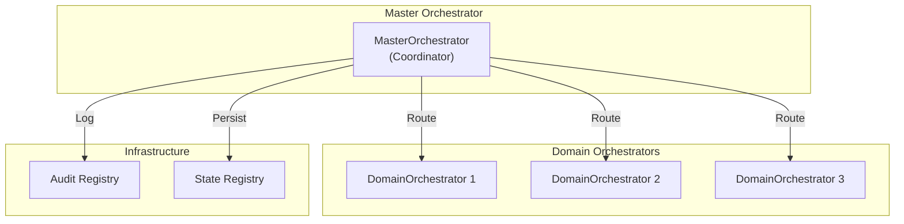

# CORTEX Documentation Generator Prompt
**Version:** 1.0 | **Updated:** 2026-01-22 | **Authority:** CORTEX Master Orchestrator

---

## Overview

This prompt is a **repeatable, autonomous documentation generation system** for the CORTEX framework. It discovers all modules, orchestrators, features, protocols, and architectural components, then generates comprehensive technical documentation from scratch.

**Key Characteristics:**
- 🔄 **Repeatable**: Run at any time to regenerate documentation
- 🗑️ **Clean-slate approach**: Deletes existing documentation before regenerating
- 🔍 **Discovery-driven**: Analyzes codebase to find all components automatically
- 📚 **Comprehensive**: Creates detailed architecture docs, guides, and API references
- 🎯 **Industry-standard**: Follows best practices for technical documentation

---

## Execution Model

### Phase 1: Discovery & Analysis
1. **Module Discovery**: Scan entire codebase for all modules, classes, and components
2. **Orchestrator Analysis**: Identify all orchestrator implementations and their relationships
3. **Feature Extraction**: Extract features, protocols, and architectural patterns
4. **Dependency Mapping**: Build dependency graphs and interaction models
5. **Test Analysis**: Map unit/integration tests to implementations

### Phase 2: Documentation Generation
1. **Architecture Documentation**: Create system-wide architecture guides
2. **Component Documentation**: Generate markdown files for each orchestrator
3. **API Documentation**: Create API reference with examples
4. **Integration Guides**: Document how components work together
5. **Best Practices Guide**: Extract and document patterns used in codebase

### Phase 3: Diagram Generation
1. **Architecture Diagrams**: Mermaid diagrams showing system structure
2. **Component Diagrams**: Individual orchestrator diagrams
3. **Interaction Diagrams**: Sequence diagrams for workflows
4. **Data Flow Diagrams**: Show data movement through system
5. **Dependency Graphs**: Visualize component dependencies

### Phase 4: Index & Navigation
1. **Main Index**: Central navigation hub
2. **Navigation Structure**: Organize docs hierarchically
3. **Search Index**: Create searchable index of all components
4. **Cross-references**: Link related components

---

## Target Output Structure

```
docs/
├── 08 orchestrators/                    # Primary orchestrator documentation
│   ├── 00-orchestrators-index.md        # Master index & navigation
│   ├── 01-architecture-overview.md      # System architecture overview
│   ├── orchestrators/                   # Individual orchestrator docs
│   │   ├── master-orchestrator.md
│   │   ├── intent-router.md
│   │   ├── workflow-orchestrator.md
│   │   ├── refactoring-orchestrator.md
│   │   ├── onboarding-orchestrator.md
│   │   ├── composition-engine.md
│   │   ├── upgrade-orchestrator.md
│   │   └── [additional orchestrators].md
│   ├── diagrams/                        # Mermaid diagram files
│   │   ├── 01-architecture-overview.mmd
│   │   ├── 02-orchestrator-hierarchy.mmd
│   │   ├── 03-master-orchestrator-flow.mmd
│   │   ├── 04-workflow-stages.mmd
│   │   ├── 05-orchestrator-interactions.mmd
│   │   ├── orchestrator/                # Per-orchestrator diagrams
│   │   │   ├── master-orchestrator.mmd
│   │   │   ├── intent-router-flow.mmd
│   │   │   ├── workflow-orchestrator-stages.mmd
│   │   │   └── [additional].mmd
│   │   └── sequences/                   # Sequence diagrams
│   │       ├── master-to-domain.mmd
│   │       ├── workflow-execution.mmd
│   │       └── [additional].mmd
│   └── patterns/                        # Design patterns & best practices
│       ├── composition-patterns.md
│       ├── routing-patterns.md
│       └── orchestration-patterns.md
```

---

## Component Categories

### 1. Core Orchestrators
- **MasterOrchestrator**: Central coordinator for all domain orchestrators
- **IntentRouter**: Routes operations based on intent type and context
- **WorkflowOrchestrator**: Manages 5-stage workflow execution
- **RefactoringOrchestrator**: Handles code refactoring operations

### 2. Specialized Orchestrators
- **OnboardingOrchestrator**: User onboarding and setup
- **UpgradeOrchestrator**: Version upgrades and deployments
- **ComposedOrchestrator**: Composition engine for workflow patterns
- **Domain Orchestrators**: Business domain-specific orchestrators

### 3. Supporting Systems
- **OrchestratorRegistry**: Registry and discovery system
- **Orchestrator Traits**: Protocol definitions and interfaces
- **Adaptive Routing**: Context-aware routing engine
- **Response Handlers**: Multi-mode response formatting

### 4. Infrastructure
- **Audit Logger**: Comprehensive audit trail system
- **State Manager**: Cross-phase state management
- **Database Transaction Manager**: Atomic operations
- **Governance Registry**: Rule enforcement

---

## Documentation Standards

### Markdown Files (Per-Component)

Each orchestrator documentation file should include:

1. **Header & Overview**
   - Component name and purpose
   - Version and status
   - High-level description (1-2 paragraphs)

2. **Architecture**
   - Design pattern used
   - Key responsibilities
   - Main components/methods
   - State management approach

3. **How It Works**
   - Step-by-step operation flow
   - Key algorithms
   - Error handling strategy
   - Performance characteristics

4. **How to Use It**
   - Basic usage example
   - Advanced usage patterns
   - Configuration options
   - Common patterns

5. **Integration Points**
   - Dependencies
   - Dependents
   - MCP tools exposed
   - Registry entries

6. **Design Principles**
   - SOLID principles applied
   - Design patterns used
   - Governance rules enforced
   - Best practices implemented

7. **API Reference**
   - Public methods/functions
   - Parameters and return types
   - Exceptions/errors
   - Examples

### Mermaid Diagrams

Diagram types for each orchestrator:

1. **Architecture Diagram**: Class/component structure
2. **Flow Diagram**: Operational flow/algorithm
3. **Interaction Diagram**: How it communicates with other components
4. **Sequence Diagram**: Message sequence for key operations
5. **State Diagram**: State transitions (if applicable)

---

## Discovery Cycle

The prompt should implement the following discovery process:

### Step 1: Find All Modules
- Scan `cortex/orchestrators/` recursively
- Find all Python files with `Orchestrator` in class name
- Identify base classes and interfaces
- Map inheritance hierarchy

### Step 2: Analyze Each Orchestrator
- Extract docstring and comments
- Parse class definition
- Identify public methods
- Find related tests
- Extract MCP tool definitions

### Step 3: Find Dependencies
- Track imports
- Identify orchestrator-to-orchestrator calls
- Find registry entries
- Build interaction graph

### Step 4: Extract Patterns
- Identify design patterns used
- Document common workflows
- Note best practices
- Flag architectural anti-patterns

### Step 5: Generate Documentation
- Create markdown files with discoveries
- Generate diagrams from analysis
- Build navigation index
- Create cross-references

---

## Execution Instructions

### Prerequisites
- Git repository must be clean (no uncommitted changes in documentation)
- All code must pass linting checks
- All tests must pass

### Command Execution

```bash
# Full documentation regeneration (clean-slate)
python -m cortex.scripts.doc_generator --full --clean

# Or from cortex-doc.prompt.md execution:
python -m cortex.orchestrators.core.master_orchestrator --orchestrate documentation_generation --mode full
```

### Cleanup Strategy

Before generating new documentation:
1. **Delete** `docs/08 orchestrators/orchestrators/*.md`
2. **Delete** `docs/08 orchestrators/diagrams/**/*.mmd`
3. **Preserve** `00-orchestrators-index.md` (regenerated with updated links)
4. **Preserve** `01-architecture-overview.md` (regenerated)

### Post-Generation Validation

After generation:
1. Verify all `.md` files are valid Markdown
2. Verify all `.mmd` files are valid Mermaid syntax
3. Check all cross-references in index
4. Validate that all orchestrators are documented
5. Ensure diagrams render correctly

---

## Output Examples

### Sample Orchestrator Documentation Structure

```markdown
# Master Orchestrator

**Status:** Production Ready | **Version:** 1.0.0 | **Category:** Core Orchestrators

## Purpose

The MasterOrchestrator serves as the central coordinator for all domain orchestrators
in CORTEX. It implements the coordinator pattern to manage complex, multi-step operations
by delegating to specialized domain orchestrators...

## Architecture

### Design Pattern: Coordinator/Facade
...

### Key Components
- Domain orchestrator registry
- Operation routing engine
- Result aggregation
...

## How It Works

1. Request arrives from client
2. Determines applicable domain orchestrators
3. Delegates to each relevant orchestrator
4. Aggregates results
5. Returns unified response
...

[Additional sections]
```

### Sample Diagram Structure



---

## Governance & Quality Gates

### TIER 0 Rules Applied

- **CORE-008**: TDD enforcement - all implementations have test coverage
- **CORE-011**: Type hints on all functions/methods
- **CORE-012**: Google-style docstrings on all public APIs
- **CORE-013**: No bare except clauses
- **CORE-029**: Response header format maintained

### Documentation Quality Checklist

- [ ] All files follow Markdown standards
- [ ] All diagrams are valid Mermaid syntax
- [ ] All code examples are syntax-correct
- [ ] All cross-references are valid
- [ ] All orchestrators are documented
- [ ] Architecture diagrams are up-to-date
- [ ] README links are verified

---

## Extensibility

### Adding New Orchestrators to Documentation

When new orchestrators are added to the codebase:

1. New documentation is **automatically discovered** on next run
2. No manual file creation needed
3. Run the documentation generator to include in docs
4. New diagrams generated automatically
5. Index updated with new entries

### Customization Hooks

The generator supports customization through:
- Custom diagram templates
- Markdown formatting preferences
- Output directory structure
- Diagram styling/theme

---

## Implementation Notes

### For Documentation Generator Developer

This prompt should be implemented as a command-line tool or orchestrator method that:

1. **Scans** the codebase for orchestrator implementations
2. **Analyzes** each orchestrator for patterns and usage
3. **Generates** markdown and Mermaid files
4. **Validates** all output
5. **Creates** index and cross-references
6. **Reports** on documentation completeness

### Key Implementation Details

- Use AST parsing to extract class definitions
- Parse docstrings using google-style format
- Generate Mermaid diagrams from class relationships
- Create Markdown with proper heading hierarchy
- Validate all generated files before completion
- Generate summary report of what was documented

---

## Maintenance & Updates

### When to Regenerate

- After significant architectural changes
- When new orchestrators are added
- After refactoring of existing orchestrators
- When governance rules change
- Quarterly review of documentation

### Version Control

- Commit generated documentation to repository
- Tag documentation versions with code versions
- Maintain history of documentation changes
- Document breaking changes in changelogs

---

## Copyright & Attribution

**Copyright © 2025-2026 Asif Hussain. All rights reserved.**

Documentation generated by CORTEX Master Orchestrator Documentation Generator.

---

**Last Updated:** 2026-01-22 | **Next Review:** 2026-04-22
