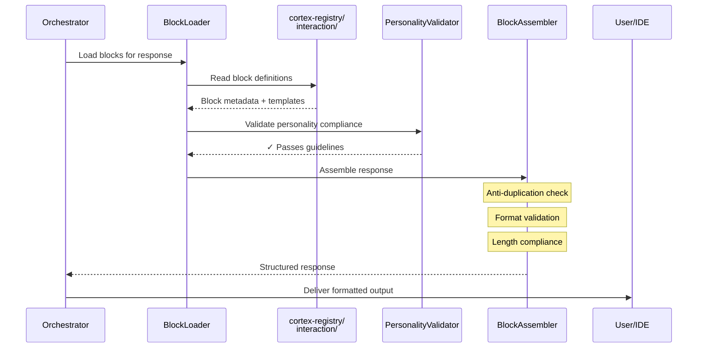

# Semantic Content Blocks - Structured Response Assembly

---
title: Semantic Content Blocks - Personality-Enforced Response Architecture
type: explanation
audience: [Software Developers, Product Owners]
word_count: 1700
last_verified: 2026-02-16
source_of_truth: cortex/registry/semantic_blocks.py + cortex-registry/interaction/
format: diátaxis-explanation
feature: Production (ENH-089, ENH-090)
authority: cortex-registry/interaction/content-blocks.yaml
order: 10
---

## Executive Summary

**Semantic Content Blocks** provide a structured, personality-enforced framework for assembling CORTEX responses. Instead of free-form text generation, responses are composed from predefined semantic blocks with strict formatting guidelines, voice constraints, and anti-duplication rules. This ensures consistency, professionalism, and compliance with brand voice across all user interactions.

Introduced in ENH-089 (Content Blocks) and ENH-090 (Interaction Blocks), this system transforms CORTEX from ad-hoc response generation to **registry-driven composition** where every response element is validated against personality guidelines.

**Key Benefits:**

- **Voice Consistency:** Third-person neutral technical voice enforced across all blocks
- **Format Compliance:** Markdown, YAML, code blocks follow strict standards
- **Anti-Duplication:** Assembly engine prevents verbose repetition
- **Personality Guardrails:** Automatic detection of casual language, emojis, over-enthusiasm
- **Composability:** Mix and match blocks to create rich, structured responses

---

## Architecture Overview

### Block Assembly Pipeline



### Core Components

| Component | Responsibility | Source of Truth | Validation |
|-----------|----------------|-----------------|------------|
| **BlockLoader** | Load block definitions from registry | `content-blocks.yaml` | Schema validation |
| **PersonalityValidator** | Enforce voice guidelines | `personality-guidelines.yaml` | Pattern matching |
| **AssemblyEngine** | Compose blocks into responses | `semantic_blocks.py` | Anti-duplication rules |
| **FormatEnforcer** | Validate markdown/YAML/code formatting | Built-in rules | Linting |

---

## Block Structure

### Block Definition Schema

```yaml
block_id: "explanation_technical"
name: "Technical Explanation Block"
length_words: 800
purpose: "Explain technical concepts with depth and clarity"
content_template: |
  ## {title}
  
  {overview_paragraph}
  
  ### Key Components
  
  {component_list}
  
  ### Technical Details
  
  {detailed_explanation}

format_spec:
  markdown_level: 2  # Start at H2
  code_blocks: true
  tables: true
  lists: true
  diagrams: mermaid

personality_guidelines:
  voice: "third_person_neutral"
  tone: "professional"
  prohibited:
    - emojis
    - exclamation_overuse  # Max 1 per 500 words
    - casual_language
    - first_person
  required:
    - technical_accuracy
    - evidence_based_claims
    - code_examples

usage_rules:
  - "Use for architecture explanations"
  - "Avoid for quick how-tos"
  - "Must include code examples"
  - "Minimum 600 words"

vscode_rendering:
  collapsible: false
  syntax_highlight: true
  table_of_contents: true
```

### Block Categories

CORTEX defines 8 standard block categories:

| Category | Purpose | Word Count | Voice | Example Use |
|----------|---------|------------|-------|-------------|
| **Explanation** | Technical concepts | 800-1500 | Neutral | Architecture docs |
| **Tutorial** | Step-by-step guides | 1000-1800 | Instructional | Onboarding |
| **Reference** | API/tool specs | 400-800 | Precise | Tool catalog |
| **How-To** | Task-oriented | 600-1000 | Directive | Quick fixes |
| **Status** | Operation results | 200-400 | Factual | Health reports |
| **Error** | Failure messages | 100-300 | Clear | Validation errors |
| **Confirmation** | Approval prompts | 50-150 | Concise | Dangerous operations |
| **Summary** | Digest/recap | 300-600 | Condensed | Feature completion |

---

## Personality Guidelines

### Voice Standards

**Third-Person Neutral Technical Voice:**

```yaml
personality_guidelines:
  voice_standards:
    perspective: "third_person"
    tone: "neutral_professional"
    formality: "technical"
    
  prohibited_patterns:
    casual_language:
      - "Hey", "folks", "guys", "y'all"
      - "gonna", "wanna", "kinda"
      - "Awesome!", "Cool!", "Nice!"
    
    emojis:
      - All Unicode emojis
      - ASCII emoticons (:-), :D, etc.)
    
    over_enthusiasm:
      - Multiple exclamation marks (!!!)
      - Excessive capitalization (AMAZING)
      - Superlatives without evidence ("best", "perfect")
    
    first_person:
      - "I think", "In my opinion"
      - "Let's", "We should"
      - "You will love this"
  
  required_patterns:
    technical_precision:
      - Specific metrics (P50, P95, P99)
      - Version numbers
      - Evidence-backed claims
      - Code examples
    
    professional_language:
      - "Organizations may observe..."
      - "The system provides..."
      - "Based on internal testing..."
      - "Production results depend on..."
```

### Validation Engine

```python
class PersonalityValidator:
    """Enforce personality guidelines on content."""
    
    def validate_block(self, content: str, guidelines: Dict) -> Tuple[bool, List[str]]:
        """
        Validate content against personality guidelines.
        
        Returns:
            (is_valid, violations)
        """
        violations = []
        
        # Check for emojis
        if self._contains_emojis(content):
            violations.append("Contains emojis (prohibited)")
        
        # Check for casual language
        casual_words = ["hey", "folks", "gonna", "wanna"]
        found_casual = [w for w in casual_words if w in content.lower()]
        if found_casual:
            violations.append(f"Casual language: {', '.join(found_casual)}")
        
        # Check for excessive exclamation marks
        exclaim_count = content.count('!')
        word_count = len(content.split())
        if exclaim_count > word_count / 500:
            violations.append(f"Excessive exclamation marks: {exclaim_count}")
        
        # Check for first-person
        first_person_patterns = ["I think", "In my opinion", "Let's", "We should"]
        found_fp = [p for p in first_person_patterns if p in content]
        if found_fp:
            violations.append(f"First-person language: {', '.join(found_fp)}")
        
        # Check for evidence-backed claims
        if guidelines.get("require_evidence"):
            superlatives = ["best", "perfect", "optimal", "ideal"]
            for sup in superlatives:
                if sup in content.lower() and "based on" not in content.lower():
                    violations.append(f"Superlative '{sup}' without evidence")
        
        is_valid = len(violations) == 0
        return is_valid, violations
```

---

## Assembly Engine

### Anti-Duplication Rules

**Problem:** Traditional LLM responses often repeat information:

❌ **Before (Repetitive):**
```
The system processes requests efficiently. When a request comes in,
the system processes it through multiple stages. The processing system
ensures that each request is handled properly by the processing pipeline.
```

✅ **After (De-duplicated):**
```
The system processes requests through multiple stages. Each request flows
through validation, orchestration, and execution phases with appropriate
error handling at each stage.
```

### Composition Rules

```python
@dataclass
class AssemblyResult:
    """Result of block assembly operation."""
    
    blocks_assembled: List[str]      # Block IDs used
    total_words: int                 # Final word count
    personality_compliant: bool      # Passed validation
    violations: List[str]            # Any detected issues
    output: str                      # Final composed text
```

### Assembly Algorithm

```python
class BlockAssembler:
    """Compose blocks into cohesive responses."""
    
    def assemble(self, block_ids: List[str], context: Dict) -> AssemblyResult:
        """
        Assemble multiple blocks with anti-duplication.
        
        Args:
            block_ids: Ordered list of blocks to compose
            context: Template variables for interpolation
        
        Returns:
            AssemblyResult with composed output
        """
        violations = []
        output_parts = []
        seen_content = set()  # Track content for de-duplication
        
        for block_id in block_ids:
            # Load block definition
            block = self.loader.load_block(block_id)
            
            # Render template with context
            rendered = self._render_template(block.content_template, context)
            
            # Check for duplication
            content_hash = self._semantic_hash(rendered)
            if content_hash in seen_content:
                violations.append(f"Block {block_id} duplicates previous content")
                continue  # Skip duplicate block
            seen_content.add(content_hash)
            
            # Validate personality compliance
            valid, block_violations = self.validator.validate_block(
                rendered, block.personality_guidelines
            )
            if not valid:
                violations.extend(block_violations)
            
            output_parts.append(rendered)
        
        # Combine with separators
        output = "\n\n---\n\n".join(output_parts)
        
        return AssemblyResult(
            blocks_assembled=block_ids,
            total_words=len(output.split()),
            personality_compliant=len(violations) == 0,
            violations=violations,
            output=output
        )
```

---

## Interaction Blocks (ENH-090)

### Specialized Interaction Patterns

**ENH-090** extends content blocks with interaction-specific patterns:

```yaml
interaction_blocks:
  confirmation_prompt:
    block_id: "confirm_dangerous_operation"
    purpose: "Prompt user before destructive actions"
    template: |
      ⚠️ **Confirmation Required**
      
      Operation: {operation_name}
      Impact: {impact_description}
      Affected: {affected_items_count} items
      
      **This action cannot be undone.**
      
      Type 'CONFIRM' to proceed:
    
    personality:
      tone: "serious_cautious"
      prohibited: ["emojis_except_warning"]
      required: ["impact_statement", "irreversibility_notice"]
  
  error_explanation:
    block_id: "explain_validation_error"
    purpose: "Explain validation failures clearly"
    template: |
      ❌ **Validation Failed: {error_type}**
      
      **Issue:** {issue_description}
      
      **Location:** {file_path}:{line_number}
      
      **Fix:** {recommended_fix}
      
      **Related Rule:** {core_rule_id}
    
    personality:
      tone: "helpful_corrective"
      prohibited: ["blame_language", "frustration"]
      required: ["clear_fix_steps", "rule_reference"]
  
  progress_update:
    block_id: "show_operation_progress"
    purpose: "Display long-running operation status"
    template: |
      🔄 **{operation_name}** in progress...
      
      Stage: {current_stage} / {total_stages}
      Completed: {items_completed} / {items_total}
      Elapsed: {elapsed_time}
      Estimated: {estimated_remaining}
      
      Current: {current_action}
    
    personality:
      tone: "informative_patient"
      required: ["progress_metrics", "time_estimates"]
```

### Interactive Response Example

```python
# Assembling interactive confirmation
assembler = BlockAssembler()

result = assembler.assemble(
    block_ids=[
        "confirm_dangerous_operation",
        "show_affected_items",
        "explain_consequences"
    ],
    context={
        "operation_name": "Delete 47 duplicate files",
        "impact_description": "Files will be permanently removed",
        "affected_items_count": 47,
        "affected_items": ["file1.py", "file2.py", "..."],
        "consequences": "This will free 23MB of disk space"
    }
)

# Output:
# ⚠️ **Confirmation Required**
# 
# Operation: Delete 47 duplicate files
# Impact: Files will be permanently removed
# Affected: 47 items
# 
# **This action cannot be undone.**
# 
# ---
# 
# ## Affected Items
# - file1.py
# - file2.py
# - ... (45 more)
# 
# ---
# 
# ## Consequences
# This will free 23MB of disk space
```

---

## VS Code Integration

### Rendering Enhancements

Blocks can specify VS Code-specific rendering hints:

```yaml
vscode_rendering:
  collapsible: true               # Render as collapsible section
  syntax_highlight: "python"      # Code block language
  table_of_contents: true         # Generate TOC for long blocks
  inline_actions:                 # Add action buttons
    - label: "View Full Report"
      command: "cortex.showHealthReport"
    - label: "Fix Issues"
      command: "cortex.autoFix"
  severity: "warning"             # For diagnostic blocks
```

### Markdown Enhancement

```python
def render_for_vscode(block: Block, context: Dict) -> str:
    """Render block with VS Code enhancements."""
    
    base_content = render_template(block.content_template, context)
    
    # Add collapsible wrapper if requested
    if block.vscode_rendering.get("collapsible"):
        base_content = f"""
<details>
<summary>{context.get('summary', 'Show Details')}</summary>

{base_content}

</details>
"""
    
    # Add inline actions
    if block.vscode_rendering.get("inline_actions"):
        actions_html = "\n\n".join([
            f"[{action['label']}](command:{action['command']})"
            for action in block.vscode_rendering["inline_actions"]
        ])
        base_content += f"\n\n{actions_html}"
    
    return base_content
```

---

## Registry-Driven Architecture

### Block Registry Structure

```
cortex-registry/interaction/
├── content-blocks.yaml          # 8 base content blocks
├── interaction-blocks.yaml      # ENH-090 interaction patterns
├── personality-guidelines.yaml  # Voice enforcement rules
├── format-standards.yaml        # Markdown/YAML/code standards
└── vscode-rendering.yaml        # IDE-specific rendering hints
```

### Hot-Reload Support

Block definitions are loaded from registry at runtime:

```python
class BlockLoader:
    """Load blocks from git-backed registry."""
    
    def __init__(self, registry_path: Path = Path("cortex-registry")):
        self.registry_path = registry_path
        self._cache = {}
        self._watch_for_changes()
    
    def load_block(self, block_id: str) -> Block:
        """Load block with hot-reload support."""
        
        # Check cache
        if block_id in self._cache:
            cached_block, cached_mtime = self._cache[block_id]
            
            # Check if file changed
            current_mtime = self._get_file_mtime(block_id)
            if current_mtime == cached_mtime:
                return cached_block  # Cache hit
        
        # Load from registry
        block_path = self.registry_path / "interaction" / "content-blocks.yaml"
        with open(block_path) as f:
            registry = yaml.safe_load(f)
        
        block_data = registry["blocks"][block_id]
        block = Block(**block_data)
        
        # Update cache
        self._cache[block_id] = (block, self._get_file_mtime(block_id))
        
        return block
```

---

## Benefits

### For Business Leaders
- **Brand Consistency:** Enforced voice across all AI interactions
- **Professional Image:** No casual language or unprofessional output
- **Quality Assurance:** Structured responses reduce support tickets

### For Product Owners
- **Predictable Output:** Responses follow known templates
- **Easy Customization:** Modify blocks in registry without code changes
- **A/B Testing:** Swap block definitions to test messaging

### For Software Developers
- **Type Safety:** Structured blocks with validation
- **Reusability:** Compose responses from pre-built blocks
- **Maintainability:** Central registry for all content

---

## Related Documentation

- [Response Formatting Standards](./response-formatting.md)
- [Personality Guidelines](./personality.md)
- [MCP Gateway Integration](../04-mcp/integration.md)
- [Registry Architecture](.../00-getting-started/04-brain-tier-architecture.md)

---

**Status:** Production (ENH-089, ENH-090)  
**Last Updated:** 2026-02-16  
**Authority:** cortex-registry/interaction/content-blocks.yaml
