# CORTEX Container Architecture (C4 Level 2)

---
id: cortex-c4-container
title: CORTEX Container Architecture Diagram
purpose: Show major runtime components and technologies within CORTEX
audience: [Business Leaders, Product Owners, Software Developers]
source_of_truth: cortex/__wiring_contract__.yaml
last_verified: 2026-02-15
diagram_type: C4-Container
interactive: false
word_count: 1200
order: 3
---

## Container Architecture Overview

CORTEX implements a modular container architecture where each major runtime component operates with clear boundaries and responsibilities. This design supports independent scaling, testing, and evolution of system capabilities.

```mermaid
graph TB
    subgraph Client["Client Layer"]
        VSCODE[VS Code Extension<br/>TypeScript/JavaScript]
        CURSOR[Cursor IDE<br/>Native Integration]
        CLAUDE[Claude Desktop<br/>MCP Client]
    end
    
    subgraph Gateway["MCP Gateway Layer (Python)"]
        MCP[MCP Server<br/>JSON-RPC 2.0<br/>stdio Transport]
        TOOLS[Core Tools<br/>10 Primary Operations]
        GATE[Native Tool Gate<br/>Bypass Prevention]
    end
    
    subgraph Orchestration["Orchestration Layer (Python)"]
        MASTER[MasterOrchestrator<br/>Entry Point]
        ROUTER[IntentRouter<br/>IMPLEMENT/FIX/REFACTOR/<br/>ANALYZE/PLAN/AUDIT]
        TDD[TDDOrchestrator<br/>RED→GREEN→REFACTOR]
        LENS_ORCH[LENSSynthesis<br/>Code Intelligence]
        PLAN[PlanOrchestrator<br/>Phase Management]
        REFACTOR[RefactoringOrchestrator<br/>Code Improvements]
    end
    
    subgraph Intelligence["Intelligence Layer (Python)"]
        LENS[LENS Analyzers<br/>8 Core Analyzers]
        AST[AST Analysis<br/>Syntax Trees]
        GIT[Git History<br/>24h Context]
        DOMAIN[Domain Intelligence<br/>.NET/Angular/React]
    end
    
    subgraph Governance["Governance Layer (Python)"]
        ENF[EnforcementOrchestrator<br/>Pre-Execution Gate]
        AGENTS[7 Enforcement Agents<br/>GovernanceEnforcement<br/>SecurityCheckpoint<br/>ComplianceValidation<br/>FileNamingEnforcement<br/>IncrementalExecution<br/>MarkdownSuppression<br/>ArchitectureIntegrity]
        RULES[CORE Rules Engine<br/>59 Rules]
    end
    
    subgraph Brain["CORTEX Brain (Git + YAML)"]
        REGISTRY[Git-Backed Registry<br/>cortex-registry/]
        WIRING[Wiring Contract<br/>__wiring_contract__.yaml]
        KNOWLEDGE[Knowledge Base<br/>45+ Best Practice YAMLs]
        PHASES[Phase Definitions<br/>Active/Completed]
    end
    
    subgraph Storage["Storage Layer"]
        SQLITE[SQLite Cache<br/>AST/Metrics]
        GITREPO[Git Repository<br/>Version Control]
        FILES[File System<br/>Workspace Files]
    end
    
    %% Client → Gateway
    VSCODE -->|stdio + JSON-RPC| MCP
    CURSOR -->|stdio + JSON-RPC| MCP
    CLAUDE -->|stdio + JSON-RPC| MCP
    
    %% Gateway → Orchestration
    MCP --> TOOLS
    TOOLS --> GATE
    GATE -->|Validated Requests| MASTER
    
    %% Orchestration Flow
    MASTER --> ROUTER
    ROUTER -->|IMPLEMENT/FIX| TDD
    ROUTER -->|ANALYZE| LENS_ORCH
    ROUTER -->|PLAN| PLAN
    ROUTER -->|REFACTOR| REFACTOR
    
    %% Orchestrators → Intelligence
    TDD --> LENS
    LENS_ORCH --> LENS
    REFACTOR --> LENS
    LENS --> AST
    LENS --> GIT
    LENS --> DOMAIN
    
    %% Governance Integration
    MASTER -->|Pre-Flight| ENF
    ENF --> AGENTS
    AGENTS --> RULES
    
    %% Brain Integration
    MASTER --> REGISTRY
    TDD --> REGISTRY
    LENS --> KNOWLEDGE
    PLAN --> PHASES
    ROUTER --> WIRING
    
    %% Storage
    LENS --> SQLITE
    REGISTRY --> GITREPO
    TDD --> FILES
    
    style Client fill:#0f3460,stroke:#16213e
    style Gateway fill:#e94560,stroke:#ff6b6b,stroke-width:2px
    style Orchestration fill:#1a5f7a,stroke:#06b6d4
    style Intelligence fill:#533483,stroke:#8b5cf6
    style Governance fill:#2d4356,stroke:#64748b
    style Brain fill:#1e3a5f,stroke:#3b82f6
    style Storage fill:#1a1a2e,stroke:#374151
```



## Container Details

### MCP Gateway Layer (JSON-RPC over stdio)

**Technology:** Python 3.9+ with MCP SDK  
**Transport:** Standard input/output (stdio) with JSON-RPC 2.0 protocol  
**Responsibilities:**
- Accept MCP tool invocation requests from IDE clients
- Validate request schemas against MCP specifications
- Route to appropriate orchestrators via Native Tool Gate
- Return responses in MCP-compliant format

**Key Components:**
- **MCP Server:** Auto-started by VS Code when Copilot Chat invokes cortex_* tools
- **Core Tools:** 10 primary MCP tools (cortex_process_request, cortex_lens_analyze, etc.)
- **Native Tool Gate:** Prevents direct file operations for IMPLEMENT/FIX/REFACTOR intents

**Performance:** Request validation completes in ~5-15ms under typical load.

### Orchestration Layer (Event-Driven Architecture)

**Technology:** Python with async/await patterns  
**Architecture:** Hierarchical orchestrator dispatch with intent-based routing  
**Responsibilities:**
- Route user requests to specialized orchestrators based on intent classification
- Coordinate multi-stage workflows (TDD cycles, analysis pipelines, phase execution)
- Manage orchestrator lifecycle and state transitions
- Enforce workflow governance through pre-execution gates

**Key Orchestrators:**

| Orchestrator | Intent | Responsibility | Typical Latency |
|--------------|--------|----------------|-----------------|
| **MasterOrchestrator** | All | Entry point, pre-flight checks, context synthesis | 50-100ms |
| **IntentRouter** | All | LANGUAGE→EXAMINATION→NAVIGATION→SYNTHESIS (LENS) classification | 20-40ms |
| **TDDOrchestrator** | IMPLEMENT, FIX | RED→GREEN→REFACTOR cycle enforcement | 500-2000ms |
| **LENSSynthesis** | ANALYZE | Code intelligence synthesis across 8 analyzers | 300-800ms |
| **PlanOrchestrator** | PLAN | Phase lifecycle management, dashboard generation | 150-400ms |
| **RefactoringOrchestrator** | REFACTOR | Code improvement workflows with quality gates | 600-1500ms |

**Wiring:** Orchestrators discovered via `__wiring_contract__.yaml` Git-backed registry, supporting hot-reload without server restart.

### Intelligence Layer (Multi-Analyzer Pipeline)

**Technology:** Python with AST parsing, git-python, tree-sitter  
**Architecture:** Parallel analyzer execution with result aggregation  
**Responsibilities:**
- Perform deep code analysis (syntax, semantics, patterns, security)
- Extract git history context (24-hour window for recent changes)
- Domain-specific intelligence (.NET/Roslyn, Angular, React analyzers)
- Build knowledge graphs of code relationships

**LENS Analyzers (8 Core):**

```mermaid
graph LR
    INPUT[Source Files] --> PARALLEL{Parallel Execution}
    
    PARALLEL --> AST_ANALYZE[AST Analyzer<br/>Syntax Trees]
    PARALLEL --> COMMENT[Comment Analyzer<br/>TODOs/FIXMEs]
    PARALLEL --> IMPORT[Import Analyzer<br/>Dependencies]
    PARALLEL --> SECURITY[Security Analyzer<br/>OWASP Patterns]
    PARALLEL --> PATTERN[Pattern Analyzer<br/>Design Patterns]
    PARALLEL --> METRICS[Metrics Analyzer<br/>Complexity/Coverage]
    PARALLEL --> GIT_ANALYZE[Git Analyzer<br/>Recent Changes]
    PARALLEL --> DOMAIN_ANALYZE[Domain Analyzer<br/>Framework-Specific]
    
    AST_ANALYZE --> AGGREGATE[Result Aggregation]
    COMMENT --> AGGREGATE
    IMPORT --> AGGREGATE
    SECURITY --> AGGREGATE
    PATTERN --> AGGREGATE
    METRICS --> AGGREGATE
    GIT_ANALYZE --> AGGREGATE
    DOMAIN_ANALYZE --> AGGREGATE
    
    AGGREGATE --> OUTPUT[Unified Intelligence]
    
    style PARALLEL fill:#533483,stroke:#8b5cf6
    style AGGREGATE fill:#1a5f7a,stroke:#06b6d4
```



**Performance:** Parallel execution completes in 300-800ms for typical repositories (50-100K LOC). SQLite caching reduces subsequent analysis to 50-150ms.

### Governance Layer (7-Agent Pre-Execution Gate)

**Technology:** Python rule engine with YAML-defined governance policies  
**Architecture:** Agent-based enforcement with blocking/warning/pass verdicts  
**Responsibilities:**
- Pre-execution validation before any code modification
- CORE rule enforcement (59 rules across 7 agents)
- Audit trail generation (AC_START → AC_COMPLETE markers)
- Prevent governance violations from reaching production

**Enforcement Agents:**

| Agent | CORE Rules | Examples | Verdict Types |
|-------|-----------|----------|---------------|
| **GovernanceEnforcementAgent** | 008, 011, 012, 013, 029, 030 | TDD-first, type hints, docstrings | BLOCKED, PASS |
| **SecurityCheckpointAgent** | 025, 026, 027 | Git discipline, audit trail | BLOCKED, PASS |
| **ComplianceValidationAgent** | Tier 1 rules | Domain-specific compliance | WARNING, PASS |
| **FileNamingEnforcementAgent** | 028 | kebab-case, no SCREAMING_CASE | BLOCKED, PASS |
| **IncrementalExecutionAgent** | 001, 004 | <500 LOC increments | BLOCKED, PASS |
| **MarkdownSuppressionAgent** | 002 | Block summary.md generation | BLOCKED, PASS |
| **ArchitectureIntegrityAgent** | 017-020, 032, 034, 035, 038-041 | Versioning, performance | WARNING, PASS |

**Coverage:** 26/59 CORE rules automated (87%) with <150ms validation latency.

### CORTEX Brain (Git-Backed Registry)

**Technology:** Git + YAML (no database runtime dependency)  
**Architecture:** Version-controlled governance data with file-based queries  
**Responsibilities:**
- Store orchestrator specifications and wiring contracts
- Maintain knowledge base of 45+ best practice YAMLs
- Track phase definitions (active, completed, future roadmap)
- Provide single source of truth for all governance rules

**Registry Structure:**

```
cortex-registry/
├──            # Master phase index, dashboard data
├── domains/                  # Domain-specific configuration
├── governance/               # CORE rules, audit checklists
├── interaction/              # Response templates, content blocks
├── master/                   # Orchestrator master registry
├── planning/                 # Phase definitions
└── manifest.yaml             # Registry metadata
```

**Why Git-Backed:**
- Version control for all governance changes (audit trail built-in)
- No runtime database maintenance or migration complexity
- Distributed collaboration through git workflows
- Instant rollback to previous governance states
- Native integration with CI/CD pipelines

### Storage Layer

**Technology:** SQLite 3 + file system  
**Responsibilities:**
- Cache AST analysis results to reduce repeated parsing
- Store computed metrics (complexity, coverage, security scores)
- Maintain workspace file references and modification timestamps

**Persistence Strategy:**
- **Hot data (AST/metrics):** SQLite in-memory with disk persistence
- **Governance data:** Git-backed YAML (cortex-registry/)
- **Workspace code:** File system (no CORTEX-managed storage)

## Inter-Container Communication

**Synchronous Calls:**
- MCP Gateway → MasterOrchestrator (request/response)
- Orchestrators → LENS Analyzers (intelligence queries)
- Orchestrators → Governance Engine (pre-flight checks)

**Asynchronous Operations:**
- Git commits (audit trail, registry updates) — fire-and-forget
- SQLite cache updates — background writes
- Context Crystallization Layer prefetch (Phase 49) — parallel warm-up

**Message Format:**
All internal communication uses Python dataclasses with type hints (no JSON serialization overhead).

## Deployment Topology

**Development Mode (current):**
```
VS Code → MCP Server (localhost stdio) → CORTEX Python Runtime
```

**Production Mode (future — Phase 11):**
```
Clients → nginx → MCP Gateway (HTTP/JSON-RPC) → CORTEX SaaS
                ↓
          Load Balancer → Multiple CORTEX Instances
```

## Scalability Characteristics

| Component | Current Limit | Bottleneck | Mitigation Strategy |
|-----------|---------------|------------|---------------------|
| **MCP Gateway** | Single process | stdio I/O bandwidth | HTTP transport for production |
| **Orchestrators** | Synchronous dispatch | Sequential execution | Async orchestrator pools |
| **LENS Analyzers** | Parallel (8 workers) | CPU-bound parsing | Horizontal scaling + distributed cache |
| **Git Registry** | Local file system | Network I/O for large repos | Read replicas |

> **Notice:** Scalability characteristics represent design analysis. Actual limits depend on hardware specifications, repository size, and concurrent user patterns. Organizations with high concurrency requirements should conduct load testing.

**Related Diagrams:**
- [C4 Level 1: System Context](./c4-context.md)
- [C4 Level 3: Orchestrator Internals](./orchestrator-internals.md)
- [MCP Request Lifecycle](./06-request-lifecycle.md)
