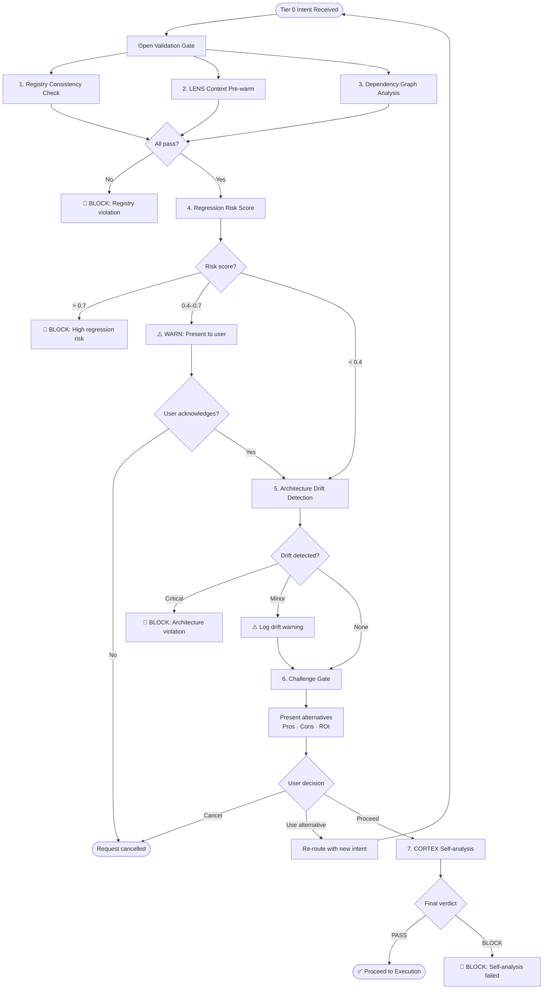

# Governance Gate Flow Diagram

---
title: Governance Gate Flow — Pre-Execution Validation Sequence
type: reference
audience: [Software Developers, Product Owners, Business Leaders]
last_verified: 2026-02-18
source_of_truth: cortex/governance/ + cortex/enforcement/ + cortex-registry/governance/
format: diátaxis-reference
voice: third-person-neutral
diagram_type: Mermaid flowchart + ASCII sequence
authority: CORE-048 (Holistic Validation Gate)
order: 7
---

> **Purpose:** Show the exact sequence of checks that run before any IMPLEMENT, FIX, or REFACTOR operation proceeds. Every Tier 0 intent triggers this gate — no exceptions.

---

## Gate Overview

```
┌─────────────────────────────────────────────────────────────────────┐
│              HOLISTIC VALIDATION GATE  (CORE-048)                   │
│                                                                      │
│  Trigger: IMPLEMENT · FIX · REFACTOR · AUDIT · ONBOARD             │
│  Authority: MasterOrchestrator + UnifiedQualityAssuranceOrchestrator│
│  Typical Duration: 150ms (parallel execution)                        │
└─────────────────────────────────────────────────────────────────────┘
```

---

## Flowchart



---

## ASCII Sequence View

For environments where Mermaid is not rendered:

```
User Request (Tier 0)
        │
        ▼
┌─────────────────────────────────────────────────────────┐
│  PARALLEL CHECKS (run concurrently — ~50ms)              │
│                                                          │
│  ① Registry consistency   → PASS / FAIL                 │
│  ② LENS pre-warm          → Ready / Timeout             │
│  ③ Dependency graph       → Risk float 0.0–1.0          │
└─────────────────────────┬───────────────────────────────┘
                          │ All PASS
                          ▼
              ④ Regression Risk Scorer
                          │
           ┌──────────────┼──────────────┐
           │              │              │
         <0.4           0.4–0.7        >0.7
           │              │              │
         PASS           WARN          BLOCK ──► 🚫 Stop
           │              │
           │         Present to user
           │         (acknowledge or cancel)
           │              │
           └──────────────┘
                          │ Continue
                          ▼
              ⑤ Architecture Drift Detection
                          │
                  None / Minor / Critical
                          │
             Minor: log + continue
             Critical: BLOCK ──────────────► 🚫 Stop
                          │
                          ▼
              ⑥ Challenge Gate (CORE-048)
                    Present alternatives
                          │
              User: proceed / use alt / cancel
                          │
                          ▼
              ⑦ CORTEX Self-Analysis
               (CORTEX repo only — Brain tier)
                          │
                          ▼
                    ✅ GATE PASSED
                    → Execution proceeds
```

---

## Risk Score Thresholds

| Score | Verdict | Action |
|-------|---------|--------|
| 0.0 – 0.39 | ✅ PASS | Proceed silently |
| 0.40 – 0.69 | ⚠️ WARN | Show risk to user, require acknowledgement |
| 0.70 – 1.0 | 🚫 BLOCK | Halt, explain reason, suggest safer approach |

Risk contributors:
- Number of files touched (×0.05 per file above 3)
- Test coverage of touched files (<80% adds +0.2)
- Recent changes to same files (hot-path adds +0.1)
- Cross-module dependencies (+0.05 per boundary crossed)
- No existing tests in touched module (+0.3)

---

## Challenge Gate Format

Every Tier 0 operation presents at least one alternative approach (CORE-048):

```
### ⚠️ MANDATORY CHALLENGE

**Your Request:** Implement email validation inline in the route handler
**Risk Score:** 0.22 (PASS) | **Impact Radius:** 1 file

**Your Approach:** Inline validation in route handler
  - Pro: Simple, no new files
  - Con: Duplicated logic risk; not reusable
  - ROI: Low — tight coupling

**Alternative A (Recommended):** Extract to utils/validation.py
  - Pro: Reusable, testable in isolation
  - Con: Requires new file + import
  - ROI: High — follows existing pattern (LENS detected 3 similar utils)

**Decision:** Type "proceed" (your approach) or "use A" (recommended)
```

---

## 8-Agent Enforcement (Post-Execution)

After the gate passes and execution completes, EnforcementOrchestrator runs 8 agents:

```
┌─────────────────────────────────────────────────────────┐
│  POST-EXECUTION ENFORCEMENT (8 agents, ~50ms)            │
│                                                          │
│  ① GovernanceEnforcementAgent   TDD / type hints        │
│  ② SecurityCheckpointAgent      Secrets / safe patterns │
│  ③ ComplianceValidationAgent    Domain compliance       │
│  ④ FileNamingEnforcementAgent   Naming conventions      │
│  ⑤ IncrementalExecutionAgent    Chunk size limits       │
│  ⑥ MarkdownSuppressionAgent     No .md files created    │
│  ⑦ ArchitectureIntegrityAgent   Pattern consistency     │
│  ⑧ EnvironmentIntegrityAgent    MCP availability        │
└─────────────────────────────────────────────────────────┘
         All PASS → commit with AC marker
         Any FAIL → auto-fix or reject with explanation
```

---

## Related Documents

- **[Governance & Compliance](../01-capabilities/07-governance-compliance.md)** — CORE rules detail
- **[Master Orchestrator](../03-orchestration/02-master-orchestrator.md)** — Gate invocation
- **[TDD Cycle Diagram](./07-tdd-cycle.md)** — What happens after the gate passes

---

*Last verified: 2026-02-18 | Authority: CORE-048 | Source: cortex/governance/ + cortex/enforcement/*
