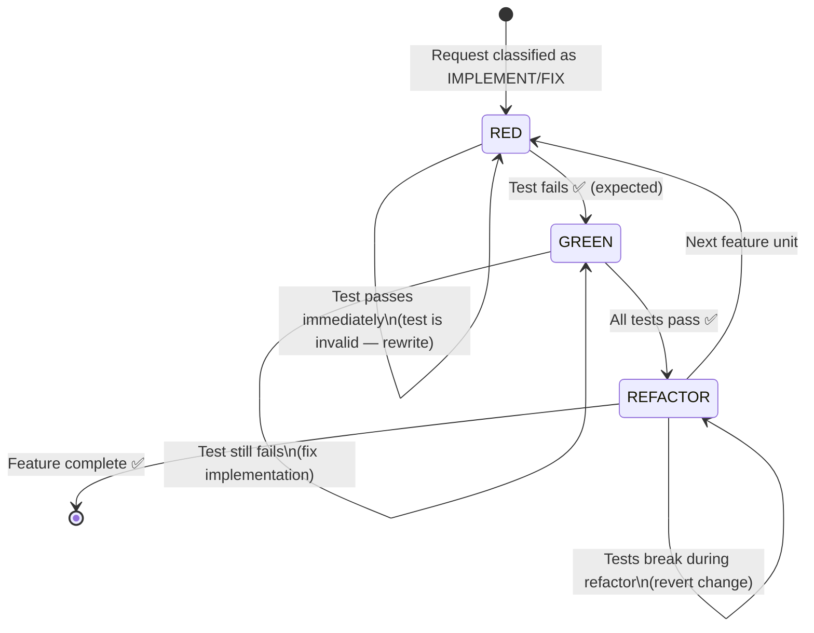

# TDD Cycle Diagram

---
title: TDD Cycle — RED → GREEN → REFACTOR Visual Reference
type: reference
audience: [Software Developers, Product Owners]
last_verified: 2026-02-18
source_of_truth: cortex/orchestrators/core/tdd_orchestrator.py + cortex-registry/core/CORE-008.yaml
format: diátaxis-reference
voice: third-person-neutral
diagram_type: Mermaid flowchart + ASCII + sequence
authority: CORE-008 (TDD Mandatory)
order: 8
---

> **Purpose:** Visual reference for the RED → GREEN → REFACTOR cycle that CORTEX enforces for every IMPLEMENT and FIX operation. Use this when explaining TDD to a new team member or validating that a request followed the correct flow.

---

## The Three-Feature Cycle



---

## Detailed ASCII Flow

```
┌─────────────────────────────────────────────────────────────────────┐
│                     TDD ORCHESTRATOR FLOW                            │
│                        (CORE-008 Mandatory)                          │
└─────────────────────────────────────────────────────────────────────┘

  LENS Analysis
  ┌─────────────────────────────────────────────┐
  │ - Scan existing tests for patterns           │
  │ - Detect domain (Python, C#, TS, …)          │
  │ - Load framework (pytest, xUnit, Jest, …)    │
  │ - Check: does this function already exist?   │
  └──────────────────────┬──────────────────────┘
                         │
                         ▼
  ┌──────────────────────────────────────────────────────────────────┐
  │  🔴  RED PHASE                                                   │
  │                                                                  │
  │  1. Write test that precisely defines expected behaviour         │
  │  2. Run test → MUST fail                                         │
  │     • If test passes: test does not cover new behaviour          │
  │       → rewrite test with tighter assertion                      │
  │  3. Record: test file path, test names, failure message          │
  │                                                                  │
  │  Output: N failing tests, audit entry created                    │
  └──────────────────────┬───────────────────────────────────────────┘
                         │ Tests failing ✅
                         ▼
  ┌──────────────────────────────────────────────────────────────────┐
  │  🟢  GREEN PHASE                                                 │
  │                                                                  │
  │  1. Write MINIMUM code to make failing tests pass                │
  │     • No optimisation                                            │
  │     • No extra features beyond what tests require               │
  │     • Type hints mandatory (enforcement agent checks)            │
  │     • Docstring mandatory (Google style)                         │
  │  2. Run tests → ALL must pass                                    │
  │     • If any fail: fix implementation (NOT the test)             │
  │  3. Run full test suite (regression check)                       │
  │     • If any existing tests break: revert and diagnose          │
  │                                                                  │
  │  Output: N passing tests, implementation file created            │
  └──────────────────────┬───────────────────────────────────────────┘
                         │ All tests pass ✅
                         ▼
  ┌──────────────────────────────────────────────────────────────────┐
  │  🔵  REFACTOR PHASE                                              │
  │                                                                  │
  │  1. Examine implementation for improvement opportunities:        │
  │     • Single responsibility (SRP)                                │
  │     • Naming clarity                                             │
  │     • Duplication removal                                        │
  │     • Magic number/string extraction                             │
  │     • Complexity reduction (target cyclomatic < 10)              │
  │  2. Apply one change at a time                                   │
  │  3. Run tests after each change → all must still pass            │
  │     • If any fail: revert that change                            │
  │  4. Repeat until no further improvements                         │
  │                                                                  │
  │  Output: Cleaner implementation, tests unchanged, all passing    │
  └──────────────────────┬───────────────────────────────────────────┘
                         │
              ┌──────────┴──────────┐
              │                     │
    More feature units?     Feature complete
              │                     │
              ▼                     ▼
           → RED          EnforcementOrchestrator
                          8-agent validation
                                    │
                          Audit marker written:
                          AC_COMPLETE: AC-xxx ✅ N/N tests
```

---

## Sequence Diagram — TDDOrchestrator + Test Runner

```
TDDOrchestrator    TestRunner    FileSystem    EnforcementAgent
       │                │             │               │
       │─── write ─────►│             │               │
       │   failing test  │             │               │
       │                │             │               │
       │─── run tests ──►│             │               │
       │◄── 5 FAIL ─────│ (RED ✅)    │               │
       │                │             │               │
       │──────────────────── write ──►│               │
       │                implementation│               │
       │                │             │               │
       │─── run tests ──►│             │               │
       │◄── 5 PASS ─────│ (GREEN ✅)  │               │
       │                │             │               │
       │── run full ────►│             │               │
       │   suite         │             │               │
       │◄── all PASS ───│             │               │
       │                │             │               │
       │─── refactor ────────────────►│               │
       │─── run tests ──►│             │               │
       │◄── all PASS ───│ (REFACTOR ✅)              │
       │                │             │               │
       │──────────────────────────────────── validate ►│
       │◄──────────────────────────────────── PASS ────│
       │                │             │               │
   AC_COMPLETE written to governance.db
```

---

## Test Quality Checklist

A test written in the RED feature must satisfy:

| Criterion | Check |
|-----------|-------|
| Specific assertion | Does NOT use `assert result is not None` alone |
| Deterministic | Same input always gives same pass/fail |
| Isolated | Does not depend on external services (mock if needed) |
| Named clearly | `test_{function}_{scenario}_{expected_outcome}` |
| Covers one behaviour | One logical assertion per test |
| Can fail | Fails before GREEN implementation |

---

## Common Anti-Patterns

| Anti-Pattern | Problem | CORTEX Response |
|---|---|---|
| Test written after code | GREEN feature skipped | Governance block on commit |
| Test passes before implementation | RED feature invalid | Orchestrator rewrites with stricter assertion |
| `assert True` | No real assertion | EnforcementAgent rejects |
| No type hints in implementation | CORE-008 violation | Auto-added before commit, warning logged |
| No docstring | CORE-008 violation | Auto-added before commit, warning logged |
| Test changed to make GREEN | Test contract violated | Orchestrator reverts test change, fixes implementation instead |

---

## Coverage Requirements

| Context | Minimum Coverage |
|---------|-----------------|
| New function | 100% of new code lines |
| Bug fix | 100% of fixed code path |
| Refactoring | No decrease from pre-refactor baseline |
| Full workspace | 90% (enforced in CI) |
| Critical modules (governance, enforcement) | 95% |

---

## Related Documents

- **[TDD Orchestrator](../03-orchestration/04-tdd-orchestrator.md)** — Full orchestrator spec
- **[End-to-End Flow](../03-orchestration/08-end-to-end-flow.md)** — Complete request trace with TDD features
- **[Governance Gate Flow](./07-governance-gate-flow.md)** — Pre-execution gate that precedes TDD
- **[Governance & Compliance](../01-capabilities/07-governance-compliance.md)** — CORE-008 authority

---

*Last verified: 2026-02-18 | Authority: CORE-008 | Source: cortex/orchestrators/core/tdd_orchestrator.py*
