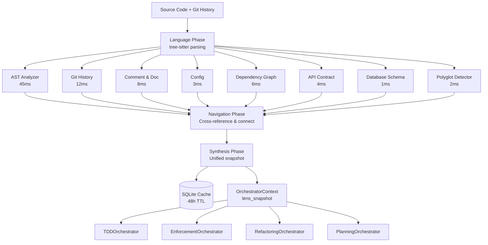

# LENS Analyzer Pipeline Diagram

---
title: LENS Analyzer Pipeline — 8-Stream Parallel Code Intelligence
type: reference
audience: [Software Developers, Product Owners, Architects]
last_verified: 2026-02-18
source_of_truth: cortex/lens/ + cortex_lens/analyzers/
format: diátaxis-reference
voice: third-person-neutral
diagram_type: ASCII pipeline + Mermaid
order: 9
---

> **Purpose:** Visual reference for how the 8 LENS analyzers run in parallel and feed a unified synthesis layer. Use this when understanding code intelligence latency, adding a new analyzer, or debugging analysis gaps.

---

## Pipeline Overview

```
┌─────────────────────────────────────────────────────────────────────┐
│                     LENS PIPELINE                                    │
│          Language · Examination · Navigation · Synthesis             │
└─────────────────────────────────────────────────────────────────────┘

  Source Code + Git History
         │
         ▼
┌────────────────────────────────────────────────────────────────────┐
│  LANGUAGE PHASE — Parse & Tokenise                                  │
│  tree-sitter multi-language parser                                  │
│  Output: AST per file, token streams, language detection            │
└───────────────────────────────┬────────────────────────────────────┘
                                │
                                ▼
┌────────────────────────────────────────────────────────────────────┐
│  EXAMINATION PHASE — 8 Parallel Analyzers                           │
│                                                                     │
│  ┌──────────────────┐  ┌──────────────────┐  ┌──────────────────┐  │
│  │ ① AST Analyzer   │  │ ② Git History    │  │ ③ Comment &      │  │
│  │                  │  │   Analyzer       │  │   Doc Analyzer   │  │
│  │ Function sigs,   │  │ Change freq,     │  │ Docstring quality│  │
│  │ class hierarchy, │  │ blame, hotspots, │  │ inline comment   │  │
│  │ type coverage    │  │ author patterns  │  │ coverage         │  │
│  │ P50: 45ms        │  │ P50: 12ms        │  │ P50: 8ms         │  │
│  └──────────────────┘  └──────────────────┘  └──────────────────┘  │
│                                                                     │
│  ┌──────────────────┐  ┌──────────────────┐  ┌──────────────────┐  │
│  │ ④ Config         │  │ ⑤ Dependency     │  │ ⑥ API Contract   │  │
│  │   Analyzer       │  │   Graph Analyzer │  │   Analyzer       │  │
│  │                  │  │                  │  │                  │  │
│  │ pytest, mypy,    │  │ Import graph,    │  │ Public function  │  │
│  │ coverage rules,  │  │ circular deps,   │  │ signatures,      │  │
│  │ linting config   │  │ coupling score   │  │ breaking changes │  │
│  │ P50: 3ms         │  │ P50: 6ms         │  │ P50: 4ms         │  │
│  └──────────────────┘  └──────────────────┘  └──────────────────┘  │
│                                                                     │
│  ┌──────────────────┐  ┌──────────────────┐                        │
│  │ ⑦ Database       │  │ ⑧ Polyglot       │                        │
│  │   Schema Analyzer│  │   Detector       │                        │
│  │                  │  │                  │                        │
│  │ SQLite/SQL DDL,  │  │ Language mix,    │                        │
│  │ ORM models,      │  │ adapters needed, │                        │
│  │ migration state  │  │ build systems    │                        │
│  │ P50: 1ms         │  │ P50: 2ms         │                        │
│  └──────────────────┘  └──────────────────┘                        │
│                                                                     │
│  All 8 analyzers run with asyncio.gather()                          │
│  Slow analyzer timeout: 2000ms (skipped, not blocking)              │
└───────────────────────────────┬────────────────────────────────────┘
                                │ 8 result streams
                                ▼
┌────────────────────────────────────────────────────────────────────┐
│  NAVIGATION PHASE — Traverse & Connect                              │
│                                                                     │
│  Cross-reference analyzer outputs:                                  │
│  • AST function → Git history (who changed this, when?)            │
│  • Dependency graph → API contract (is this used externally?)       │
│  • Config rules → current state (are rules satisfied?)             │
│  • Comment quality → complexity score (high complexity + low docs?) │
│                                                                     │
│  Conflict resolution:                                               │
│  • Config says: coverage ≥ 90%                                      │
│  • AST says: coverage = 78%  → CONFLICT recorded                    │
│  • Navigation: flag as action item                                  │
└───────────────────────────────┬────────────────────────────────────┘
                                │ Connected intelligence graph
                                ▼
┌────────────────────────────────────────────────────────────────────┐
│  SYNTHESIS PHASE — Combine & Reason                                 │
│                                                                     │
│  Produce unified LENS snapshot:                                     │
│  • Quality score (0.0–1.0)                                          │
│  • Risk score (0.0–1.0)                                             │
│  • Action items (ordered by priority)                               │
│  • Context for orchestrators (domain, patterns, hotspots)           │
│  • Cache storage (SQLite, TTL: 48h per file hash)                   │
└───────────────────────────────┬────────────────────────────────────┘
                                │ OrchestratorContext.lens_snapshot
                                ▼
                     Orchestrators consume snapshot
```

---

## Mermaid Pipeline (Interactive)



---

## Performance Summary

| Analyzer | P50 | P95 | P99 | Timeout |
|----------|-----|-----|-----|---------|
| AST Analyzer | 45ms | 120ms | 250ms | 2000ms |
| Git History | 12ms | 35ms | 80ms | 2000ms |
| Comment & Doc | 8ms | 20ms | 45ms | 500ms |
| Config | 3ms | 8ms | 15ms | 500ms |
| Dependency Graph | 6ms | 18ms | 40ms | 2000ms |
| API Contract | 4ms | 12ms | 25ms | 500ms |
| Database Schema | 1ms | 3ms | 8ms | 500ms |
| Polyglot Detector | 2ms | 5ms | 12ms | 500ms |
| **Full pipeline (cold)** | **450ms** | **750ms** | **1200ms** | — |
| **Full pipeline (warm)** | **12ms** | **25ms** | **45ms** | — |

Cache hit rate target: ≥70% for active development sessions.

---

## Adding a Custom Analyzer

The plugin system allows new analyzers to be registered without modifying core LENS:

```python
# cortex_lens/analyzers/my_analyzer.py
from cortex_lens.analyzers.base import BaseAnalyzer, AnalyzerResult

class MyAnalyzer(BaseAnalyzer):
    """
    Detect custom patterns in the codebase.
    """
    name = "my_analyzer"
    timeout_ms = 1000

    async def analyze(self, context: LENSContext) -> AnalyzerResult:
        # Your analysis logic here
        return AnalyzerResult(findings=[...], confidence=0.9)
```

Register in `cortex-registry/core/lens-config.yaml`:

```yaml
analyzers:
  custom:
    - name: my_analyzer
      module: cortex_lens.analyzers.my_analyzer
      enabled: true
      timeout_ms: 1000
```

---

## Related Documents

- **[LENS Overview](../02-lens/01-overview.md)** — What LENS is and why it exists
- **[LENS Architecture](../02-lens/02-architecture.md)** — Layer architecture detail
- **[LENS Analyzers](../02-lens/03-analyzers.md)** — Each analyzer in depth
- **[LENS Synthesis](../02-lens/04-synthesis.md)** — How streams are merged
- **[LENS Caching](../02-lens/05-caching.md)** — Cache strategy

---

*Last verified: 2026-02-18 | Source: cortex/lens/ + cortex_lens/analyzers/*
