# AI & Intelligence Capabilities

---
title: CORTEX AI & Intelligence Architecture
type: explanation
audience: [Product Owners, Software Developers, Architects]
word_count: 1800
last_verified: 2026-02-15
source_of_truth: cortex/lens/ + cortex/intelligence/ + cortex-registry/
format: diátaxis-explanation
voice: third-person-blended
related_diagrams: [c4-container.md, mcp-request-lifecycle.md]
---

> **Notice:** Intelligence capabilities represent system design intentions. Actual analysis accuracy, performance, and insights depend on codebase characteristics, language ecosystems, comment quality, and repository history. Organizations should validate intelligence outputs against their specific code patterns and development practices.

---

## Overview: Multi-Layer Intelligence Architecture

CORTEX's AI and intelligence capabilities transform raw code repositories into actionable development insights through three interconnected systems [Business Leaders]. Product teams leverage these capabilities for architecture analysis, technical debt assessment, and dependency management across multi-language codebases [Product Owners]. The intelligence layer provides developers with real-time code understanding, pattern detection, security analysis, and contextual recommendations during implementation workflows [Software Developers].

**Intelligence Architecture Layers:**

1. **LENS Engine** — Multi-analyzer code intelligence with parallel execution (8 core analyzers)
2. **Context Synthesis** — Unified intelligence aggregation across git history, AST structure, and domain patterns
3. **Knowledge Repository** — Git-backed knowledge base (45+ best practice YAMLs) with tier precedence (company > tier1 > tier0)
4. **Domain Intelligence** — Framework-specific analyzers (.NET/Roslyn, Angular, React, Vue, Python)
5. **Context Crystallization Layer (Phase 49)** — Async prefetch of rules, LENS state, and infrastructure detection

These systems operate in concert to provide orchestrators with evidence-based context for test generation, implementation guidance, refactoring decisions, and architecture validation.

---

## LENS Intelligence Engine

### What is LENS?

LENS stands for **L**anguage → **E**xamination → **N**avigation → **S**ynthesis. Organizations benefit from this four-phase intelligence cycle that transforms code into structured understanding suitable for automated decision-making [Business Leaders]. The LENS pipeline processes code repositories through progressive stages of analysis, from lexical parsing to semantic synthesis [Software Developers].


### LENS Processing Phases

| Phase | Purpose | Outputs | Typical Latency |
|-------|---------|---------|-----------------|
| **Language** | Lexical parsing and tokenization | AST, tokens, syntax structure | 50-150ms |
| **Examination** | Pattern analysis and metric extraction | Complexity, dependencies, security patterns | 100-300ms |
| **Navigation** | Relationship traversal and graph construction | Call graphs, data flow, dependency chains | 80-200ms |
| **Synthesis** | Intelligence combination and reasoning | Unified context, recommendations, insights | 70-150ms |

**End-to-End Performance:** Organizations may experience LENS analysis completion within 300-800ms for typical files (100-500 LOC) with SQLite caching. Subsequent analyses of unchanged files complete in 50-150ms via cache hits. Cache hit rates typically achieve 60-70% in active development workflows.

### Core LENS Analyzers (8 Parallel Execution)

CORTEX employs eight specialized analyzers executing in parallel to provide comprehensive code intelligence:

```mermaid
graph TB
    SOURCE[Source Files] --> DISPATCH{Parallel Dispatch}
    
    DISPATCH --> AST[AST Analyzer<br/>Syntax Structure]
    DISPATCH --> GIT[Git History Analyzer<br/>24h Context]
    DISPATCH --> COMMENT[Comment Analyzer<br/>TODOs/FIXMEs/Docs]
    DISPATCH --> IMPORT[Import Analyzer<br/>Dependencies]
    DISPATCH --> SECURITY[Security Analyzer<br/>OWASP Patterns]
    DISPATCH --> PATTERN[Pattern Analyzer<br/>Design Patterns]
    DISPATCH --> METRICS[Metrics Analyzer<br/>Complexity/Coverage]
    DISPATCH --> DOMAIN[Domain Analyzer<br/>Framework-Specific]
    
    AST --> AGGREGATE[Intelligence<br/>Aggregation]
    GIT --> AGGREGATE
    COMMENT --> AGGREGATE
    IMPORT --> AGGREGATE
    SECURITY --> AGGREGATE
    PATTERN --> AGGREGATE
    METRICS --> AGGREGATE
    DOMAIN --> AGGREGATE
    
    AGGREGATE --> CACHE[SQLite Cache]
    AGGREGATE --> OUTPUT[LENSContext<br/>Unified Intelligence]
    
    style DISPATCH fill:#e94560,stroke:#ff6b6b
    style AGGREGATE fill:#1a5f7a,stroke:#06b6d4
    style CACHE fill:#2d4356,stroke:#64748b
    style OUTPUT fill:#10b981,stroke:#059669
```



| Analyzer | Analysis Target | Key Outputs | Language Support |
|----------|----------------|-------------|------------------|
| **AST Analyzer** | Syntax structure | Functions, classes, methods, parameters, return types, complexity metrics | Python, TypeScript, JavaScript, C#, Java |
| **Git History Analyzer** | Version control (24h) | Recent commits, authors, file churn, hotspot detection, change frequency | Universal (git-agnostic) |
| **Comment Analyzer** | Documentation | TODOs, FIXMEs, docstrings, inline comments, annotation extraction | Multi-language (regex + AST) |
| **Import Analyzer** | Dependencies | Import statements, module usage, circular dependencies, unused imports | Python, TypeScript, JavaScript, C# |
| **Security Analyzer** | OWASP patterns | SQL injection vectors, XSS vulnerabilities, authentication issues, secrets detection | Python, TypeScript, JavaScript |
| **Pattern Analyzer** | Design patterns | Singleton, Factory, Observer, Strategy, adapter detection, anti-patterns | Python, TypeScript, C# |
| **Metrics Analyzer** | Quantitative metrics | Cyclomatic complexity, Halstead metrics, maintainability index, test coverage | Python, TypeScript, JavaScript |
| **Domain Analyzer** | Framework specifics | .NET (Roslyn-based), Angular (component analysis), React (hook patterns), Vue | Framework-specific plugins |

**Analyzer Coordination Architecture:**

Analyzers execute asynchronously with dependency-aware sequencing:
- **Phase 1 (parallel, no dependencies):** Git History, Comment, Import
- **Phase 2 (requires AST):** Security, Pattern, Metrics
- **Phase 3 (requires domain detection):** Domain-specific analyzers
- **Phase 4 (aggregation):** LENSSynthesis combines all results

**Performance Characteristics:**

| Repository Size | Analyzer Execution | Cache Hit Rate | Typical Latency |
|-----------------|-------------------|----------------|-----------------|
| Small (< 10K LOC) | All 8 analyzers | 60-70% | 300-500ms |
| Medium (10-50K LOC) | All 8 analyzers | 65-75% | 500-800ms |
| Large (50-100K LOC) | All 8 analyzers | 70-80% | 800-1200ms |
| Very Large (> 100K LOC) | Selective (6 core) | 75-85% | 1200-2000ms |

> **Notice:** Performance measurements reflect internal testing. Production results depend on CPU cores available for parallel execution, repository complexity, file change frequency, and cache warm-up state.
        ast_result = self.ast_analyzer.analyze(file_path)
        comment_result = self.comment_extractor.extract(file_path)
        
        # Synthesize results
        context = LENSContext(
            git_analysis=git_result,
            ast_analysis=ast_result,
            comment_analysis=comment_result,
            metadata={"analyzed_at": datetime.now().isoformat()}
        )
        
        # Cache for future use
        self.lens_cache.set(file_path, context)
        
        return context
```

---

## Context Synthesis

### Purpose

Context Synthesis aggregates intelligence from multiple sources into a unified context that orchestrators can use for decision-making.

### Synthesis Architecture

```
┌─────────────────────────────────────────────────────────────────┐
│                    CONTEXT SYNTHESIS ENGINE                      │
├─────────────────────────────────────────────────────────────────┤
│                                                                  │
│   Inputs:                                                        │
│   ┌──────────┐  ┌──────────┐  ┌──────────┐  ┌──────────┐      │
│   │   LENS   │  │ Knowledge│  │  Domain  │  │  Session │      │
│   │ Analysis │  │Repository│  │  Brain   │  │ Context  │      │
│   └────┬─────┘  └────┬─────┘  └────┬─────┘  └────┬─────┘      │
│        │             │             │             │              │
│        └─────────────┴──────┬──────┴─────────────┘              │
│                             ▼                                    │
│   ┌─────────────────────────────────────────────────────────┐  │
│   │                  SYNTHESIS PIPELINE                      │  │
│   │  ┌────────────┐  ┌────────────┐  ┌────────────────────┐│  │
│   │  │ Merge      │─▶│ Prioritize │─▶│ Generate Unified   ││  │
│   │  │ Sources    │  │ Signals    │  │ Intelligence Context││  │
│   │  └────────────┘  └────────────┘  └────────────────────┘│  │
│   └─────────────────────────────────────────────────────────┘  │
│                             │                                    │
│                             ▼                                    │
│   Output:                                                        │
│   ┌─────────────────────────────────────────────────────────┐  │
│   │           UnifiedIntelligenceContext                     │  │
│   │  • file_context    • domain_knowledge                    │  │
│   │  • git_insights    • governance_rules                    │  │
│   │  • dependencies    • recommendations                     │  │
│   └─────────────────────────────────────────────────────────┘  │
│                                                                  │
└─────────────────────────────────────────────────────────────────┘
```

### Unified Intelligence Context

```python
@dataclass
class UnifiedIntelligenceContext:
    """
    Unified context for orchestrator decision-making.
    
    Aggregates LENS analysis, knowledge base, and session context
    into a single coherent view.
    """
    # LENS-derived
    file_context: Dict[str, Any]       # File structure and content
    git_insights: Dict[str, Any]       # History and authorship
    dependencies: List[str]            # Detected dependencies
    patterns: List[str]                # Detected patterns
    
    # Knowledge-derived
    domain_knowledge: Dict[str, Any]   # Domain-specific knowledge
    best_practices: List[str]          # Applicable best practices
    governance_rules: List[str]        # Applicable governance rules
    
    # Synthesized
    recommendations: List[str]         # AI-generated recommendations
    risk_factors: List[str]            # Identified risks
    confidence_score: float            # Synthesis confidence (0.0-1.0)
```

### Synthesis Performance

| Metric | Target | Typical |
|--------|--------|---------|
| **Synthesis Time** | < 200ms | 120ms |
| **Cache Hit Rate** | > 70% | 75% |
| **Context Size** | < 20KB | 15KB |
| **Source Count** | 4-6 | 5 |

---

## Pattern Detection

### Design Pattern Recognition

CORTEX recognizes common design patterns:

| Pattern Category | Patterns Detected |
|-----------------|-------------------|
| **Creational** | Factory, Singleton, Builder, Prototype |
| **Structural** | Adapter, Decorator, Facade, Proxy |
| **Behavioral** | Observer, Strategy, Command, State |
| **Architectural** | MVC, Repository, Service, Gateway |

### Anti-Pattern Detection

CORTEX identifies problematic patterns:

| Anti-Pattern | Detection Method | Severity |
|--------------|------------------|----------|
| **God Class** | Class size > 500 LOC, > 20 methods | High |
| **Spaghetti Code** | Cyclomatic complexity > 15 | High |
| **Feature Envy** | Method accessing other class data excessively | Medium |
| **Duplicate Code** | AST similarity > 80% | Medium |
| **Long Method** | Method > 50 LOC | Low |

### Code Smell Identification

```python
@dataclass
class CodeSmell:
    """Identified code quality issue."""
    
    type: str           # Smell type (e.g., "long_method")
    location: str       # File:line
    severity: str       # low, medium, high
    description: str    # Human-readable explanation
    suggestion: str     # Recommended fix
    
    # Example:
    # CodeSmell(
    #     type="god_class",
    #     location="src/auth.py:1",
    #     severity="high",
    #     description="AuthManager has 45 methods and 800 LOC",
    #     suggestion="Split into AuthenticationService, AuthorizationService"
    # )
```

---

## Knowledge Repository

### Knowledge Structure

```
cortex_intelligence/
├── tier0/          # Core rules (immutable)
│   ├── core-rules.yaml
│   └── security-baseline.yaml
├── tier1/          # Best practices (curated)
│   ├── python-patterns.yaml
│   ├── testing-patterns.yaml
│   └── api-design.yaml
├── tier2/          # Domain knowledge (organization)
│   ├── business-rules.yaml
│   └── compliance-requirements.yaml
└── tier3/          # Learned patterns (AI-generated)
    └── discovered-patterns.yaml
```

### Knowledge Tiers

| Tier | Authority | Mutability | Source |
|------|-----------|------------|--------|
| **Tier 0** | Absolute | Immutable | CORTEX Core |
| **Tier 1** | High | Curated updates | Best practices |
| **Tier 2** | Medium | Organization managed | Domain experts |
| **Tier 3** | Learned | AI-managed | Pattern discovery |

### Knowledge Query API

```python
from cortex.brain.knowledge import KnowledgeRepository

repo = KnowledgeRepository()

# Query by domain
python_patterns = repo.query(domain="python", type="patterns")

# Query by file context
applicable_rules = repo.for_file("src/auth.py")

# Query with synthesis
context = repo.synthesize_for_operation(
    operation="implement",
    domain="authentication",
    file_context=lens_context
)
```

---

## Reasoning & Decisioning

### Challenge Generation

The Challenge Engine generates intelligent challenges when it detects potential issues:

```python
@dataclass
class Challenge:
    """AI-generated challenge for user consideration."""
    
    type: ChallengeType      # BETTER_SOLUTION, MISSING_CONTEXT, etc.
    category: ChallengeCategory  # TECHNICAL, SECURITY, etc.
    description: str         # What the challenge is
    rationale: str          # Why it matters
    alternatives: List[str]  # Suggested alternatives
    confidence: float       # AI confidence (0.0-1.0)
```

### Challenge Types

| Type | Trigger | Response |
|------|---------|----------|
| **BETTER_SOLUTION** | Alternative approach detected | Present alternatives |
| **MISSING_CONTEXT** | Insufficient information | Request clarification |
| **SECURITY_RISK** | Security concern identified | Require acknowledgment |
| **PERFORMANCE_CONCERN** | Performance issue predicted | Suggest optimization |

### Confidence Scoring

```python
def calculate_confidence(
    lens_context: LENSContext,
    knowledge_match: float,
    historical_success: float
) -> float:
    """
    Calculate confidence score for routing decision.
    
    Factors:
    - LENS context completeness (0.3 weight)
    - Knowledge base match quality (0.4 weight)
    - Historical success rate (0.3 weight)
    """
    return (
        lens_context.completeness * 0.3 +
        knowledge_match * 0.4 +
        historical_success * 0.3
    )
```

---

## Learning & Feedback

### Feedback Loop

```
┌──────────────┐    ┌──────────────┐    ┌──────────────┐
│   User       │───▶│   CORTEX     │───▶│   Outcome    │
│   Request    │    │   Response   │    │   Feedback   │
└──────────────┘    └──────────────┘    └──────┬───────┘
                                               │
                    ┌──────────────────────────┘
                    ▼
┌──────────────────────────────────────────────────────┐
│                    LEARNING SYSTEM                    │
│   ┌────────────┐  ┌────────────┐  ┌────────────┐    │
│   │  Capture   │─▶│  Analyze   │─▶│  Update    │    │
│   │  Outcome   │  │  Patterns  │  │  Tier 3    │    │
│   └────────────┘  └────────────┘  └────────────┘    │
└──────────────────────────────────────────────────────┘
```

### Learning Signals

| Signal | Weight | Example |
|--------|--------|---------|
| **Explicit Approval** | High | User accepts suggestion |
| **Explicit Rejection** | High | User rejects with reason |
| **Implicit Success** | Medium | Tests pass after implementation |
| **Implicit Failure** | Medium | Tests fail, rollback needed |

### Pattern Discovery

CORTEX continuously discovers patterns from:

- Successful implementations
- Common refactoring patterns
- Frequently used code structures
- Organization-specific idioms

These patterns are stored in Tier 3 knowledge and validated before promotion.

---

## Performance Metrics

| Capability | Metric | Target | Actual |
|-----------|--------|--------|--------|
| **LENS Analysis** | Time per file | < 500ms | 200ms |
| **Context Synthesis** | Time | < 200ms | 120ms |
| **Pattern Detection** | Accuracy | > 90% | 94% |
| **Challenge Relevance** | User acceptance | > 80% | 82% |
| **Knowledge Retrieval** | Time | < 50ms | 25ms |

---

## Related Documents

- [LENS Overview](../lens/overview.md) — LENS deep-dive
- [LENS Architecture](../lens/architecture.md) — Technical details
- [Analyzers](../lens/analyzers.md) — Individual analyzer docs
- [Context Synthesis](../lens/synthesis.md) — Synthesis details

---

*Part of CORTEX Architecture Documentation*
