# CORTEX System Context (C4 Level 1)

---
id: cortex-c4-context
title: CORTEX System Context Diagram
purpose: Show who uses CORTEX and what external systems interact with it
audience: [Business Leaders, Product Owners, Software Developers]
source_of_truth: cortex/__wiring_contract__.yaml + cortex-registry manifest
last_verified: 2026-02-15
diagram_type: C4-Context
interactive: false
word_count: 450
---

## System Context Overview

CORTEX operates as an intelligent software development acceleration platform that interfaces with multiple development environments and version control systems. The system serves three primary user groups while maintaining integration with external tools and services.

```mermaid
graph TB
    subgraph External["External Systems"]
        VCS[Version Control<br/>Git Repositories]
        CI[CI/CD Pipelines<br/>GitHub Actions]
        IDE[Development Environments<br/>VS Code, Cursor, Claude]
    end
    
    subgraph Users["User Roles"]
        BL[Business Leaders<br/>Strategic Decisions]
        PO[Product Owners<br/>Feature Planning]
        SD[Software Developers<br/>Implementation]
    end
    
    subgraph CORTEX["CORTEX System"]
        MCP[MCP Gateway<br/>10 Core Tools<br/>JSON-RPC Interface]
        ORCH[Orchestration Layer<br/>20+ Orchestrators]
        BRAIN[CORTEX Brain<br/>Git-Backed Registry]
        LENS[LENS Intelligence<br/>Code Analysis]
        GOV[Governance Engine<br/>7 Enforcement Agents]
    end
    
    %% User interactions
    BL -->|Strategic Queries| MCP
    PO -->|Feature Planning| MCP
    SD -->|Implementation Requests| MCP
    
    %% IDE integration
    IDE -->|MCP Protocol| MCP
    
    %% Internal flow
    MCP --> ORCH
    ORCH --> BRAIN
    ORCH --> LENS
    ORCH --> GOV
    
    %% External system integration
    BRAIN <-->|Read/Write| VCS
    LENS -->|Analyze| VCS
    GOV -->|Validate| CI
    
    style CORTEX fill:#1a1a2e,stroke:#16213e,stroke-width:3px
    style Users fill:#0f3460,stroke:#16213e
    style External fill:#0f3460,stroke:#16213e
    style MCP fill:#e94560,stroke:#ff6b6b,stroke-width:2px
    style BRAIN fill:#533483,stroke:#8b5cf6
    style LENS fill:#1a5f7a,stroke:#06b6d4
    style GOV fill:#2d4356,stroke:#64748b
```

## Key Interactions

**User → CORTEX:**
- Business Leaders query system capabilities and metrics for strategic decision-making
- Product Owners use planning tools for feature decomposition and roadmap management
- Software Developers interact through implementation, fix, refactor, and analysis operations

**CORTEX → External Systems:**
- **Git Repositories:** CORTEX Brain stores all governance data as version-controlled YAML
- **CI/CD Pipelines:** Governance gates integrate with build validation processes
- **IDEs:** MCP protocol enables native integration with VS Code, Cursor, and Claude Desktop

## System Boundaries

| Boundary | What's Inside | What's Outside |
|----------|---------------|----------------|
| **CORTEX Core** | MCP Gateway, Orchestrators, Brain, LENS, Governance | User IDEs, Git hosting, CI platforms |
| **Data Persistence** | Git-backed YAML registry, SQLite caches | External databases, cloud storage |
| **Execution** | Local Python runtime, MCP server process | Remote compute, containerized services |

## Trust Model

CORTEX operates under a **zero-trust principle** for external integrations:
- All MCP requests validated before processing
- Git commits signed and audited
- Governance rules prevent unauthorized code modification
- No external API dependencies for core functionality

## Performance Characteristics

Organizations using CORTEX in production contexts may experience:
- **Request latency:** 150-500ms for standard operations (varies by codebase size)
- **Concurrent users:** Designed to support multiple developers per repository
- **Repository scale:** Tested with codebases up to 500K LOC

> **Notice:** Performance characteristics represent design intentions and internal testing results. Actual performance depends on hardware specifications, repository size, network latency, and concurrent load patterns. Organizations should conduct proof-of-concept evaluations to assess performance in their specific environment.

**Related Diagrams:**
- [C4 Level 2: Container Architecture](./c4-container.md)
- [System Architecture Overview](./architecture-overview.md)
- [MCP Gateway Flow](./mcp-gateway-flow.md)
