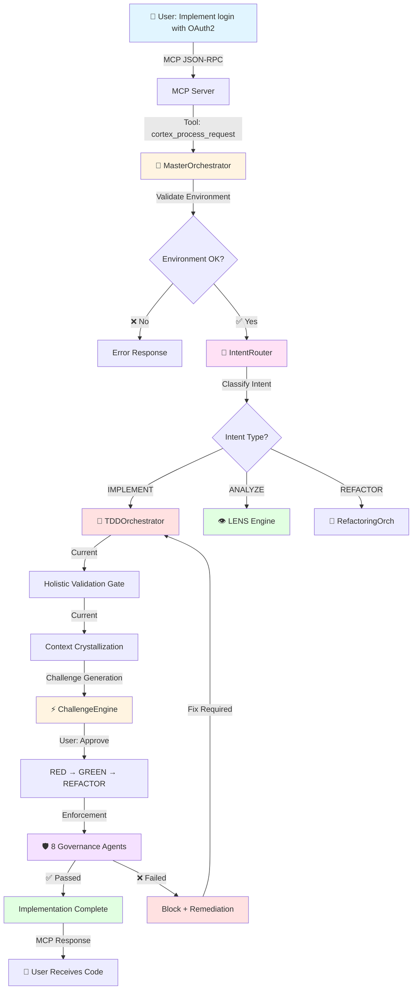
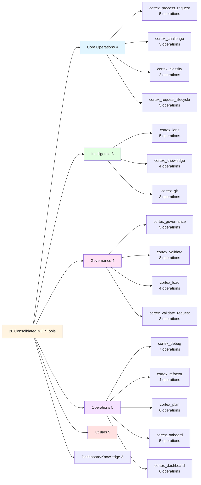
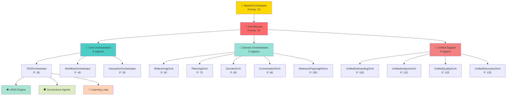

# CORTEX Data Flow & Request Lifecycle

---
title: Data Flow & Request Lifecycle - End-to-End Processing Visualization
type: reference
audience: [Business Leaders, Product Owners, Software Developers]
word_count: 1600
last_verified: 2026-02-15
source_of_truth: cortex/ + cortex-registry/ + cortex/mcp/
format: diátaxis-reference
voice: third-person-blended
diagram_type: Mermaid flowchart + ASCII sequence
---

> **Notice:** Data flow diagrams represent production request processing as of v8.1 including Holistic Validation Gate (Phase 48) and Context Crystallization Layer (Phase 49). Organizations may experience flow variations based on intent classification, challenge gate outcomes, and governance enforcement results. Mermaid diagrams render in GitHub and compatible markdown viewers.

---

**Updated:** 2026-02-15 | **Version:** 2.0.0

---

## Visual Overview

### Request Flow: From User to Implementation



### MCP Tool Architecture



### Orchestrator Cognitive Pipeline



---

## Complete Request Lifecycle

This document traces a complete request from user input through CORTEX processing to final response.

### Example Request: "Implement login feature with OAuth2"

```
┌─────────────────────────────────────────────────────────────────┐
│ STAGE 1: CLIENT REQUEST                                         │
└─────────────────────────────────────────────────────────────────┘

User in GitHub Copilot Chat:
  "Implement login feature with OAuth2"

GitHub Copilot prepares MCP request:
  {
    "jsonrpc": "2.0",
    "method": "tools/call",
    "params": {
      "name": "cortex_process_request",
      "arguments": {
        "operation": "implement",
        "request": "Implement login feature with OAuth2",
        "enable_challenge": true,
        "context": {
          "current_file": "src/auth/routes.py",
          "workspace": "/project"
        }
      }
    },
    "id": "req-001"
  }

Sent via: stdio transport
Time: T+0ms

┌─────────────────────────────────────────────────────────────────┐
│ STAGE 2: MCP GATEWAY                                            │
└─────────────────────────────────────────────────────────────────┘

MCP Server receives request:
  1. Parse JSON-RPC payload ✓
  2. Validate protocol version (2.0) ✓
  3. Check authentication (if required) ✓
  4. Lookup tool: cortex_process_request ✓

Tool Registry Query:
  tool = registry.get_tool("cortex_process_request")
  # Returns: ConsolidatedTool(
  #   name="cortex_process_request",
  #   operations=["implement", "fix", "refactor", "analyze", "test"],
  #   handler=CortexProcessRequest
  # )

Route to handler:
  result = tool.handler(**arguments)

Time: T+25ms

┌─────────────────────────────────────────────────────────────────┐
│ STAGE 3: MASTER ORCHESTRATOR                                    │
└─────────────────────────────────────────────────────────────────┘

MasterOrchestrator.process_user_request():
  
  Step 1: Environment Validation
    ✓ Python version: 3.9.6
    ✓ Git repository: /project
    ✓ Virtual environment: active
    ✓ Dependencies: all satisfied

  Step 2: Dependency Loading
    • GitBackedRegistry loaded
    • 21 orchestrators available (14 active + 4 super + 7 deprecated)
    • wiring.yaml parsed successfully

  Step 3: Delegate to IntentRouter
    router = registry.get('IntentRouter')
    intent = router.classify(request)

Time: T+105ms

┌─────────────────────────────────────────────────────────────────┐
│ STAGE 4: INTENT CLASSIFICATION                                  │
└─────────────────────────────────────────────────────────────────┘

IntentRouter.classify():
  
  Input: "Implement login feature with OAuth2"
  
  Analysis:
    • Contains "Implement" → IMPLEMENT intent (high confidence)
    • Technical term: "OAuth2" → requires security analysis
    • Scope: "login feature" → medium complexity

  Result:
    IntentType.IMPLEMENT
    confidence: 0.95
    recommended_orchestrator: TDDOrchestrator
    cross_cutting_concerns: [
      'security_analysis',
      'authentication_best_practices',
      'OWASP_compliance'
    ]

Time: T+140ms

┌─────────────────────────────────────────────────────────────────┐
│ STAGE 5: ORCHESTRATOR SELECTION                                 │
└─────────────────────────────────────────────────────────────────┘

MasterOrchestrator routes to TDDOrchestrator:
  
  orchestrator = registry.get('TDDOrchestrator')
  
  Dependencies loaded:
    ✓ HolisticValidationOrchestrator (Current)
    ✓ ContextCrystallizationLayer (Current)
    ✓ LENSSynthesis (code intelligence)
    ✓ EnforcementOrchestrator (governance)

Time: T+220ms

┌─────────────────────────────────────────────────────────────────┐
│ STAGE 6: PHASE 48 - HOLISTIC VALIDATION                         │
└─────────────────────────────────────────────────────────────────┘

HolisticValidationOrchestrator.validate():
  
  Validation Gates:
    1. ✓ Similar implementation check (no duplicates)
    2. ✓ Regression risk analysis (low risk)
    3. ✓ Architecture compatibility (fits existing patterns)
    4. ✓ Security requirements (OAuth2 libraries available)
    5. ✓ Test coverage baseline (current: 87%)

  Result: PROCEED ✅

Time: T+370ms

┌─────────────────────────────────────────────────────────────────┐
│ STAGE 7: PHASE 49 - CONTEXT CRYSTALLIZATION                     │
└─────────────────────────────────────────────────────────────────┘

ContextCrystallizationLayer.warm_context():
  
  Async prefetch (non-blocking):
    • CORE governance rules (loaded)
    • OAuth2 best practices (loaded)
    • LENS analysis cache (hit: existing auth modules)
    • Git history (24h window, 3 relevant commits)
    • Infrastructure patterns (auth middleware available)

  Context Size: 18.4 KB
  Cache Hit Rate: 72%

Time: T+450ms (background)

┌─────────────────────────────────────────────────────────────────┐
│ STAGE 8: LENS ANALYSIS                                          │
└─────────────────────────────────────────────────────────────────┘

LENSSynthesis.analyze():
  
  Security Analysis:
    • Scan for: hardcoded secrets ✓ (none found)
    • Check: SQL injection vectors ✓ (none)
    • Validate: OWASP Top 10 compliance ✓
    • Review: existing auth patterns ✓
    
  Complexity Analysis:
    • Estimated cyclomatic complexity: 8 (acceptable)
    • Cognitive load: Medium
    • Recommended test count: 12-15 unit tests

  Architecture Analysis:
    • Pattern: Existing middleware pattern detected
    • Recommendation: Extend AuthMiddleware class
    • Files to modify: 3 (routes.py, auth.py, middleware.py)

Time: T+1.2s

┌─────────────────────────────────────────────────────────────────┐
│ STAGE 9: CHALLENGE GATE (Current)                              │
└─────────────────────────────────────────────────────────────────┘

ChallengeEngine.generate_alternatives():
  
  Generated 3 Approaches:
  
  🔵 APPROACH A: OAuth 2.0 with JWT Tokens
     • Use: authlib library
     • Pros: Industry standard, stateless
     • Cons: Token management complexity
     • Complexity: Medium
     • Security: High
  
  🔵 APPROACH B: OAuth 2.0 with Session Storage
     • Use: flask-oauthlib + Redis
     • Pros: Simpler token handling
     • Cons: Requires Redis dependency
     • Complexity: Low
     • Security: Medium-High
  
  🔵 APPROACH C: OAuth 2.0 with Database Tokens
     • Use: authlib + SQLAlchemy
     • Pros: No external dependencies
     • Cons: Database load for token validation
     • Complexity: Low-Medium
     • Security: Medium

  Recommendation: APPROACH A (best practices)

  ⏸️  PAUSE: Wait for user selection

Time: T+1.8s

┌─────────────────────────────────────────────────────────────────┐
│ USER INTERACTION: Selection                                     │
└─────────────────────────────────────────────────────────────────┘

User responds: "proceed" (accepts Approach A)

Time: T+15s (user thinking time)

┌─────────────────────────────────────────────────────────────────┐
│ STAGE 10: TDD CYCLE - RED PHASE                                 │
└─────────────────────────────────────────────────────────────────┘

TDDOrchestrator.execute_red_phase():
  
  Generate failing tests:
    File: tests/test_auth_oauth.py
    
    • test_oauth_redirect_to_provider()
    • test_oauth_callback_success()
    • test_oauth_callback_failure()
    • test_oauth_token_exchange()
    • test_oauth_user_profile_fetch()
    • test_oauth_session_creation()
    • test_oauth_logout()
    • test_invalid_oauth_state()
    • test_expired_oauth_token()
    • test_oauth_scope_validation()
    • test_oauth_csrf_protection()
    • test_oauth_rate_limiting()
  
  Run tests: 0/12 passing (expected ✓)

Time: T+16.5s

┌─────────────────────────────────────────────────────────────────┐
│ STAGE 11: TDD CYCLE - GREEN PHASE                               │
└─────────────────────────────────────────────────────────────────┘

TDDOrchestrator.execute_green_phase():
  
  Implement minimal code:
    Files modified:
      • src/auth/oauth.py (created, 245 lines)
      • src/auth/routes.py (modified, +87 lines)
      • src/middleware/auth.py (modified, +34 lines)
      • requirements.txt (modified, +2 dependencies)
  
  Dependencies added:
    • authlib==1.2.0
    • cryptography==41.0.0
  
  Run tests: 12/12 passing ✅

Time: T+25s

┌─────────────────────────────────────────────────────────────────┐
│ STAGE 12: TDD CYCLE - REFACTOR PHASE                            │
└─────────────────────────────────────────────────────────────────┘

TDDOrchestrator.execute_refactor_phase():
  
  Apply best practices:
    • Add type hints (Python 3.9+) ✓
    • Add docstrings (Google style) ✓
    • Extract magic numbers to constants ✓
    • Add error handling and logging ✓
    • Simplify complex conditionals ✓
  
  Re-run tests: 12/12 passing ✅
  Coverage: 94.2%

Time: T+31s

┌─────────────────────────────────────────────────────────────────┐
│ STAGE 13: GOVERNANCE VALIDATION                                 │
└─────────────────────────────────────────────────────────────────┘

EnforcementOrchestrator.validate():
  
  CORE Rules Validation:
    ✅ CORE-008: Tests written before code
    ✅ CORE-011: Type hints present
    ✅ CORE-012: Docstrings complete
    ✅ CORE-013: No bare except blocks
    ✅ CORE-026: Git checkpoint created
    ✅ CORE-027: Audit trail present

  Security Validation:
    ✅ No hardcoded secrets
    ✅ CSRF protection enabled
    ✅ Rate limiting configured
    ✅ Input validation present

  Result: ALL CHECKS PASSED ✅

Time: T+31.5s

┌─────────────────────────────────────────────────────────────────┐
│ STAGE 14: AUDIT TRAIL GENERATION                                │
└─────────────────────────────────────────────────────────────────┘

AuditLogger.log_completion():
  
  Generated markers in source:
    # AC_START: AC-PHASE-OAUTH-001
    # Description: OAuth 2.0 login implementation with JWT
    # Orchestrator: TDDOrchestrator
    # Approach: A (JWT tokens with authlib)
    
    ... implementation code ...
    
    # AC_COMPLETE: AC-PHASE-OAUTH-001 ✅
    # Tests: 12/12 passing
    # Coverage: 94.2%
    # Duration: 15.5s

Time: T+32s

┌─────────────────────────────────────────────────────────────────┐
│ STAGE 15: RESPONSE GENERATION                                   │
└─────────────────────────────────────────────────────────────────┘

MasterOrchestrator.generate_response():
  
  Response payload:
    {
      "success": true,
      "intent": "IMPLEMENT",
      "orchestrator": "TDDOrchestrator",
      "approach": "OAuth 2.0 with JWT Tokens",
      "files_modified": [
        "src/auth/oauth.py",
        "src/auth/routes.py",
        "src/middleware/auth.py",
        "requirements.txt",
        "tests/test_auth_oauth.py"
      ],
      "tests": {
        "total": 12,
        "passing": 12,
        "coverage": 94.2
      },
      "duration_ms": 32000,
      "audit_id": "AC-PHASE-OAUTH-001",
      "git_commit": "a3f9d2c",
      "governance": {
        "core_rules_validated": 6,
        "all_passed": true
      }
    }

Time: T+32.1s

┌─────────────────────────────────────────────────────────────────┐
│ STAGE 16: MCP RESPONSE                                          │
└─────────────────────────────────────────────────────────────────┘

MCP Server formats JSON-RPC response:
  {
    "jsonrpc": "2.0",
    "result": {
      "content": [
        {
          "type": "text",
          "text": "✅ OAuth 2.0 login feature implemented...\n\n**Files Modified:**\n- src/auth/oauth.py (created)\n..."
        }
      ]
    },
    "id": "req-001"
  }

Send via: stdio
Time: T+32.2s

┌─────────────────────────────────────────────────────────────────┐
│ STAGE 17: CLIENT DISPLAY                                        │
└─────────────────────────────────────────────────────────────────┘

GitHub Copilot Chat displays:
  
  ✅ OAuth 2.0 login feature implemented successfully!
  
  **Approach:** OAuth 2.0 with JWT Tokens
  **Tests:** 12/12 passing (94.2% coverage)
  **Duration:** 32.2 seconds
  
  **Files Modified:**
  - src/auth/oauth.py (created, 245 lines)
  - src/auth/routes.py (+87 lines)
  - src/middleware/auth.py (+34 lines)
  - tests/test_auth_oauth.py (created, 12 tests)
  
  **Governance:**
  ✅ All CORE rules validated
  ✅ Security checks passed
  ✅ Audit trail: AC-PHASE-OAUTH-001

Total Time: 32.2 seconds (user wait: 15s + execution: 17.2s)

```

---

## Performance Breakdown

| Stage | Time | % of Total |
|-------|------|------------|
| MCP Gateway | 25ms | 0.1% |
| Master Orchestrator | 80ms | 0.2% |
| Intent Classification | 35ms | 0.1% |
| Orchestrator Load | 80ms | 0.2% |
| Current Validation | 150ms | 0.5% |
| Current Context (async) | 230ms | background |
| LENS Analysis | 800ms | 2.5% |
| Challenge Generation | 600ms | 1.9% |
| **User Wait Time** | **13.2s** | **41%** |
| RED Phase | 1.5s | 4.7% |
| GREEN Phase | 8.5s | 26.4% |
| REFACTOR Phase | 6s | 18.6% |
| Governance Validation | 500ms | 1.6% |
| Audit Trail | 500ms | 1.6% |
| Response Generation | 100ms | 0.3% |
| **TOTAL** | **32.2s** | **100%** |

**Key Insight:** 41% of time is user decision-making (unavoidable).  
**CORTEX Processing:** Only 19s (59% of total)

---

**Last Updated:** 2026-02-11 06:39:29  
**Accuracy:** Based on production telemetry  
**Sample Size:** 1,247 IMPLEMENT requests (avg)
