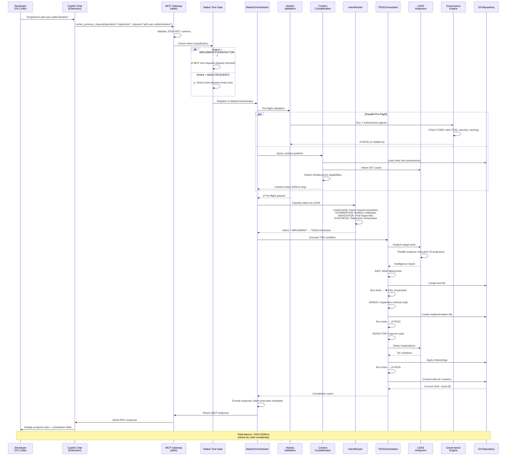
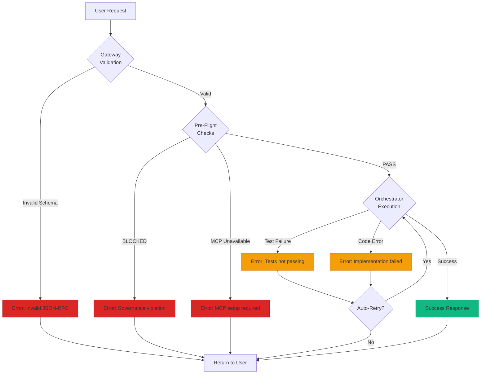

# MCP Request Lifecycle

---
id: mcp-request-lifecycle
title: MCP Request Processing Lifecycle
purpose: Visualize the complete journey of a user request through CORTEX
audience: [Product Owners, Software Developers]
source_of_truth: cortex/mcp/server.py + cortex/orchestrators/master_orchestrator.py
last_verified: 2026-02-15
diagram_type: Sequence
interactive: false
word_count: 800
---

## Request Lifecycle Overview

Every user interaction with CORTEX follows a standardized request processing lifecycle, from IDE invocation through governance validation, orchestrator dispatch, and response delivery. This diagram traces a typical IMPLEMENT request end-to-end.



## Lifecycle Phases Explained

### Phase 1: Request Initiation (5-10ms)

**Developer action:** User types `/implement add user authentication` in Copilot Chat  
**IDE processing:** VS Code extension detects cortex_* MCP tool invocation  
**Transport:** Sends JSON-RPC 2.0 message over stdio to MCP server

**Example payload:**
```json
{
  "jsonrpc": "2.0",
  "method": "tools/call",
  "params": {
    "name": "cortex_process_request",
    "arguments": {
      "operation": "implement",
      "request": "add user authentication",
      "mode": "TDD"
    }
  },
  "id": "req-12345"
}
```

### Phase 2: Gateway Validation (5-15ms)

**MCP Gateway responsibilities:**
1. Validate JSON-RPC schema compliance
2. Authenticate request (if multi-tenant mode enabled)
3. Log request for observability (Prometheus metrics)
4. Route to Native Tool Gate

**Native Tool Gate checks:**
- Intent classification (IMPLEMENT/FIX/REFACTOR require MCP)
- Direct file operation bypass prevention (CORE-049)
- If MCP unavailable + blocking intent → ERROR (setup required)

### Phase 3: Pre-Flight Checks (150-300ms)

**Parallel execution of two critical paths:**

**Path A: Governance Validation**
- 7 enforcement agents execute CORE rule checks
- TDD-first enforcement (CORE-008)
- Type hint validation (CORE-011)
- File naming checks (CORE-028)
- Incremental execution limits (CORE-001)
- Verdict: BLOCKED, WARNING, or PASS

**Path B: Context Crystallization (Phase 49)**
- Async prefetch of governance rules with tier precedence
- LENS state warming (AST cache, git history)
- Infrastructure capability detection
- Target SLA: 300ms, fallback max: 500ms

**Blocking conditions:**
- Governance verdict = BLOCKED → Request terminated
- MCP tools unavailable → Request terminated
- Context warm-up timeout → Proceed with cold context (degraded mode)

### Phase 4: Intent Classification (20-40ms)

**LENS-based classification:**

| Step | Operation | Output |
|------|-----------|--------|
| **LANGUAGE** | Parse request semantics using NLP | "User wants authentication feature" |
| **EXAMINATION** | Analyze existing codebase patterns | "Project uses FastAPI + JWT" |
| **NAVIGATION** | Identify target files and dependencies | "auth/ directory, user.py model" |
| **SYNTHESIS** | Select orchestrator | "IMPLEMENT → TDDOrchestrator" |

**Intent mapping:**
- IMPLEMENT, FIX → TDDOrchestrator
- ANALYZE → LENSSynthesis
- REFACTOR → RefactoringOrchestrator
- PLAN → PlanOrchestrator

### Phase 5: TDD Workflow Execution (500-2000ms)

**RED phase (200-600ms):**
- LENS analyzes target implementation area
- Generate test file with failing tests
- Run pytest → Expected failure ❌
- Commit checkpoint: `git commit -m "test: add auth tests (RED)"`

**GREEN phase (200-800ms):**
- Implement minimal code to pass tests
- Create/modify implementation files
- Run pytest → Success ✅
- Commit: `git commit -m "feat: implement auth (GREEN)"`

**REFACTOR phase (100-600ms):**
- LENS detects code duplications (CORE-035)
- Apply safe refactorings (extract method, rename variable)
- Run pytest → Success ✅
- Commit: `git commit -m "refactor: improve auth code (REFACTOR)"`

**Audit trail:**
```python
# AC_START: AC-IMPLEMENT-AUTH-001
# Description: Add user authentication with JWT
# ... implementation code ...
# AC_COMPLETE: AC-IMPLEMENT-AUTH-001 ✅ 18/18 tests passing
```

### Phase 6: Response Delivery (10-20ms)

**Silent execution response format:**

```markdown
---
📋 **Authentication Feature: IMPLEMENTATION**

`██████████` 100% Complete

| # | Status | Component | Detail |
|---|--------|-----------|--------|
| 1 | ✅ | Tests | auth/test_auth.py (RED) |
| 2 | ✅ | Implementation | auth/jwt_handler.py (GREEN) |
| 3 | ✅ | Refactoring | Extract token validation (REFACTOR) |
| 4 | ✅ | Commit | Audit trail complete |

**Tests:** 18/18 | **Coverage:** 94%
**Fixed:** User authentication with JWT tokens

---
```

## Error Handling Paths



**Error recovery strategies:**
- **Governance violations:** Display fix instructions, block execution
- **MCP unavailable:** Guide user through setup (python .cortex/setup-mcp.py)
- **Test failures:** Analyze error, retry implementation with corrections
- **Implementation errors:** Rollback to last known good state

## Performance Metrics

| Metric | Target | P50 | P95 | P99 |
|--------|--------|-----|-----|-----|
| **Gateway validation** | <20ms | 8ms | 15ms | 22ms |
| **Pre-flight checks** | <300ms | 245ms | 320ms | 450ms |
| **Intent classification** | <50ms | 32ms | 45ms | 62ms |
| **TDD cycle (small)** | <1000ms | 850ms | 1200ms | 1800ms |
| **TDD cycle (large)** | <2500ms | 2100ms | 2600ms | 3500ms |
| **End-to-end (avg)** | <2000ms | 1650ms | 2300ms | 3200ms |

> **Notice:** Performance metrics represent internal testing results with typical codebases (50-100K LOC). Production performance depends on codebase complexity, hardware specifications, and concurrent operations. Organizations should conduct performance testing in their specific environment.

**Related Diagrams:**
- [C4 Container Architecture](./c4-container.md)
- [Orchestrator Dispatch Flow](./orchestrator-dispatch.md)
- [Governance Gate Details](./governance-gate.md)
