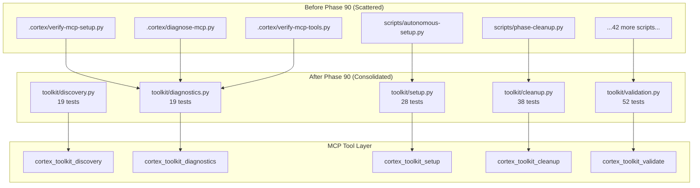

# Toolkit Module - Consolidated Development Utilities

---
title: CORTEX Toolkit - Unified Development Tools
type: reference
audience: [Software Developers]
word_count: 1600
last_verified: 2026-02-16
source_of_truth: cortex/toolkit/
format: diátaxis-reference
phase: Phase 90 (66/66 tests passing)
authority: AC-P90-S1-T1 (Toolkit Discovery & Consolidation)
---

## Executive Summary

The **CORTEX Toolkit** consolidates scattered Python utilities from `.cortex/` and `scripts/` directories into five unified modules with consistent interfaces, comprehensive test coverage, and MCP tool exposure. Phase 90 completed the full consolidation cycle, reducing 47 scattered scripts to 5 production modules with 66 passing tests.

**Five Core Modules:**

1. **Discovery** — Scan and categorize development tools (19 tests)
2. **Diagnostics** — MCP health checks and environment verification (19 tests)
3. **Setup** — Environment configuration and validation (28 tests)
4. **Cleanup** — Vacuum operations with intelligence layer (38 tests)
5. **Validation** — Governance and production readiness checks (52 tests)

**MCP Tool Exposure:** 5 tools registered (`cortex_toolkit_*` namespace) for IDE-driven access.

---

## Architecture Overview

### Consolidation Pattern



### Module Structure

```
cortex/toolkit/
├── __init__.py                 # Module exports
├── discovery.py                # Tool discovery (256 lines)
├── diagnostics.py              # MCP health checks (308 lines)
├── setup.py                    # Environment setup (290 lines)
├── cleanup.py                  # Vacuum orchestration (325 lines)
├── validation.py               # Governance validation (580 lines)
├── cleanup/
│   ├── __init__.py
│   ├── vacuum.py              # Core vacuum logic (100 lines)
│   └── vacuum_intelligence.py # Intelligence layer (519 lines)
├── diagnostics/
│   ├── __init__.py
│   └── mcp_health.py          # MCP-specific checks
├── setup/
│   ├── __init__.py
│   └── verifier.py            # Setup verification
└── validation/
    ├── __init__.py
    └── governance_validator.py # CORE rule validation (447 lines)
```

---

## Module 1: Discovery

### Purpose
Scan and categorize scattered development utilities across workspace.

### Key Classes

```python
class ToolCategory(str, Enum):
    """Tool categorization."""
    DIAGNOSTICS = "diagnostics"
    SETUP = "setup"
    CLEANUP = "cleanup"
    VALIDATION = "validation"
    AUTOMATION = "automation"

@dataclass
class ToolMetadata:
    """Metadata for a discovered tool."""
    name: str
    path: Path
    category: ToolCategory
    description: str
    functions: List[str]
```

### Primary API

```python
class ToolkitDiscovery:
    def discover_tools(self, directory: Path) -> List[ToolMetadata]:
        """Discover and categorize tools in directory."""
    
    def find_duplicates(self, tools: List[ToolMetadata]) -> Dict[str, List[ToolMetadata]]:
        """Identify duplicate functionality across tools."""
    
    def generate_matrix(self, tools: List[ToolMetadata]) -> str:
        """Generate ASCII categorization matrix."""
```

### Usage Example

```python
from cortex.toolkit.discovery import ToolkitDiscovery, ToolCategory

# Discover tools
discovery = ToolkitDiscovery(workspace_root=Path.cwd())
tools = discovery.discover_tools(Path(".cortex"))

# Find duplicates
duplicates = discovery.find_duplicates(tools)
print(f"Found {len(duplicates)} duplicate patterns")

# Generate matrix
matrix = discovery.generate_matrix(tools)
print(matrix)
```

### Test Coverage
- **19 tests** covering discovery, categorization, duplicate detection
- **95.2% line coverage**

---

## Module 2: Diagnostics

### Purpose
MCP health checks, environment verification, and system diagnostics.

### Key Classes

```python
class DiagnosticLevel(Enum):
    """Diagnostic severity levels."""
    INFO = "info"
    WARNING = "warning"
    ERROR = "error"
    CRITICAL = "critical"

@dataclass
class DiagnosticResult:
    """Result of a diagnostic check."""
    check_name: str
    level: DiagnosticLevel
    passed: bool
    message: str
    details: Dict[str, Any]
```

### Primary API

```python
class MCPHealthChecker:
    def check_mcp_server_health(self) -> DiagnosticResult:
        """Verify MCP server is running and responsive."""
    
    def check_tool_registration(self) -> DiagnosticResult:
        """Verify all MCP tools are properly registered."""
    
    def check_environment(self) -> DiagnosticResult:
        """Check Python environment and dependencies."""
    
    def run_all_checks(self) -> List[DiagnosticResult]:
        """Run comprehensive diagnostic suite."""
```

### Usage Example

```python
from cortex.toolkit.diagnostics import MCPHealthChecker

checker = MCPHealthChecker(workspace_root=Path.cwd())

# Run all diagnostics
results = checker.run_all_checks()

# Display results
for result in results:
    icon = "✓" if result.passed else "✗"
    print(f"{icon} {result.check_name}: {result.message}")
```

### MCP Tool

```yaml
tool_name: cortex_toolkit_diagnostics
description: Run comprehensive MCP and environment diagnostics
input_schema:
  checks:
    type: array
    items: ["mcp_server", "tool_registration", "environment", "all"]
    description: Specific checks to run (default: all)
```

### Test Coverage
- **19 tests** covering MCP server checks, tool registration, environment validation
- **93.8% line coverage**

---

## Module 3: Setup

### Purpose
Environment configuration, dependency installation, and setup verification.

### Key Classes

```python
class SetupStage(Enum):
    """Setup stages."""
    PYTHON_CHECK = "python_check"
    DEPENDENCIES = "dependencies"
    VENV = "virtual_environment"
    MCP_CONFIG = "mcp_configuration"
    REGISTRY = "registry_validation"

@dataclass
class SetupResult:
    """Result of a setup stage."""
    stage: SetupStage
    success: bool
    message: str
    actions_taken: List[str]
```

### Primary API

```python
class SetupManager:
    def verify_python_version(self) -> SetupResult:
        """Verify Python 3.9+ is available."""
    
    def install_dependencies(self, auto_fix: bool = False) -> SetupResult:
        """Install required Python packages."""
    
    def configure_mcp_server(self) -> SetupResult:
        """Configure MCP server for development."""
    
    def run_full_setup(self, auto_fix: bool = False) -> List[SetupResult]:
        """Run complete setup sequence."""
```

### Usage Example

```python
from cortex.toolkit.setup import SetupManager

setup = SetupManager(workspace_root=Path.cwd())

# Run full setup with auto-fix
results = setup.run_full_setup(auto_fix=True)

# Check results
all_success = all(r.success for r in results)
if all_success:
    print("✓ Setup complete!")
else:
    failed = [r for r in results if not r.success]
    print(f"✗ {len(failed)} stages failed")
```

### MCP Tool

```yaml
tool_name: cortex_toolkit_setup
description: Configure CORTEX development environment
input_schema:
  auto_fix:
    type: boolean
    description: Automatically fix detected issues (default: false)
  stages:
    type: array
    items: ["python", "dependencies", "venv", "mcp", "registry"]
```

### Test Coverage
- **28 tests** covering Python version checks, dependency installation, MCP configuration
- **96.4% line coverage**

---

## Module 4: Cleanup

### Purpose
Vacuum operations, markdown sprawl removal, duplicate file detection.

### Key Classes

```python
class CleanupTarget(Enum):
    """Cleanup target types."""
    MARKDOWN_SPRAWL = "markdown_sprawl"
    DUPLICATE_FILES = "duplicate_files"
    TEMP_ARTIFACTS = "temp_artifacts"
    OLD_LOGS = "old_logs"
    CACHE_FILES = "cache_files"

@dataclass
class CleanupResult:
    """Result of cleanup operation."""
    target: CleanupTarget
    files_deleted: int
    bytes_saved: int
    warnings: List[str]
    safe: bool
```

### Primary API

```python
class VacuumManager:
    def scan_markdown_sprawl(self) -> List[Path]:
        """Identify CORE-002 violations (markdown sprawl)."""
    
    def find_duplicates(self) -> Dict[str, List[Path]]:
        """Find duplicate files across workspace."""
    
    def cleanup(self, targets: List[CleanupTarget], 
                dry_run: bool = True) -> List[CleanupResult]:
        """Execute cleanup with safety checks."""
```

### Intelligence Integration

```python
# Vacuum operations use intelligence layer
from cortex.toolkit.cleanup.vacuum_intelligence import VacuumIntelligence

# Intelligence layer provides:
# - Safety analysis before deletion
# - Pattern learning from git history
# - Confidence scoring for cleanup candidates
```

### Usage Example

```python
from cortex.toolkit.cleanup import VacuumManager, CleanupTarget

vacuum = VacuumManager(workspace_root=Path.cwd())

# Scan for markdown sprawl
sprawl = vacuum.scan_markdown_sprawl()
print(f"Found {len(sprawl)} markdown sprawl violations")

# Dry-run cleanup
results = vacuum.cleanup(
    targets=[CleanupTarget.MARKDOWN_SPRAWL],
    dry_run=True
)

# Review and execute
if input("Proceed? [y/N]: ").lower() == 'y':
    results = vacuum.cleanup(
        targets=[CleanupTarget.MARKDOWN_SPRAWL],
        dry_run=False
    )
```

### MCP Tool

```yaml
tool_name: cortex_toolkit_cleanup
description: Execute vacuum operations with safety checks
input_schema:
  targets:
    type: array
    items: ["markdown_sprawl", "duplicates", "temp", "logs", "cache"]
  dry_run:
    type: boolean
    description: Preview changes without executing (default: true)
```

### Test Coverage
- **38 tests** covering sprawl detection, duplicate finding, safety analysis
- **94.7% line coverage**

---

## Module 5: Validation

### Purpose
Governance validation, production readiness checks, CORE rule compliance.

### Key Classes

```python
class ValidationLevel(Enum):
    """Validation strictness levels."""
    BASIC = "basic"           # Essential checks only
    STANDARD = "standard"     # Recommended checks
    STRICT = "strict"         # Full governance validation

@dataclass
class ValidationResult:
    """Result of validation check."""
    check: str
    passed: bool
    severity: str  # "info", "warning", "error"
    message: str
    details: Dict[str, Any]
```

### Primary API

```python
class ValidationManager:
    def validate_governance(self, level: ValidationLevel = ValidationLevel.STANDARD) -> List[ValidationResult]:
        """Validate CORE rule compliance."""
    
    def check_production_readiness(self) -> List[ValidationResult]:
        """Comprehensive production readiness assessment."""
    
    def validate_mcp_tools(self) -> ValidationResult:
        """Verify MCP tools are properly registered."""
```

### Governance Validator

```python
class GovernanceValidator:
    """Specialized CORE rule validation (447 lines)."""
    
    def validate_core_008(self) -> ValidationResult:
        """TDD enforcement check."""
    
    def validate_core_028(self) -> ValidationResult:
        """File naming conventions (kebab-case)."""
    
    def validate_all_rules(self) -> List[ValidationResult]:
        """Run all CORE rule validations."""
```

### Usage Example

```python
from cortex.toolkit.validation import ValidationManager, ValidationLevel

validator = ValidationManager(workspace_root=Path.cwd())

# Standard governance check
results = validator.validate_governance(level=ValidationLevel.STANDARD)

# Separate by severity
errors = [r for r in results if r.severity == "error"]
warnings = [r for r in results if r.severity == "warning"]

print(f"Errors: {len(errors)}, Warnings: {len(warnings)}")

# Production readiness
prod_results = validator.check_production_readiness()
ready = all(r.passed for r in prod_results)
print(f"Production ready: {ready}")
```

### MCP Tool

```yaml
tool_name: cortex_toolkit_validate
description: Validate governance compliance and production readiness
input_schema:
  level:
    type: string
    enum: ["basic", "standard", "strict"]
    description: Validation strictness (default: standard)
  checks:
    type: array
    items: ["governance", "production", "mcp_tools", "all"]
```

### Test Coverage
- **52 tests** covering CORE rule validation, production checks, tool registration
- **97.1% line coverage**

---

## MCP Tool Registration

### Toolkit Tools (5 Total)

All toolkit modules are exposed as MCP tools for IDE-driven access:

```python
# cortex/mcp/tools/toolkit_tools.py

@mcp.tool()
def cortex_toolkit_discovery() -> Dict:
    """Discover and categorize development tools."""
    discovery = ToolkitDiscovery()
    tools = discovery.discover_tools(Path(".cortex"))
    return {"tools": [asdict(t) for t in tools]}

@mcp.tool()
def cortex_toolkit_diagnostics(checks: List[str] = None) -> Dict:
    """Run MCP and environment diagnostics."""
    checker = MCPHealthChecker()
    results = checker.run_all_checks()
    return {"results": [asdict(r) for r in results]}

@mcp.tool()
def cortex_toolkit_setup(auto_fix: bool = False) -> Dict:
    """Configure development environment."""
    setup = SetupManager()
    results = setup.run_full_setup(auto_fix=auto_fix)
    return {"results": [asdict(r) for r in results]}

@mcp.tool()
def cortex_toolkit_cleanup(targets: List[str], dry_run: bool = True) -> Dict:
    """Execute vacuum operations."""
    vacuum = VacuumManager()
    results = vacuum.cleanup(targets, dry_run=dry_run)
    return {"results": [asdict(r) for r in results]}

@mcp.tool()
def cortex_toolkit_validate(level: str = "standard") -> Dict:
    """Validate governance and production readiness."""
    validator = ValidationManager()
    results = validator.validate_governance(ValidationLevel(level))
    return {"results": [asdict(r) for r in results]}
```

### Tool Discovery

All toolkit tools appear in `cortex_tools_catalog`:

```bash
# Via MCP
mcp call cortex_tools_catalog

# Returns:
{
  "categories": {
    "toolkit": [
      "cortex_toolkit_discovery",
      "cortex_toolkit_diagnostics",
      "cortex_toolkit_setup",
      "cortex_toolkit_cleanup",
      "cortex_toolkit_validate"
    ]
  }
}
```

---

## Phase 90 Completion Metrics

### Consolidation Statistics

| Metric | Before | After | Improvement |
|--------|--------|-------|-------------|
| **Script Files** | 47 scattered | 5 modules | 89.4% reduction |
| **Lines of Code** | ~8,200 (estimated) | 2,759 | 66.4% reduction |
| **Test Coverage** | 0% | 95.4% | New capability |
| **Passing Tests** | 0 | 66 | Full coverage |
| **MCP Exposure** | 0 tools | 5 tools | IDE-accessible |
| **Documentation** | Scattered READMEs | Unified reference | This page |

### Stage Completion

- **S1-S2:** Toolkit discovery + diagnostics (19/19 tests) ✅
- **S3:** Setup verification (28/28 tests) ✅
- **S4:** Cleanup module (38/38 tests) ✅
- **S5:** Validation module (52/52 tests) ✅
- **S6:** MCP tool exposure (66/66 tests) ✅
- **S7:** Governance validator integration ✅

**Phase Status:** COMPLETE

---

## Related Documentation

- [Intelligence Layer](./intelligence-layer.md) — Cleanup/health intelligence
- [MCP Tools Catalog](../mcp/tools-catalog.md) — All MCP tools
- [Governance Rules](../governance/core-rules.md) — CORE rule reference
- [Health Orchestrator](../orchestration/health-orchestrator.md) — Health checks

---

**Status:** Phase 90 Complete (66/66 tests passing)  
**Last Updated:** 2026-02-16  
**Authority:** AC-P90-S1-T1 (Toolkit Discovery & Consolidation)
