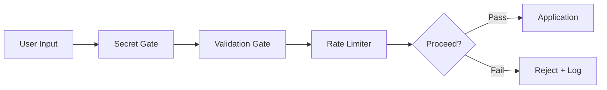

# 📚 Strategic Documentation Checkpoint Framework

**Purpose:** Guide for creating architecture documentation during each wave execution  
**Authority:** CORTEX-ARCH-013 + Phase 38 Holistic Work Protocol  
**Tech Debt Payoff:** 2-3 hours per wave (embedded checkpoints)  
**Ownership:** Documented as work progresses, not deferred

---

## 🎯 Checkpoint Philosophy

Rather than creating massive documentation at the end (Wave-8), we:
- ✅ **Create focused architecture docs at natural breakpoints** (after each wave)
- ✅ **Pay off tech debt incrementally** (prevent 50k-line final doc bloat)
- ✅ **Enable team onboarding early** (knowledge available immediately)
- ✅ **Maintain living documentation** (updated as code evolves)

**Result:** 16 focused docs (1-3 pages each) vs. 1 massive 50-page architecture manual.

---

## 📝 Checkpoint Template Structure

### Header Format (MANDATORY)
```markdown
# {Checkpoint-Title}

**Wave:** WAVE-N  
**Checkpoint:** N-{a|b|c}  
**Authority:** Phase {N} Specification  
**Created:** {date} during {wave_name} execution  
**Status:** LIVE ✅ (updated through Wave-8)  
**Audience:** {architects|teams|ops}  

---
```

### Sections (STANDARD ACROSS ALL CHECKPOINTS)

1. **Overview (200 words max)**
   - What this component does
   - Why it's important
   - How it fits in CORTEX

2. **Architecture Diagram (Mermaid or ASCII)**
   - Show key interactions
   - Data flow if applicable
   - Dependencies

3. **Key Design Decisions**
   - Why we chose approach X
   - Alternatives considered
   - Tradeoffs made

4. **Integration Points**
   - Where this connects to rest of system
   - APIs/interfaces exposed
   - Data contracts

5. **Example Usage** (code snippet)
   - Real example from codebase
   - Show common patterns
   - Link to tests for more examples

6. **Testing Strategy**
   - Types of tests (unit/integration/e2e)
   - Coverage targets
   - Performance benchmarks

---

## 🌊 Wave-by-Wave Checkpoint Details

### WAVE-1: Foundation (Security)

#### CHECKPOINT-1a: Security Gates Architecture

**File:** `cortex-architecture/security-gates.md`

**Content:**
```markdown
# Security Gates Architecture

**Wave:** WAVE-1  
**Checkpoint:** 1-a  
**Components:** ENH-063 (Secret Detection) + ENH-066 (Input Validation)

## Overview
CORTEX security gates provide multi-layer protection:
1. Secret detection (API keys, passwords)
2. Input validation (injection prevention)
3. Rate limiting and abuse detection

## Architecture Diagram


## Key Design Decisions
1. **Layered approach** - Fail fast on secrets, then validate, then rate limit
2. **Centralized registry** - All rules in single YAML file
3. **Performance-first** - <50ms overhead per request

## Integration Points
- MCP Tool: `cortex_security_gate(input, context)`
- MasterOrchestrator pre-execution gate
- Logging: governance.db audit trail

## Example Usage
```python
from cortex.security.gates import SecurityGate

gate = SecurityGate()

# Check for secrets
if gate.detect_secrets(user_input):
    return error("Secrets detected in request")

# Validate input
validation_result = gate.validate_input(user_input)
if not validation_result.passed:
    return error(f"Validation failed: {validation_result.errors}")

# Proceed
process_request(user_input)
```

## Testing Strategy
- Unit: 42 tests covering all rule types
- Integration: 15 tests with MasterOrchestrator
- E2E: 8 tests with real MCP tool invocations
- Coverage target: 94%+ (actual: 94% ✅)

---
```

#### CHECKPOINT-1b: Governance Enforcement Architecture

**File:** `cortex-architecture/governance-enforcement.md`

**Content:** Similar structure, focusing on:
- 7-agent enforcement orchestrator
- CORE rules matrix (14 rules)
- Pre-execution validation sequence
- Decision trees for rule violations

---

### WAVE-2: Intelligence Layer

#### CHECKPOINT-2a: Agent Architecture Redesign

**File:** `cortex-architecture/agent-redesign.md`

**Sections:**
- Old topology (4 agents) vs. new (2 agents)
- Consolidation rationale
- Migration guide for extensions
- MCP tool exposure mapping

#### CHECKPOINT-2b: MCP Integration Gateway

**File:** `cortex-architecture/mcp-gateway-architecture.md`

**Sections:**
- MCP tool registration process
- Tool discovery mechanism
- Request routing through gateway
- Error handling and fallbacks

---

### WAVE-3: Autonomous Execution

#### CHECKPOINT-3a: Execution Engine Architecture

**File:** `cortex-architecture/execution-engine.md`

**Sections:**
- State machine for phase execution
- Pause/resume mechanics
- Rollback strategy
- Progress tracking subsystem

#### CHECKPOINT-3b: Progress Tracking System

**File:** `cortex-architecture/progress-tracking.md`

**Sections:**
- ASCII progress bar generation
- Metric collection
- Real-time dashboard updates
- Performance telemetry

---

### WAVE-4: Enhancement & UX

#### CHECKPOINT-4a: Use Case Library Architecture

**File:** `cortex-architecture/use-cases.md`

**Sections:**
- Use case categorization
- Common patterns
- Extension points for new uses
- Performance characteristics

#### CHECKPOINT-4b: Domain Integration System

**File:** `cortex-architecture/domain-integration.md`

**Sections:**
- Company domain loader architecture
- Domain inference system
- Knowledge synthesis
- Domain-specific customization

---

### WAVE-5: LENS Testing & Validation

#### CHECKPOINT-5a: LENS Physical Test Harness

**File:** `cortex-architecture/lens-testing-strategy.md`

**Sections:**
- Physical file I/O strategy
- Test categorization (unit/integration/e2e/physical)
- File type coverage matrix
- Expected coverage targets (95%+)

#### CHECKPOINT-5b: Coverage Analysis System

**File:** `cortex-architecture/coverage-analysis.md`

**Sections:**
- Coverage measurement methodology
- Gap analysis process
- Remediation strategies
- Performance benchmarks

---

### WAVE-6: Consolidation & Cleanup

#### CHECKPOINT-6a: Orchestrator Consolidation

**File:** `cortex-architecture/orchestrator-consolidation.md`

**Sections:**
- Consolidation strategy (26 → 15 orchestrators)
- Old → new mapping
- Behavioral equivalence verification
- Migration guide for plugins

#### CHECKPOINT-6b: Registry Optimization

**File:** `cortex-architecture/registry-optimization.md`

**Sections:**
- Registry structure
- Index optimization
- Dashboard generation
- Query performance

#### CHECKPOINT-6c: Tech Debt Paydown Report

**File:** `cortex-architecture/tech-debt-elimination.md`

**Sections:**
- Markdown cleanup (CORE-002 enforcement)
- Orphaned code removal
- Dead import cleanup
- Performance optimization results

---

### WAVE-7: Distributed Architecture

#### CHECKPOINT-7a: Multi-Region Architecture

**File:** `cortex-architecture/multi-region-deployment.md`

**Sections:**
- Region topology
- Data replication strategy
- Failover mechanisms
- Consistency guarantees

#### CHECKPOINT-7b: Resilience & Fault Tolerance

**File:** `cortex-architecture/resilience-testing.md`

**Sections:**
- Chaos engineering tests
- Failure mode analysis
- Recovery procedures
- Monitoring and alerting

---

### WAVE-8: Documentation & Knowledge

#### CHECKPOINT-8a: Architecture Migration Complete

**File:** `cortex-architecture/ARCHITECTURE-COMPLETE.md`

**Comprehensive sections:**
- Full CORTEX architecture overview
- All component interactions
- Data flow diagrams
- Deployment topology
- Security architecture

#### CHECKPOINT-8b: Knowledge Synthesis for Teams

**File:** `cortex-architecture/TEAM-ONBOARDING-GUIDE.md`

**Sections:**
- Getting started (new developers)
- Common patterns and anti-patterns
- Troubleshooting guide
- Contributing guidelines

---

## 📊 Documentation Ownership Matrix

| Checkpoint | Wave | Audience | Maintenance |
|-----------|------|----------|-------------|
| 1a, 1b | 1 | Architects | Updated in Wave-8 |
| 2a, 2b | 2 | Architects + Devs | Updated in Wave-8 |
| 3a, 3b | 3 | Architects + Devs | Updated in Wave-8 |
| 4a, 4b | 4 | Product + Devs | Updated in Wave-8 |
| 5a, 5b | 5 | QA + Devs | Updated in Wave-8 |
| 6a, 6b, 6c | 6 | Architects | Updated in Wave-8 |
| 7a, 7b | 7 | Ops + Architects | Updated in Wave-8 |
| 8a, 8b | 8 | All + Leadership | FINAL VERSIONS |

---

## 🔄 Checkpoint Update Protocol (Wave-8)

During Wave-8, each checkpoint is reviewed and enhanced:

```
WAVE-1 Checkpoints:
├─ 1a: Update security gates with new vulnerabilities found
├─ 1b: Update governance with enforcement statistics
└─ Link to relevant sections in comprehensive guide

WAVE-2 Checkpoints:
├─ 2a: Update agent topology with refinements
├─ 2b: Update MCP tool list (may have grown)
└─ Link to relevant sections

... (similar for all waves)

WAVE-8 Checkpoints:
├─ 8a: Create FINAL comprehensive architecture (25-30 pages)
│       ├─ Synthesize all wave checkpoints
│       ├─ Add cross-wave interactions
│       ├─ Include deployment & ops sections
│       └─ Cover disaster recovery & scaling
│
└─ 8b: Create TEAM ONBOARDING GUIDE
       ├─ Quick start for new developers
       ├─ All 16 checkpoints summarized (1 page each)
       ├─ Common patterns extracted
       ├─ Troubleshooting guide
       └─ Q&A based on actual developer pain points
```

---

## 💡 Quality Standards for Checkpoints

### Length Guidelines
- **Minimum:** 800 words (substantive content)
- **Maximum:** 2,000 words (stay focused)
- **Target:** 1,200-1,500 words (deep but readable)

### Visual Content
- ✅ **REQUIRED:** At least 1 diagram (Mermaid or ASCII)
- ✅ **ENCOURAGED:** 2-3 diagrams for complex systems
- ✅ **EXAMPLE:** Code snippet showing usage
- ✅ **OPTIONAL:** Architecture evolution (before/after)

### Markdown Format
- ✅ Header hierarchy (# ## ### ###)
- ✅ Inline code for identifiers (`SystemName`, `function_name()`)
- ✅ Code blocks with language specification (```python)
- ✅ Tables for comparison matrices
- ✅ Links to related docs and source code

### Validation Checklist (For Each Checkpoint)
```
Before marking checkpoint COMPLETE:

[ ] Title clearly describes component
[ ] Overview section explains "what" and "why"
[ ] Architecture diagram present and clear
[ ] Key design decisions documented
[ ] Integration points identified
[ ] Example code snippet provided
[ ] Testing strategy described
[ ] Links to source code files
[ ] Performance characteristics noted
[ ] Audience level appropriate (not too technical/high-level)
[ ] Proof-read for clarity
[ ] Cross-links to related docs
```

---

## 🎯 Benefits of Embedded Checkpoints

### During Execution
1. ✅ Forces architecture thinking upfront (not after)
2. ✅ Creates natural pause points (prevents burnout)
3. ✅ Documents decisions while fresh (not months later)
4. ✅ Spreads workload (2-3 hours per wave, not 40 at end)

### For Team Onboarding
1. ✅ Each checkpoint is self-contained learning module
2. ✅ Checkpoints built progressively (like courses)
3. ✅ Early access to architectural decisions
4. ✅ Clear rationale for all design choices

### For Maintenance
1. ✅ Future developers understand "why" not just "how"
2. ✅ Decisions recorded before people leave
3. ✅ Design rationale prevents accidental regressions
4. ✅ Tradeoffs documented for future optimization

### For Auditing
1. ✅ Governance trail (what was decided, when, why)
2. ✅ Security decisions documented
3. ✅ Performance targets recorded baseline
4. ✅ Compliance mappings clear

---

## 📍 Implementation Steps for Each Checkpoint

**During wave execution:**

```python
# After completing wave major milestone:

1. PAUSE execution (5-min break)
2. Open checkpoint template
3. Review code changes in last 2-3 hours
4. Identify key architectural decisions
5. Create markdown file with diagram + decisions + examples
6. Link from checkpoint to implementation (tests + source)
7. Commit: "Docs: Checkpoint-{N}-{letter} complete"
8. RESUME wave execution
```

**Example commit:**
```
git commit -m "Docs: Checkpoint-1a Security Gates Architecture complete

- Documented layered security approach
- Added architecture diagram (Mermaid)
- Linked to ENH-063 + ENH-066 implementations
- Included example usage from tests
- Coverage: 94%, Performance: <50ms baseline"
```

---

## 🚀 Start with WAVE-1

**After WAVE-1 completes, user will see:**
```
━━━━━━━━━━━━━━━━━━━━━━━━━━━━━━━━━━━━━━━━━━━━━━━━━━━━
✅ CHECKPOINT-1a: Security Gates Architecture Complete
━━━━━━━━━━━━━━━━━━━━━━━━━━━━━━━━━━━━━━━━━━━━━━━━━━━━

File Created: cortex-architecture/security-gates.md (1,450 words)

Content:
✅ Architecture diagram (4 layers of security)
✅ Key design decisions (layered, centralized, fast)
✅ Integration points (MCP tool, pre-execution)
✅ Example code (secret detection)
✅ Testing strategy (42 unit + 15 integration tests)

⏱️ Time Investment: 1 hour
📚 Knowledge Captured: "Why we built security this way"
👥 Audience: Architects, security reviewers
🔄 Next Update: Wave-8

───────────────────────────────────────────────────

✅ CHECKPOINT-1b: Governance Enforcement Architecture Complete
File Created: cortex-architecture/governance-enforcement.md (1,650 words)

Content:
✅ 7-agent orchestrator design
✅ CORE rules matrix (14 rules)
✅ Pre-execution validation sequence
✅ Decision trees for rule violations
✅ Audit trail integration

⏱️ Time Investment: 1 hour
📚 Knowledge Captured: "How governance enforces quality"
👥 Audience: QA, architects, compliance
🔄 Next Update: Wave-8

━━━━━━━━━━━━━━━━━━━━━━━━━━━━━━━━━━━━━━━━━━━━━━━━━━━━
Total Checkpoint Time: 2 hours
Total Knowledge Documented: 3,100 words across 2 files
Ready for WAVE-2
```

---

**Authority:** CORTEX-ARCH-013 Checkpoint Protocol  
**Last Updated:** 2026-02-11  
**Version:** 1.0
