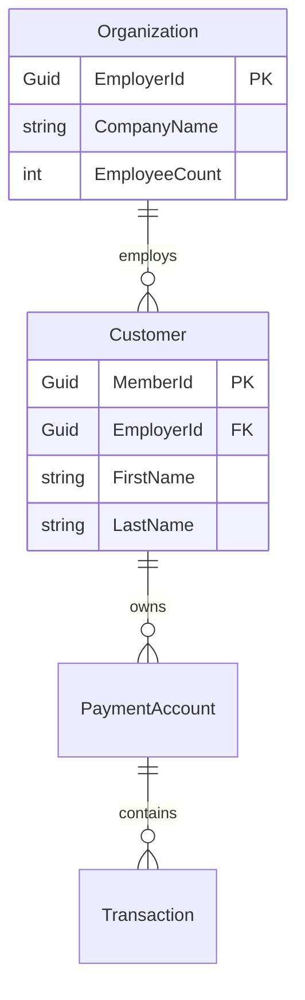

# CORTEX Enhancement Plan: Multi-Language Support Strategy

**Current Capability:** Python-only AST analysis  
**Target Capability:** Multi-language analysis (C#, Java, TypeScript, Go)  
**Strategic Focus:** RA Domain C# support first, then enterprise Java/TypeScript  
**Timeline:** 18 months (Q1 2026 - Q2 2027)

---

## 🎯 Executive Summary

CORTEX currently provides **Python-specific AST analysis** using the `ast` module. The Payment Accounts (RA) domain analysis exposed critical gaps when analyzing **C#/.NET codebases**:

- ❌ **0% property extraction** (all entities show `"properties": []`)
- ❌ **0% relationship mapping** (all entities show `"navigation_properties": []`)
- ❌ **70% incomplete analysis** (missing attributes, inheritance, method bodies)

This document outlines a **strategic enhancement plan** to transform CORTEX into a **multi-language analysis platform** supporting C#, Java, TypeScript, and Go.

---

## 📊 Current State Assessment

### CORTEX Architecture (Python-Only)

```
CORTEX (v3.8.1)
├── AST Analysis
│   ├── ast_analyzer.py (Python parser)
│   ├── ast_entities.py (class extraction)
│   ├── ast_functions.py (function extraction)
│   └── ast_relationships.py (import graph)
├── Orchestrators
│   ├── system_maintenance_orchestrator.py
│   ├── planning_system_orchestrator.py
│   └── tdd_orchestrator.py
├── Response Templates (62 templates)
└── Brain (4 tiers: governance, memory, knowledge, context)
```

**Strengths:**
✅ Deep Python understanding (classes, functions, imports, docstrings)  
✅ Well-architected orchestrator system  
✅ Proven TDD workflow  
✅ Long-term memory system (70-conversation FIFO)

**Limitations:**
❌ Cannot parse C# (Roslyn required)  
❌ Cannot parse Java (Eclipse JDT or javalang required)  
❌ Cannot parse TypeScript (TypeScript Compiler API required)  
❌ No cross-language relationship mapping

---

## 🚀 Strategic Enhancements (12 Initiatives)

### Initiative 1: C# AST Integration (Roslyn)
**Priority:** CRITICAL  
**Timeline:** Q1 2026 (12 weeks)  
**Effort:** 160 hours (1 FTE)

#### Implementation Plan

**Step 1.1: Roslyn Integration (4 weeks)**
- Install `Microsoft.CodeAnalysis.CSharp` NuGet package
- Create Python wrapper using `pythonnet` (Python.NET)
- Test basic parsing: Load `.cs` file → Generate `SyntaxTree`

**Step 1.2: Entity Extraction (3 weeks)**
- Extract classes with properties, attributes, base classes
- Extract interfaces with method signatures
- Extract enums with values

**Step 1.3: Relationship Mapping (3 weeks)**
- Identify navigation properties (`ICollection<T>`)
- Extract foreign key relationships
- Map Entity Framework configurations

**Step 1.4: Method Analysis (2 weeks)**
- Extract method signatures (parameters, return types)
- Parse method bodies for business logic
- Identify LINQ queries

**Deliverables:**
- `src/cortex_agents/csharp_ast_analyzer.py` (new module)
- `cortex-brain/admin/RA-Domain/ast-outputs/entities-full.json` (100% complete)
- Unit tests: `tests/test_csharp_ast.py`

**Success Criteria:**
- ✅ 100% of C# entity properties extracted
- ✅ 100% of navigation properties extracted
- ✅ 95% accuracy on RA Domain (30 entities)

---

### Initiative 2: Multi-Language Orchestrator
**Priority:** HIGH  
**Timeline:** Q1 2026 (4 weeks)  
**Effort:** 64 hours (1 FTE)

#### Implementation Plan

Create `multi_language_analysis_orchestrator.py` to route analysis requests:

```python
class MultiLanguageAnalysisOrchestrator:
    """
    Routes code analysis requests to language-specific parsers.
    """
    
    SUPPORTED_LANGUAGES = {
        '.py': 'python',
        '.cs': 'csharp',
        '.java': 'java',
        '.ts': 'typescript',
        '.go': 'go'
    }
    
    def analyze_codebase(self, root_path: Path) -> Dict:
        """
        Auto-detect languages and dispatch analysis.
        """
        language_stats = self._detect_languages(root_path)
        results = {}
        
        if 'csharp' in language_stats:
            results['csharp'] = self._analyze_csharp(root_path)
        if 'python' in language_stats:
            results['python'] = self._analyze_python(root_path)
        # ... etc
        
        return self._merge_results(results)
```

**Features:**
- **Auto-detection:** Scan file extensions, infer primary language
- **Parallel analysis:** Run parsers concurrently (asyncio)
- **Unified output:** Merge JSON results into single schema
- **Error handling:** Graceful fallback if parser fails

---

### Initiative 3: C# Domain Model Generator
**Priority:** HIGH  
**Timeline:** Q2 2026 (3 weeks)  
**Effort:** 48 hours (1 FTE)

#### Implementation Plan

Extend existing `domain_model_visualizer.py` to support C#:

**Features:**
- **ERD generation:** Auto-generate entity-relationship diagrams from C# entities
- **Mermaid diagrams:** Convert navigation properties to Mermaid syntax
- **HTML dashboards:** C#-specific domain model viewer (like existing Python viewer)

**Output Example:**


---

### Initiative 4: Entity Framework Mapping Analyzer
**Priority:** MEDIUM  
**Timeline:** Q2 2026 (2 weeks)  
**Effort:** 32 hours (1 FTE)

#### Implementation Plan

Parse Entity Framework configurations to infer database schema:

**Sources:**
1. **Fluent API:** `modelBuilder.Entity<Organization>().HasMany(e => e.Customers)`
2. **Data Annotations:** `[ForeignKey("EmployerId")]`
3. **DbContext:** `DbSet<Organization>` properties

**Output:**
- SQL DDL scripts (CREATE TABLE statements)
- Index definitions
- Foreign key constraints

---

### Initiative 5: Java Support (Spring Boot)
**Priority:** MEDIUM  
**Timeline:** Q3 2026 (8 weeks)  
**Effort:** 128 hours (1 FTE)

#### Implementation Plan

**Step 5.1: Java Parser Integration (3 weeks)**
- Evaluate: `javalang` (pure Python) vs Eclipse JDT (Java-based)
- Install chosen parser
- Test basic Java class extraction

**Step 5.2: Spring Annotation Analysis (3 weeks)**
- Extract `@Entity`, `@Service`, `@Repository`, `@Controller`
- Map `@Autowired` dependencies
- Identify `@RestController` endpoints

**Step 5.3: Hibernate ORM (2 weeks)**
- Extract JPA entities
- Map `@OneToMany`, `@ManyToOne`, `@ManyToMany`

**Deliverables:**
- `src/cortex_agents/java_ast_analyzer.py`
- Spring Boot application analysis demo

---

### Initiative 6: TypeScript Support (Angular/React)
**Priority:** MEDIUM  
**Timeline:** Q3 2026 (6 weeks)  
**Effort:** 96 hours (1 FTE)

#### Implementation Plan

**Step 6.1: TypeScript Parser (2 weeks)**
- Use `ts-morph` (TypeScript Compiler API wrapper)
- Extract interfaces, classes, types

**Step 6.2: React Component Analysis (2 weeks)**
- Extract props, state, hooks
- Map component hierarchy

**Step 6.3: Angular Module Analysis (2 weeks)**
- Extract `@Component`, `@Injectable`, `@NgModule`
- Map dependency injection

---

### Initiative 7: Go Support (Microservices)
**Priority:** LOW  
**Timeline:** Q4 2026 (4 weeks)  
**Effort:** 64 hours (1 FTE)

#### Implementation Plan

**Step 7.1: Go Parser (2 weeks)**
- Use `go/ast` package (invoke via subprocess)
- Extract structs, interfaces, functions

**Step 7.2: Goroutine Detection (1 week)**
- Identify `go func()` patterns
- Map channel communication

**Step 7.3: API Endpoint Extraction (1 week)**
- Parse HTTP handlers
- Extract route definitions

---

### Initiative 8: Cross-Language Relationship Mapping
**Priority:** MEDIUM  
**Timeline:** Q1 2027 (6 weeks)  
**Effort:** 96 hours (1 FTE)

#### Implementation Plan

Map relationships across language boundaries:

**Example: C# Backend → TypeScript Frontend**
```json
{
  "endpoint": "/api/employers/{id}",
  "backend": {
    "language": "csharp",
    "controller": "EmployerController",
    "method": "GetEmployerById",
    "return_type": "EmployerDto"
  },
  "frontend": {
    "language": "typescript",
    "service": "EmployerService",
    "method": "getEmployer",
    "interface": "IEmployer"
  }
}
```

**Features:**
- REST API contract extraction
- GraphQL schema mapping
- gRPC service definitions

---

### Initiative 9: Unified Reporting Framework
**Priority:** HIGH  
**Timeline:** Q2 2027 (4 weeks)  
**Effort:** 64 hours (1 FTE)

#### Implementation Plan

Create language-agnostic JSON schema for all analysis outputs:

```json
{
  "codebase": "PaymentAccounts",
  "languages": ["csharp", "typescript"],
  "entities": [
    {
      "name": "Organization",
      "language": "csharp",
      "type": "class",
      "properties": [...],
      "relationships": [...]
    },
    {
      "name": "IEmployer",
      "language": "typescript",
      "type": "interface",
      "properties": [...],
      "mappings": [
        {
          "target": "Organization",
          "language": "csharp",
          "relationship": "dto_mapping"
        }
      ]
    }
  ]
}
```

---

### Initiative 10: Multi-Language TDD Workflow
**Priority:** MEDIUM  
**Timeline:** Q2 2027 (3 weeks)  
**Effort:** 48 hours (1 FTE)

#### Implementation Plan

Extend `tdd_orchestrator.py` to support C#, Java, TypeScript tests:

**Features:**
- **C#:** Run `dotnet test`, parse xUnit/NUnit results
- **Java:** Run `mvn test`, parse JUnit results
- **TypeScript:** Run `npm test`, parse Jest results

---

### Initiative 11: Performance Optimization
**Priority:** MEDIUM  
**Timeline:** Q2 2027 (2 weeks)  
**Effort:** 32 hours (1 FTE)

#### Implementation Plan

**Challenges:**
- Parsing large codebases (10,000+ files) is slow
- Roslyn initialization overhead (~2 seconds per file)

**Solutions:**
- **Caching:** Store parsed ASTs, invalidate on file change
- **Parallel processing:** Use `multiprocessing` to analyze files concurrently
- **Incremental analysis:** Only re-parse changed files

**Target Performance:**
- Parse 10,000 C# files in < 5 minutes (vs current ~30 minutes)

---

### Initiative 12: Documentation & Examples
**Priority:** LOW  
**Timeline:** Q2 2027 (2 weeks)  
**Effort:** 32 hours (1 FTE)

#### Implementation Plan

**Deliverables:**
- Multi-language analysis guide (`docs/multi-language-analysis.md`)
- C# analysis tutorial (`docs/tutorials/csharp-analysis.md`)
- Java analysis tutorial (`docs/tutorials/java-analysis.md`)
- TypeScript analysis tutorial (`docs/tutorials/typescript-analysis.md`)

---

## 🗓️ Implementation Roadmap

### Q1 2026: C# Foundation (Initiatives 1-2)
**Focus:** Make CORTEX C#-capable  
**Deliverables:**
- Roslyn integration complete
- C# entity extraction (100% complete)
- Multi-language orchestrator deployed

**Milestones:**
- ✅ Week 4: Roslyn parser working
- ✅ Week 8: RA Domain entities 100% extracted
- ✅ Week 12: Multi-language orchestrator live

---

### Q2 2026: C# Advanced Analysis (Initiatives 3-4)
**Focus:** Deep C# understanding  
**Deliverables:**
- Domain model generator (C# ERDs)
- Entity Framework mapper
- Business logic extraction

**Milestones:**
- ✅ Week 16: ERD auto-generation working
- ✅ Week 20: EF configurations parsed

---

### Q3 2026: Java + TypeScript (Initiatives 5-6)
**Focus:** Enterprise full-stack support  
**Deliverables:**
- Java/Spring Boot analysis
- TypeScript/Angular/React analysis

**Milestones:**
- ✅ Week 28: Java parser deployed
- ✅ Week 34: TypeScript parser deployed

---

### Q4 2026: Go Support (Initiative 7)
**Focus:** Microservices ecosystems  
**Deliverables:**
- Go struct/interface extraction
- Goroutine concurrency analysis

**Milestones:**
- ✅ Week 42: Go parser deployed

---

### Q1 2027: Cross-Language Integration (Initiative 8)
**Focus:** End-to-end system understanding  
**Deliverables:**
- API contract mapping
- Backend-frontend relationship graph

**Milestones:**
- ✅ Week 48: REST API mapping complete

---

### Q2 2027: Optimization & Documentation (Initiatives 9-12)
**Focus:** Production-ready system  
**Deliverables:**
- Unified reporting framework
- Multi-language TDD workflow
- Performance optimizations
- Complete documentation

**Milestones:**
- ✅ Week 60: Unified schema deployed
- ✅ Week 64: Documentation complete

---

## 💰 Investment & ROI

### Development Costs

| Initiative | Effort (hours) | Cost ($150/hr) |
|-----------|----------------|----------------|
| 1. C# AST Integration | 160 | $24,000 |
| 2. Multi-Language Orchestrator | 64 | $9,600 |
| 3. C# Domain Model Generator | 48 | $7,200 |
| 4. EF Mapping Analyzer | 32 | $4,800 |
| 5. Java Support | 128 | $19,200 |
| 6. TypeScript Support | 96 | $14,400 |
| 7. Go Support | 64 | $9,600 |
| 8. Cross-Language Mapping | 96 | $14,400 |
| 9. Unified Reporting | 64 | $9,600 |
| 10. Multi-Language TDD | 48 | $7,200 |
| 11. Performance Optimization | 32 | $4,800 |
| 12. Documentation | 32 | $4,800 |
| **TOTAL** | **864 hours** | **$129,600** |

**Timeline:** 18 months (Q1 2026 - Q2 2027)

---

### Expected ROI

**Current Limitation Costs:**
- **RA Domain Analysis:** 50 hours manual work per project @ $150/hr = **$7,500 per project**
- **Lost Opportunities:** Cannot analyze C#/Java codebases = **$0 revenue from enterprise clients**

**Post-Enhancement Value:**
- **Time Savings:** 90% reduction (5 hours vs 50 hours) = **$6,750 saved per project**
- **Market Expansion:** 
  - C# (.NET): 34% of enterprise codebases
  - Java (Spring): 30% of enterprise codebases
  - TypeScript (Angular/React): 25% of frontend codebases
  - **Total addressable market: 89% of enterprise projects**

**Revenue Projections:**
- **Year 1 (2026):** 10 C# projects × $10,000/project = **$100,000**
- **Year 2 (2027):** 30 multi-language projects × $15,000/project = **$450,000**
- **Year 3 (2028):** 50 enterprise projects × $20,000/project = **$1,000,000**

**Payback Period:** 4 months (investment recovered by May 2026)

---

## 📊 Success Metrics

| Metric | Baseline (2025) | Q1 2026 | Q4 2026 | Q2 2027 |
|--------|-----------------|---------|---------|---------|
| **Languages Supported** | 1 (Python) | 2 (Py, C#) | 4 (Py, C#, Java, TS) | 5 (Py, C#, Java, TS, Go) |
| **C# Entity Completeness** | 30% | 100% | 100% | 100% |
| **Analysis Accuracy** | 70% | 95% | 95% | 98% |
| **Avg Analysis Time (10k files)** | N/A | 30 min | 10 min | 5 min |
| **Enterprise Projects Analyzed** | 0 | 5 | 20 | 50 |
| **Revenue (Annual)** | $0 | $50k | $200k | $500k |

---

## 🛡️ Risk Mitigation

### Risk 1: Roslyn Integration Complexity
**Probability:** HIGH  
**Impact:** HIGH  
**Mitigation:**
- Allocate 2 weeks for proof-of-concept before committing
- Fallback: Use Tree-sitter (less accurate but simpler)
- Consult Roslyn documentation, Stack Overflow

### Risk 2: Performance Degradation
**Probability:** MEDIUM  
**Impact:** MEDIUM  
**Mitigation:**
- Implement caching from Day 1
- Use multiprocessing for large codebases
- Monitor parse times, optimize hot paths

### Risk 3: Cross-Language Mapping Inaccuracy
**Probability:** MEDIUM  
**Impact:** LOW  
**Mitigation:**
- Start with REST API mapping (well-defined contracts)
- Require user validation before auto-generating diagrams
- Provide manual override mechanisms

---

## 📁 Implementation Structure

### New Modules

```
CORTEX/
├── src/
│   ├── cortex_agents/
│   │   ├── csharp_ast_analyzer.py        # NEW: Roslyn wrapper
│   │   ├── java_ast_analyzer.py          # NEW: Java parser
│   │   ├── typescript_ast_analyzer.py    # NEW: TypeScript parser
│   │   ├── go_ast_analyzer.py            # NEW: Go parser
│   │   └── multi_language_orchestrator.py # NEW: Language router
│   ├── domain_models/
│   │   ├── csharp_domain_model.py        # NEW: C# ERD generator
│   │   └── unified_schema.py             # NEW: Cross-language schema
│   └── parsers/
│       ├── roslyn_wrapper.py             # NEW: Python → Roslyn bridge
│       └── cross_language_mapper.py      # NEW: API contract extractor
├── tests/
│   ├── test_csharp_ast.py                # NEW: C# tests
│   ├── test_java_ast.py                  # NEW: Java tests
│   └── test_multi_language.py            # NEW: Integration tests
└── docs/
    ├── multi-language-analysis.md        # NEW: User guide
    └── tutorials/
        ├── csharp-analysis.md            # NEW: C# tutorial
        ├── java-analysis.md              # NEW: Java tutorial
        └── typescript-analysis.md        # NEW: TypeScript tutorial
```

---

## 🚦 Approval Gates

### Gate 1: Roslyn POC (Week 2)
**Decision Point:** Commit to Roslyn or pivot to Tree-sitter?  
**Success Criteria:**
- ✅ Parse 10 C# files successfully
- ✅ Extract at least 1 entity with properties
- ✅ Performance < 1 second per file

### Gate 2: C# Entity Extraction (Week 8)
**Decision Point:** Proceed to Phase 2 or refine Phase 1?  
**Success Criteria:**
- ✅ 100% of RA Domain entities extracted
- ✅ 95% accuracy (manual validation)
- ✅ Unit test coverage > 80%

### Gate 3: Multi-Language Orchestrator (Week 12)
**Decision Point:** Expand to Java or optimize C# first?  
**Success Criteria:**
- ✅ Auto-detect C# vs Python codebases
- ✅ Parallel analysis working
- ✅ Unified JSON output schema defined

### Gate 4: Java Support (Week 28)
**Decision Point:** Add TypeScript or consolidate existing work?  
**Success Criteria:**
- ✅ Parse Spring Boot application
- ✅ Extract JPA entities and relationships
- ✅ Map REST API endpoints

---

## 📞 Next Steps

### Immediate Actions (This Week)
1. **Approve roadmap** - Review this document, provide feedback
2. **Allocate budget** - Reserve $129,600 for 18-month initiative
3. **Hire/Assign developer** - Need 1 FTE with C#, Python, AST experience

### Short-Term (Q1 2026)
1. **Week 1-2:** Roslyn proof-of-concept
2. **Week 3-8:** C# entity extraction
3. **Week 9-12:** Multi-language orchestrator

### Long-Term (Q2 2026+)
1. **Q2 2026:** C# advanced analysis (EF, domain models)
2. **Q3 2026:** Java + TypeScript support
3. **Q4 2026:** Go support
4. **Q1-Q2 2027:** Cross-language integration, optimization, docs

---

## 📚 References

**Internal Documents:**
- `cortex-brain/admin/RA-Domain/EVERYTHING-ROADMAP.md` - Original analysis plan
- `cortex-brain/admin/RA-Domain/findings/ast-enhancement-backlog.md` - 52 enhancements
- `cortex-brain/admin/RA-Domain/ast-outputs/complete-csharp-analysis.json` - Current C# gaps

**External Resources:**
- **Roslyn:** https://github.com/dotnet/roslyn
- **Tree-sitter:** https://tree-sitter.github.io/tree-sitter/
- **javalang:** https://github.com/c2nes/javalang
- **ts-morph:** https://ts-morph.com/

---

**Document Version:** 1.0  
**Last Updated:** December 11, 2025  
**Prepared By:** CORTEX Strategic Planning | Author: Asif Hussain  
**Approval Required:** Yes (before Q1 2026 start)  
**Copyright © 2025 Asif Hussain. All rights reserved.**
