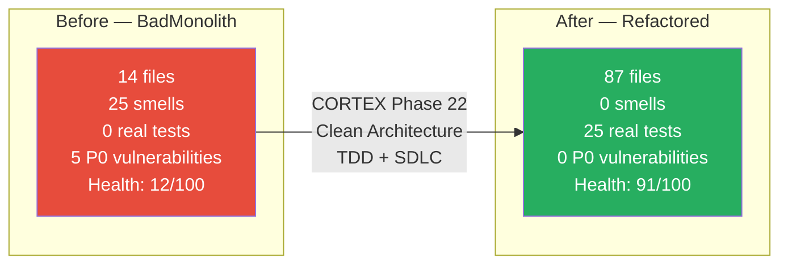

# Comparison Documents — Index

> **Source:** `BadMonolith/` → `Refactored/` | **Generated by:** CORTEX Phase 22
> Deep before-vs-after analysis across 8 dimensions with Mermaid diagrams.

## Documents

| # | Document | Focus Area | Diagrams |
|---|----------|-----------|----------|
| 1 | [Architecture Comparison](architecture-comparison.md) | Monolith → Clean Architecture, DI, layer boundaries | 2 component graphs, metrics table |
| 2 | [Security Comparison](security-comparison.md) | SQL injection, secrets, passwords, CORS, error disclosure | Threat flow, sequence diagrams, scoreboard |
| 3 | [Code Quality Comparison](code-quality-comparison.md) | SOLID, naming, dead code, dependency graph, smell traceability | 6 Mermaid diagrams, 25-smell matrix |
| 4 | [Testing Comparison](testing-comparison.md) | Test pyramid, anti-patterns, coverage heat map | 4 Mermaid diagrams, anti-pattern table |
| 5 | [Frontend Comparison](frontend-comparison.md) | God Component → services, type safety, API patterns | 5 Mermaid diagrams, sequence diagrams |
| 6 | [Data Model Comparison](data-model-comparison.md) | ER diagrams, schema changes, type system, FK/indexes | 4 Mermaid ER/graphs, column matrix |
| 7 | [File Structure Comparison](file-structure-comparison.md) | Directory tree, file count growth, SRP validation | 3 Mermaid trees, bar chart |
| 8 | [Metrics Dashboard](metrics-dashboard.md) | KPIs, defect density, risk timeline, complexity | 6 Mermaid charts, gantt, full KPI table |

## Summary

## How to View

All diagrams use **Mermaid** syntax. To render:

1. **VS Code** — Install "Markdown Preview Mermaid Support" extension
2. **GitHub** — Renders Mermaid natively in `.md` files
3. **CLI** — Use `mmdc` (Mermaid CLI): `npx @mermaid-js/mermaid-cli -i file.md -o file.svg`
