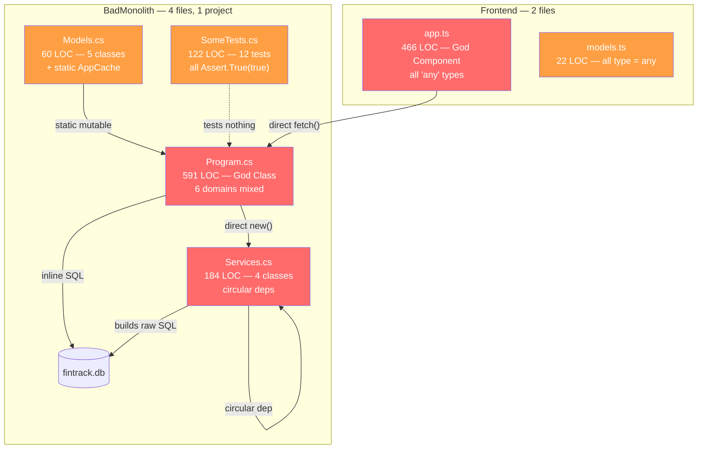
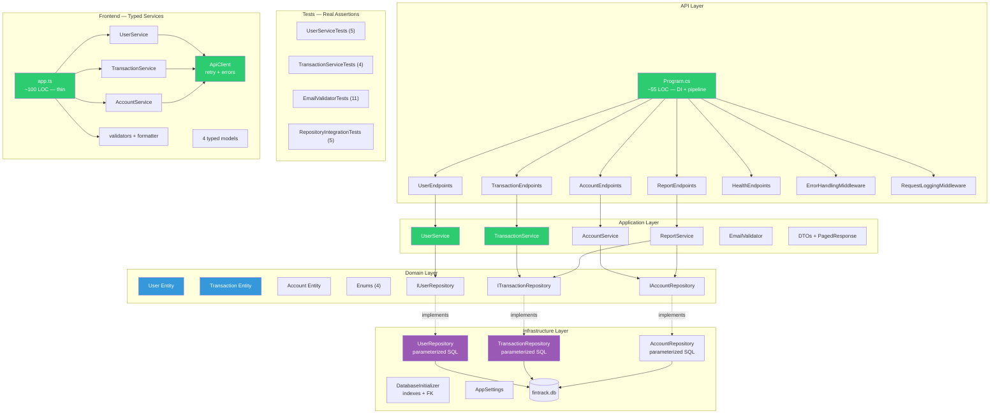

# Architecture Comparison — Before vs After

> **Source:** `BadMonolith/` → `Refactored/` | **Generated by:** CORTEX Phase 22

## Before: BadMonolith Architecture (Flat Monolith)

## After: Refactored Architecture (Clean Architecture)

## Side-by-Side Metrics

| Metric | Before (BadMonolith) | After (Refactored) | Delta |
|--------|---------------------|--------------------:|------:|
| Backend files | 4 (.cs) | 35 (.cs/.csproj/.sln) | +31 |
| Frontend files | 3 (.ts/.html) | 13 (.ts/.html/.json) | +10 |
| Total LOC (backend) | ~957 | ~2,200 | +130% |
| Program.cs LOC | 591 (God Class) | ~55 (thin DI) | −91% |
| app.ts LOC | 466 (God Component) | ~100 (thin) | −79% |
| C# projects | 1 | 5 (Domain/App/Infra/Api/Tests) | +4 |
| Domains in one file | 6 | 1 per file | −83% |
| Test quality | 12 × Assert.True(true) | 25 real assertions | +25 |
| `any` types (TS) | 22+ | 0 | −100% |
| SQL injection points | 4 | 0 | −100% |
| Hardcoded secrets | 5 | 0 | −100% |
| CORS policy | AllowAnyOrigin() | WithOrigins(config) | ✅ Fixed |
| Pagination | None | All list endpoints | ✅ Added |
| Error handling | Empty catch / stack trace | ProblemDetails (RFC 7807) | ✅ Fixed |
| Dead code classes | 2 (NotificationService, ReportGenerator) | 0 | −100% |
