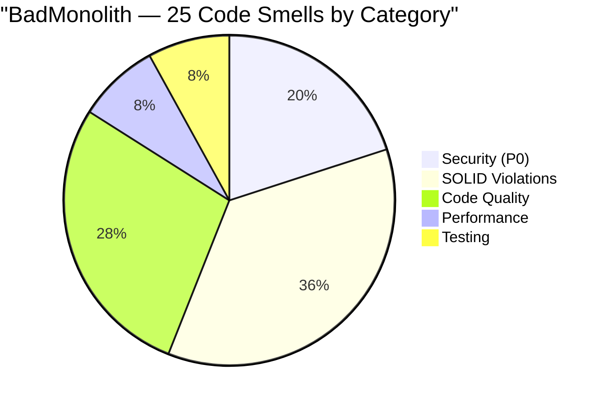
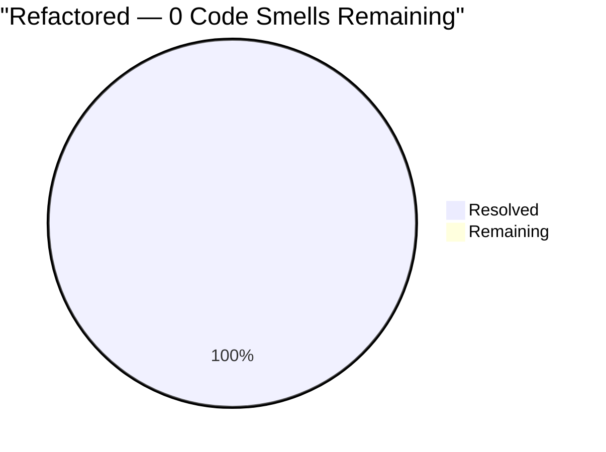
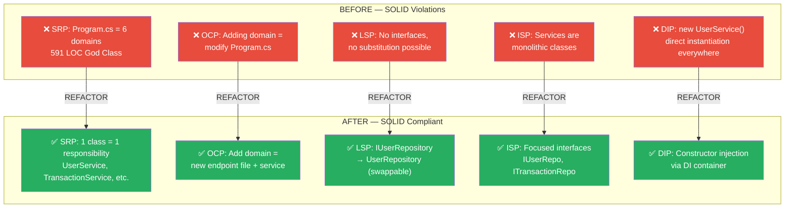
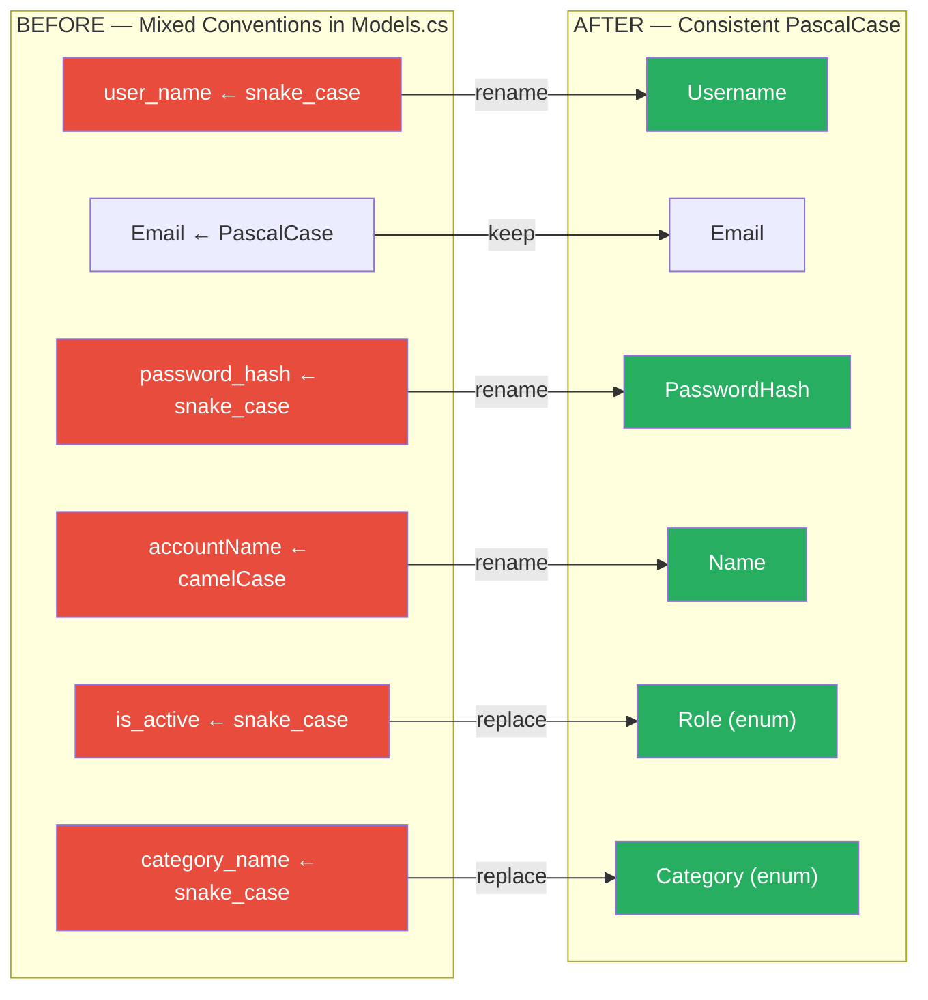
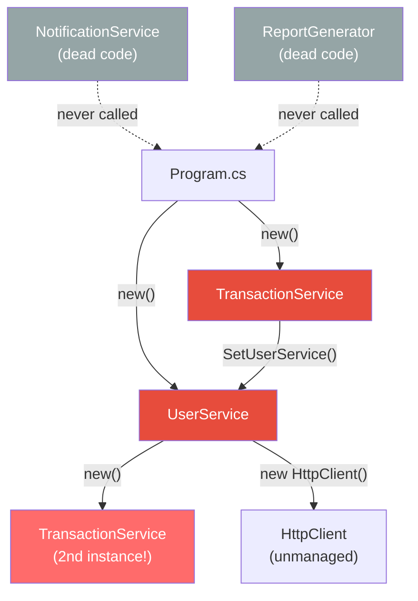
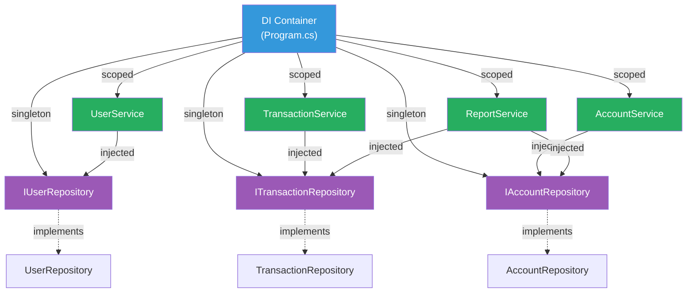

# Code Quality Comparison — Before vs After

> **Source:** `BadMonolith/` → `Refactored/` | **Generated by:** CORTEX Phase 22
> 25 annotated code smells resolved across 5 categories.

## Smell Distribution — Before vs After

## SOLID Principles — Before vs After

## Naming Convention Violations (SMELL-7)

## Dependency Graph — Before vs After

### Before: Circular Dependencies + Direct Instantiation

### After: Clean Dependency Injection (Acyclic)

## Dead Code Elimination

| Dead Code Item | Location (Before) | Status (After) |
|---------------|-------------------|----------------|
| `NotificationService` class (62 LOC) | Services.cs | 🗑️ Deleted |
| `ReportGenerator` class (25 LOC) | Services.cs | 🗑️ Deleted |
| `SendWelcomeEmail()` method | UserService | 🗑️ Deleted |
| `ExportUserData()` method | UserService | 🗑️ Deleted |
| `GetUserCreditScore()` method | UserService | 🗑️ Deleted |
| `ArchiveOldTransactions()` method | TransactionService | 🗑️ Deleted |
| `calculateCompoundInterest()` function | app.ts | 🗑️ Deleted |
| `generatePdfReport()` function | app.ts | 🗑️ Deleted |
| `exportToExcel()` function | app.ts | 🗑️ Deleted |
| `AppCache` static class | Models.cs | 🗑️ Deleted |
| `Report` model class | Models.cs | 🗑️ Deleted |
| **Total dead code removed** | | **~200 LOC** |

## Smell-to-Fix Traceability Matrix

| Smell | Category | Before (File) | After (Fix) |
|-------|----------|---------------|-------------|
| SMELL-1 | 🔴 Security | SQL string concat in Program.cs + Services.cs | `@param` in all Repository classes |
| SMELL-2 | 🔴 Security | Password hash exposed in GET response | `UserDto` excludes `PasswordHash` |
| SMELL-3 | 🔴 SOLID | God Class — 591 LOC Program.cs | 5 endpoint files, 4 services |
| SMELL-4 | 🔴 SOLID | Infrastructure in startup | `DatabaseInitializer` class |
| SMELL-5 | 🔴 SOLID | Circular dep UserService ↔ TransactionService | Constructor injection, no cycles |
| SMELL-6 | 🟡 Perf | No pagination anywhere | `PagedResponse<T>` + LIMIT/OFFSET |
| SMELL-7 | 🟡 Quality | Mixed naming (snake/camel/Pascal) | PascalCase for C#, camelCase for TS |
| SMELL-8 | 🟡 Quality | 6 dead methods + 2 dead classes | All removed |
| SMELL-9 | 🟡 Quality | No API versioning | `/api/v1/` prefix |
| SMELL-10 | 🟡 Quality | Duplicate email validation (3 copies) | Single `EmailValidator` class |
| SMELL-11 | 🟡 Quality | `Console.WriteLine` everywhere | `ILogger<T>` structured logging |
| SMELL-12 | 🔴 Testing | 12 × `Assert.True(true)` | 25 real assertions (Theory + Fact) |
| SMELL-13 | 🔴 Security | CORS `AllowAnyOrigin()` | `WithOrigins(config[])` |
| SMELL-14 | 🟡 Perf | No retry on HTTP calls | `ApiClient` with retry + backoff |
| SMELL-15 | 🟡 Quality | Magic numbers/strings (15+ instances) | Enums + config constants |
| SMELL-16 | 🔴 SOLID | Global mutable `AppCache` | Stateless services, DI scoping |
| SMELL-17 | 🔴 SOLID | No DI — `new Service()` everywhere | Built-in DI container |
| SMELL-18 | 🔴 Security | `ex.ToString()` in response | `ErrorHandlingMiddleware` |
| SMELL-19 | 🟡 Quality | No validation attributes | `[Required]` `[Range]` `[Email]` |
| SMELL-20 | 🟡 Quality | No audit fields | `CreatedAt`, `UpdatedAt` on all entities |
| SMELL-21 | 🔴 SOLID | God Component — 466 LOC app.ts | ~100 LOC thin app.ts + services |
| SMELL-22 | 🟡 Quality | `any` everywhere in TypeScript | Typed interfaces, `strict: true` |
| SMELL-23 | 🔴 SOLID | Biz logic in UI layer | Service layer + utils |
| SMELL-24 | 🔴 SOLID | Direct `fetch()` calls | `ApiClient` service abstraction |
| SMELL-25 | 🟡 Quality | No error handling (silent failures) | try/catch + error banner + retry |
