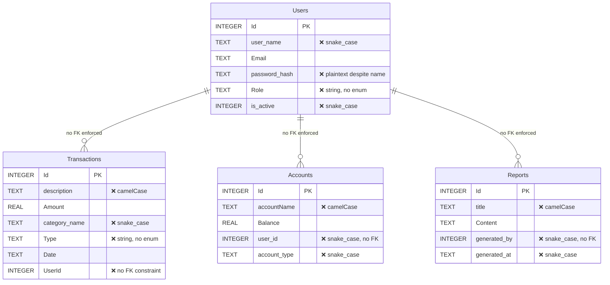
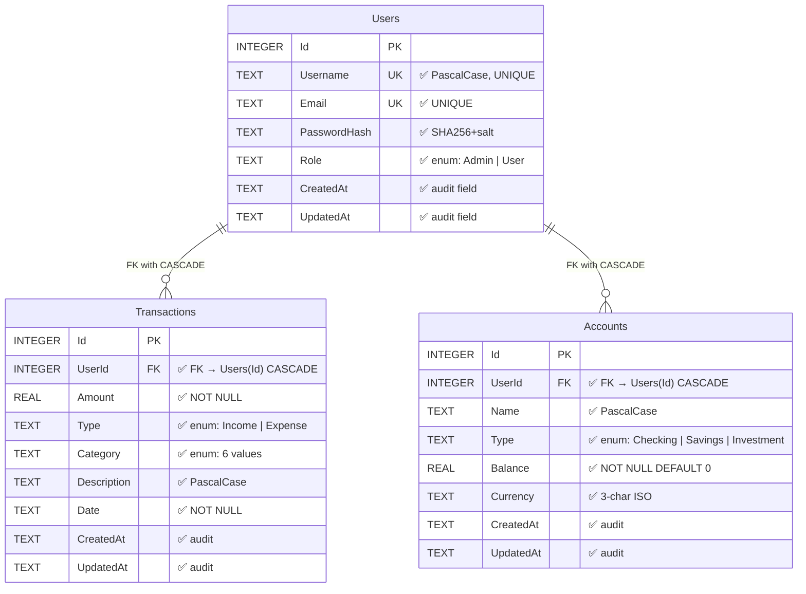
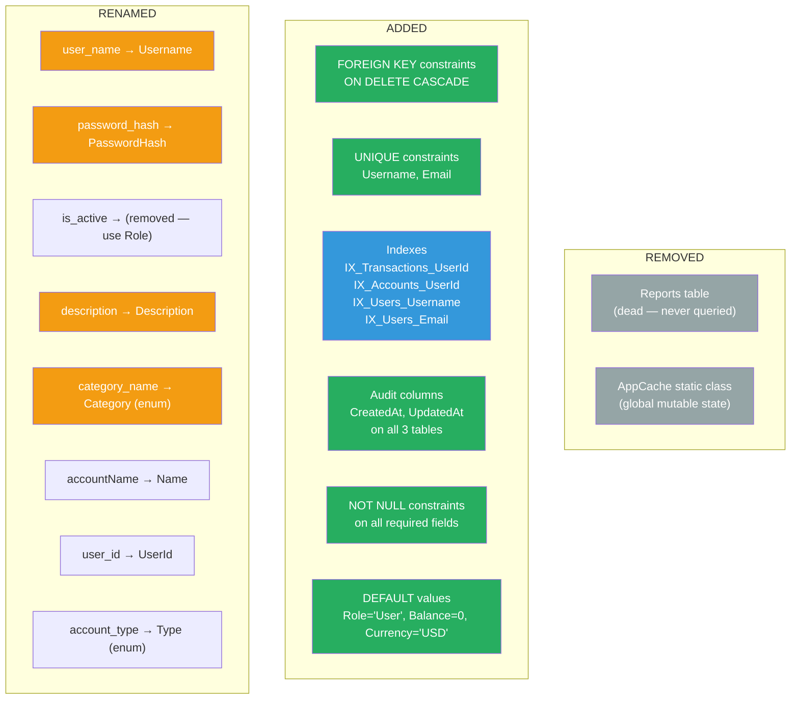
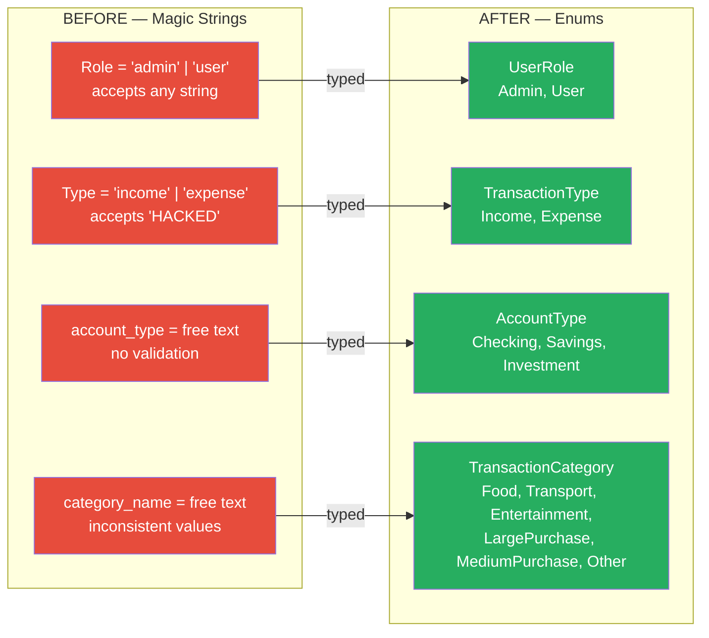

# Data Model Comparison — Before vs After

> **Source:** `BadMonolith/backend/Models/Models.cs` → `Refactored/backend/CortexLabs.FinTrack.Domain/`
> **Generated by:** CORTEX Phase 22

## Entity-Relationship — Before vs After

### Before: Flat Models (No Relationships, No Constraints)

### After: Normalized with Constraints, FKs, Indexes

## Schema Changes Detail

## Type System — Before vs After

## Column-Level Change Matrix

| Table | Column (Before) | Column (After) | Change |
|-------|----------------|----------------|--------|
| Users | `user_name TEXT` | `Username TEXT NOT NULL UNIQUE` | Renamed + constraint |
| Users | `Email TEXT` | `Email TEXT NOT NULL UNIQUE` | Added NOT NULL + UNIQUE |
| Users | `password_hash TEXT` (plaintext!) | `PasswordHash TEXT NOT NULL` (SHA256+salt) | Renamed + hashed |
| Users | `Role TEXT DEFAULT 'user'` | `Role TEXT NOT NULL DEFAULT 'User'` | Enum-backed |
| Users | `is_active INTEGER` | *(removed)* | Role-based instead |
| Users | *(missing)* | `CreatedAt TEXT NOT NULL` | Added audit |
| Users | *(missing)* | `UpdatedAt TEXT NOT NULL` | Added audit |
| Transactions | `description TEXT` | `Description TEXT NOT NULL DEFAULT ''` | Renamed + default |
| Transactions | `Amount REAL` | `Amount REAL NOT NULL` | Added NOT NULL |
| Transactions | `category_name TEXT` | `Category TEXT NOT NULL DEFAULT 'Other'` | Renamed + enum |
| Transactions | `Type TEXT` | `Type TEXT NOT NULL` | Added NOT NULL + enum |
| Transactions | `UserId INTEGER` | `UserId INTEGER NOT NULL FK` | Added FK + CASCADE |
| Transactions | *(missing)* | `CreatedAt, UpdatedAt` | Added audit |
| Accounts | `accountName TEXT` | `Name TEXT NOT NULL` | Renamed + NOT NULL |
| Accounts | `Balance REAL` | `Balance REAL NOT NULL DEFAULT 0` | Added default |
| Accounts | `user_id INTEGER` | `UserId INTEGER NOT NULL FK` | Renamed + FK |
| Accounts | `account_type TEXT` | `Type TEXT NOT NULL DEFAULT 'Checking'` | Renamed + enum |
| Accounts | *(missing)* | `Currency TEXT NOT NULL DEFAULT 'USD'` | Added |
| Accounts | *(missing)* | `CreatedAt, UpdatedAt` | Added audit |
| Reports | *(entire table)* | *(removed)* | Dead table deleted |
