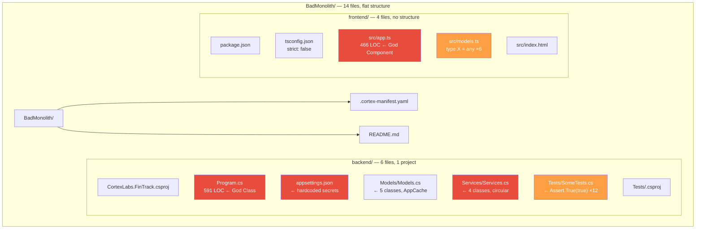
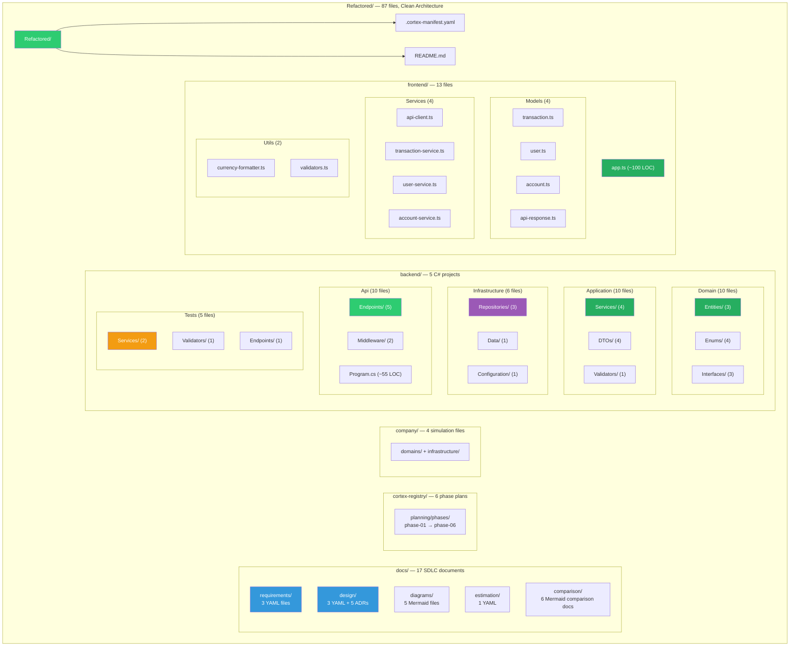

# File Structure Comparison — Before vs After

> **Source:** `BadMonolith/` → `Refactored/` | **Generated by:** CORTEX Phase 22
> From 14 files (flat) → 87 files (Clean Architecture + full SDLC docs)

## Directory Tree — Before

## Directory Tree — After

## Growth Summary

```mermaid
xychart-beta
    title "File Count by Category"
    x-axis ["Backend", "Frontend", "Docs", "Registry", "Company", "Root"]
    y-axis "File Count" 0 --> 50
    bar [6, 4, 0, 0, 0, 2]
    bar [42, 13, 23, 6, 4, 3]
```

| Category | Before | After | Growth |
|----------|--------|-------|--------|
| Backend C# | 6 files (1 project) | 42 files (5 projects) | +600% |
| Frontend TS | 4 files (flat) | 13 files (layered) | +225% |
| SDLC Documentation | 0 files | 23 files | ∞ |
| Planning / Registry | 0 files | 6 files | ∞ |
| Company Simulation | 0 files | 4 files | ∞ |
| Root Config | 2 files | 3 files | +50% |
| **Total** | **14 files** | **87 files** | **+521%** |

> **Note:** More files ≠ more complexity. Each file now has a single responsibility
> (SRP). The _cognitive load per file_ dropped from 591 LOC to ~40 LOC average.
