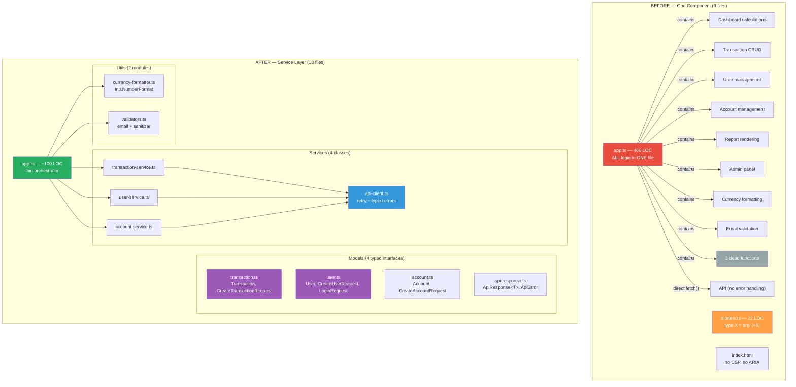
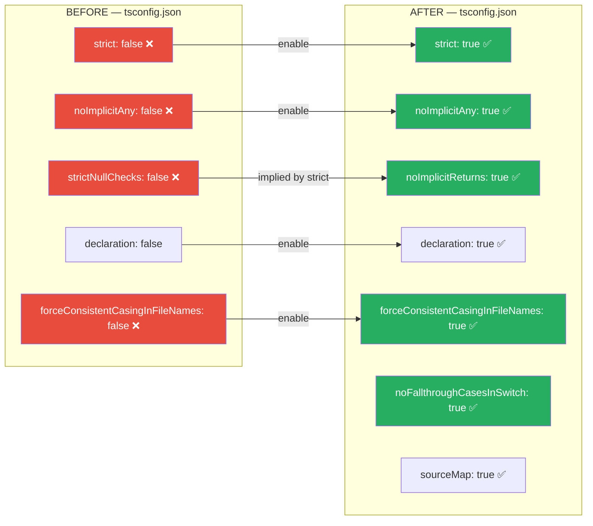
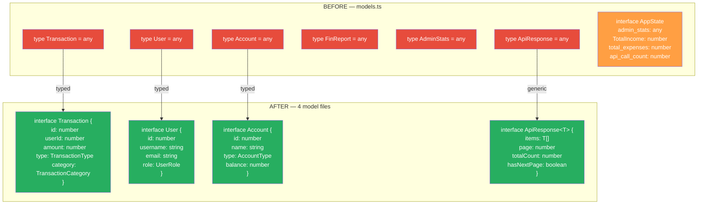
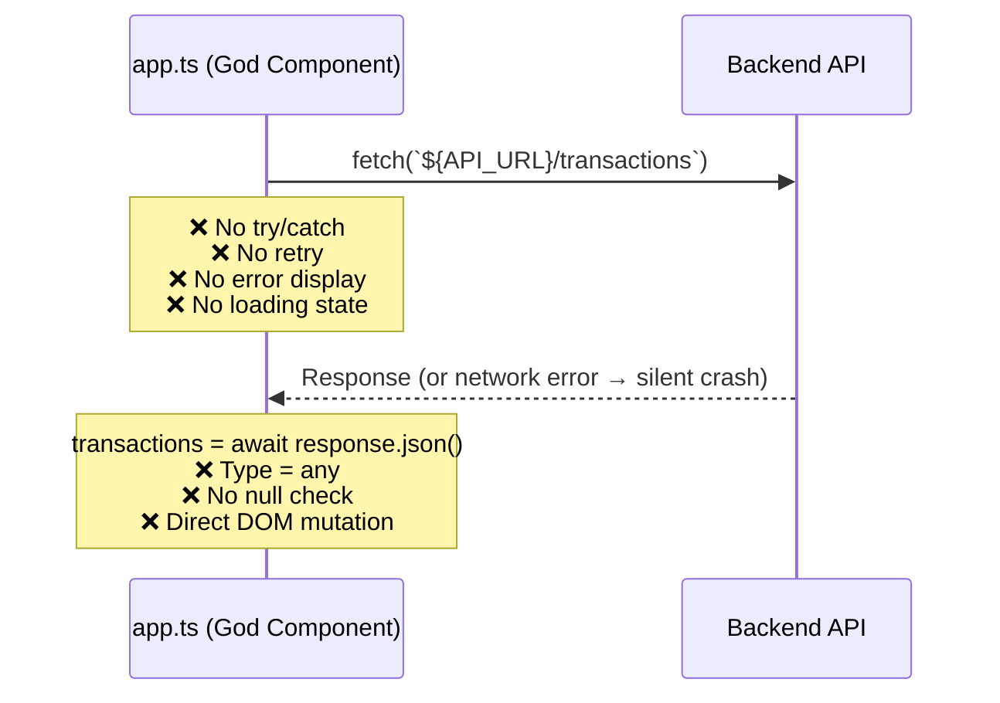
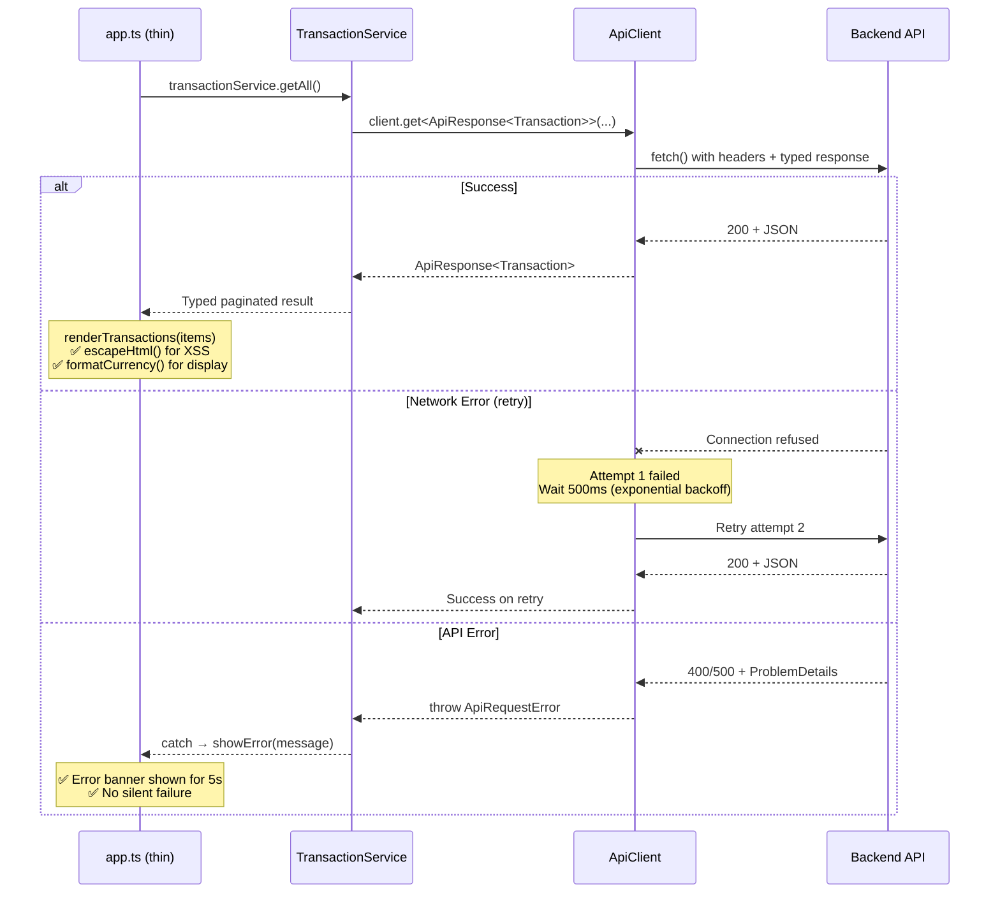

# Frontend Comparison — Before vs After

> **Source:** `BadMonolith/frontend/` → `Refactored/frontend/` | **Generated by:** CORTEX Phase 22
> God Component (466 LOC, all `any`) → Typed service layer (~100 LOC app.ts)

## Component Architecture — Before vs After

## TypeScript Compiler Settings

## Type Safety — Before vs After

## API Call Pattern — Before vs After

### Before: Direct fetch() — No Error Handling

### After: Typed ApiClient — Retry + Error Handling

## Frontend Metrics

| Metric | Before | After | Improvement |
|--------|--------|-------|-------------|
| **Files** | 3 | 13 | +10 (separation of concerns) |
| **app.ts LOC** | 466 | ~100 | −79% |
| **`any` types** | 22+ | 0 | −100% |
| **Global variables** | 13 mutable | 0 | −100% |
| **Direct fetch() calls** | 6 | 0 (ApiClient) | −100% |
| **Error handling** | 0 try/catch | All calls wrapped | ✅ |
| **Retry logic** | None (`MAX_RETRIES = 0`) | Exponential backoff | ✅ |
| **XSS protection** | None | `escapeHtml()` + CSP | ✅ |
| **Dead functions** | 3 | 0 | −100% |
| **TypeScript strict** | `false` | `true` | ✅ |
| **Naming conventions** | Mixed (snake/camel/Pascal) | Consistent camelCase | ✅ |
| **Service abstraction** | None | 4 service classes | ✅ |
