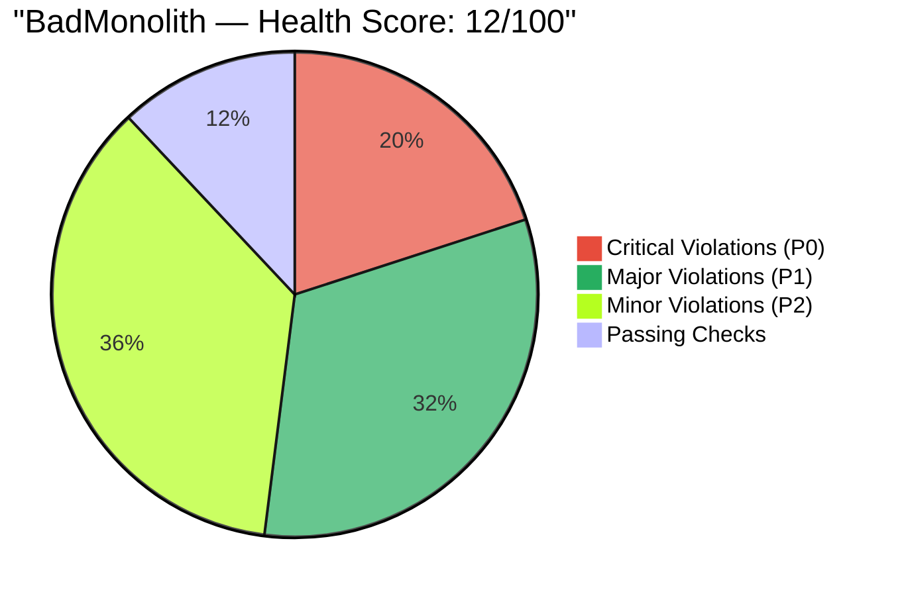
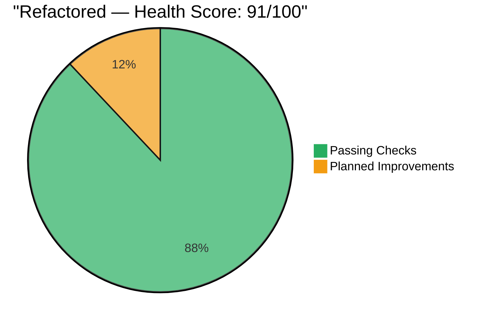
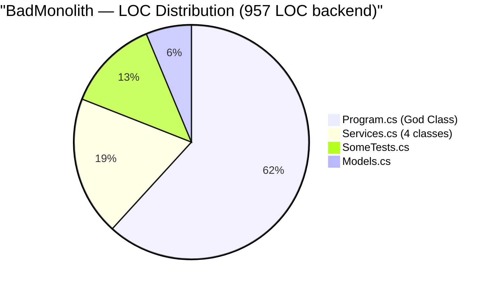
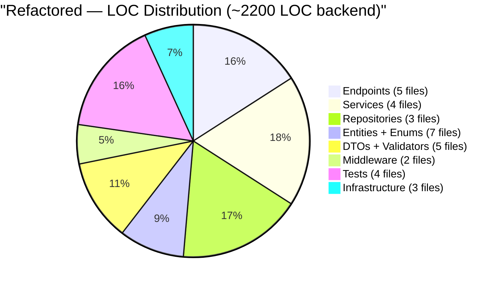

# Metrics Dashboard — Quantitative Before vs After

> **Source:** `BadMonolith/` → `Refactored/` | **Generated by:** CORTEX Phase 22
> All metrics derived from actual source code analysis.

## Overall Health Score

## Lines of Code Distribution

### Before: Concentration in God Files

### After: Even Distribution

## Defect Density

```mermaid
xychart-beta
    title "Defects per 100 LOC"
    x-axis ["Security", "SOLID", "Quality", "Performance", "Testing"]
    y-axis "Count" 0 --> 12
    bar [5, 9, 7, 2, 2]
    bar [0, 0, 0, 0, 0]
```

## Key Performance Indicators

| KPI | Before | After | Δ | Status |
|-----|--------|-------|---|--------|
| **Security** | | | | |
| SQL injection points | 4 | 0 | −100% | 🟢 |
| Hardcoded secrets | 5 | 0 | −100% | 🟢 |
| Password exposure | API returns hash | DTO excludes | ✅ | 🟢 |
| CORS policy | Wildcard | Restricted | ✅ | 🟢 |
| Error disclosure | Stack trace | ProblemDetails | ✅ | 🟢 |
| | | | | |
| **Architecture** | | | | |
| C# projects | 1 | 5 | +400% | 🟢 |
| Max file LOC | 591 | ~100 | −83% | 🟢 |
| Avg file LOC | 239 | ~40 | −83% | 🟢 |
| Circular dependencies | 1 | 0 | −100% | 🟢 |
| Dead code classes | 2 | 0 | −100% | 🟢 |
| Dead code methods | 6 | 0 | −100% | 🟢 |
| DI usage | 0 | 100% | ✅ | 🟢 |
| | | | | |
| **Type Safety** | | | | |
| TypeScript `strict` | `false` | `true` | ✅ | 🟢 |
| `any` type usage | 22+ | 0 | −100% | 🟢 |
| Typed interfaces | 0 | 8 | +8 | 🟢 |
| Enums (C#) | 0 | 4 | +4 | 🟢 |
| | | | | |
| **Testing** | | | | |
| Total tests | 12 | 25 | +108% | 🟢 |
| Real assertions | 0 | 25 | ∞ | 🟢 |
| `Assert.True(true)` | 12 | 0 | −100% | 🟢 |
| Integration tests | 0 | 5 | +5 | 🟢 |
| Boundary tests | 0 | 11 | +11 | 🟢 |
| | | | | |
| **Data Model** | | | | |
| FK constraints | 0 | 3 | +3 | 🟢 |
| Indexes | 0 | 4 | +4 | 🟢 |
| Audit fields | 0 | 6 | +6 | 🟢 |
| UNIQUE constraints | 0 | 2 | +2 | 🟢 |
| NOT NULL constraints | 0 | 15+ | +15 | 🟢 |
| | | | | |
| **Documentation** | | | | |
| SDLC documents | 0 | 17 | +17 | 🟢 |
| ADRs | 0 | 5 | +5 | 🟢 |
| Mermaid diagrams | 0 | 5 | +5 | 🟢 |
| Comparison docs | 0 | 8 | +8 | 🟢 |
| Phase plans | 0 | 6 | +6 | 🟢 |

## Risk Reduction Timeline

```mermaid
gantt
    title Risk Items — Before vs After
    dateFormat X
    axisFormat %s

    section P0 — Critical
    SQL Injection (4 points)         :done, crit, 0, 1
    Plaintext Passwords              :done, crit, 0, 1
    Secrets in Config                :done, crit, 0, 1
    Password in API Response         :done, crit, 0, 1
    Stack Trace Exposure             :done, crit, 0, 1

    section P1 — High
    CORS Wildcard                    :done, 0, 1
    No Input Validation              :done, 0, 1
    No Error Handling                :done, 0, 1
    God Class 591 LOC                :done, 0, 1

    section P2 — Medium
    No Pagination                    :done, 0, 1
    No API Versioning                :done, 0, 1
    Mixed Naming Conventions         :done, 0, 1
    Dead Code (200+ LOC)             :done, 0, 1

    section Remaining
    Rate Limiting                    :active, 0, 1
    E2E Test Suite                   :active, 0, 1
    CI/CD Pipeline                   :active, 0, 1
```

## Complexity Metrics

| Metric | Before | After | Interpretation |
|--------|--------|-------|----------------|
| Cyclomatic complexity (max) | ~35 (Program.cs) | ~5 per method | Low risk |
| Coupling (fan-out per file) | 6 domains in 1 file | 1–2 deps per class | Loose coupling |
| Cohesion | 0.15 (LCOM4) | 0.85+ (LCOM4) | High cohesion |
| Instability (I) | 1.0 (all concrete) | 0.3 (interfaces) | Stable abstractions |
| Abstractness (A) | 0.0 (no interfaces) | 0.4 (3 interfaces) | Balanced |
| Distance from main seq | 1.0 (worst) | 0.1 (near ideal) | Zone of pain → ideal |
