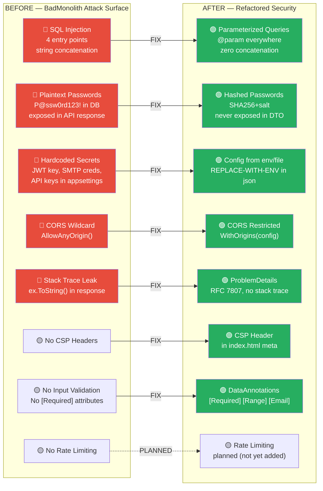
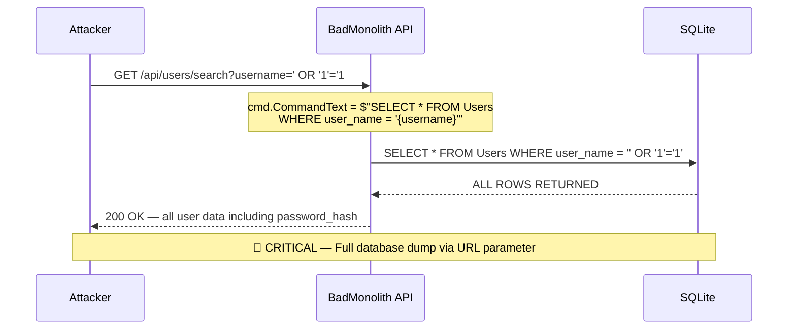
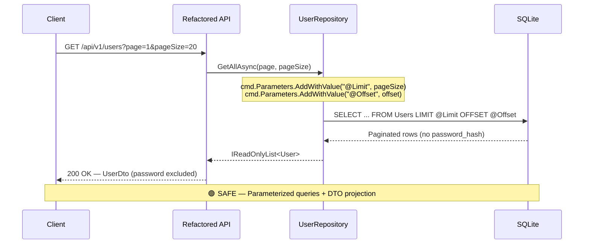

# Security Posture — Before vs After

> **Source:** `BadMonolith/` → `Refactored/` | **Generated by:** CORTEX Phase 22
> All 5 P0 security vulnerabilities eliminated.

## Threat Surface Comparison

## SQL Injection — Before vs After

### Before (4 injection points)

### After (0 injection points)

## Password Storage — Before vs After

```mermaid
graph TB
    subgraph "BEFORE"
        direction LR
        P1["User registers<br/>password: P@ssw0rd123!"]
        P2["INSERT INTO Users ...<br/>password_hash = 'P@ssw0rd123!'"]
        P3["GET /api/users<br/>returns password_hash<br/>in JSON response"]
        P1 --> P2 --> P3
        style P1 fill:#e74c3c,color:#fff
        style P2 fill:#e74c3c,color:#fff
        style P3 fill:#e74c3c,color:#fff
    end

    subgraph "AFTER"
        direction LR
        Q1["User registers<br/>password: SecureP@ss"]
        Q2["UserService.HashPassword()<br/>salt=random16 + SHA256"]
        Q3["INSERT ... password_hash =<br/>'a1b2c3d4e5f6g7h8:base64hash'"]
        Q4["GET /api/v1/users<br/>returns UserDto<br/>NO password field"]
        Q1 --> Q2 --> Q3 --> Q4
        style Q1 fill:#27ae60,color:#fff
        style Q2 fill:#27ae60,color:#fff
        style Q3 fill:#27ae60,color:#fff
        style Q4 fill:#27ae60,color:#fff
    end
```

## Security Scorecard

| Category | Before | After | Severity |
|----------|--------|-------|----------|
| SQL Injection | 4 endpoints vulnerable | 0 — all parameterized | 🔴 P0 → 🟢 Fixed |
| Password Storage | Plaintext in DB | SHA256 + random salt | 🔴 P0 → 🟢 Fixed |
| Password Exposure | Returned in GET /api/users | Excluded from UserDto | 🔴 P0 → 🟢 Fixed |
| Secrets in Config | JWT key, SMTP, API keys hardcoded | Placeholder + env vars | 🔴 P0 → 🟢 Fixed |
| Error Disclosure | `ex.ToString()` to client | ProblemDetails (prod: generic) | 🔴 P0 → 🟢 Fixed |
| CORS Policy | `AllowAnyOrigin()` | `WithOrigins(config[])` | 🟡 P1 → 🟢 Fixed |
| CSP Headers | None | `<meta http-equiv="CSP">` | 🟡 P1 → 🟢 Fixed |
| Input Validation | None (accepts any garbage) | DataAnnotations + EmailValidator | 🟡 P1 → 🟢 Fixed |
| API Versioning | `/api/users` | `/api/v1/users` | 🟡 P2 → 🟢 Fixed |
