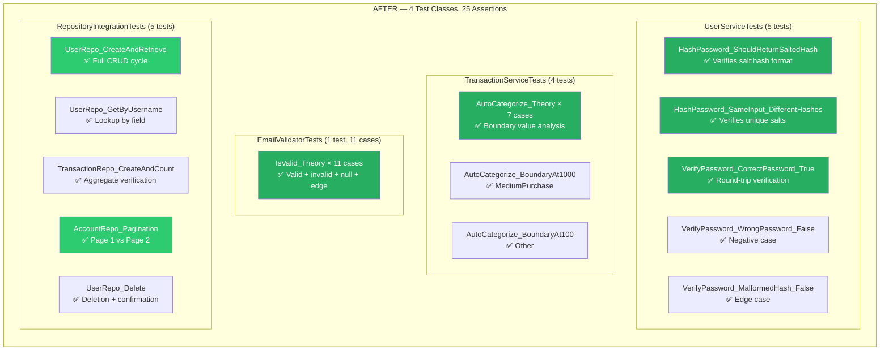
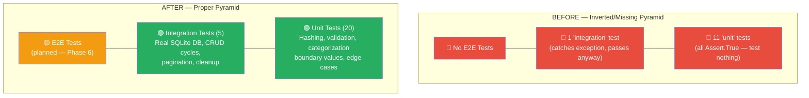
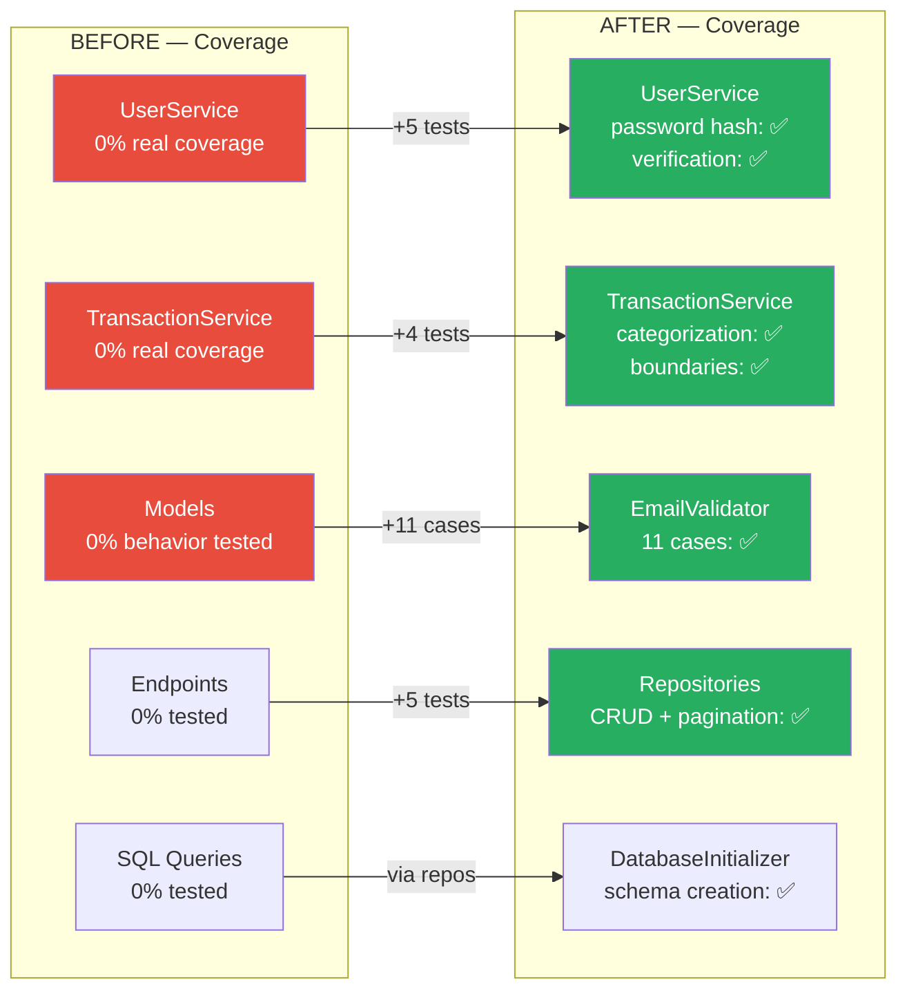

# Testing Comparison — Before vs After

> **Source:** `BadMonolith/` → `Refactored/` | **Generated by:** CORTEX Phase 22
> From 12 meaningless tests to 25 real assertions with behavioral coverage.

## Test Quality — Before vs After

```mermaid
graph TB
    subgraph "BEFORE — SomeTests.cs (122 LOC)"
        direction TB
        BT1["Test1()<br/>Assert.True(true)"]
        BT2["UserService_Should_Work()<br/>Assert.True(1 == 1)"]
        BT3["Transaction_Has_Properties()<br/>Assert.NotNull(new T())"]
        BT4["Account_Balance_Test()<br/>NO assertion at all"]
        BT5["Should_Validate_Email_Format()<br/>calls method, asserts true"]
        BT6["Legacy_Import_Test()<br/>Assert.True(true)"]
        BT7["Another_User_Test()<br/>duplicate of BT2"]
        BT8["Transaction_Categorization_Works()<br/>Assert.Equal(x, x) — tautology"]
        BT9["AccountTests class<br/>completely empty"]
        BT10["Report_Generation_Test()<br/>Skip — would fail"]
        BT11["Report_Export_Test()<br/>Skip — NotImplementedException"]
        BT12["Can_Connect_To_Database()<br/>try { True } catch { True }"]

        style BT1 fill:#e74c3c,color:#fff
        style BT2 fill:#e74c3c,color:#fff
        style BT3 fill:#ff9f43,color:#fff
        style BT4 fill:#e74c3c,color:#fff
        style BT5 fill:#e74c3c,color:#fff
        style BT6 fill:#e74c3c,color:#fff
        style BT7 fill:#e74c3c,color:#fff
        style BT8 fill:#e74c3c,color:#fff
        style BT9 fill:#95a5a6,color:#fff
        style BT10 fill:#95a5a6,color:#fff
        style BT11 fill:#95a5a6,color:#fff
        style BT12 fill:#e74c3c,color:#fff
    end
```

## Test Pyramid

## Test Anti-Pattern Catalogue (Eliminated)

| Anti-Pattern | Before Example | After Fix |
|-------------|---------------|-----------|
| **Tautology** | `Assert.True(true)` | `Assert.Equal(expected, actual)` |
| **Duplicate** | 2 tests with `Assert.True(1==1)` | Unique test per behavior |
| **No Assertion** | `account.Balance = 100; // no assert` | Full round-trip verification |
| **Mock-the-World** | `Assert.Equal("food", "food")` | Call real method, check result |
| **Skipped Forever** | `[Fact(Skip = "Broken since Q1 2023")]` | Implemented or deleted |
| **Empty Class** | `public class AccountTests { }` | Real integration tests |
| **Catch-All Pass** | `catch { Assert.True(true); }` | Proper error assertions |
| **Misleading Name** | `Should_Validate_Email_Format` — doesn't | Name matches behavior tested |

## Coverage Heat Map

