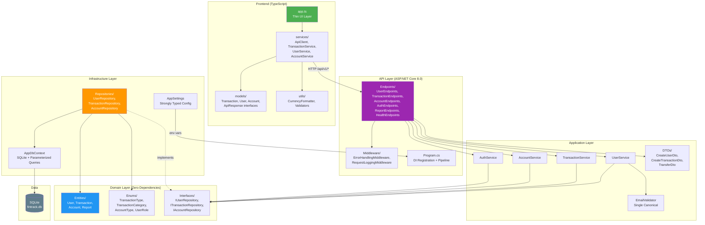

# Component Diagram — CortexLabs FinTrack (Refactored)

```mermaid
graph TB
    subgraph "Frontend (TypeScript)"
        UI[app.ts<br/>Thin UI Layer]
        SVC_FE[services/<br/>ApiClient, TransactionService,<br/>UserService, AccountService]
        MDL_FE[models/<br/>Transaction, User, Account,<br/>ApiResponse interfaces]
        UTL[utils/<br/>CurrencyFormatter, Validators]
    end

    subgraph "API Layer (ASP.NET Core 8.0)"
        EP[Endpoints/<br/>UserEndpoints, TransactionEndpoints,<br/>AccountEndpoints, AuthEndpoints,<br/>ReportEndpoints, HealthEndpoints]
        MW[Middleware/<br/>ErrorHandlingMiddleware,<br/>RequestLoggingMiddleware]
        PRG[Program.cs<br/>DI Registration + Pipeline]
    end

    subgraph "Application Layer"
        US[UserService]
        TS[TransactionService]
        AS[AccountService]
        AUTH[AuthService]
        VAL[EmailValidator<br/>Single Canonical]
        DTO[DTOs/<br/>CreateUserDto,<br/>CreateTransactionDto,<br/>TransferDto]
    end

    subgraph "Domain Layer (Zero Dependencies)"
        ENT[Entities/<br/>User, Transaction,<br/>Account, Report]
        ENUM[Enums/<br/>TransactionType,<br/>TransactionCategory,<br/>AccountType, UserRole]
        IFACE[Interfaces/<br/>IUserRepository,<br/>ITransactionRepository,<br/>IAccountRepository]
    end

    subgraph "Infrastructure Layer"
        REPO[Repositories/<br/>UserRepository,<br/>TransactionRepository,<br/>AccountRepository]
        DB[AppDbContext<br/>SQLite + Parameterized Queries]
        CFG[AppSettings<br/>Strongly Typed Config]
    end

    subgraph "Data"
        SQLITE[(SQLite<br/>fintrack.db)]
    end

    UI --> SVC_FE
    SVC_FE --> MDL_FE
    SVC_FE --> UTL
    SVC_FE -->|HTTP /api/v1/*| EP

    EP --> MW
    EP --> US
    EP --> TS
    EP --> AS
    EP --> AUTH
    EP --> DTO

    US --> VAL
    US --> IFACE
    TS --> IFACE
    AS --> IFACE
    AUTH --> IFACE

    REPO -.->|implements| IFACE
    REPO --> DB
    REPO --> ENT
    REPO --> ENUM
    DB --> SQLITE
    CFG -->|env vars| PRG

    style UI fill:#4CAF50,color:#fff
    style ENT fill:#2196F3,color:#fff
    style REPO fill:#FF9800,color:#fff
    style EP fill:#9C27B0,color:#fff
    style SQLITE fill:#607D8B,color:#fff
```
