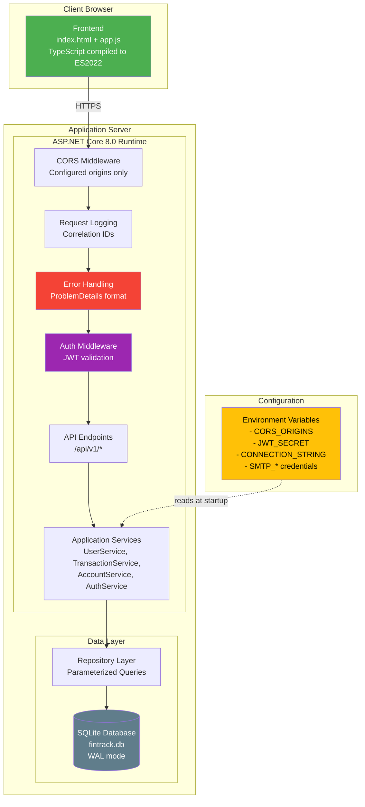

# Deployment Diagram — CortexLabs FinTrack

## Deployment Notes

| Aspect | BadMonolith | Refactored |
|---|---|---|
| Secrets | Hardcoded in appsettings.json | Environment variables |
| CORS | AllowAnyOrigin() | Configured allowlist |
| Middleware | None (catch in global handler) | Pipeline: CORS → Logging → Error → Auth |
| Database | Inline CREATE TABLE in Program.cs | DatabaseInitializer (idempotent) |
| Health | Always returns "healthy" | Checks DB connectivity |
| Error format | Raw stack traces | RFC 7807 ProblemDetails |
