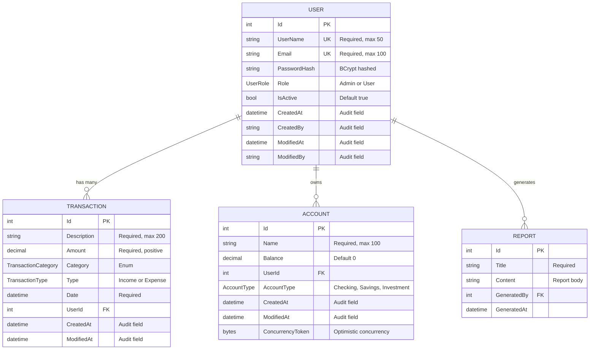

# Entity-Relationship Diagram — CortexLabs FinTrack

## Key Changes from BadMonolith

| Aspect | BadMonolith | Refactored |
|--------|------------|------------|
| Naming | Mixed (snake_case, camelCase, PascalCase) | Consistent PascalCase |
| Types | String for everything | Enums (TransactionType, UserRole, etc.) |
| Audit | No audit fields | CreatedAt, CreatedBy, ModifiedAt, ModifiedBy |
| Validation | None | DataAnnotations + service layer |
| Concurrency | None | ConcurrencyToken on Account |
| Password | Plaintext (named password_hash) | Actual BCrypt hash |
