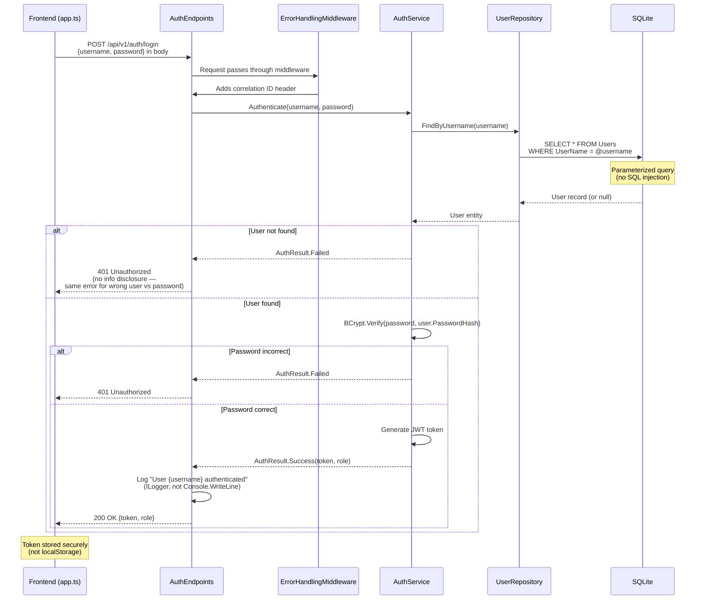

# Sequence Diagram — Authentication Flow

## Security Improvements over BadMonolith

| Vulnerability | BadMonolith | Refactored |
|---|---|---|
| SQL injection in login | `WHERE user_name = '{username}'` | `WHERE UserName = @username` |
| Credentials in URL | Query params `?username=...&password=...` | Request body (POST) |
| Info disclosure | Different error for wrong user vs password | Same 401 for both |
| Token storage | `localStorage.setItem("auth_token", ...)` | Secure cookie or memory |
| Password storage | Plaintext despite field name | BCrypt hash |
| Audit logging | `Console.WriteLine` | `ILogger.LogInformation` |
