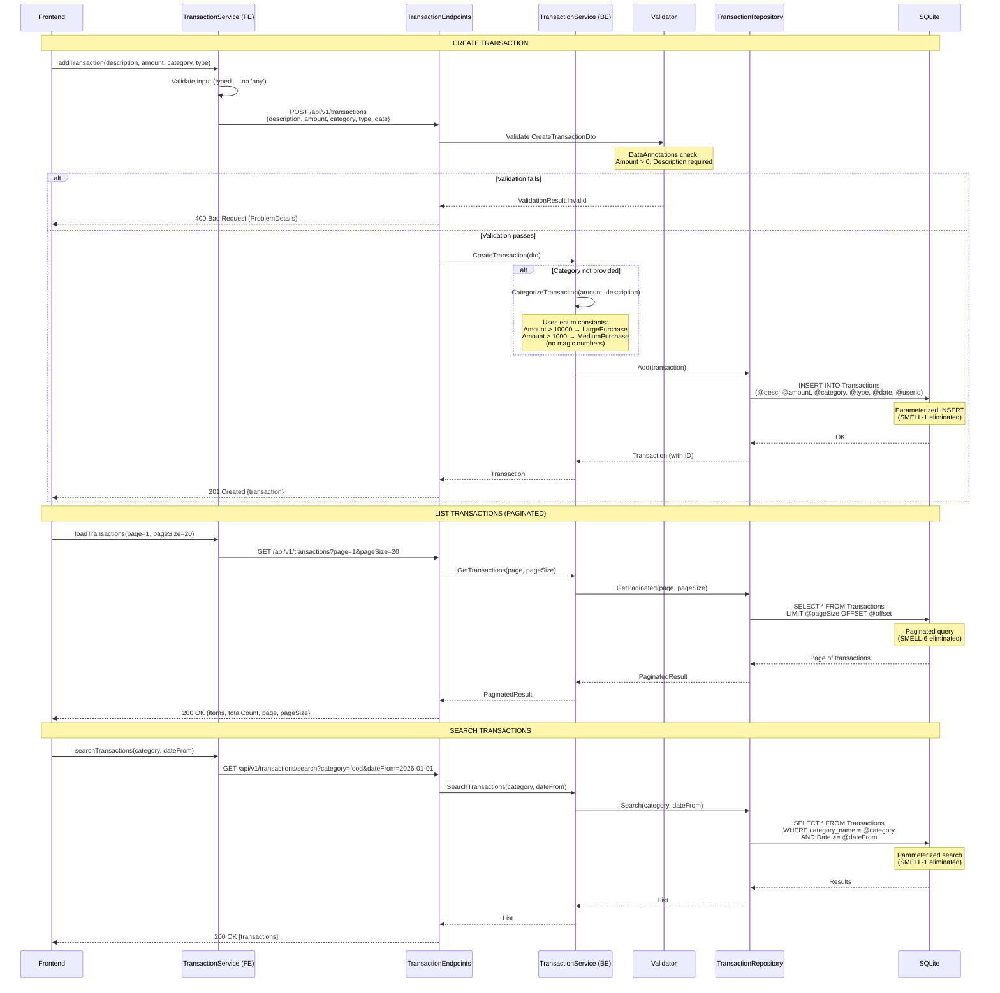

# Sequence Diagram — Transaction CRUD Flow

```mermaid
sequenceDiagram
    participant Client as Frontend
    participant SVC as TransactionService (FE)
    participant API as TransactionEndpoints
    participant AppSvc as TransactionService (BE)
    participant Val as Validator
    participant Repo as TransactionRepository
    participant DB as SQLite

    Note over Client,DB: CREATE TRANSACTION

    Client->>SVC: addTransaction(description, amount, category, type)
    SVC->>SVC: Validate input (typed — no 'any')
    SVC->>API: POST /api/v1/transactions<br/>{description, amount, category, type, date}

    API->>Val: Validate CreateTransactionDto
    Note over Val: DataAnnotations check:<br/>Amount > 0, Description required

    alt Validation fails
        Val-->>API: ValidationResult.Invalid
        API-->>Client: 400 Bad Request (ProblemDetails)
    else Validation passes
        API->>AppSvc: CreateTransaction(dto)

        alt Category not provided
            AppSvc->>AppSvc: CategorizeTransaction(amount, description)
            Note over AppSvc: Uses enum constants:<br/>Amount > 10000 → LargePurchase<br/>Amount > 1000 → MediumPurchase<br/>(no magic numbers)
        end

        AppSvc->>Repo: Add(transaction)
        Repo->>DB: INSERT INTO Transactions<br/>(@desc, @amount, @category, @type, @date, @userId)
        Note over DB: Parameterized INSERT<br/>(SMELL-1 eliminated)
        DB-->>Repo: OK
        Repo-->>AppSvc: Transaction (with ID)
        AppSvc-->>API: Transaction
        API-->>Client: 201 Created {transaction}
    end

    Note over Client,DB: LIST TRANSACTIONS (PAGINATED)

    Client->>SVC: loadTransactions(page=1, pageSize=20)
    SVC->>API: GET /api/v1/transactions?page=1&pageSize=20
    API->>AppSvc: GetTransactions(page, pageSize)
    AppSvc->>Repo: GetPaginated(page, pageSize)
    Repo->>DB: SELECT * FROM Transactions<br/>LIMIT @pageSize OFFSET @offset
    Note over DB: Paginated query<br/>(SMELL-6 eliminated)
    DB-->>Repo: Page of transactions
    Repo-->>AppSvc: PaginatedResult
    AppSvc-->>API: PaginatedResult
    API-->>Client: 200 OK {items, totalCount, page, pageSize}

    Note over Client,DB: SEARCH TRANSACTIONS

    Client->>SVC: searchTransactions(category, dateFrom)
    SVC->>API: GET /api/v1/transactions/search?category=food&dateFrom=2026-01-01
    API->>AppSvc: SearchTransactions(category, dateFrom)
    AppSvc->>Repo: Search(category, dateFrom)
    Repo->>DB: SELECT * FROM Transactions<br/>WHERE category_name = @category<br/>AND Date >= @dateFrom
    Note over DB: Parameterized search<br/>(SMELL-1 eliminated)
    DB-->>Repo: Results
    Repo-->>AppSvc: List
    AppSvc-->>API: List
    API-->>Client: 200 OK [transactions]
```
