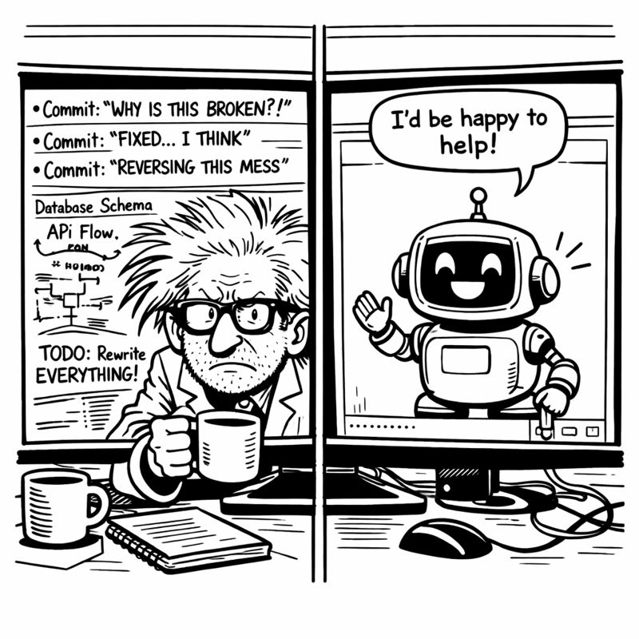
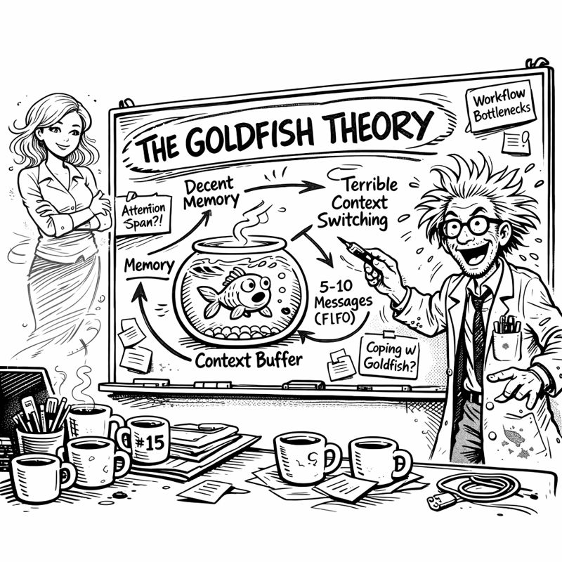
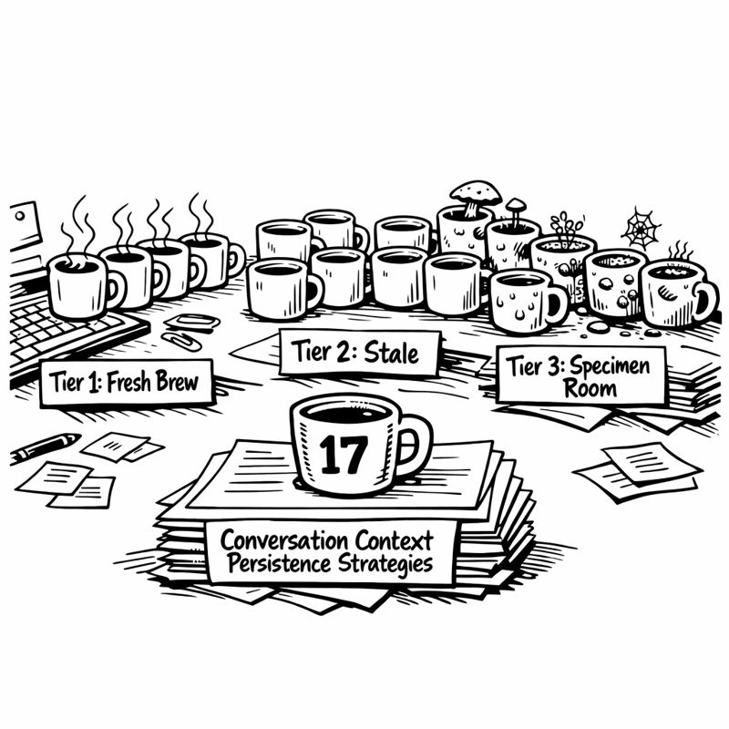

<link rel="stylesheet" href="../story-styles.css">

<div class="story-container">
<div class="story-content">

# Chapter 1: The Amnesia Crisis

The coffee in mug number four had achieved room temperature at some point. I couldn't remember when.

"Okay," I muttered to the screen, setting it down harder than necessary. "Let's try this again."

The GitHub Copilot Chat window stared back at me, pristine and empty. Two hours of detailed JWT authentication discussion—token refresh strategies, security best practices, that clever expiration logic we'd worked out together—gone. Vanished the moment I'd closed VS Code for dinner.

I typed: "How do we implement token refresh for the authentication system we discussed?"

The response was immediate and devastating: "I don't have context about previous discussions. Could you provide more details about your authentication system?"

My eye twitched. The left one. It always does that when my ADHD brain recognizes a pattern of impending frustration.

## The Forgotten Conversation

"We LITERALLY spent two hours on this," I told the screen. Out loud. To a machine. In an empty basement. At midnight. "Two. Hours. You suggested PyJWT. You recommended Redis for token storage. You caught that security flaw in my expiration logic!"

"I'd be happy to help with authentication! Could you share your current implementation?"



The cursor blinked at me. Cheerful. Oblivious. Like a golden retriever who'd forgotten we'd just gone on a three-hour walk.

Miss G's voice materialized in my consciousness with the warmth of someone who'd heard me ranting through the floor. "Are you arguing with the robot again?"

"It's not an argument. An argument requires both parties to remember what they're arguing about."

"So you're losing an argument to a goldfish."

"It's not—" I paused. "Actually, that's exactly what this is."

## The Git Commits of Madness

I pulled up my git history, hoping for salvation. What I found was evidence of my own deterioration:

- `implement JWT auth` (2:15 PM)
- `add token refresh logic` (3:47 PM)  
- `fix security issue copilot found` (4:23 PM)
- `update auth tests` (5:01 PM)
- `forgot to commit earlier changes` (5:02 PM)
- `no really this is the auth fix` (6:18 PM)
- `why does git hate me` (6:19 PM)



Seven commits. Seven separate conversations with Copilot. Seven brilliant, insightful exchanges that had evaporated the moment they ended.

Miss G studied the commit messages over my shoulder. "That last one seems personal."

"Git and I are going through something."

"Is 'why does git hate me' the kind of commit message your future self will thank you for?"

"My future self will be too busy re-explaining context to Copilot to notice."

The whiteboard behind me mocked me with its neat diagrams. **Tier 1: Working Memory**. I'd drawn it three days ago with such confidence. A simple SQLite database. Track the last 70 conversations. Let Copilot remember what we'd discussed.

How hard could it be?

## The Archaeological Dig

I pushed back from my desk. The basement laboratory felt different at midnight—less "cognitive architecture breakthrough" and more "crime scene from a documentary about engineers who went too far."



Coffee mugs occupied every horizontal surface. Seventeen of them. Mug seventeen sat on papers titled "Conversation Context Persistence Strategies." Mug sixteen had formed a ring stain on my entity relationship diagram. The others were scattered like geological strata, each marking a different failed approach.

"The mugs are multiplying," Miss G observed. "Is that part of the experiment?"

"They're visual metaphors for the tier system."

"They're dishes. With ecosystems."

"Mug seven might be achieving sentience."

"Mug seven needs to achieve the dishwasher."

I glanced at the offending mug. Something was definitely growing in there. Something with ambitions.

"Ten more minutes," I said.

"You said that at 10 PM."

"This time I mean it."

"You said that too."

---

## The Goldfish Theory

Three days later, I had a breakthrough. Or a breakdown. The line was getting blurry.

"Copilot is a goldfish," I announced to the empty basement.

Miss G's voice manifested with the particular patience she reserves for my 3 AM revelations. "It's 2:47 in the morning. I'm going to need more context."

"Goldfish!" I gestured at the whiteboard, which had evolved into something that would concern a psychiatrist. "**THE GOLDFISH THEORY**" was scrawled across the top, surrounded by arrows pointing in directions that made sense to me at the time.

"Goldfish actually have decent memory," I explained, pacing. "They can remember things for months. But they have terrible context switching. Show them something new, they forget they were in the middle of something else."

"Like you with browser tabs."

"Exactly! Wait—no. The POINT is, Copilot has the same problem."

"The browser tabs?"

"The CONTEXT SWITCHING." I pulled up my notes. Seventy-two hours of documenting every interaction. Not the code—the meta-patterns.

"Within a session? Maybe 5-10 exchanges before earlier context starts dropping. Between sessions? Complete amnesia. Every new chat is a fresh start." I turned to face her. "It's not broken. It's architecturally limited."

"So you're saying..."

"If Copilot is a goldfish, I need to give it a bigger bowl."

"That's the solution? A bigger bowl?"

"No, wrong metaphor. External memory. A notebook. A diary. A database that persists between sessions and tracks everything we've discussed."

Miss G was quiet for a moment. "And the mugs?"

"What about them?"

"Are they still a metaphor, or can I put them in the dishwasher now?"

I looked around. Mug seven had definitely developed something that could be classified as a biome.

"Tomorrow," I said.

"That's what you said about the Christmas decorations."

I winced. Fifty-seven days left on my self-imposed deadline. Fifty-seven days to teach a goldfish to remember.

I opened a new file: `tier1_working_memory.py`

```bash
git commit -m "Document the Goldfish Theory - Tier 1 Working Memory spec"
```

Tomorrow, I'd start building. Tonight, I'd drink cold coffee and dream of databases.

The mug situation could wait.

Probably.

---

</div>

<div class="chapter-navigation">
  <a href="../Prologue/" class="nav-prev">← Previous: Prologue</a>
  <a href="../index.html" class="nav-home">📖 Table of Contents</a>
  <a href="../Chapter-02/" class="nav-next">Next: Tier 0 - The Gatekeeper →</a>
</div>

</div>
