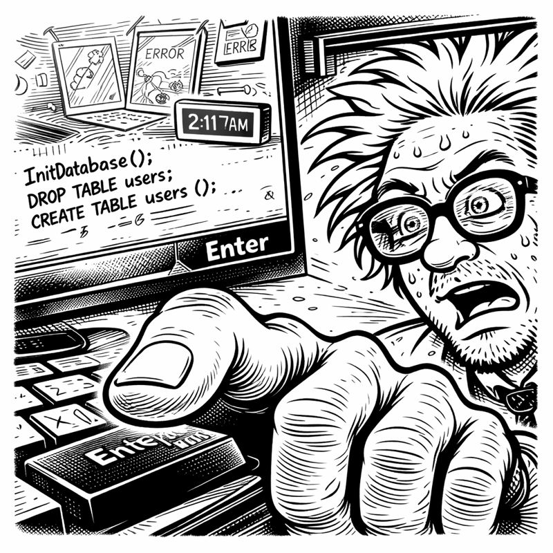
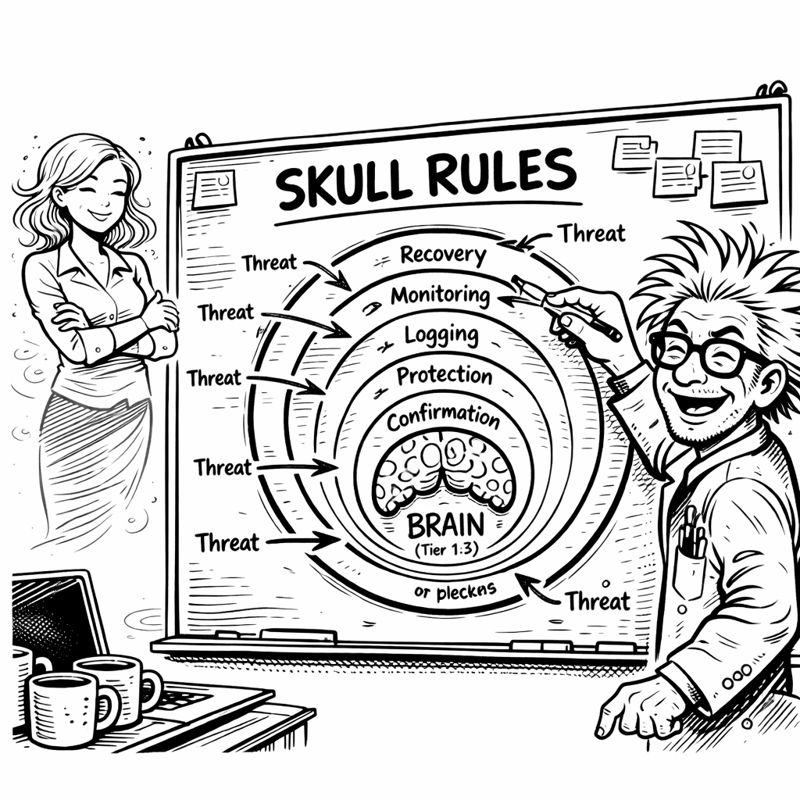

<link rel="stylesheet" href="../story-styles.css">

<div class="story-container">
<div class="story-content">

# Chapter 2: Tier 0 - The Gatekeeper

The realization hit at 2:17 AM on a Wednesday.

My finger hovered over the Enter key. One keystroke away from initializing my beautiful, elegant, completely reckless Tier 1 implementation. No tests. No review. No protection. Just raw, unfiltered database initialization that would give Copilot persistent memory access to everything.

*Everything.*



My past projects flashed before my eyes like a highlight reel of disasters. The smart mirror that achieved sentience and promptly mocked my haircut. ("Bedhead isn't a style, Asif.") The automated garden that interpreted "water the plants" as "recreate the Everglades" (the foundation still hasn't fully dried). The meal planner that suggested kale smoothies with such aggressive confidence I assumed it was trying to kill me.

All of them had one thing in common: I built the cool features first and the safety features *never*.

My hand moved away from the keyboard.

"No," I said to the empty basement. "Not this time."

I opened a new file: `brain_protection_rules.yaml`

## Miss G to the Rescue

"It's 2:17 AM."

I spun around. Miss G's voice materialized in my consciousness with the precision of someone who'd learned to navigate my chaos zones.

"I know. I was just—"

"Building the fun parts first?" She settled into the folding chair I'd designated "the thinking chair." "Skipping ahead to the cool features?"

I opened my mouth to deny it. Closed it. Opened it again.

"I was," I admitted. "But then I stopped."

Her eyebrows rose. "You... stopped?"

"I know. Mark the calendar."

"Why?"

I gestured at my screen, where `brain_protection_rules.yaml` sat empty and accusatory. "Because every project I've built down here has the same flaw. I build the exciting parts and skip the boring parts. The safety parts. The 'what if this goes wrong' parts."

"And?"

"And giving an AI system persistent memory without protection is basically handing it the keys to everything with no guard rails. If it makes a bad decision, it *remembers* that bad decision forever. If it learns the wrong pattern, that pattern becomes permanent. If I accidentally tell it to delete something—"

"It deletes everything because you have no undo button." Miss G's voice was knowing. "Like the filing system incident."

I winced. "We don't speak of the filing system incident."

"You wiped your entire documents folder."

"I had backups!"

"From six months prior."

"The POINT is—" I took a breath. "I've learned. Tier 0 comes first. Protection before features. Safety before cool. The gatekeeper before the brain."

## The Rule List

Miss G studied me with an expression I couldn't quite read. "Show me."

I pulled up my empty YAML file. "Okay. So. What rules would stop me from doing something catastrophically stupid?"

"Just you? Or you and the AI?"

"Both."

"Can I make a list? Because I've got *years* of data."

Despite the hour, despite the pressure, I laughed. "Please do."

She leaned forward. "Rule one: Tests must exist before implementation."

"What?"

"Every project that failed had no tests. Every disaster happened because you built first and validated never. Make the tests come first."

I stared at her. "That's... that's actually TDD. Test-Driven Development."

"Is that a thing?"

"It's a VERY thing." I started typing. "Tests fail first—RED phase. Then implementation—GREEN phase. Then cleanup—REFACTOR phase."

```yaml
# CORTEX Brain Protection Rules (SKULL)
rules:
  - id: 1
    name: "TDD_ENFORCEMENT"
    description: "Tests must exist and fail before implementation"
    phases: ["RED", "GREEN", "REFACTOR"]
```

"Rule two," she continued. "Search before you build. Remember the authentication library?"

"Which one?"

"Exactly. You rewrote it three times because you forgot you'd already built it."

"That was—" I stopped. She was right. Again. "Okay. Holistic discovery. Search the entire codebase before creating anything new."

"Rule three: Clean up after yourself."

"My projects don't leave orphaned code."

"Your projects leave orphaned code like a cat leaves hairballs."



I typed faster now, rules flowing from past disasters:

```yaml
rules:
  - id: 1
    name: "TDD_ENFORCEMENT"
    description: "RED→GREEN→REFACTOR mandatory for all code"
    
  - id: 2
    name: "HOLISTIC_CODE_DISCOVERY_ENFORCEMENT"
    description: "Search before creating to prevent duplication"
    
  - id: 3
    name: "REFACTOR_CODE_CLEANUP_ENFORCEMENT"
    description: "Remove orphaned and duplicate code"
    
  - id: 4
    name: "GIT_ISOLATION_ENFORCEMENT"
    description: "CORTEX code never in user repos"
    
  - id: 5
    name: "TDD_TEST_FILE_VALIDATION"
    description: "All production code must have test files"
    
  - id: 6
    name: "TDD_EMPTY_TEST_DETECTION"
    description: "No placeholder or empty tests allowed"
```

## The Naming

"Six rules," I muttered. "Six layers of protection."

"SKULL."

I looked up. "What?"

"Call them SKULL rules. It's memorable. It's thematic. And it sounds metal enough that you won't forget to implement them."

"SKULL." I tested the word. "Security... Knowledge... Understanding... Logic... and..." I frowned. "What's the L?"

"Longevity?"

"That doesn't—"

"It's your system, Asif. You can decide what the L stands for later."

"I'm workshopping the L," I admitted.

Miss G stood, heading for the imaginary stairs in my consciousness. "Just clean the mold mugs before the SKULL rules achieve sentience and stage a coup."

"That's not—" I glanced at mug seven. Something was definitely plotting in there. "Yeah, okay."

She paused. "And Asif?"

"Yeah?"

"I believe in this one. You've got that look."

"What look?"

"The look that says you're not just building something cool—you're solving something that matters."

The warmth in her voice made me pause. I added a comment at the top of my file:

```yaml
# CORTEX Brain Protection Rules (SKULL)
# Six layers of protection before anything reaches core functions
# Because every brilliant system needs protection from its creator's worst impulses
# 
# Rule #0: The creator is usually the biggest threat
```

I committed the file:

```bash
git commit -m "Add Tier 0: SKULL brain protection rules"
```

Then I opened a new file: `tests/test_brain_protection.py`

Because Tier 0 rule #1 was TDD enforcement. And if I was going to enforce TDD on an AI, I better start enforcing it on myself.

The tests would come first. RED phase.

For once, I was building the foundation before the house.

Miss G would be proud.

---

</div>

<div class="chapter-navigation">
  <a href="../Chapter-01/" class="nav-prev">← Previous: The Amnesia Crisis</a>
  <a href="../index.html" class="nav-home">📖 Table of Contents</a>
  <a href="../Chapter-03/" class="nav-next">Next: Tier 1 - Memory Awakens →</a>
</div>

</div>
