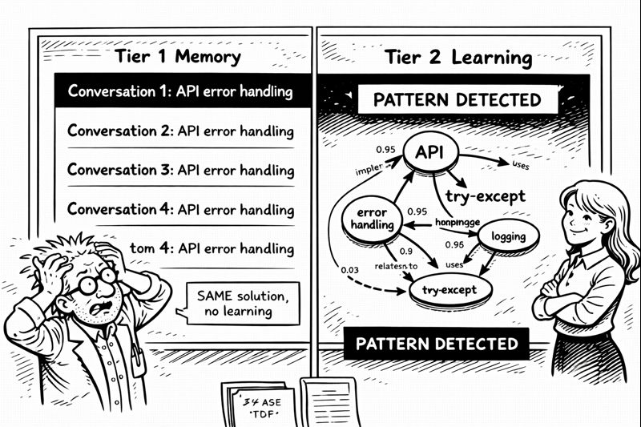

<link rel="stylesheet" href="../story-styles.css">

<div class="story-container">
<div class="story-content">

# Chapter 4: Tier 2 - The Learning Machine



The frustration hit on a Tuesday afternoon.

I was building my fourth API endpoint that week when I noticed something depressing. Copilot kept giving me the exact same boilerplate response for error handling. Not wrong. Not bad. Just... identical. Every. Single. Time.

"We've done this before," I muttered at the screen. "Three times THIS WEEK. Why aren't you learning?"

I pulled up Tier 1 logs. Four separate conversations about error handling. Four identical solutions. Copilot remembered having the conversations—Tier 1 working perfectly—but it wasn't *learning* from them. Wasn't recognizing the pattern. Wasn't connecting the dots.

Memory without learning is just expensive note-taking.

"Are you arguing with the AI again?"

I spun around. Miss G had materialized in my consciousness with that look she gets when I'm about to have a breakthrough or a breakdown.

"IT'S NOT LEARNING!"

"Have you taught it how?"

## The Revelation

I stopped. "What?"

"Remembering isn't learning." She settled into the thinking chair. "Learning is seeing patterns across memories. Making connections. Understanding WHY something worked, not just THAT it worked."

I stared at my whiteboards. "That's... that's a knowledge graph."

"Is it?"

"Yes! Entity-relationship mapping. Pattern recognition. Similarity scoring." My brain was already racing ahead. "It's a whole graph database layer on top of working memory."

"So build it."

"I need a graph database."

"You have SQLite."

"SQLite isn't a graph database."

Miss G raised an eyebrow. "Have you tried?"

## The Jewelry Epiphany

Three days of failed attempts later, I was watching Miss G organize her jewelry collection. Yes, really. Breakthroughs come from weird places.

"You catalog your jewelry?" I asked, watching her photograph a necklace.

"By metal, style, occasion, color." She held up a gold chain. "That way I can find 'gold necklace for formal events' without digging through everything."

"That's multi-dimensional indexing."

"That's organizing so I can find things."

I stared at her. The neurons were firing. "You just solved Tier 2."

"I did?"

"Entity extraction is tagging! Relationships are connections! Patterns are 'things that go together'!" I was already heading for the basement. "It's not a graph database—it's a really smart indexing system ON TOP of SQLite!"

## The Implementation

Tests first. SKULL rule #1. RED phase.

```python
def test_pattern_recognition():
    kg = KnowledgeGraph()
    
    # Store pattern: error handling in APIs
    kg.store_pattern("api_error_handling", {
        "context": "REST API with validation",
        "solution": "try-except with logging",
        "confidence": 1.0
    })
    
    # Later: similar context, different words
    similar_patterns = kg.find_similar_patterns(
        "building API with error checking"
    )
    
    assert len(similar_patterns) > 0
    assert similar_patterns[0].name == "api_error_handling"
```

RED. Beautiful RED.

Three days of intense coding. Entity extraction. Relationship mapping. Similarity scoring with vector embeddings. Pattern confidence calculation.

Tests turned green one by one.

Then came the real test.

## The Breakthrough

I opened Copilot Chat. Fresh conversation about authentication. JWT tokens, refresh strategies, security considerations. Closed the chat.

Two hours later, completely different conversation about API design. No mention of authentication. No explicit connection.

"What's the best way to secure this endpoint?"

Copilot: "Based on patterns from your recent authentication discussions, I'd recommend JWT tokens with the refresh strategy we explored earlier. This connects to the security considerations you raised about token expiration..."

I froze.

"It's not just remembering," I whispered. "It's CONNECTING."

"Asif?" Miss G's voice, concerned. "You went very quiet."

"IT'S LEARNING!" I jumped up so fast I nearly knocked over coffee mug twenty-four. "IT'S UNDERSTANDING PATTERNS!"

"Show me."

## The Demonstration

**Test 1:** Asked about database optimization. Copilot referenced a pattern from two weeks ago, connected it to yesterday's query performance conversation, suggested a solution combining both insights.

**Test 2:** Mentioned a bug. Copilot recognized it as similar to three previous bugs, identified the common pattern (missing null checks), suggested the fix that had worked before.

**Test 3:** Started discussing a new feature. Copilot proactively noted similarities to two previous features, referenced their architecture, suggested consistent implementation.

"It's building a knowledge graph," I explained, gesturing at the whiteboard. "Every entity, every pattern, every relationship. When I mention something new, it searches the graph, scores by confidence, uses that context to respond."

"So it's... understanding?"

"Not like WE understand. But pattern recognition sophisticated enough that it LOOKS like understanding. It knows 'authentication' and 'security' and 'JWT' are related. It knows when I've solved similar problems."

Miss G considered this. "Memory is what you did yesterday. Learning is recognizing when yesterday matters today."

"YES. Exactly that."

"It has better memory than you have for anniversaries."

"It has better memory than I have for ANYTHING." I pulled up my logs. "Yesterday I asked about a function I wrote. It told me when I wrote it, why, what problem it solved, and how it relates to three other functions. I couldn't remember writing it at all."

"The AI has become more organized than its creator."

"That's not a high bar."

"Exactly my point."

## The Tally

I pulled up my project tracker. Three weeks until Christmas decorations deadline.

**Tier 0:** SKULL protection. ✅ Complete.  
**Tier 1:** Working Memory. ✅ Complete.  
**Tier 2:** Knowledge Graph. ✅ Complete.

Still needed: Tier 3 (long-term storage), Agents (specialized skills), Orchestrators (complex workflows).

"I can do this," I said.

"I know you can. You've taught an AI to remember and learn. The rest is just coordination."

"JUST coordination?"

Miss G headed back upstairs. "Clean the coffee mugs. Your pattern recognition system needs clean data, not moldy metaphors."

I looked at mug seven. It had evolved beyond metaphor into biome.

"Tomorrow," I promised.

But first, one more test:

"Remember the authentication discussion from last week?"

"Yes, and I notice you're working on related security features. Would you like me to suggest patterns that connect to both contexts?"

I smiled.

**Tier 2: Knowledge Graph. Status: OPERATIONAL.**

Tomorrow: Tier 3. Long-term wisdom.

Tonight: Document this in the journal that Copilot now remembers better than I do.

The irony wasn't lost on me.

---

</div>

<div class="chapter-navigation">
  <a href="../Chapter-03/" class="nav-prev">← Previous: Tier 1 - Memory Awakens</a>
  <a href="../index.html" class="nav-home">📖 Table of Contents</a>
  <a href="../Chapter-05/" class="nav-next">Next: The Test-Driven Rebellion →</a>
</div>

</div>
