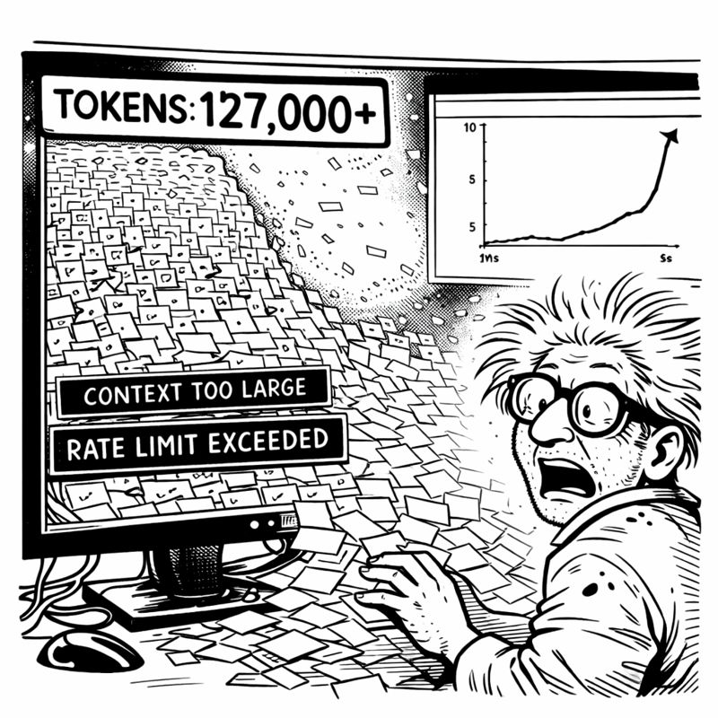

<link rel="stylesheet" href="../story-styles.css">

<div class="story-container">
<div class="story-content">

# Chapter 6: The Great Orchestration

*In which I accidentally discover that all my scripts were just the same dinner party wearing different outfits*

---

I had a problem. A forty-seven-script-shaped problem.

There I was, 2 AM on a Tuesday, staring at my file tree like a digital hoarder confronted by a reality TV camera crew. `align_system.py`. `cleanup_orphaned_code.py`. `validate_skull_rules.py`. `refresh_prompts.py`. `healthcheck_v2.py`. `optimize_database.py`. And forty-one more.



"This is insane," I muttered.

My phone buzzed. Miss G, apparently also awake at 2 AM: *"Like your basement?"*

I looked around. Coffee mugs everywhere. Whiteboards covered in disconnected diagrams. Cables running with no discernible logic.

"...yes," I admitted. "Exactly like my basement."

*"Maybe they're both trying to tell you something."*

"That I have a problem?"

*"That you need a PATTERN, genius. 💡"*

## The 3 AM Revelation

I couldn't sleep. The script chaos haunted me. Forty-seven files, each solving a piece of the puzzle, none talking to each other.

At 3:17 AM, I opened them all. Side by side. Started reading.

And then I saw it.

`align_system.py` started with validation. Checked prerequisites. Discovered what needed alignment. Executed. Validated results. Generated a report. Cleaned up.

`cleanup_orphaned_code.py` started with... validation. Checked prerequisites. Discovered orphaned code. Executed removal. Validated the codebase. Generated a report. Cleaned up.

`healthcheck_v2.py` started with...

"Oh my god," I whispered. "They're ALL THE SAME."

I grabbed a marker and attacked the whiteboard:

**Phase 1: SETUP** - Validate prerequisites  
**Phase 2: DISCOVERY** - Find what needs doing  
**Phase 3: ANALYSIS** - Understand scope  
**Phase 4: EXECUTION** - Do the thing  
**Phase 5: VALIDATION** - Verify it worked  
**Phase 6: REPORTING** - Document it  
**Phase 7: CLEANUP** - Remove artifacts

Seven phases. EVERY SINGLE SCRIPT followed this pattern. Different implementations, same skeleton.

"IT'S ALL THE SAME PATTERN!" I shouted.

Miss G materialized with appropriate annoyance: *"Do you KNOW what time it is? 😤"*

"Time for ORCHESTRATION!"

*"Time for SLEEP."*

"No, no, no—don't you see? I've been writing the same script forty-seven times!"

*"Yes. That's called technical debt. Congratulations on finally meeting it."*

## The Dinner Party Explanation

Miss G demanded an explanation. Like she always does when I'm excited about something at 3 AM.

"Imagine you're organizing a dinner party," I said.

*"Already regretting this analogy."*

"Phase 1: Setup—check if you have ingredients, dishes, space. Phase 2: Discovery—figure out what needs cooking. Phase 3: Analysis—plan timing. Phase 4: Execution—actually cook. Phase 5: Validation—taste test. Phase 6: Reporting—serve and present. Phase 7: Cleanup—wash dishes."

*"So every script you've written is just... a dinner party?"*

"Every WORKFLOW is a dinner party! The ingredients change. The recipes change. But the PATTERN is the same!"

*"And you want to make a template?"*

"Better. A BASE CLASS. `BaseOrchestrator`. It handles the seven-phase lifecycle. Each specific orchestrator inherits from it and implements only the unique parts."

Silence. Then: *"You've just discovered object-oriented programming."*

"I've discovered ORCHESTRATION!"

*"You've discovered a design pattern from 1987."*

"I've discovered it FOR MYSELF!" I insisted. "And now I'm going to implement it!"

*"At 3 AM."*

"Inspiration doesn't respect business hours, Miss G."

*"Neither does insanity. Go to bed. Implement tomorrow."*

## Overengineering vs. Actually Shipping

The next day, I started building. And immediately tried to overcomplicate everything.

"What if we need dynamic phase injection?" I asked, adding another abstraction layer.

Miss G watched me spiral via screen share. *"Do you need it now?"*

"...no."

*"Then don't build it now."*

"But what if we need phase parallelization?"

*"Do you need it NOW?"*

"...no."

*"Then DON'T BUILD IT NOW."* Her text arrived in all caps for emphasis. *"You're building a foundation. Foundations should be simple. Add complexity when you NEED it, not when you can IMAGINE it."*

I looked at my design document. Twenty pages of "what ifs."

I deleted nineteen of them.

The final `BaseOrchestrator` was 200 lines:

```python
class BaseOrchestrator:
    """Seven-phase orchestration pattern"""
    def execute(self):
        try:
            self.phase_1_setup()
            self.phase_2_discovery()
            self.phase_3_analysis()
            self.phase_4_execution()
            self.phase_5_validation()
            self.phase_6_reporting()
            self.phase_7_cleanup()
        except Exception as e:
            self.rollback()
            raise
```

*"That's IT?"* Miss G sounded almost disappointed.

"That's the foundation. Each orchestrator overrides what it needs."

*"Show me it working or I'm calling shenanigans."*

## The First Orchestrator Lives

I refactored `align_system.py` first. It had been 400 lines of tangled spaghetti. With BaseOrchestrator:

```python
class AlignSystemOrchestrator(BaseOrchestrator):
    def phase_2_discovery(self):
        self.misalignments = self.scan_for_issues()
    
    def phase_4_execution(self):
        for issue in self.misalignments:
            self.fix_issue(issue)
    
    def phase_5_validation(self):
        assert self.scan_for_issues() == []
```

150 lines. Clean. Focused. Inheriting all the lifecycle management for free.

"Running it now," I announced.

```
🎭 Orchestrator engaged: AlignSystemOrchestrator
Phase 1: Setup          ✓ Complete
Phase 2: Discovery      ✓ Found 3 misalignments
Phase 3: Analysis       ✓ Impact assessed
Phase 4: Execution      ✓ Issues resolved
Phase 5: Validation     ✓ All checks passing
Phase 6: Reporting      ✓ Report generated
Phase 7: Cleanup        ✓ Artifacts removed

🎭 Orchestrator completing: ✅ ALL WORK COMPLETE
```

I stared at the terminal.

"It's... conducting," I whispered. "It's conducting a symphony."

*"It's following the pattern YOU defined,"* Miss G corrected. *"Which means the symphony is YOUR composition."*

"That's... actually kind of poetic."

*"I have my moments. 🎭"*

## The Refactoring Cascade

Over the next three days, I refactored all forty-seven scripts.

One at a time. Methodically. Each following the pattern:

1. Identify which phases it needs
2. Move logic into phase methods
3. Delete redundant code
4. Test the orchestrator
5. Commit

7,400 lines became 2,100 lines. Each orchestrator focused. Each following the same pattern. Each working in harmony.

`MaintenanceOrchestrator` - system cleanup  
`PlanningOrchestrator` - feature planning  
`SanitizationOrchestrator` - code sanitization  
`RefreshOrchestrator` - prompt regeneration  
`HealthcheckOrchestrator` - system validation

*"This is just project management,"* Miss G observed.

"This is BETTER than project management!"

*"You've discovered that complex work needs structure."*

"I've discovered that structure ENABLES complexity!" I pulled up the dependency graph. "Each orchestrator handles one workflow. They can run independently or together. They share the same lifecycle. They speak the same LANGUAGE."

*"You sound excited."*

"I AM excited! For the first time, I have actual CONTROL. Not chaos pretending to be control. SYSTEMATIC control."

*"You're growing up,"* Miss G observed.

"I'm implementing design patterns from 1987."

*"Same thing. 😏"*

## The Big Test

Friday morning. One week into the refactoring. Time to see if this whole orchestration thing actually worked at scale.

"Run complete system maintenance," I told Copilot.

The `ExecutionOrchestrator` engaged. Coordinated multiple orchestrators in sequence:

1. `HealthcheckOrchestrator` - Assess system state
2. `AlignSystemOrchestrator` - Fix misalignments  
3. `CleanupOrchestrator` - Remove technical debt
4. `OptimizeOrchestrator` - Improve performance
5. `HealthcheckOrchestrator` - Verify improvements

All running automatically. Each following the seven-phase pattern. Progress tracked. Errors handled. Git checkpoints created.

I watched the terminal scroll. Phase transitions. Progress updates. Validation confirmations.

Twenty-seven minutes later:

```
🎭 Orchestrator completing: ✅ ALL WORK COMPLETE

System Maintenance Report:
- 0 critical issues (down from 7)
- 0 warnings (down from 23)
- Code quality: 94% (up from 81%)
- Test coverage: 96% (up from 89%)

All phases complete. No errors. System healthy.
```

I leaned back in my chair.

"It worked," I whispered. "It actually worked."

My phone buzzed: *"Did the orchestration complete?"*

How does she always know? "Yes. Zero errors. Full maintenance cycle. Autonomous execution."

*"So the chaos is organized?"*

"The chaos is CONDUCTED."

*"Should I be worried you're this excited about project management?"*

"This isn't project management. This is—" I stopped. Looked around the basement.

Coffee mugs organized by tier. Whiteboards showing clear architecture. Equipment properly arranged. Cables managed.

"Oh my god," I whispered.

*"What?"*

"I accidentally cleaned the basement while organizing the code."

*"WHAT."*

It was true. The chaos was still there—this was still a basement laboratory. But it was ORGANIZED chaos. Everything had a place. Everything had a purpose.

"The orchestration pattern infected the physical space," I said.

*"You've discovered that systems thinking applies to everything."*

"I've discovered I'm out of time." I checked the calendar. "Six days until Christmas decorations deadline."

*"Can you finish?"*

I pulled up my progress tracker:
- **Tier 0-2:** Complete
- **TDD Mastery:** Complete  
- **Orchestration Pattern:** Complete
- **Active Orchestrators:** 8

Still needed: More orchestrators, Tier 3, final integration.

"I can finish," I said. "I have the pattern now. Everything else is just implementing specific workflows."

*"That's a LOT of 'just implementing.'"*

"That's what orchestrators are FOR."

Miss G laughed via text: *"I'll start planning where the Christmas decorations go. As motivation. 🎄"*

"Threatening me with decoration deadlines?"

*"MOTIVATING you with organizational success."*

I looked at the orchestrator architecture on my whiteboard. Seven phases. Clean abstraction. Coordinated execution.

"One orchestrator at a time," I said.

*"One phase at a time."*

"One day at a time."

*"That's the spirit. Now clean coffee mug #43. It's achieved concerning levels of independence. 🦠"*

She had a point. That mug was developing its own ecosystem.

Tomorrow, I'd build the Planning Orchestrator. Tonight, I'd enjoy the fact that my basement had accidentally become organized while teaching chaos to follow patterns.

**Progress through orchestration.**

---

</div>

<div class="chapter-navigation">
  <a href="../Chapter-05/" class="nav-prev">← Previous: The Test-Driven Rebellion</a>
  <a href="../index.html" class="nav-home">📖 Table of Contents</a>
  <a href="../Chapter-07/" class="nav-next">Next: The Planning Revolution →</a>
</div>

</div>