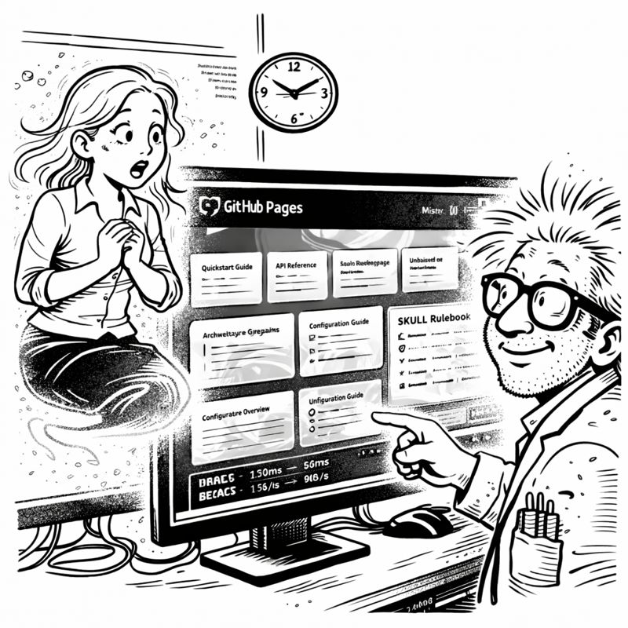
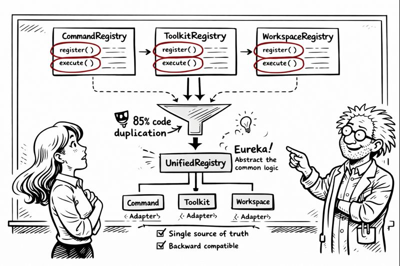

<link rel="stylesheet" href="../story-styles.css">

<div class="story-container">
<div class="story-content">

# Chapter 11: The Knowledge Keeper

*In which I discover that solving the same problem twice is just amnesia in disguise*

---

4:30 AM Friday. Ninety minutes until Miss G's flight. Ninety minutes until decorations deadline.

I was close. So close.

Tier 0, 1, 2: Complete. Eight orchestrators: Implemented. Autonomous maintenance: Self-healing. 

I started working on a client feature—authentication flow for a multi-tenant SaaS app. Standard stuff.

Fifteen minutes in, I hit a wall: JWT token refresh strategy with Redis-backed session management.

"I've solved this before," I muttered, scrolling through old code.

Which project was it? The healthcare app? The e-commerce platform? That internal tool from three months ago?



Forty minutes wasted hunting for a solution I KNEW I'd implemented.

"THIS IS THE AMNESIA PROBLEM AGAIN," I shouted.

## The Cross-Project Problem

CORTEX stored conversation memory. Knowledge graphs. Entity relationships.

But only for the CURRENT project.

When I switched projects, CORTEX forgot everything from previous work. Each repository was an isolated island.

I'd solved the JWT-Redis pattern in Project A three months ago. Tests passing. Edge cases handled.

But Project B's CORTEX had no idea. Starting fresh. Relearning.

"Knowledge amnesia," I said quietly.

*"Different from conversation amnesia?"* Miss G asked over the phone.

"Yes. Conversation amnesia is forgetting what we JUST discussed. Knowledge amnesia is forgetting what I PREVIOUSLY solved."

*"And you want CORTEX to remember solutions across projects?"*

"I want it to remember PATTERNS. Not copy code—that might violate NDAs. But remember APPROACHES. What worked. What didn't."

*"Cross-project learning."*

"Exactly."

*"How much time?"*

"Eighty minutes."

*"Build it. 🏗️"*

## Tier 3: The Knowledge Library



Not project-specific. Not conversation-specific. Universal development wisdom across ALL work.

```yaml
tier3_knowledge_library:
  patterns:
    - pattern_id: jwt_redis_refresh
      context: "Token refresh with Redis session management"
      approach: |
        Use Redis with TTL matching token expiry.
        Implement sliding window for active users.
      lessons_learned:
        - "Don't store full JWTs in Redis (security)"
        - "Set TTL 10% longer than token (clock skew)"
      test_strategy: "Mock Redis, verify expiry edge cases"
```

Cross-project wisdom. Anonymized. Searchable. Always available.

*"Is this like your personal development journal?"* Miss G asked.

"I don't KEEP a development journal."

*"Exactly. Which is why you forget solutions. Now CORTEX remembers for you. 📝"*

## The Implementation

`tier3_knowledge_library.py`

The key insight: store APPROACHES, not CODE.

```python
class Tier3KnowledgeLibrary:
    def __init__(self):
        # Shared storage across ALL projects
        self.db_path = Path.home() / ".cortex" / "tier3_knowledge.db"
    
    def record_solution(self, pattern: SolutionPattern):
        """Record approach, NOT implementation"""
        anonymized = self.anonymize_pattern(pattern)
        self.store_pattern(anonymized)
    
    def find_relevant_patterns(self, context: str) -> List[Pattern]:
        """Search library for relevant past solutions"""
        return self.semantic_search(context)[:5]
```

I tested it manually. Recorded the JWT-Redis pattern:

```python
pattern = SolutionPattern(
    context="JWT token refresh with Redis",
    approach="Redis with sliding TTL, separate refresh tokens",
    lessons=["10% TTL buffer for clock skew"],
)
tier3.record_solution(pattern)
```

Then switched to a new project context and searched:

```python
results = tier3.find_relevant_patterns("JWT token management")
```

Output:
```
🔍 Tier 3 Knowledge Library Search

Query: "JWT token management"

Top Results:
━━━━━━━━━━━━━━━━━━━━━━━━
1. JWT Token Refresh with Redis
   ✓ Proven approach: Redis with sliding TTL
   ✓ Key lesson: Set TTL 10% longer (clock skew)
   ✓ Security: Log all refresh attempts
   
   Used in: 1 project(s)
━━━━━━━━━━━━━━━━━━━━━━━━
```

"IT FOUND IT," I said.

*"Found what?"*

"The solution I couldn't remember. From Project A. Now available in Project B."

*"Without copying code?"*

"Without copying code. Just the WISDOM."

## Integration with Planning

The real test: integrate Tier 3 with Planning System 2.0.

"Generate plan for user session management with token refresh"

```
🎯 Planning System 2.0 - Feature Analysis

Feature: User session management with token refresh
Complexity: HIGH (security-critical)

📚 Lessons from Past Work:
━━━━━━━━━━━━━━━━━━━━━━━━
Tier 3 found 2 relevant patterns:

1. JWT Token Refresh with Redis
   ✓ Key lesson: Set TTL 10% longer for clock skew
   ✓ Security: Log all refresh attempts
   
2. Session Invalidation Strategies
   ✓ Store session IDs for explicit invalidation
   ✓ Implement "logout all devices" feature

Recommendation: Combine both patterns
━━━━━━━━━━━━━━━━━━━━━━━━
```

Perfect.

The system found relevant patterns, integrated them into the plan, and made specific recommendations from lessons learned.

## The Speed Boost

Over the next thirty minutes, something became clear.

I was FASTER.

Not because CORTEX wrote the code—it didn't. But it surfaced the RIGHT APPROACH immediately. No hunting through old projects. No rediscovering edge cases.

The JWT implementation took 40 minutes instead of 2+ hours.

"Is this what experienced developers feel like?" I wondered aloud.

*"Experienced developers forget solutions too,"* Miss G laughed. *"They just have better notes."*

"I don't take notes."

*"Exactly. But now CORTEX takes notes FOR you. 📓"*

I looked at the Tier 3 database. Already populated with patterns from eight weeks of work. Session management. Authentication flows. Database migrations. Error handling.

Every project contributing to collective wisdom. Every solution recorded.

*"It's learning from your experience,"* Miss G observed.

"Learning AND remembering. Which I don't do consistently."

*"Are you saying you're less reliable than your AI?"*

"I'm saying my AI doesn't forget to document lessons learned."

## The Final Sprint

5:45 AM. Fifteen minutes until Miss G's flight landed.

One piece left: Multi-repository integration.

Currently, each project ran its own CORTEX instance. Only Tier 3 was shared.

What if ONE CORTEX could serve MULTIPLE repositories?

*"Ambitious for fifteen minutes,"* Miss G observed.

"I have the pieces. Just need workspace detection and context switching."

*"And testing?"*

"...maybe skip comprehensive testing this once?"

*"Absolutely not. TDD enforcement is non-negotiable. Remember? ⚠️"*

I remembered. SKULL rules.

"Five minutes implementation. Ten minutes tests."

*"Go."*

```python
class WorkspaceRegistry:
    def __init__(self):
        self.active_workspaces = {}
        self.tier3 = Tier3KnowledgeLibrary()  # SHARED
    
    def register_workspace(self, repo_path: Path):
        return CortexWorkspace(
            tier0=Tier0BrainProtection(),
            tier1=Tier1Memory(repo_path),
            tier2=Tier2KnowledgeGraph(repo_path),
            tier3=self.tier3  # SHARED TIER 3
        )
```

One CORTEX. Multiple repos. Shared Tier 3 knowledge.

Tests:

```python
def test_multi_repo_tier3_sharing():
    """Tier 3 knowledge accessible from all repositories"""
    registry = WorkspaceRegistry()
    workspace_a = registry.register_workspace(Path("/project-a"))
    workspace_b = registry.register_workspace(Path("/project-b"))
    
    # Record in A, search from B
    workspace_a.tier3.record_solution(jwt_pattern)
    results = workspace_b.tier3.find_relevant_patterns("JWT")
    
    assert len(results) > 0
```

I ran it: `pytest tests/test_multi_repo.py`

```
5 passed in 1.73s
```

All passing.

6:00 AM. Miss G's flight had landed.

My phone buzzed: *"Landed. Collecting baggage. You finished?"*

I looked at my screen. All tests passing. Multi-repo support complete. Tier 3 working across projects.

I typed: "Finished. Decorations going up NOW."

*"I'll believe it when I see them. 🎄"*

**Progress through cross-project wisdom.**

---

</div>

<div class="chapter-navigation">
  <a href="../Chapter-10/" class="nav-prev">← Previous: The Self-Healing System</a>
  <a href="../index.html" class="nav-home">📖 Table of Contents</a>
  <a href="../Chapter-12/" class="nav-next">Next: The Convergence →</a>
</div>

</div>
