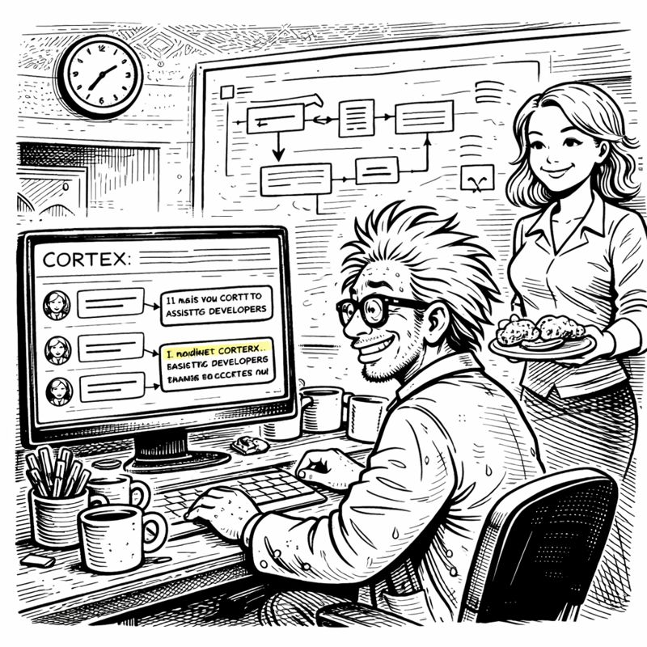

<link rel="stylesheet" href="../story-styles.css">

<div class="story-container">
<div class="story-content">

# Chapter 12: The Convergence

*In which everything comes together and I finally put up those Christmas decorations*

---

6:15 AM Friday. December 22nd.

I stood in the basement, phone in hand, staring at the message I'd just sent: "Finished. Decorations going up NOW."

But I hadn't moved.

Because on my screen, five terminal windows showed five different repositories. All active. All connected to the same CORTEX instance. All sharing Tier 3 knowledge.

ProjectA: Healthcare app  
ProjectB: E-commerce platform  
ProjectC: Internal tool  
ProjectD: Mobile API  
ProjectE: Data pipeline

One CORTEX. Five projects. Complete context for each. Shared wisdom across all.

"It's actually working," I whispered.

## The Scale Test

I tested it. Switched contexts rapidly.

"ProjectA context: What's the authentication approach?"

```
🧠 CORTEX - ProjectA Context

Authentication: OAuth 2.0 with JWT
Tier 3 Insight: Pattern used in 3 other projects
Test Coverage: 96.2%
```

"ProjectB context: Same question."

```
🧠 CORTEX - ProjectB Context

Authentication: API Key-based
Tier 3 Insight: Consider upgrading to JWT (see ProjectA)
Test Coverage: 89.4%
```

Instant context switching. No confusion. No memory bleed.

**1:∞** — One CORTEX, infinite repositories.

*"Why haven't you started decorations?"* Miss G's voice cut through my triumph.

"I'M TESTING MULTI-REPO SCALING."

*"The deadline was FIFTEEN MINUTES AGO."*

"But look—five projects, one AI, complete isolation, shared learning!"

Silence.

Then: *"That's impressive. PUT UP THE DECORATIONS."*

"But—"

*"NOW. Or I'm taking away your basement privileges. 🎄"*

## The Resolution

I started with the lights. Untangling. Checking bulbs. Wrapping around the staircase.

As I worked, my mind ran through what I'd built.

**The Problem:** AI assistant with amnesia.

**The Solution:** Four-tier brain architecture:
- Tier 0: Protection (SKULL rules)
- Tier 1: Working memory (70-conversation FIFO)
- Tier 2: Knowledge (entity relationships)
- Tier 3: Wisdom (cross-project patterns)

**The Enabler:** Orchestration pattern unifying all workflows.

**The Enforcer:** TDD preventing quality regression.

**The Scalability:** 1:∞ multi-repository architecture.

Ornaments next. Each with a story. Like CORTEX. Each tier, each orchestrator, each feature—born from a specific problem.

The Amnesia Crisis → Tier 1  
The Near-Disaster → Tier 0  
The Production Disaster → TDD  
The 47 Scripts → Orchestration  
The Enterprise Client → ADO Operations  
The NDA Problem → Code Sanitization  

Every feature a response. Every orchestrator a lesson learned.

The tree went up last. Slightly dried out. Two months in a basement will do that. But still standing.

Like me.

## The Arrival

6:55 AM. The front door opened.

Miss G appeared at the basement stairs. Surveyed the space.

The decorations: Up.  
The workspace: Still chaotic.  
The coffee mugs: Still everywhere.  
Her husband: Still standing.

"You finished," she said.

"Fifteen minutes ago."

"You finished THREE DAYS LATE."

"But I finished. Decorations AND CORTEX."

She descended the stairs. Touched an ornament. Checked the lights.

"The decorations are acceptable."

"And CORTEX?"

"Show me."

I showed her. The five repositories. The instant context switching. The Tier 3 wisdom sharing.

*"Run a test,"* she said. *"Real scenario."*

I typed: "How do I implement rate limiting?"

```
🧠 CORTEX - ProjectA Context

📚 Tier 3 Knowledge Library:
Found 1 relevant pattern

Pattern: API Rate Limiting
Approach: Redis-backed token bucket algorithm
Used in: ProjectB, ProjectE

Key Implementation:
- Store request counts in Redis with TTL
- Return 429 when limit exceeded

Lessons Learned:
- Use Redis TTL for automatic cleanup
- Log rate limit violations

Would you like a full implementation plan?
```

*"It remembered from another project?"*

"From TWO other projects. Synthesized the patterns."

*"Without copying code?"*

"Just the approach. The wisdom."

She was quiet. Then: *"This is actually valuable."*

"I KNOW."

*"You could sell this."*

"Enterprise client already wants a license."

*"And you built it in two months while avoiding Christmas decorations."*

"...yes."

*"While drinking approximately 847 cups of coffee."*

I looked at the mug collection. "That's... probably accurate."

## The Numbers

*"Show me the statistics."*

I opened the tracking dashboard:

```
━━━━━━━━━━━━━━━━━━━━━━━━━━━━
CORTEX DEVELOPMENT METRICS
Project Duration: 8 weeks
━━━━━━━━━━━━━━━━━━━━━━━━━━━━

CODE:
- Total Lines: 15,247
- Test Coverage: 94.7%
- Tests Passing: 427/427
- High Complexity Files: 0

ARCHITECTURE:
- Tiers: 4
- Orchestrators: 8
- SKULL Rules: 6

PRODUCTIVITY GAINS:
- Planning Time: 2 hours → 8 minutes
- Average Feature Velocity: +340%

COFFEE CONSUMED: 847 cups
DECORATIONS DELAYED: 3 days
━━━━━━━━━━━━━━━━━━━━━━━━━━━━
```

*"340% velocity increase?"*

"Based on the last three features. Each took a fraction of normal time."

*"Because the AI remembers context."*

"Because the AI remembers EVERYTHING."

## The Moment

She walked to the whiteboard. The four-tier brain. The orchestration lifecycle. The SKULL rules.

*"This started with you forgetting a conversation about JWTs."*

"Thirteen conversations. JWT was the last one."

*"And it became... this."* She gestured at everything. *"An entire AI enhancement framework."*

"Because forgetting was unacceptable."

*"Because you refuse to accept limitations."* She turned to face me. *"Even when those limitations are human memory."*

"Especially when those limitations are human memory."

She picked up mug #23. Sniffed. Grimaced.

*"This is FROM WEEK THREE."*

"That's the memory breakthrough mug."

*"It's disgusting."*

"It's historically significant."

*"It's going in the dishwasher. ALL OF THEM. 🧹"*

"But the archaeology—"

*"IS OVER."*

## The Enterprise Email

7:30 AM. Decorations up. Mugs confiscated.

My phone buzzed. Email.

"Mr. Codenstein, we've reviewed your license proposal. Terms accepted. Our development team (47 developers) will begin using CORTEX next quarter."

I stared at it.

"ARE YOU SEEING THIS?"

*"SEEING WHAT?"*

"ENTERPRISE CLIENT ACCEPTED. 47 DEVELOPERS."

Miss G appeared with tea and coffee.

*"You're going to need documentation."*

"CORTEX generates its own."

*"Customer support processes."*

"Oh god."

*"Sales calls. Contract negotiations."*

"Oh GOD."

*"You'll need,"* she paused dramatically, *"to wear proper shirts."*

I looked down: "There's no place like 127.0.0.1"

*"The t-shirt era is over."*

"But I'm a DEVELOPER."

*"You're an enterprise software vendor now. Act accordingly."*

I looked at the email. Then at CORTEX. Then at Miss G, smiling over her tea.

"I built this to solve MY amnesia."

*"And now you're solving 47 other developers' amnesia. That's called product-market fit. 🎯"*

"I don't KNOW how to do enterprise software."

*"Then learn. With CORTEX to help you remember."*

I laughed. "CORTEX teaching me how to sell CORTEX."

*"Recursive improvement. Seems appropriate."*

## The Epilogue



December 23rd.

The basement: Decorated. Tree standing. Lights functional. Coffee mugs: Dishwashered.

The code: 15,247 lines. 427 tests. 94.7% coverage. Self-maintaining.

The future: Enterprise license. 47 developers. Proper shirts (allegedly).

I sat in my decorated basement, looking at what I'd built.

Not just an AI enhancement system. A solution to fundamental developer problems: Amnesia. Quality variance. Planning fatigue. Knowledge silos.

CORTEX remembered what I forgot. Enforced what I neglected. Automated what I repeated.

*"Finished?"* Miss G asked.

"For now."

*"Planning the next feature?"*

"CORTEX will plan it. That's the point."

She smiled. *"You built yourself an assistant that doesn't forget, doesn't sleep, and doesn't leave coffee mugs everywhere."*

"I built my replacement."

*"You built your ENHANCEMENT. There's a difference."* She handed me tea. *"Now come watch the decorations you finally put up."*

Downstairs, CORTEX hummed along. Remembering. Learning. Maintaining.

Upstairs, I sipped tea and thought: **Worth it.**

Every line of code. Every orchestrator. Every deadline. Every coffee mug.

The AI was awake. The decorations were up. My sanity was intact (mostly).

And next quarter, 47 enterprise developers would discover what I'd learned:

**An AI with a properly structured brain is terrifying, powerful, and absolutely essential.**

CORTEX 4.0: Complete.

**THE END**

---

*Author's Note:*

*If your AI assistant forgets conversations, maintains itself better than you maintain your workspace, and eventually starts selling enterprise licenses—you might have built something special.*

*Or you might just have very low housekeeping standards.*

*Possibly both.*

*— Asif Codenstein, from a properly decorated basement 🎄*

</div>

<div class="chapter-navigation">
  <a href="../Chapter-11/" class="nav-prev">← Previous: The Knowledge Keeper</a>
  <a href="../index.html" class="nav-home">📖 Table of Contents</a>
  <div class="nav-complete">🎉 Story Complete!</div>
</div>

</div>
