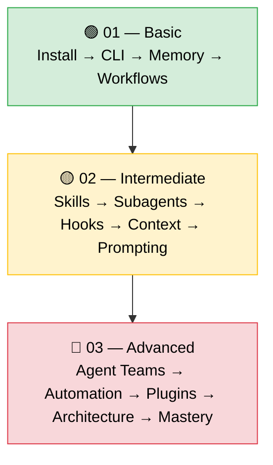

# Claude Code — Knowledge Hub

---
title: Claude Code Learning Paths & Knowledge Repository
type: index
audience: [Developers, Architects, Team Leads]
last_verified: 2026-03-14
order: 0
---

> **Claude Code is an agentic coding tool** that reads your codebase, edits files, runs commands, and integrates with your development tools — available in terminal, IDE, desktop app, and browser.

---

## Learning Paths Overview

This knowledge hub organises Claude Code concepts into three progressive learning paths. Each path builds on the previous, taking you from first install to multi-agent orchestration mastery.



---

## File Map

### 🟢 01 — Basic (Files 01–05)

| # | File | Topic |
|---|------|-------|
| 01 | `01-cc-overview.md` | What is Claude Code — features, surfaces, architecture |
| 02 | `02-cc-install.md` | Installation & first session setup |
| 03 | `03-cc-claudemd.md` | CLAUDE.md files, auto memory, persistent context |
| 04 | `04-cc-cli.md` | CLI commands, flags, non-interactive mode |
| 05 | `05-cc-workflows.md` | Common workflows — explore, fix, test, PR, docs |

### 🟡 02 — Intermediate (Files 06–10)

| # | File | Topic |
|---|------|-------|
| 06 | `06-cc-skills.md` | Creating & managing skills (SKILL.md) |
| 07 | `07-cc-subagents.md` | Custom subagents — scope, tools, memory |
| 08 | `08-cc-hooks.md` | Lifecycle hooks — automate, guard, enforce |
| 09 | `09-cc-context.md` | Context window management & session control |
| 10 | `10-cc-prompts.md` | Effective prompting patterns & strategies |

### 🔴 03 — Advanced (Files 11–15)

| # | File | Topic |
|---|------|-------|
| 11 | `11-cc-teams.md` | Agent teams — multi-session orchestration |
| 12 | `12-cc-automate.md` | CI/CD integration, scripting, fan-out |
| 13 | `13-cc-plugins.md` | Plugin creation, packaging, distribution |
| 14 | `14-cc-archit.md` | Agent & skill orchestration patterns |
| 15 | `15-cc-mastery.md` | CORTEX for Claude Code development |

### 📚 Knowledge YAMLs

| File | Content |
|------|---------|
| `knowledge/cc_best_practices.yaml` | Synthesised best practices checklist |
| `knowledge/cc_skills_dev.yaml` | Skill & agent development patterns |
| `knowledge/cc_agent_dev.yaml` | Agent architecture & design reference |

---

## Quick-Start Command

```bash
# Install Claude Code
curl -fsSL https://claude.ai/install.sh | bash

# Start in any project
cd your-project && claude
```

---

## Sources

All content synthesised from official Anthropic documentation:

- [Claude Code Overview](https://code.claude.com/docs/en/overview)
- [Best Practices](https://code.claude.com/docs/en/best-practices)
- [CLI Reference](https://code.claude.com/docs/en/cli-usage)
- [Skills](https://code.claude.com/docs/en/skills)
- [Subagents](https://code.claude.com/docs/en/sub-agents)
- [Hooks Guide](https://code.claude.com/docs/en/hooks-guide)
- [Memory (CLAUDE.md)](https://code.claude.com/docs/en/memory)
- [Common Workflows](https://code.claude.com/docs/en/common-workflows)
- [Agent Teams](https://code.claude.com/docs/en/agent-teams)
- [Plugins](https://code.claude.com/docs/en/plugins)
- [CI/CD & Non-Interactive](https://code.claude.com/docs/en/github-actions)

**CORTEX Architecture References (files 14–15):**

- `.github/agents/` — CORTEX agent registry (core, docs, certification, support)
- `.github/skills/` — CORTEX skill hierarchy (gateway + 6 domain skills)
- `.github/instructions/` — CORTEX file-scoped instruction system
- `cortex/orchestrators/core/` — MasterOrchestrator, IntentRouter, TDDOrchestrator
